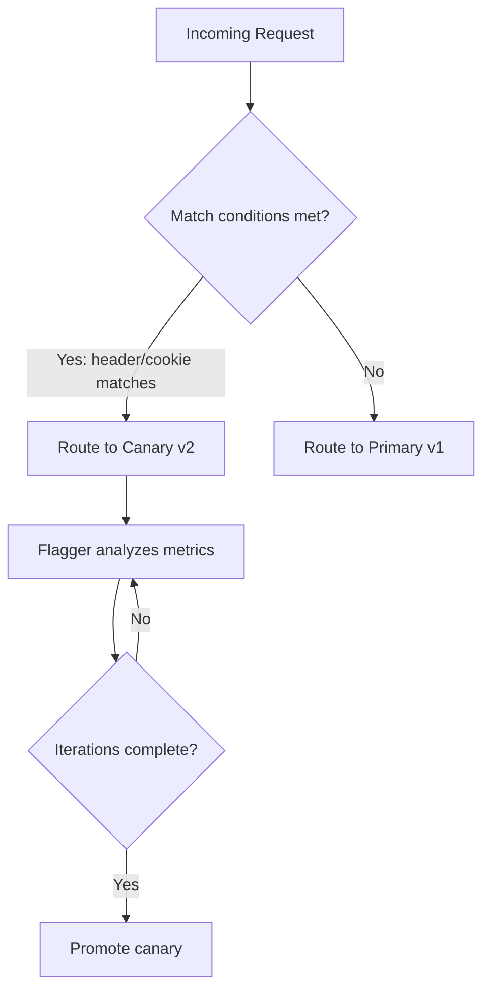

# How to Configure Flagger Canary Match Conditions for A/B Testing

Author: [nawazdhandala](https://github.com/nawazdhandala)

Tags: Flagger, Canary, Ab-Testing, Match Conditions, Kubernetes, Progressive Delivery

Description: Learn how to configure Flagger's match conditions to route specific users or requests to the canary version for A/B testing scenarios.

---

## Introduction

A/B testing is a deployment strategy where specific users or requests are routed to the new version based on request attributes like HTTP headers, cookies, or query parameters. Unlike canary deployments that split traffic by percentage, A/B testing gives you precise control over which requests reach the new version.

Flagger supports A/B testing through the `match` field in the analysis spec. Match conditions define rules that determine whether a request should be routed to the canary or the primary version. This is useful for feature flagging, beta testing with specific user groups, or testing with internal traffic before a broader rollout.

## Prerequisites

- A running Kubernetes cluster with Flagger installed
- Istio or another service mesh that supports header-based routing
- kubectl access to your cluster
- A Deployment and Service to target

## How A/B Testing Works in Flagger

When match conditions are configured, Flagger routes requests that match the conditions to the canary while all other requests go to the primary:



## Configuring Match Conditions

Match conditions are defined in the `analysis.match` array. Each condition specifies an HTTP header and a matching rule:

```yaml
apiVersion: flagger.app/v1beta1
kind: Canary
metadata:
  name: podinfo
  namespace: demo
spec:
  targetRef:
    apiVersion: apps/v1
    kind: Deployment
    name: podinfo
  service:
    port: 9898
    targetPort: http
    gateways:
      - public-gateway.istio-system.svc.cluster.local
    hosts:
      - podinfo.example.com
  analysis:
    interval: 1m
    threshold: 5
    # Use iterations for A/B testing (not weight-based)
    iterations: 10
    # Match conditions for routing
    match:
      - headers:
          x-canary:
            exact: "insider"
      - headers:
          cookie:
            regex: "^(.*?;)?(canary=always)(;.*)?$"
    metrics:
      - name: request-success-rate
        thresholdRange:
          min: 99
        interval: 1m
      - name: request-duration
        thresholdRange:
          max: 500
        interval: 1m
```

## Match Condition Types

Flagger supports several matching strategies for HTTP headers:

### Exact Match

Route requests with an exact header value:

```yaml
match:
  - headers:
      x-user-type:
        exact: "beta-tester"
```

Test with curl:

```bash
curl -H "x-user-type: beta-tester" http://podinfo.example.com
```

### Regex Match

Route requests where the header value matches a regular expression:

```yaml
match:
  - headers:
      x-user-id:
        regex: "^(user-1|user-2|user-3)$"
```

### Prefix Match

Route requests where the header value starts with a specified prefix:

```yaml
match:
  - headers:
      x-region:
        prefix: "us-"
```

### Suffix Match

Route requests where the header value ends with a specified suffix:

```yaml
match:
  - headers:
      x-email:
        suffix: "@company.com"
```

## Common A/B Testing Scenarios

### Route by Cookie

Route users who have a specific cookie set:

```yaml
apiVersion: flagger.app/v1beta1
kind: Canary
metadata:
  name: frontend
  namespace: production
spec:
  targetRef:
    apiVersion: apps/v1
    kind: Deployment
    name: frontend
  service:
    port: 3000
    targetPort: http
    gateways:
      - public-gateway.istio-system.svc.cluster.local
    hosts:
      - app.example.com
  analysis:
    interval: 1m
    threshold: 5
    iterations: 20
    match:
      - headers:
          cookie:
            regex: "^(.*?;)?(beta=true)(;.*)?$"
    metrics:
      - name: request-success-rate
        thresholdRange:
          min: 99
        interval: 1m
    webhooks:
      - name: load-test
        type: rollout
        url: http://flagger-loadtester.test/
        metadata:
          cmd: "hey -z 1m -q 5 -c 2 -H 'Cookie: beta=true' http://frontend-canary.production:3000/"
```

Users can opt into the beta by setting the cookie in their browser. This is useful for internal testing before a wider rollout.

### Route by User Agent

Route requests from a specific client or application:

```yaml
match:
  - headers:
      user-agent:
        prefix: "MyApp-iOS/2.0"
```

This routes only iOS app version 2.0 users to the canary, letting you test a new backend version with a specific client.

### Route Internal Traffic

Route requests from internal networks or tools:

```yaml
match:
  - headers:
      x-internal:
        exact: "true"
  - headers:
      x-source:
        exact: "load-balancer-internal"
```

### Multiple Match Conditions (OR Logic)

When you specify multiple items in the `match` array, they are evaluated with OR logic. A request matching any of the conditions is routed to the canary:

```yaml
match:
  # Route if x-canary header is set
  - headers:
      x-canary:
        exact: "true"
  # OR if the user is a beta tester
  - headers:
      x-user-type:
        exact: "beta"
  # OR if the request comes from staging
  - headers:
      x-environment:
        exact: "staging"
```

### Multiple Headers in One Condition (AND Logic)

When you specify multiple headers within a single match item, they are evaluated with AND logic. All headers must match:

```yaml
match:
  # Both headers must match
  - headers:
      x-canary:
        exact: "true"
      x-region:
        prefix: "us-"
```

## Complete A/B Testing Example

Here is a full example combining match conditions with load testing and custom metrics:

```yaml
apiVersion: flagger.app/v1beta1
kind: Canary
metadata:
  name: web-app
  namespace: production
spec:
  targetRef:
    apiVersion: apps/v1
    kind: Deployment
    name: web-app
  service:
    port: 8080
    targetPort: http
    gateways:
      - public-gateway.istio-system.svc.cluster.local
    hosts:
      - web.example.com
  analysis:
    interval: 1m
    threshold: 5
    iterations: 30
    match:
      - headers:
          x-canary:
            exact: "insider"
      - headers:
          cookie:
            regex: "^(.*?;)?(canary=always)(;.*)?$"
    metrics:
      - name: request-success-rate
        thresholdRange:
          min: 99
        interval: 1m
      - name: request-duration
        thresholdRange:
          max: 500
        interval: 1m
    webhooks:
      - name: load-test-canary
        type: rollout
        url: http://flagger-loadtester.test/
        metadata:
          cmd: "hey -z 1m -q 10 -c 5 -H 'x-canary: insider' http://web-app-canary.production:8080/"
      - name: smoke-test
        type: pre-rollout
        url: http://flagger-loadtester.test/
        metadata:
          type: bash
          cmd: "curl -sf -H 'x-canary: insider' http://web-app-canary.production:8080/health"
```

## Testing Your Match Conditions

Verify that routing works correctly:

```bash
# This request should go to the canary
curl -H "x-canary: insider" http://web.example.com/api/info

# This request should go to the primary
curl http://web.example.com/api/info

# Test cookie-based routing
curl -b "canary=always" http://web.example.com/api/info
```

## Conclusion

Flagger's match conditions enable A/B testing by routing specific requests to the canary version based on HTTP headers, cookies, or other request attributes. This gives you precise control over which users see the new version, making it ideal for beta testing, internal validation, and gradual feature rollouts. Combine match conditions with iteration-based analysis and load testing webhooks for a robust A/B testing workflow.
