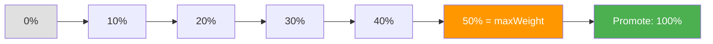
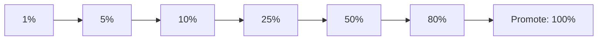

# How to Configure Flagger Canary Max Weight and Step Weight

Author: [nawazdhandala](https://github.com/nawazdhandala)

Tags: Flagger, Canary, Traffic Shifting, Max Weight, Step Weight, Kubernetes

Description: Learn how to configure Flagger's maxWeight and stepWeight parameters to control the pace and extent of traffic shifting during canary deployments.

---

## Introduction

Traffic-based canary analysis is one of Flagger's most powerful features. Instead of sending all traffic to a new version at once, Flagger gradually increases the percentage of traffic routed to the canary. The `maxWeight` and `stepWeight` parameters control this progression: `stepWeight` defines how much traffic to add at each step, and `maxWeight` defines the ceiling before promotion.

Getting these values right determines how quickly your canary rolls out and how much exposure the new version gets before being promoted to primary.

## Prerequisites

- A running Kubernetes cluster with Flagger installed
- A service mesh or ingress controller that supports traffic splitting (Istio, Linkerd, NGINX, Contour, etc.)
- A Deployment with a Canary resource configured
- kubectl access to your cluster

## Understanding maxWeight and stepWeight

### stepWeight

The `stepWeight` field defines the percentage of traffic to add to the canary at each successful analysis step:

```yaml
spec:
  analysis:
    stepWeight: 10  # Increase canary traffic by 10% each step
```

### maxWeight

The `maxWeight` field defines the maximum percentage of traffic the canary can receive before Flagger promotes it:

```yaml
spec:
  analysis:
    maxWeight: 50  # Promote when canary reaches 50% traffic
```

### Traffic Progression

The canary traffic progresses through weights from `stepWeight` up to `maxWeight` in increments of `stepWeight`:



The total number of steps is: `maxWeight / stepWeight`

## Configuration Examples

### Cautious Rollout (Small Steps, Low Max)

For critical services where you want minimal exposure:

```yaml
apiVersion: flagger.app/v1beta1
kind: Canary
metadata:
  name: payment-service
  namespace: production
spec:
  targetRef:
    apiVersion: apps/v1
    kind: Deployment
    name: payment-service
  service:
    port: 8080
  analysis:
    interval: 1m
    threshold: 5
    # Small increments with low maximum exposure
    maxWeight: 30
    stepWeight: 5
    metrics:
      - name: request-success-rate
        thresholdRange:
          min: 99.9
        interval: 1m
      - name: request-duration
        thresholdRange:
          max: 200
        interval: 1m
```

This produces 6 steps: 5%, 10%, 15%, 20%, 25%, 30%, then promote. Total analysis time: 6 minutes with 1-minute intervals.

### Aggressive Rollout (Large Steps, High Max)

For non-critical services or staging environments:

```yaml
apiVersion: flagger.app/v1beta1
kind: Canary
metadata:
  name: frontend
  namespace: staging
spec:
  targetRef:
    apiVersion: apps/v1
    kind: Deployment
    name: frontend
  service:
    port: 3000
  analysis:
    interval: 30s
    threshold: 2
    # Large increments, high maximum
    maxWeight: 80
    stepWeight: 20
    metrics:
      - name: request-success-rate
        thresholdRange:
          min: 99
        interval: 30s
```

This produces 4 steps: 20%, 40%, 60%, 80%, then promote. Total analysis time: 2 minutes with 30-second intervals.

### Gradual Rollout (Default Recommendation)

A balanced approach suitable for most production workloads:

```yaml
apiVersion: flagger.app/v1beta1
kind: Canary
metadata:
  name: api-server
  namespace: production
spec:
  targetRef:
    apiVersion: apps/v1
    kind: Deployment
    name: api-server
  service:
    port: 8080
  analysis:
    interval: 1m
    threshold: 5
    maxWeight: 50
    stepWeight: 10
    metrics:
      - name: request-success-rate
        thresholdRange:
          min: 99
        interval: 1m
      - name: request-duration
        thresholdRange:
          max: 500
        interval: 1m
```

This produces 5 steps: 10%, 20%, 30%, 40%, 50%, then promote. Total analysis time: 5 minutes.

## Using stepWeights for Non-Linear Progression

For more control over the traffic progression, use `stepWeights` (plural) instead of `stepWeight` to define exact weight values at each step:

```yaml
apiVersion: flagger.app/v1beta1
kind: Canary
metadata:
  name: api-server
  namespace: production
spec:
  targetRef:
    apiVersion: apps/v1
    kind: Deployment
    name: api-server
  service:
    port: 8080
  analysis:
    interval: 1m
    threshold: 5
    # Define exact traffic percentages at each step
    stepWeights: [1, 5, 10, 25, 50, 80]
    metrics:
      - name: request-success-rate
        thresholdRange:
          min: 99
        interval: 1m
```

This gives you non-linear progression:



This approach is useful when you want to start very conservatively (1% traffic) and then accelerate as confidence grows. When using `stepWeights`, you do not need to set `maxWeight` or `stepWeight` separately; the last value in the array acts as the effective max weight.

## Choosing Values Based on Traffic Volume

The right values depend on your service's traffic volume:

| Daily Requests | Recommended stepWeight | Recommended maxWeight |
|---------------|------------------------|----------------------|
| < 1,000       | 20-25                 | 50-80                |
| 1,000-100,000 | 10                    | 50                   |
| 100,000-1M    | 5-10                  | 30-50                |
| > 1M          | 2-5                   | 20-30                |

Low-traffic services need higher weights to generate enough data for meaningful metric analysis. High-traffic services can use smaller increments because even a small percentage represents significant request volume.

## Verifying Traffic Weight During Analysis

Monitor the current canary weight during a rollout:

```bash
# Check current weight
kubectl get canary api-server -n production \
  -o jsonpath='{.status.canaryWeight}'

# Watch weight progression
kubectl get canary api-server -n production -w

# Check the traffic split (Istio example)
kubectl get virtualservice api-server -n production -o yaml
```

## Common Mistakes

### maxWeight Not Divisible by stepWeight

If `maxWeight` is not evenly divisible by `stepWeight`, Flagger will still work but the last step before promotion may be smaller than expected. For clarity, use values where `maxWeight % stepWeight == 0`.

### stepWeight Too Small with Short Interval

A `stepWeight` of 1 with a 15-second interval means the canary takes a long time to reach `maxWeight`. Make sure the total rollout time is acceptable:

```text
total_time = (maxWeight / stepWeight) * interval
```

For `maxWeight=50`, `stepWeight=1`, `interval=15s`: total time = 50 * 15s = 12.5 minutes.

## Conclusion

The `maxWeight` and `stepWeight` parameters give you precise control over how aggressively Flagger shifts traffic to a canary version. Start with conservative values for critical services and more aggressive values for non-critical ones. For advanced use cases, the `stepWeights` array lets you define non-linear traffic progression that starts cautiously and accelerates. Always consider your service's traffic volume when choosing these values, as low-traffic services need higher percentages to generate statistically meaningful metric data.
