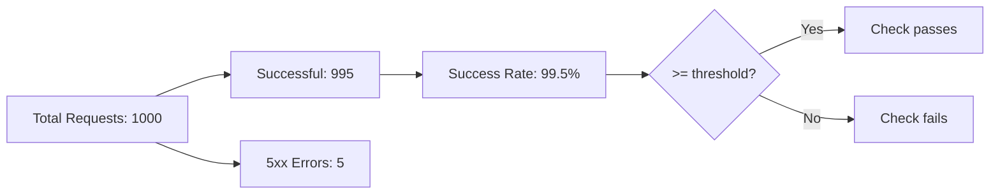

# How to Configure Flagger Canary Metrics with Request Success Rate

Author: [nawazdhandala](https://github.com/nawazdhandala)

Tags: flagger, canary, metrics, request success rate, kubernetes, progressive delivery

Description: Learn how to configure Flagger's built-in request-success-rate metric to ensure your canary deployments meet reliability thresholds before promotion.

---

## Introduction

Request success rate is the most fundamental metric for canary analysis. It measures the percentage of HTTP requests that return a successful response (non-5xx status codes). If a new version of your application starts returning errors, the success rate drops, and Flagger can automatically roll back before the issue affects more users.

Flagger provides `request-success-rate` as a built-in metric that works out of the box with supported service meshes and ingress controllers. This guide explains how to configure and tune this metric for different scenarios.

## Prerequisites

- A running Kubernetes cluster with Flagger installed
- A supported service mesh (Istio, Linkerd) or ingress controller (NGINX, Contour, Gloo) that provides request metrics
- A Deployment with a Canary resource configured
- kubectl access to your cluster

## How Request Success Rate Works

The request success rate metric calculates the percentage of requests that do not return a 5xx status code:

```
success_rate = (total_requests - 5xx_requests) / total_requests * 100
```



## Basic Configuration

The simplest way to use request success rate in your Canary:

```yaml
apiVersion: flagger.app/v1beta1
kind: Canary
metadata:
  name: podinfo
  namespace: demo
spec:
  targetRef:
    apiVersion: apps/v1
    kind: Deployment
    name: podinfo
  service:
    port: 9898
  analysis:
    interval: 1m
    threshold: 5
    maxWeight: 50
    stepWeight: 10
    metrics:
      - name: request-success-rate
        thresholdRange:
          min: 99
        interval: 1m
```

This configuration requires at least 99% of requests to succeed during each 1-minute evaluation window.

## Understanding the Metric Parameters

### thresholdRange

The `thresholdRange.min` value defines the minimum acceptable success rate:

```yaml
metrics:
  - name: request-success-rate
    thresholdRange:
      min: 99    # At least 99% of requests must succeed
    interval: 1m
```

Common threshold values:

| Service Type | Recommended Min | Rationale |
|-------------|----------------|-----------|
| Internal APIs | 95-99 | Some internal errors may be acceptable |
| Customer-facing APIs | 99-99.9 | High reliability expected |
| Payment/Financial | 99.9-99.99 | Critical path, minimal errors allowed |
| Health checks | 100 | Health endpoints should never fail |

### interval

The `interval` field defines the time window for the Prometheus query. Flagger evaluates the success rate over this period:

```yaml
metrics:
  - name: request-success-rate
    thresholdRange:
      min: 99
    interval: 1m    # Evaluate success rate over the last 1 minute
```

The metric interval should be at least as long as the analysis interval. Using a longer metric interval smooths out short spikes:

```yaml
analysis:
  interval: 30s     # Check every 30 seconds
  metrics:
    - name: request-success-rate
      thresholdRange:
        min: 99
      interval: 2m  # But evaluate success rate over the last 2 minutes
```

## Service Mesh Specific Behavior

### Istio

With Istio, Flagger uses the `istio_requests_total` metric. The built-in query looks like:

```promql
sum(rate(istio_requests_total{
  reporter="destination",
  destination_workload_namespace="demo",
  destination_workload=~"podinfo",
  response_code!~"5.*"
}[1m]))
/
sum(rate(istio_requests_total{
  reporter="destination",
  destination_workload_namespace="demo",
  destination_workload=~"podinfo"
}[1m])) * 100
```

### Linkerd

With Linkerd, Flagger uses the `response_total` metric:

```promql
sum(rate(response_total{
  namespace="demo",
  deployment=~"podinfo",
  classification!="failure"
}[1m]))
/
sum(rate(response_total{
  namespace="demo",
  deployment=~"podinfo"
}[1m])) * 100
```

### NGINX Ingress

With NGINX ingress controller, Flagger uses `nginx_ingress_controller_requests`:

```promql
sum(rate(nginx_ingress_controller_requests{
  namespace="demo",
  ingress=~"podinfo",
  status!~"5.*"
}[1m]))
/
sum(rate(nginx_ingress_controller_requests{
  namespace="demo",
  ingress=~"podinfo"
}[1m])) * 100
```

## Production Configuration Examples

### Standard Web Application

```yaml
apiVersion: flagger.app/v1beta1
kind: Canary
metadata:
  name: web-app
  namespace: production
spec:
  targetRef:
    apiVersion: apps/v1
    kind: Deployment
    name: web-app
  service:
    port: 8080
  analysis:
    interval: 1m
    threshold: 5
    maxWeight: 50
    stepWeight: 10
    metrics:
      - name: request-success-rate
        thresholdRange:
          min: 99
        interval: 1m
      - name: request-duration
        thresholdRange:
          max: 500
        interval: 1m
```

### High-Reliability API

```yaml
apiVersion: flagger.app/v1beta1
kind: Canary
metadata:
  name: payment-api
  namespace: production
spec:
  targetRef:
    apiVersion: apps/v1
    kind: Deployment
    name: payment-api
  service:
    port: 8080
  analysis:
    interval: 1m
    threshold: 3
    maxWeight: 30
    stepWeight: 5
    metrics:
      - name: request-success-rate
        thresholdRange:
          min: 99.9
        interval: 2m
```

### Low-Traffic Service

For services with low traffic, use a longer evaluation interval to collect enough data:

```yaml
analysis:
  interval: 2m
  threshold: 5
  maxWeight: 50
  stepWeight: 10
  metrics:
    - name: request-success-rate
      thresholdRange:
        min: 95
      interval: 5m
```

## Combining with Other Metrics

Request success rate is typically the first metric in a multi-metric analysis. All metrics must pass for the check to succeed:

```yaml
metrics:
  # Primary metric: success rate
  - name: request-success-rate
    thresholdRange:
      min: 99
    interval: 1m
  # Secondary metric: latency
  - name: request-duration
    thresholdRange:
      max: 500
    interval: 1m
  # Custom metric: error rate by type
  - name: custom-error-rate
    templateRef:
      name: error-rate
    thresholdRange:
      max: 1
    interval: 1m
```

## Troubleshooting

### Metric Returns No Data

If the success rate metric returns no data, the check is considered failed. Common causes:

```bash
# Verify metrics are being collected
kubectl port-forward -n monitoring svc/prometheus 9090:9090
# Query Prometheus directly for your service's metrics
```

### False Rollbacks from Low Traffic

If your service has very low traffic, a single error can drop the success rate below the threshold. Solutions:

1. Lower the threshold minimum
2. Increase the metric interval to aggregate more data
3. Increase the analysis threshold to tolerate more failed checks
4. Add a load testing webhook to generate synthetic traffic

## Conclusion

The `request-success-rate` metric is the cornerstone of Flagger canary analysis. It provides a simple but effective way to detect regressions in your application's reliability. Configure the minimum threshold based on your service's criticality, choose an appropriate evaluation interval based on your traffic volume, and combine it with latency and custom metrics for comprehensive canary analysis. For low-traffic services, consider using longer intervals and load testing webhooks to ensure statistically meaningful results.
