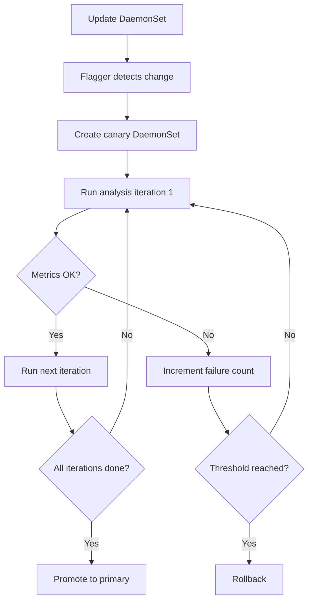

# How to Configure Flagger Canary Resource for DaemonSets

Author: [nawazdhandala](https://github.com/nawazdhandala)

Tags: flagger, canary, kubernetes, daemonsets, progressive delivery

Description: Learn how to configure a Flagger Canary resource to automate progressive delivery for Kubernetes DaemonSets using node-level rollouts.

---

## Introduction

DaemonSets ensure that a copy of a pod runs on every node (or a subset of nodes) in your Kubernetes cluster. They are commonly used for log collectors, monitoring agents, and network plugins. Rolling out updates to DaemonSets requires extra care because these workloads often have cluster-wide impact. A faulty update to a logging agent, for example, could cause data loss across every node.

Flagger supports DaemonSets as a target resource, allowing you to apply canary analysis to DaemonSet updates. This guide walks you through configuring a Canary resource that targets a DaemonSet.

## Prerequisites

- A running Kubernetes cluster (v1.22+) with multiple nodes
- Flagger installed in your cluster (v1.30+)
- A supported service mesh or ingress controller
- kubectl configured to access your cluster
- Familiarity with Kubernetes DaemonSets

## Setting Up the Target DaemonSet

Here is an example DaemonSet that runs a log collector on every node:

```yaml
# daemonset.yaml
apiVersion: apps/v1
kind: DaemonSet
metadata:
  name: log-collector
  namespace: monitoring
  labels:
    app: log-collector
spec:
  selector:
    matchLabels:
      app: log-collector
  template:
    metadata:
      labels:
        app: log-collector
    spec:
      containers:
        - name: log-collector
          image: fluent/fluent-bit:2.1
          ports:
            - containerPort: 2020
              name: http-metrics
          resources:
            requests:
              cpu: 50m
              memory: 64Mi
            limits:
              cpu: 200m
              memory: 256Mi
          volumeMounts:
            - name: varlog
              mountPath: /var/log
              readOnly: true
      volumes:
        - name: varlog
          hostPath:
            path: /var/log
---
# service.yaml
apiVersion: v1
kind: Service
metadata:
  name: log-collector
  namespace: monitoring
spec:
  selector:
    app: log-collector
  ports:
    - port: 2020
      targetPort: http-metrics
      name: http-metrics
```

Apply these resources:

```bash
kubectl create namespace monitoring
kubectl apply -f daemonset.yaml
```

## Creating the Canary Resource for a DaemonSet

The key difference from a Deployment-based Canary is the `targetRef.kind` field. Set it to `DaemonSet`:

```yaml
# canary-daemonset.yaml
apiVersion: flagger.app/v1beta1
kind: Canary
metadata:
  name: log-collector
  namespace: monitoring
spec:
  # Target the DaemonSet instead of a Deployment
  targetRef:
    apiVersion: apps/v1
    kind: DaemonSet
    name: log-collector

  # Service configuration for metrics collection
  service:
    port: 2020
    targetPort: http-metrics

  # Analysis configuration
  analysis:
    # Interval between analysis checks
    interval: 1m
    # Number of failed checks before rollback
    threshold: 3
    # Number of successful iterations before promotion
    iterations: 5
    # Metrics to evaluate during analysis
    metrics:
      - name: request-success-rate
        thresholdRange:
          min: 99
        interval: 1m
    # Webhook for load testing
    webhooks:
      - name: load-test
        type: rollout
        url: http://flagger-loadtester.test/
        metadata:
          cmd: "hey -z 1m -q 5 -c 2 http://log-collector-canary.monitoring:2020/"
```

Apply the Canary:

```bash
kubectl apply -f canary-daemonset.yaml
```

## How DaemonSet Canary Analysis Works

DaemonSet canary analysis differs from Deployment-based analysis in an important way. Because DaemonSets must run on every node, Flagger cannot use traffic-based weight shifting. Instead, it uses an iteration-based approach:



Instead of `maxWeight` and `stepWeight`, DaemonSet canaries use `iterations` to define how many successful analysis cycles must pass before promotion:

```yaml
analysis:
  interval: 1m       # Check every minute
  threshold: 3       # Allow up to 3 failures
  iterations: 5      # Require 5 successful checks before promoting
```

## Key Differences from Deployment Canaries

When targeting DaemonSets, keep these differences in mind:

### No Traffic Splitting

DaemonSets do not support traffic-based canary analysis. You cannot use `maxWeight` and `stepWeight` fields. Instead, use `iterations` to define the analysis window.

### Node-Level Rollout

Flagger manages the DaemonSet update at the node level. During analysis, both the primary and canary versions may run on the same nodes temporarily, depending on the update strategy.

### Update Strategy Configuration

Make sure your DaemonSet uses the `RollingUpdate` strategy:

```yaml
spec:
  updateStrategy:
    type: RollingUpdate
    rollingUpdate:
      maxUnavailable: 1
```

## Monitoring DaemonSet Canary Progress

Watch the canary status to track progression:

```bash
# Watch canary status
kubectl get canary log-collector -n monitoring -w

# Get detailed events
kubectl describe canary log-collector -n monitoring

# Check the DaemonSet pods across nodes
kubectl get pods -n monitoring -l app=log-collector -o wide
```

## Triggering a DaemonSet Canary Update

Update the DaemonSet image to trigger a canary release:

```bash
kubectl set image daemonset/log-collector \
  log-collector=fluent/fluent-bit:2.2 \
  -n monitoring
```

Flagger will detect the change, begin analysis iterations, and either promote or rollback based on the metrics.

## Adding Custom Metrics for DaemonSet Analysis

Since DaemonSets often handle system-level workloads, you may want custom metrics. Here is an example with a Prometheus query for log processing rate:

```yaml
analysis:
  interval: 1m
  threshold: 3
  iterations: 10
  metrics:
    - name: request-success-rate
      thresholdRange:
        min: 99
      interval: 1m
    - name: log-throughput
      templateRef:
        name: log-throughput
        namespace: monitoring
      thresholdRange:
        min: 100
      interval: 1m
```

The referenced MetricTemplate would look like:

```yaml
apiVersion: flagger.app/v1beta1
kind: MetricTemplate
metadata:
  name: log-throughput
  namespace: monitoring
spec:
  provider:
    type: prometheus
    address: http://prometheus.monitoring:9090
  query: |
    rate(
      fluentbit_output_proc_records_total{
        kubernetes_pod_name=~"{{ target }}-[0-9a-zA-Z]+(-[0-9a-zA-Z]+)"
      }[{{ interval }}]
    )
```

## Conclusion

Configuring Flagger for DaemonSets follows the same pattern as Deployments, with the key difference being the use of iteration-based analysis instead of traffic weight shifting. By setting appropriate iteration counts and thresholds, you can safely validate DaemonSet updates before they roll out to every node in your cluster. This is especially valuable for infrastructure-critical workloads like log collectors, monitoring agents, and network components where a bad update can have cluster-wide impact.
