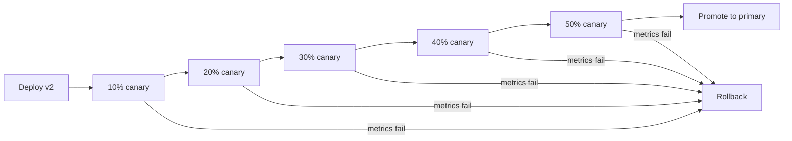

# How to Configure Flagger Canary Resource for Deployments

Author: [nawazdhandala](https://github.com/nawazdhandala)

Tags: flagger, canary, kubernetes, deployments, progressive delivery

Description: Learn how to configure a Flagger Canary resource to automate progressive delivery for Kubernetes Deployments with traffic shifting and automated rollback.

---

## Introduction

Flagger is a progressive delivery operator for Kubernetes that automates the process of rolling out new versions of your applications. Instead of replacing all pods at once, Flagger gradually shifts traffic to the new version while monitoring metrics to detect issues early. If something goes wrong, it automatically rolls back to the previous stable version.

In this guide, you will learn how to configure a Flagger Canary resource that targets a standard Kubernetes Deployment. This is the most common use case for Flagger and forms the foundation for more advanced deployment strategies like blue-green and A/B testing.

## Prerequisites

- A running Kubernetes cluster (v1.22+)
- Flagger installed in your cluster (v1.30+)
- A supported service mesh or ingress controller (Istio, Linkerd, NGINX, etc.)
- kubectl configured to access your cluster
- A basic understanding of Kubernetes Deployments and Services

## Setting Up the Target Deployment

Before creating the Canary resource, you need a Deployment and a Service for Flagger to manage. Here is a simple example application:

```yaml
# deployment.yaml
apiVersion: apps/v1
kind: Deployment
metadata:
  name: podinfo
  namespace: demo
  labels:
    app: podinfo
spec:
  replicas: 2
  selector:
    matchLabels:
      app: podinfo
  template:
    metadata:
      labels:
        app: podinfo
    spec:
      containers:
        - name: podinfo
          image: ghcr.io/stefanprodan/podinfo:6.3.0
          ports:
            - containerPort: 9898
              name: http
          resources:
            requests:
              cpu: 100m
              memory: 64Mi
            limits:
              cpu: 200m
              memory: 128Mi
---
# service.yaml
apiVersion: v1
kind: Service
metadata:
  name: podinfo
  namespace: demo
spec:
  selector:
    app: podinfo
  ports:
    - port: 9898
      targetPort: http
      name: http
```

Apply these resources first:

```bash
kubectl create namespace demo
kubectl apply -f deployment.yaml
kubectl apply -f service.yaml
```

## Creating the Canary Resource

The Canary custom resource tells Flagger how to manage your Deployment. Here is a complete Canary resource targeting the Deployment above:

```yaml
# canary.yaml
apiVersion: flagger.app/v1beta1
kind: Canary
metadata:
  name: podinfo
  namespace: demo
spec:
  # Reference to the target Deployment
  targetRef:
    apiVersion: apps/v1
    kind: Deployment
    name: podinfo

  # The service that Flagger will manage
  service:
    port: 9898
    targetPort: http
    # Gateway and host settings for Istio (adjust for your mesh)
    gateways:
      - public-gateway.istio-system.svc.cluster.local
    hosts:
      - podinfo.example.com

  # Canary analysis configuration
  analysis:
    # Schedule interval for analysis checks
    interval: 30s
    # Maximum number of failed checks before rollback
    threshold: 5
    # Maximum traffic weight routed to the canary
    maxWeight: 50
    # Traffic weight increment per step
    stepWeight: 10
    # Built-in metrics for analysis
    metrics:
      - name: request-success-rate
        thresholdRange:
          min: 99
        interval: 1m
      - name: request-duration
        thresholdRange:
          max: 500
        interval: 1m
```

Apply the Canary resource:

```bash
kubectl apply -f canary.yaml
```

## Understanding the Canary Spec Fields

Let us break down each section of the Canary resource:

### targetRef

The `targetRef` field points to the Kubernetes resource that Flagger will manage. For Deployments, you specify:

```yaml
targetRef:
  apiVersion: apps/v1
  kind: Deployment
  name: podinfo
```

When Flagger initializes, it creates a copy of your Deployment with a `-primary` suffix (e.g., `podinfo-primary`). The original Deployment is scaled to zero and used as the canary version during analysis.

### service

The `service` block defines the networking configuration. Flagger creates additional Kubernetes Services and, depending on your mesh, virtual services or traffic splits:

```yaml
service:
  port: 9898          # The port exposed by the Service
  targetPort: http    # The container port name or number
```

Flagger creates these services automatically:
- `podinfo-primary` - routes to the primary (stable) pods
- `podinfo-canary` - routes to the canary (new version) pods

### analysis

The `analysis` block controls how Flagger evaluates the canary:

```yaml
analysis:
  interval: 30s    # How often to run the analysis
  threshold: 5     # Number of failed checks before rollback
  maxWeight: 50    # Maximum percentage of traffic to the canary
  stepWeight: 10   # How much to increase traffic each step
```

This configuration means Flagger will increase canary traffic by 10% every 30 seconds, up to 50%, as long as metrics stay healthy. If 5 consecutive checks fail, Flagger rolls back.

## How the Canary Progression Works

The following diagram shows the traffic shifting progression:



## Triggering a Canary Release

To trigger a canary release, update the Deployment's container image or any field in the pod template:

```bash
kubectl set image deployment/podinfo podinfo=ghcr.io/stefanprodan/podinfo:6.4.0 -n demo
```

You can monitor the progress with:

```bash
# Watch the canary status
kubectl get canary podinfo -n demo -w

# Check detailed status
kubectl describe canary podinfo -n demo
```

The output will show the progression through each weight step:

```
STATUS
  canaryWeight:  0
  conditions:
    - message: Canary analysis completed successfully, promotion finished.
      status: "True"
      type: Promoted
  phase: Succeeded
```

## Adding Autoscaler Reference

If you use a HorizontalPodAutoscaler (HPA) with your Deployment, include it in the Canary spec so Flagger can manage it:

```yaml
spec:
  targetRef:
    apiVersion: apps/v1
    kind: Deployment
    name: podinfo
  autoscalerRef:
    apiVersion: autoscaling/v2
    kind: HorizontalPodAutoscaler
    name: podinfo
```

Flagger will create a copy of your HPA for the primary Deployment and scale the canary HPA during analysis.

## Conclusion

Configuring a Flagger Canary resource for Deployments is straightforward. You define the target Deployment, the service configuration, and the analysis parameters. Flagger takes care of creating the primary and canary services, shifting traffic progressively, and rolling back if metrics indicate problems. This approach significantly reduces the risk of deploying new versions by catching issues before they affect all users. In the next posts, we will explore how to configure Canary resources for DaemonSets and StatefulSets, as well as advanced analysis configurations.
