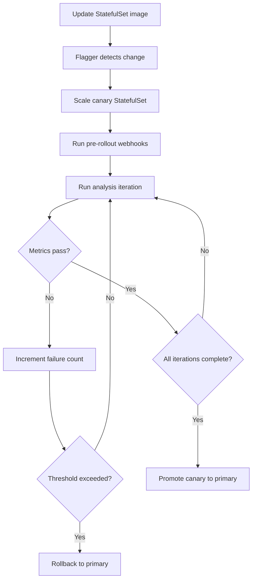

# How to Configure Flagger Canary Resource for StatefulSets

Author: [nawazdhandala](https://github.com/nawazdhandala)

Tags: flagger, canary, kubernetes, statefulsets, progressive delivery

Description: Learn how to configure a Flagger Canary resource for Kubernetes StatefulSets to safely roll out updates to stateful applications like databases and caches.

---

## Introduction

StatefulSets manage stateful applications in Kubernetes, providing stable network identities and persistent storage for each pod. Updating stateful workloads like databases, message queues, and caches carries higher risk than updating stateless Deployments because data integrity and ordering guarantees must be maintained.

> **Important**: As of Flagger v1.x, the Canary CRD's `targetRef.kind` field only accepts `Deployment`, `DaemonSet`, or `Service` as valid values. `StatefulSet` is **not** a supported `targetRef.kind`. There is an open feature request ([GitHub issue #410](https://github.com/weaveworks/flagger/issues/410)) and a closed pull request ([PR #1391](https://github.com/fluxcd/flagger/pull/1391)) for StatefulSet support, but neither has been merged into the official Flagger release. The patterns described in this guide (iteration-based analysis, health check webhooks, and custom Prometheus metrics) remain valid approaches once official StatefulSet support is added. For current production use, manage StatefulSet rollouts using native Kubernetes rolling update strategies combined with Flagger-monitored sidecar Deployments or external validation tooling.

## Prerequisites

- A running Kubernetes cluster (v1.22+)
- Flagger installed in your cluster (v1.30+)
- A supported service mesh or ingress controller
- kubectl configured to access your cluster
- A StorageClass configured for dynamic provisioning
- Familiarity with Kubernetes StatefulSets

## Setting Up the Target StatefulSet

Here is an example StatefulSet for a Redis cluster:

```yaml
# statefulset.yaml
apiVersion: apps/v1
kind: StatefulSet
metadata:
  name: redis
  namespace: cache
  labels:
    app: redis
spec:
  serviceName: redis
  replicas: 3
  selector:
    matchLabels:
      app: redis
  template:
    metadata:
      labels:
        app: redis
    spec:
      containers:
        - name: redis
          image: redis:7.0
          ports:
            - containerPort: 6379
              name: redis
            - containerPort: 9121
              name: metrics
          resources:
            requests:
              cpu: 100m
              memory: 128Mi
            limits:
              cpu: 500m
              memory: 512Mi
          volumeMounts:
            - name: data
              mountPath: /data
  volumeClaimTemplates:
    - metadata:
        name: data
      spec:
        accessModes: ["ReadWriteOnce"]
        resources:
          requests:
            storage: 10Gi
---
# headless-service.yaml
apiVersion: v1
kind: Service
metadata:
  name: redis
  namespace: cache
spec:
  clusterIP: None
  selector:
    app: redis
  ports:
    - port: 6379
      targetPort: redis
      name: redis
    - port: 9121
      targetPort: metrics
      name: metrics
```

Apply these resources:

```bash
kubectl create namespace cache
kubectl apply -f statefulset.yaml
```

## Creating the Canary Resource for a StatefulSet

Set the `targetRef.kind` to `StatefulSet`:

```yaml
# canary-statefulset.yaml
apiVersion: flagger.app/v1beta1
kind: Canary
metadata:
  name: redis
  namespace: cache
spec:
  # Target the StatefulSet
  targetRef:
    apiVersion: apps/v1
    kind: StatefulSet
    name: redis

  # Service configuration
  service:
    port: 6379
    targetPort: redis

  # Analysis configuration uses iterations (not traffic weight)
  analysis:
    interval: 1m
    threshold: 3
    iterations: 10
    metrics:
      - name: request-success-rate
        thresholdRange:
          min: 99
        interval: 1m
      - name: request-duration
        thresholdRange:
          max: 100
        interval: 1m
    webhooks:
      - name: redis-check
        type: pre-rollout
        url: http://flagger-loadtester.test/
        metadata:
          type: bash
          cmd: "redis-cli -h redis-canary.cache ping | grep PONG"
```

Apply the Canary:

```bash
kubectl apply -f canary-statefulset.yaml
```

## How StatefulSet Canary Analysis Works

Like DaemonSets, StatefulSets use iteration-based analysis rather than traffic weight shifting. Flagger evaluates the canary version over a defined number of iterations before deciding to promote or rollback.



## Key Considerations for StatefulSet Canaries

### Persistent Volume Handling

Flagger does not duplicate PersistentVolumeClaims during canary analysis. The primary and canary StatefulSets maintain separate PVCs. Be aware of data consistency implications when running both versions simultaneously.

### Ordered Pod Management

StatefulSets support two pod management policies: `OrderedReady` and `Parallel`. Flagger respects the configured policy during canary operations:

```yaml
spec:
  podManagementPolicy: OrderedReady  # Default - pods created in order
```

### Headless Services

StatefulSets typically use headless Services (with `clusterIP: None`). Flagger creates separate headless services for primary and canary:

```yaml
# Flagger creates these automatically:
# redis-primary - headless service for primary pods
# redis-canary  - headless service for canary pods
```

## Adding Health Checks with Webhooks

For stateful applications, it is critical to verify data integrity during canary analysis. Use webhooks to run custom health checks:

```yaml
analysis:
  interval: 1m
  threshold: 3
  iterations: 10
  webhooks:
    # Verify the canary can handle read/write operations
    - name: redis-write-test
      type: rollout
      url: http://flagger-loadtester.test/
      metadata:
        type: bash
        cmd: |
          redis-cli -h redis-canary.cache SET test-key "canary-test" && \
          redis-cli -h redis-canary.cache GET test-key | grep "canary-test"
    # Verify replication is working
    - name: redis-replication-check
      type: pre-rollout
      url: http://flagger-loadtester.test/
      metadata:
        type: bash
        cmd: |
          redis-cli -h redis-canary.cache INFO replication | grep "role:slave"
```

## Monitoring StatefulSet Canary Progress

Track the canary analysis:

```bash
# Watch canary status
kubectl get canary redis -n cache -w

# View detailed events
kubectl describe canary redis -n cache

# Check StatefulSet pod status (note the ordered naming)
kubectl get pods -n cache -l app=redis
```

Expected output during analysis:

```
NAME     STATUS        WEIGHT   LASTTRANSITIONTIME
redis    Progressing   0        2026-03-13T10:15:00Z
```

## Triggering a StatefulSet Canary Update

Update the container image to start a canary release:

```bash
kubectl set image statefulset/redis \
  redis=redis:7.2 \
  -n cache
```

## Example with Custom Prometheus Metrics

For a database workload, you might want to monitor query latency and connection counts:

```yaml
analysis:
  interval: 1m
  threshold: 5
  iterations: 15
  metrics:
    - name: request-success-rate
      thresholdRange:
        min: 99
      interval: 1m
    - name: redis-memory-usage
      templateRef:
        name: redis-memory
        namespace: cache
      thresholdRange:
        max: 80
      interval: 1m
```

With the corresponding MetricTemplate:

```yaml
apiVersion: flagger.app/v1beta1
kind: MetricTemplate
metadata:
  name: redis-memory
  namespace: cache
spec:
  provider:
    type: prometheus
    address: http://prometheus.monitoring:9090
  query: |
    redis_memory_used_ratio{
      kubernetes_pod_name=~"{{ target }}-[0-9]+"
    } * 100
```

## Conclusion

Configuring Flagger for StatefulSets follows the iteration-based analysis pattern similar to DaemonSets. The key considerations are handling persistent volumes, respecting pod ordering, and implementing thorough health checks that verify data integrity. By combining Flagger's automated analysis with custom webhooks for stateful validation, you can significantly reduce the risk of rolling out updates to your most critical stateful workloads.
