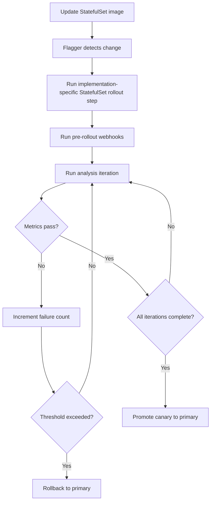

# How to Configure Flagger Canary Resource for StatefulSets

Author: [nawazdhandala](https://github.com/nawazdhandala)

Tags: Flagger, Canary, Kubernetes, StatefulSet, Progressive Delivery

Description: Learn how to configure a Flagger Canary resource for Kubernetes StatefulSets to safely roll out updates to stateful applications like databases and caches.

---

## Introduction

StatefulSets manage stateful applications in Kubernetes, providing stable network identities and persistent storage for each pod. Updating stateful workloads like databases, message queues, and caches carries higher risk than updating stateless Deployments because data integrity and ordering guarantees must be maintained.

> **Important**: As of Flagger v1.x, the Canary CRD's `targetRef.kind` field only accepts `Deployment`, `DaemonSet`, or `Service` as valid values. `StatefulSet` is **not** a supported `targetRef.kind`. There is an open feature request ([GitHub issue #410](https://github.com/weaveworks/flagger/issues/410)) and a closed pull request ([PR #1391](https://github.com/fluxcd/flagger/pull/1391)) for StatefulSet support, but neither has been merged into the official Flagger release. Do not apply a Canary that targets a StatefulSet in a production cluster; Kubernetes will reject it against the current Flagger CRD. The patterns described in this guide (iteration-based analysis, health check webhooks, and custom Prometheus metrics) are planning patterns that would need to be revalidated once official StatefulSet support is added. For current production use, manage StatefulSet rollouts using native Kubernetes rolling update strategies combined with Flagger-monitored sidecar Deployments or external validation tooling.

## Prerequisites

- A running Kubernetes cluster (v1.22+)
- Flagger installed in your cluster, if you are using a supported Deployment or DaemonSet workaround
- A supported service mesh or ingress controller
- kubectl configured to access your cluster
- A StorageClass configured for dynamic provisioning
- Familiarity with Kubernetes StatefulSets

## Setting Up the Target StatefulSet

Here is an example StatefulSet for Redis:

```yaml
# statefulset.yaml

apiVersion: apps/v1
kind: StatefulSet
metadata:
  name: redis
  namespace: cache
  labels:
    app: redis
spec:
  serviceName: redis
  replicas: 3
  selector:
    matchLabels:
      app: redis
  template:
    metadata:
      labels:
        app: redis
    spec:
      containers:
        - name: redis
          image: redis:7.0
          ports:
            - containerPort: 6379
              name: redis
          resources:
            requests:
              cpu: 100m
              memory: 128Mi
            limits:
              cpu: 500m
              memory: 512Mi
          volumeMounts:
            - name: data
              mountPath: /data
  volumeClaimTemplates:
    - metadata:
        name: data
      spec:
        accessModes: ["ReadWriteOnce"]
        resources:
          requests:
            storage: 10Gi
---
# headless-service.yaml
apiVersion: v1
kind: Service
metadata:
  name: redis
  namespace: cache
spec:
  clusterIP: None
  selector:
    app: redis
  ports:
    - port: 6379
      targetPort: redis
      name: redis
```

Apply these resources:

```bash
kubectl create namespace cache
kubectl apply -f statefulset.yaml
```

## Creating the Canary Resource for a StatefulSet

The following manifest shows what a StatefulSet Canary might look like if Flagger adds official support in the future. Do **not** apply this manifest against current Flagger releases because `StatefulSet` is not accepted by the Canary CRD:

```yaml
# canary-statefulset.yaml
apiVersion: flagger.app/v1beta1
kind: Canary
metadata:
  name: redis
  namespace: cache
spec:
  # Target the StatefulSet
  targetRef:
    apiVersion: apps/v1
    kind: StatefulSet
    name: redis

  # Service configuration
  service:
    port: 6379
    targetPort: redis

  # Analysis configuration uses iterations (not traffic weight)
  analysis:
    interval: 1m
    threshold: 3
    iterations: 10
    webhooks:
      - name: redis-check
        type: pre-rollout
        url: http://flagger-loadtester.test/
        metadata:
          type: bash
          cmd: "redis-cli -h redis-canary.cache ping | grep PONG"
```

Current Flagger releases will reject this Canary:

```bash
kubectl apply -f canary-statefulset.yaml
```

## How StatefulSet Canary Analysis Works

Flagger uses `analysis.iterations` for blue/green and A/B testing strategies. If StatefulSet support is added in the future, a StatefulSet rollout would likely need an iteration-based analysis model rather than HTTP traffic weight shifting. Flagger would evaluate the canary version over a defined number of iterations before deciding to promote or rollback.


```mermaid
graph TD
    A[Update StatefulSet image] --> B[Flagger detects change]
    B --> C[Run implementation-specific StatefulSet rollout step]
    C --> D[Run pre-rollout webhooks]
    D --> E[Run analysis iteration]
    E --> F{Metrics pass?}
    F -->|Yes| G{All iterations complete?}
    F -->|No| H[Increment failure count]
    H --> I{Threshold exceeded?}
    I -->|Yes| J[Rollback to primary]
    I -->|No| E
    G -->|No| E
    G -->|Yes| K[Promote canary to primary]
```

## Key Considerations for StatefulSet Canaries

### Persistent Volume Handling

The current Flagger controller does not implement StatefulSet canaries, so it does not define any PVC cloning or sharing behavior for StatefulSet analysis. Any future StatefulSet implementation would need explicit handling for PVC identity, data consistency, and whether primary and canary pods can safely run at the same time.

### Ordered Pod Management

StatefulSets support two pod management policies: `OrderedReady` and `Parallel`. A future Flagger implementation would need to preserve the ordering semantics configured on the StatefulSet:

```yaml
spec:
  podManagementPolicy: OrderedReady  # Default - pods created in order
```

### Headless Services

StatefulSets typically use headless Services (with `clusterIP: None`). Flagger can generate headless services for supported workloads when `spec.service.headless` is set to `true`, but current releases do not generate StatefulSet-specific primary and canary headless services:

```yaml
service:
  port: 6379
  targetPort: redis
  headless: true
```

## Adding Health Checks with Webhooks

For stateful applications, it is critical to verify data integrity during canary analysis. Use webhooks to run custom health checks:

```yaml
analysis:
  interval: 1m
  threshold: 3
  iterations: 10
  webhooks:
    # Verify the canary can handle read/write operations
    - name: redis-write-test
      type: rollout
      url: http://flagger-loadtester.test/
      metadata:
        type: bash
        cmd: |
          redis-cli -h redis-canary.cache SET test-key "canary-test" && \
          redis-cli -h redis-canary.cache GET test-key | grep "canary-test"
    # Verify replication is working
    - name: redis-replication-check
      type: pre-rollout
      url: http://flagger-loadtester.test/
      metadata:
        type: bash
        cmd: |
          redis-cli -h redis-canary.cache INFO replication | grep "role:slave"
```

## Monitoring StatefulSet Canary Progress

If Flagger adds StatefulSet support in the future, you would track the canary analysis with the normal Canary commands:

```bash
# Watch canary status
kubectl get canary redis -n cache -w

# View detailed events
kubectl describe canary redis -n cache

# Check StatefulSet pod status
kubectl get pods -n cache -l app=redis
```

For supported workloads, Flagger reports status in the Canary resource:

```text
NAME     STATUS        WEIGHT   LASTTRANSITIONTIME
redis    Progressing   0        2026-03-13T10:15:00Z
```

## Triggering a StatefulSet Canary Update

This command is valid for a native Kubernetes StatefulSet rolling update, but it will not start a Flagger canary in current Flagger releases:

```bash
kubectl set image statefulset/redis \
  redis=redis:7.2 \
  -n cache
```

## Example with Custom Prometheus Metrics

For a database workload, you might want to monitor memory usage or connection counts with custom metrics. Redis does not expose Prometheus metrics from the `redis:7.0` image by itself, so this example assumes you have deployed a Redis exporter that publishes Redis memory metrics:

```yaml
analysis:
  interval: 1m
  threshold: 5
  iterations: 15
  metrics:
    - name: redis-memory-usage
      templateRef:
        name: redis-memory
        namespace: cache
      thresholdRange:
        max: 80
      interval: 1m
```

With the corresponding MetricTemplate:

```yaml
apiVersion: flagger.app/v1beta1
kind: MetricTemplate
metadata:
  name: redis-memory
  namespace: cache
spec:
  provider:
    type: prometheus
    address: http://prometheus.monitoring:9090
  query: |
    100 * (
      redis_memory_used_bytes{pod=~"{{ target }}-[0-9]+"}
      /
      redis_memory_max_bytes{pod=~"{{ target }}-[0-9]+"}
    )
```

## Conclusion

Flagger does not currently support StatefulSets as Canary targets. If support is added in a future release, StatefulSet canaries will need careful handling for persistent volumes, pod ordering, and health checks that verify data integrity. Until then, use native Kubernetes StatefulSet rolling updates and pair them with external validation, or model the validation around a supported Flagger target such as a Deployment or DaemonSet.
