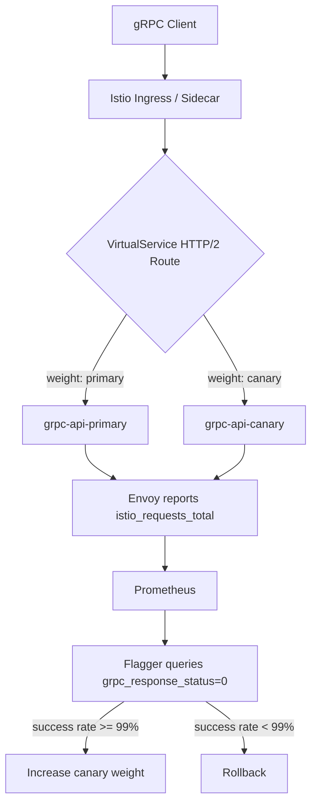

# How to Configure Flagger for Canary Deployments with gRPC Services

Author: [nawazdhandala](https://github.com/nawazdhandala)

Tags: Flagger, Canary, Kubernetes, gRPC, Istio, Progressive Delivery

Description: Learn how to configure Flagger for progressive canary deployments of gRPC services using Istio for traffic management and analysis.

---

## Introduction

gRPC is widely used in microservice architectures for its efficiency, strong typing, and bidirectional streaming support. When deploying gRPC services with Flagger, you need to handle the protocol-specific routing and metrics correctly. Istio natively supports gRPC traffic management, and Flagger can leverage this for canary analysis and progressive traffic shifting.

This guide covers the complete setup for running canary deployments on gRPC services, from Deployment configuration through Flagger Canary resource definition and metric analysis.

## Prerequisites

- A Kubernetes cluster (v1.25 or later)
- Flagger installed (v1.37 or later)
- Istio service mesh installed
- Prometheus installed and scraping Istio metrics
- kubectl configured to access your cluster

## Step 1: Deploy a gRPC Service

Create a Deployment for your gRPC service. The key detail is setting the port name with a `grpc-` prefix or using the `appProtocol` field so Istio recognizes it as gRPC traffic:

```yaml
apiVersion: apps/v1
kind: Deployment
metadata:
  name: grpc-api
  namespace: default
  labels:
    app: grpc-api
spec:
  replicas: 2
  selector:
    matchLabels:
      app: grpc-api
  template:
    metadata:
      labels:
        app: grpc-api
    spec:
      containers:
        - name: grpc-api
          image: myregistry/grpc-api:1.0.0
          ports:
            - name: grpc
              containerPort: 9000
              protocol: TCP
          readinessProbe:
            grpc:
              port: 9000
            initialDelaySeconds: 5
            periodSeconds: 10
          resources:
            requests:
              cpu: 100m
              memory: 128Mi
```

## Step 2: Create the Canary Resource for gRPC

Configure the Flagger Canary resource with `appProtocol: grpc` to instruct Flagger and Istio to treat traffic as gRPC:

```yaml
apiVersion: flagger.app/v1beta1
kind: Canary
metadata:
  name: grpc-api
  namespace: default
spec:
  targetRef:
    apiVersion: apps/v1
    kind: Deployment
    name: grpc-api
  service:
    port: 9000
    targetPort: 9000
    appProtocol: grpc
    portDiscovery: false
  analysis:
    interval: 30s
    threshold: 5
    maxWeight: 50
    stepWeight: 10
    metrics:
      - name: request-success-rate
        thresholdRange:
          min: 99
        interval: 1m
      - name: request-duration
        thresholdRange:
          max: 500
        interval: 1m
```

Flagger's built-in `request-success-rate` and `request-duration` metrics work with gRPC because Istio reports gRPC request metrics using the same `istio_requests_total` and `istio_request_duration_milliseconds` telemetry as HTTP. gRPC status codes are mapped to HTTP status codes in Istio metrics.

## Step 3: gRPC-Specific Metric Templates

If you want to analyze gRPC-specific status codes rather than the HTTP-mapped ones, create custom MetricTemplates:

```yaml
apiVersion: flagger.app/v1beta1
kind: MetricTemplate
metadata:
  name: grpc-success-rate
  namespace: default
spec:
  provider:
    type: prometheus
    address: http://prometheus.istio-system:9090
  query: |
    sum(rate(istio_requests_total{
      reporter="destination",
      destination_workload_namespace="{{ namespace }}",
      destination_workload="{{ target }}",
      grpc_response_status="0"
    }[{{ interval }}])) /
    sum(rate(istio_requests_total{
      reporter="destination",
      destination_workload_namespace="{{ namespace }}",
      destination_workload="{{ target }}"
    }[{{ interval }}])) * 100
```

gRPC status code `0` means `OK`. You can reference this metric in your Canary analysis:

```yaml
  analysis:
    metrics:
      - name: grpc-success-rate
        templateRef:
          name: grpc-success-rate
          namespace: default
        thresholdRange:
          min: 99
        interval: 1m
```

## Step 4: Configure gRPC Health Checking

Kubernetes v1.24+ supports native gRPC health checks. Make sure your gRPC service implements the standard gRPC health checking protocol (`grpc.health.v1.Health`). The readiness probe in the Deployment spec should use the `grpc` probe type:

```yaml
readinessProbe:
  grpc:
    port: 9000
    service: ""
  initialDelaySeconds: 5
  periodSeconds: 10
```

If your cluster does not support native gRPC probes, use a `grpc_health_probe` binary in an exec probe:

```yaml
readinessProbe:
  exec:
    command:
      - /bin/grpc_health_probe
      - -addr=:9000
  initialDelaySeconds: 5
  periodSeconds: 10
```

## Step 5: Verify the Generated VirtualService

After Flagger initializes the canary, check the VirtualService it creates:

```bash
kubectl get virtualservice grpc-api -o yaml
```

The VirtualService should contain HTTP routes (gRPC uses HTTP/2 under the hood):

```yaml
apiVersion: networking.istio.io/v1beta1
kind: VirtualService
metadata:
  name: grpc-api
spec:
  hosts:
    - grpc-api
  http:
    - route:
        - destination:
            host: grpc-api-primary
            port:
              number: 9000
          weight: 100
        - destination:
            host: grpc-api-canary
            port:
              number: 9000
          weight: 0
```

## Step 6: Trigger and Monitor the Canary

Update the Deployment image to start a canary rollout:

```bash
kubectl set image deployment/grpc-api grpc-api=myregistry/grpc-api:1.1.0
```

Watch the canary progression:

```bash
watch kubectl get canary grpc-api
```

Check events for detailed rollout information:

```bash
kubectl describe canary grpc-api
```

## gRPC Canary Analysis Flow



## Handling gRPC Streaming

If your gRPC service uses streaming RPCs (server-side, client-side, or bidirectional), be aware that:

- Istio metrics are reported per-stream, not per-message within a stream.
- Long-lived streams may not produce metrics frequently enough for short analysis intervals. Consider increasing `analysis.interval` to 1m or more.
- Connection-level load balancing means that new streams from existing connections may not respect the weight changes. Istio handles this correctly for gRPC because each RPC is routed independently.

## Conclusion

Flagger works well with gRPC services because Istio treats gRPC as HTTP/2 traffic, enabling the same weighted routing and telemetry used for HTTP canaries. Set `appProtocol: grpc` in your Canary spec, and Flagger will handle the rest. For more granular analysis, create custom MetricTemplates that filter on gRPC-specific status codes. Make sure your gRPC service implements the standard health checking protocol for proper readiness probes during the canary rollout.
