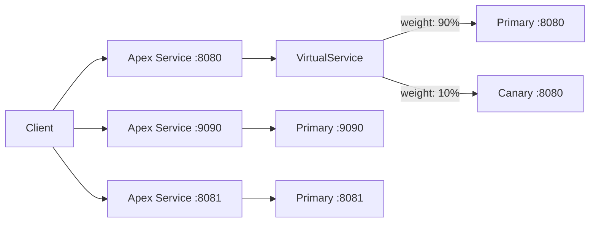

# How to Configure Flagger for Canary Deployments with Multiple Ports

Author: [nawazdhandala](https://github.com/nawazdhandala)

Tags: flagger, canary, kubernetes, multi-port, service mesh, progressive delivery

Description: Learn how to configure Flagger canary deployments for services that expose multiple ports, including HTTP, metrics, and admin endpoints.

---

## Introduction

Many production Kubernetes services expose more than one port. A typical microservice might serve HTTP traffic on port 8080, expose Prometheus metrics on port 9090, and provide an admin or health-check interface on port 8081. When you set up Flagger for canary deployments on such services, you need to ensure that all ports are properly defined in both your Deployment and Canary resource so that traffic shifting and analysis work correctly.

This guide walks you through configuring Flagger to handle canary deployments for services with multiple ports, using Istio as the service mesh provider.

## Prerequisites

- A Kubernetes cluster (v1.25 or later)
- Flagger installed (v1.37 or later)
- Istio service mesh installed and configured
- kubectl configured to access your cluster
- Basic familiarity with Kubernetes Deployments and Services

## Step 1: Define a Multi-Port Deployment

Start with a Deployment that exposes multiple container ports. Here is an example application that listens on three ports:

```yaml
apiVersion: apps/v1
kind: Deployment
metadata:
  name: multi-port-app
  namespace: default
  labels:
    app: multi-port-app
spec:
  replicas: 2
  selector:
    matchLabels:
      app: multi-port-app
  template:
    metadata:
      labels:
        app: multi-port-app
    spec:
      containers:
        - name: app
          image: myregistry/multi-port-app:1.0.0
          ports:
            - name: http
              containerPort: 8080
              protocol: TCP
            - name: metrics
              containerPort: 9090
              protocol: TCP
            - name: admin
              containerPort: 8081
              protocol: TCP
          readinessProbe:
            httpGet:
              path: /healthz
              port: http
            initialDelaySeconds: 5
            periodSeconds: 10
```

## Step 2: Create the Canary Resource with Multiple Ports

The Flagger Canary resource supports a `service.portDiscovery` field and allows you to define additional ports via `service.port` for the primary port and `service.additionalPorts` (or through the generated service) for the remaining ports. You specify the primary analysis port in `service.port` and list additional ports under `service.portDiscovery` or by letting Flagger auto-discover them from the Deployment spec.

```yaml
apiVersion: flagger.app/v1beta1
kind: Canary
metadata:
  name: multi-port-app
  namespace: default
spec:
  targetRef:
    apiVersion: apps/v1
    kind: Deployment
    name: multi-port-app
  service:
    port: 8080
    targetPort: http
    name: http
    portDiscovery: true
    trafficPolicy:
      tls:
        mode: ISTIO_MUTUAL
  analysis:
    interval: 30s
    threshold: 5
    maxWeight: 50
    stepWeight: 10
    metrics:
      - name: request-success-rate
        thresholdRange:
          min: 99
        interval: 1m
      - name: request-duration
        thresholdRange:
          max: 500
        interval: 1m
```

Setting `portDiscovery: true` tells Flagger to scan the Deployment's container ports and automatically create ClusterIP services for each discovered port. Flagger will generate the primary service on port 8080 and additional services for ports 9090 and 8081.

## Step 3: Verify the Generated Services

After applying the Canary resource, Flagger creates several Kubernetes services. Check them with:

```bash
kubectl get services -l app=multi-port-app
```

You should see output similar to:

```
NAME                      TYPE        CLUSTER-IP       PORT(S)
multi-port-app            ClusterIP   10.96.100.1      8080/TCP,9090/TCP,8081/TCP
multi-port-app-canary     ClusterIP   10.96.100.2      8080/TCP,9090/TCP,8081/TCP
multi-port-app-primary    ClusterIP   10.96.100.3      8080/TCP,9090/TCP,8081/TCP
```

Flagger creates a primary service (serving stable traffic), a canary service (serving new-version traffic), and the apex service (used for routing).

## Step 4: Manually Specifying Additional Ports

If you prefer explicit control rather than auto-discovery, you can disable `portDiscovery` and define the ports manually. Flagger supports specifying the primary port and appending additional port definitions through the generated VirtualService. However, the recommended approach is to use `portDiscovery: true` for simplicity.

For service meshes that need explicit port mapping in the VirtualService, you can combine the Canary resource with a custom VirtualService:

```yaml
apiVersion: networking.istio.io/v1beta1
kind: VirtualService
metadata:
  name: multi-port-app
  namespace: default
spec:
  hosts:
    - multi-port-app
  http:
    - route:
        - destination:
            host: multi-port-app-primary
            port:
              number: 8080
          weight: 100
        - destination:
            host: multi-port-app-canary
            port:
              number: 8080
          weight: 0
```

Note that Flagger manages the VirtualService weights automatically during a canary rollout. The above is the initial state before any canary analysis begins.

## Step 5: Validate the Canary Configuration

Confirm that Flagger has initialized the canary correctly:

```bash
kubectl get canary multi-port-app -o wide
```

You should see the status as `Initialized`. To trigger a canary rollout, update the container image:

```bash
kubectl set image deployment/multi-port-app app=myregistry/multi-port-app:1.1.0
```

Monitor the rollout progress:

```bash
kubectl describe canary multi-port-app
```

Flagger will incrementally shift traffic on the primary port (8080) while the additional ports remain accessible on both the primary and canary services throughout the rollout.

## How Traffic Flows During a Multi-Port Canary



Traffic shifting only applies to the primary analysis port. The metrics and admin ports route directly to the primary or canary pods based on the service selector, not through weighted routing.

## Conclusion

Configuring Flagger for multi-port services is straightforward when you use the `portDiscovery: true` option. Flagger automatically detects all container ports and creates corresponding services for both the primary and canary workloads. The canary analysis and traffic shifting operate on the primary port you define in `service.port`, while additional ports remain accessible throughout the deployment. This approach lets you maintain metrics endpoints, admin interfaces, and other auxiliary ports without interfering with the progressive delivery process.
