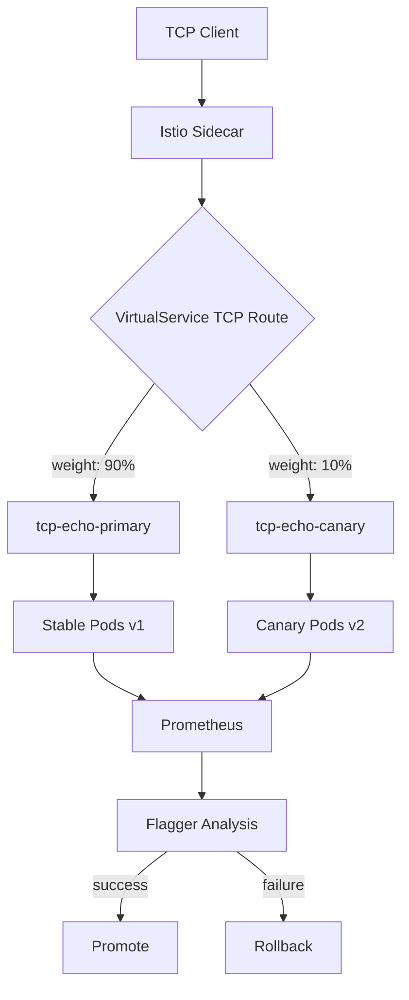

# How to Configure Flagger for Canary Deployments with TCP Services

Author: [nawazdhandala](https://github.com/nawazdhandala)

Tags: Flagger, Canary, Kubernetes, TCP, Istio, Progressive Delivery

Description: Learn how to set up Flagger canary deployments for TCP-based services using Istio service mesh for weighted traffic routing.

---

## Introduction

Not all services communicate over HTTP. Many infrastructure components such as databases, message brokers, and custom protocol servers use raw TCP connections. Flagger supports canary deployments for TCP services when used with Istio, which can perform weighted TCP routing through its VirtualService and DestinationRule resources.

This guide demonstrates how to configure Flagger for progressive delivery of TCP-based services, including the necessary Istio configuration and metric collection setup.

## Prerequisites

- A Kubernetes cluster (v1.25 or later)
- Flagger installed (v1.37 or later)
- Istio service mesh with TCP routing support
- Prometheus installed for metrics collection
- kubectl configured to access your cluster

## Step 1: Deploy a TCP Service

Create a Deployment for a TCP service. This example uses a simple TCP echo server:

```yaml
apiVersion: apps/v1
kind: Deployment
metadata:
  name: tcp-echo
  namespace: default
  labels:
    app: tcp-echo
spec:
  replicas: 2
  selector:
    matchLabels:
      app: tcp-echo
  template:
    metadata:
      labels:
        app: tcp-echo
      annotations:
        prometheus.io/scrape: "true"
        prometheus.io/port: "9090"
    spec:
      containers:
        - name: tcp-echo
          image: myregistry/tcp-echo:1.0.0
          ports:
            - name: tcp
              containerPort: 5000
              protocol: TCP
            - name: metrics
              containerPort: 9090
              protocol: TCP
          readinessProbe:
            tcpSocket:
              port: 5000
            initialDelaySeconds: 5
            periodSeconds: 10
```

## Step 2: Create the Canary Resource for TCP

When configuring Flagger for TCP services, you must set the `service.appProtocol` field to `tcp` to tell Flagger to generate TCP routing rules in the Istio VirtualService instead of HTTP routes.

```yaml
apiVersion: flagger.app/v1beta1
kind: Canary
metadata:
  name: tcp-echo
  namespace: default
spec:
  targetRef:
    apiVersion: apps/v1
    kind: Deployment
    name: tcp-echo
  service:
    port: 5000
    targetPort: tcp
    appProtocol: tcp
    portDiscovery: true
  analysis:
    interval: 30s
    threshold: 5
    maxWeight: 50
    stepWeight: 10
    metrics:
      - name: tcp-connections-success
        templateRef:
          name: tcp-connections-success
          namespace: default
        thresholdRange:
          min: 99
        interval: 1m
```

Since TCP services do not have built-in request success rate or request duration metrics, you need to define custom metric templates.

## Step 3: Define Custom TCP Metrics

Flagger uses MetricTemplate resources to query Prometheus for TCP-specific metrics. Create a MetricTemplate that measures TCP connection success rate:

```yaml
apiVersion: flagger.app/v1beta1
kind: MetricTemplate
metadata:
  name: tcp-connections-success
  namespace: default
spec:
  provider:
    type: prometheus
    address: http://prometheus.istio-system:9090
  query: |
    sum(rate(istio_tcp_connections_opened_total{
      reporter="destination",
      destination_workload_namespace="{{ namespace }}",
      destination_workload="{{ target }}"
    }[{{ interval }}])) /
    (sum(rate(istio_tcp_connections_opened_total{
      reporter="destination",
      destination_workload_namespace="{{ namespace }}",
      destination_workload="{{ target }}"
    }[{{ interval }}])) +
    sum(rate(istio_tcp_connections_closed_total{
      reporter="destination",
      destination_workload_namespace="{{ namespace }}",
      destination_workload="{{ target }}",
      connection_security_policy!="mutual_tls"
    }[{{ interval }}]))) * 100
```

You can also add a metric for TCP bytes received to monitor throughput:

```yaml
apiVersion: flagger.app/v1beta1
kind: MetricTemplate
metadata:
  name: tcp-bytes-received
  namespace: default
spec:
  provider:
    type: prometheus
    address: http://prometheus.istio-system:9090
  query: |
    sum(rate(istio_tcp_received_bytes_total{
      reporter="destination",
      destination_workload_namespace="{{ namespace }}",
      destination_workload="{{ target }}"
    }[{{ interval }}]))
```

## Step 4: Understanding the Generated Istio Resources

When Flagger initializes a TCP canary, it creates Istio resources with TCP-specific routing. The generated VirtualService will look like this:

```yaml
apiVersion: networking.istio.io/v1beta1
kind: VirtualService
metadata:
  name: tcp-echo
  namespace: default
spec:
  hosts:
    - tcp-echo
  tcp:
    - match:
        - port: 5000
      route:
        - destination:
            host: tcp-echo-primary
            port:
              number: 5000
          weight: 100
        - destination:
            host: tcp-echo-canary
            port:
              number: 5000
          weight: 0
```

Notice the `tcp` section instead of the `http` section. Istio uses this to perform weighted TCP routing at L4.

## Step 5: Trigger and Monitor a TCP Canary Rollout

Trigger the canary by updating the Deployment image:

```bash
kubectl set image deployment/tcp-echo tcp-echo=myregistry/tcp-echo:1.1.0
```

Monitor the progress:

```bash
watch kubectl get canary tcp-echo
```

You can also check the Flagger logs for detailed analysis output:

```bash
kubectl -n flagger-system logs deployment/flagger -f | grep tcp-echo
```

## TCP Canary Traffic Flow



## Important Considerations for TCP Canaries

TCP canary deployments have some limitations compared to HTTP canaries:

1. **No header-based routing**: TCP operates at L4, so you cannot use HTTP headers for traffic mirroring or A/B testing.
2. **Limited metrics**: Istio provides connection-level metrics for TCP, not request-level metrics. You get connection counts and byte throughput but not response codes.
3. **Long-lived connections**: If your TCP service uses persistent connections, traffic shifting happens only for new connections. Existing connections remain on their current destination.
4. **No retries**: TCP routing in Istio does not support automatic retries like HTTP routing does.

## Conclusion

Flagger supports canary deployments for TCP services through Istio's L4 routing capabilities. The key differences from HTTP canaries are using `appProtocol: tcp` in the Canary spec, creating custom MetricTemplate resources for TCP-specific Prometheus metrics, and understanding that traffic shifting happens at the connection level. While TCP canaries have fewer analysis options than HTTP canaries, they still provide a safe progressive delivery mechanism for non-HTTP workloads.
