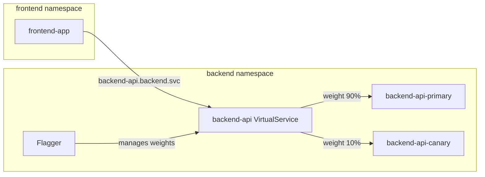

# How to Configure Flagger for Cross-Namespace Canary Deployments

Author: [nawazdhandala](https://github.com/nawazdhandala)

Tags: Flagger, Canary, Kubernetes, Namespace, Istio, Progressive Delivery

Description: Learn how to configure Flagger canary deployments that work across Kubernetes namespaces with proper service mesh routing and RBAC.

---

## Introduction

In production Kubernetes environments, services are often distributed across multiple namespaces for isolation, multi-tenancy, or organizational separation. When a service in one namespace needs to communicate with a canary deployment in another namespace, Flagger and the service mesh must be configured to handle cross-namespace traffic routing correctly.

This guide covers how to set up Flagger canary deployments that work across namespace boundaries, including Istio VirtualService configuration, RBAC requirements, and DNS considerations.

## Prerequisites

- A Kubernetes cluster (v1.25 or later)
- Flagger installed (v1.37 or later)
- Istio service mesh with cross-namespace support
- kubectl configured to access your cluster
- Cluster-admin access for RBAC configuration

## Step 1: Set Up Namespaces

Create the namespaces and label them for Istio sidecar injection:

```bash
kubectl create namespace frontend
kubectl create namespace backend
kubectl label namespace frontend istio-injection=enabled
kubectl label namespace backend istio-injection=enabled
```

## Step 2: Deploy the Backend Service

Deploy the backend service in the `backend` namespace:

```yaml
apiVersion: apps/v1
kind: Deployment
metadata:
  name: backend-api
  namespace: backend
  labels:
    app: backend-api
spec:
  replicas: 2
  selector:
    matchLabels:
      app: backend-api
  template:
    metadata:
      labels:
        app: backend-api
    spec:
      containers:
        - name: backend-api
          image: myregistry/backend-api:1.0.0
          ports:
            - name: http
              containerPort: 8080
          readinessProbe:
            httpGet:
              path: /healthz
              port: 8080
```

## Step 3: Create the Canary in the Backend Namespace

The Canary resource must reside in the same namespace as the target Deployment:

```yaml
apiVersion: flagger.app/v1beta1
kind: Canary
metadata:
  name: backend-api
  namespace: backend
spec:
  targetRef:
    apiVersion: apps/v1
    kind: Deployment
    name: backend-api
  service:
    port: 8080
    targetPort: http
    hosts:
      - backend-api.backend.svc.cluster.local
    trafficPolicy:
      tls:
        mode: ISTIO_MUTUAL
  analysis:
    interval: 30s
    threshold: 5
    maxWeight: 50
    stepWeight: 10
    metrics:
      - name: request-success-rate
        thresholdRange:
          min: 99
        interval: 1m
      - name: request-duration
        thresholdRange:
          max: 500
        interval: 1m
```

The `hosts` field specifies the fully qualified domain name (FQDN) of the service. This is important for cross-namespace routing because clients in other namespaces resolve the service using its FQDN.

## Step 4: Configure Cross-Namespace Service Discovery

Services in the `frontend` namespace need to reach the backend using its FQDN. Create an Istio `ServiceEntry` or use Kubernetes DNS directly:

```yaml
# Frontend deployment calling backend across namespaces
apiVersion: apps/v1
kind: Deployment
metadata:
  name: frontend-app
  namespace: frontend
  labels:
    app: frontend-app
spec:
  replicas: 2
  selector:
    matchLabels:
      app: frontend-app
  template:
    metadata:
      labels:
        app: frontend-app
    spec:
      containers:
        - name: frontend-app
          image: myregistry/frontend-app:1.0.0
          ports:
            - containerPort: 3000
          env:
            - name: BACKEND_URL
              value: "http://backend-api.backend.svc.cluster.local:8080"
```

The frontend uses `backend-api.backend.svc.cluster.local` to reach the backend. Istio's VirtualService in the `backend` namespace will handle traffic splitting for canary analysis.

## Step 5: Export the VirtualService Across Namespaces

By default, Istio VirtualServices are scoped to their namespace. To make the canary routing visible to the `frontend` namespace, configure the VirtualService with `exportTo`:

```yaml
apiVersion: networking.istio.io/v1beta1
kind: VirtualService
metadata:
  name: backend-api
  namespace: backend
spec:
  hosts:
    - backend-api.backend.svc.cluster.local
  exportTo:
    - "."
    - "frontend"
  http:
    - route:
        - destination:
            host: backend-api-primary.backend.svc.cluster.local
            port:
              number: 8080
          weight: 100
        - destination:
            host: backend-api-canary.backend.svc.cluster.local
            port:
              number: 8080
          weight: 0
```

Note: Flagger manages this VirtualService automatically. If you need cross-namespace export, you may need to patch the VirtualService after Flagger creates it, or use Istio's mesh-wide configuration to allow cross-namespace routing by default.

## Step 6: Configure RBAC for Flagger

Flagger needs permissions to manage resources in the `backend` namespace. If Flagger runs in its own namespace (e.g., `flagger-system`), its ServiceAccount needs the following RBAC:

```yaml
apiVersion: rbac.authorization.k8s.io/v1
kind: ClusterRole
metadata:
  name: flagger-cross-namespace
rules:
  - apiGroups: ["apps"]
    resources: ["deployments", "deployments/scale"]
    verbs: ["get", "list", "watch", "update", "patch"]
  - apiGroups: [""]
    resources: ["services"]
    verbs: ["get", "list", "watch", "create", "update", "patch", "delete"]
  - apiGroups: ["networking.istio.io"]
    resources: ["virtualservices", "destinationrules"]
    verbs: ["get", "list", "watch", "create", "update", "patch", "delete"]
  - apiGroups: ["flagger.app"]
    resources: ["canaries", "canaries/status", "metrictemplates"]
    verbs: ["get", "list", "watch", "create", "update", "patch"]
---
apiVersion: rbac.authorization.k8s.io/v1
kind: ClusterRoleBinding
metadata:
  name: flagger-cross-namespace
roleRef:
  apiGroup: rbac.authorization.k8s.io
  kind: ClusterRole
  name: flagger-cross-namespace
subjects:
  - kind: ServiceAccount
    name: flagger
    namespace: flagger-system
```

## Step 7: Verify Cross-Namespace Routing

After the canary initializes, confirm that traffic from the frontend namespace routes correctly:

```bash
# Check canary status
kubectl -n backend get canary backend-api

# Check services in backend namespace
kubectl -n backend get svc -l app=backend-api

# Test connectivity from frontend namespace
kubectl -n frontend exec -it deploy/frontend-app -- \
  curl -s http://backend-api.backend.svc.cluster.local:8080/healthz
```

## Cross-Namespace Traffic Flow



## Istio Sidecar Resource for Namespace Isolation

If you use Istio Sidecar resources to limit the scope of service discovery, make sure the frontend namespace can discover backend services:

```yaml
apiVersion: networking.istio.io/v1beta1
kind: Sidecar
metadata:
  name: frontend-sidecar
  namespace: frontend
spec:
  egress:
    - hosts:
        - "frontend/*"
        - "backend/*"
        - "istio-system/*"
```

## Conclusion

Cross-namespace canary deployments with Flagger require attention to DNS naming, Istio VirtualService export configuration, and RBAC permissions. The Canary resource must reside in the same namespace as its target Deployment, while services in other namespaces access the canary through the FQDN. Ensure that Istio configuration allows cross-namespace routing and that Flagger has the necessary cluster-wide permissions to manage resources across namespaces.
