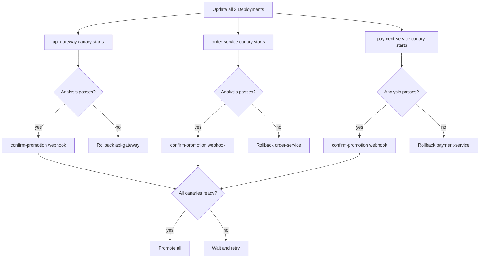

# How to Configure Flagger for Multi-Service Canary Deployments

Author: [nawazdhandala](https://github.com/nawazdhandala)

Tags: Flagger, Canary, Kubernetes, Multi-Service, Istio, Progressive Delivery

Description: Learn how to coordinate canary deployments across multiple interdependent services using Flagger and Istio.

---

## Introduction

In a microservices architecture, deploying a new feature often requires updating multiple services simultaneously. For example, a frontend change might depend on a new API endpoint in the backend, which in turn requires a schema update in a data service. Flagger does not have a built-in multi-service coordination mechanism, but you can configure multiple Canary resources and use webhooks and manual gates to synchronize their rollouts.

This guide demonstrates patterns for managing canary deployments across multiple services that need to be released together.

## Prerequisites

- A Kubernetes cluster (v1.25 or later)
- Flagger installed (v1.37 or later)
- Istio service mesh installed
- kubectl configured to access your cluster
- Familiarity with Flagger Canary resources and webhooks

## Step 1: Deploy the Services

Consider a system with three services: `api-gateway`, `order-service`, and `payment-service`. Deploy all three:

```yaml
apiVersion: apps/v1
kind: Deployment
metadata:
  name: api-gateway
  namespace: default
  labels:
    app: api-gateway
spec:
  replicas: 2
  selector:
    matchLabels:
      app: api-gateway
  template:
    metadata:
      labels:
        app: api-gateway
        version: "1.0.0"
    spec:
      containers:
        - name: api-gateway
          image: myregistry/api-gateway:1.0.0
          ports:
            - containerPort: 8080
---
apiVersion: apps/v1
kind: Deployment
metadata:
  name: order-service
  namespace: default
  labels:
    app: order-service
spec:
  replicas: 2
  selector:
    matchLabels:
      app: order-service
  template:
    metadata:
      labels:
        app: order-service
        version: "1.0.0"
    spec:
      containers:
        - name: order-service
          image: myregistry/order-service:1.0.0
          ports:
            - containerPort: 8080
---
apiVersion: apps/v1
kind: Deployment
metadata:
  name: payment-service
  namespace: default
  labels:
    app: payment-service
spec:
  replicas: 2
  selector:
    matchLabels:
      app: payment-service
  template:
    metadata:
      labels:
        app: payment-service
        version: "1.0.0"
    spec:
      containers:
        - name: payment-service
          image: myregistry/payment-service:1.0.0
          ports:
            - containerPort: 8080
```

## Step 2: Create Canary Resources for Each Service

Define a Canary resource for each service. Each canary operates independently but uses webhooks to check the status of related canaries:

```yaml
apiVersion: flagger.app/v1beta1
kind: Canary
metadata:
  name: api-gateway
  namespace: default
spec:
  targetRef:
    apiVersion: apps/v1
    kind: Deployment
    name: api-gateway
  service:
    port: 8080
  analysis:
    interval: 30s
    threshold: 5
    maxWeight: 50
    stepWeight: 10
    metrics:
      - name: request-success-rate
        thresholdRange:
          min: 99
        interval: 1m
    webhooks:
      - name: check-dependent-canaries
        type: pre-rollout
        url: http://flagger-loadtester.default/
        timeout: 60s
        metadata:
          type: bash
          cmd: |
            kubectl get canary order-service -n default -o jsonpath='{.status.phase}' | grep -E '(Succeeded|Initialized)' &&
            kubectl get canary payment-service -n default -o jsonpath='{.status.phase}' | grep -E '(Succeeded|Initialized|Progressing)'
---
apiVersion: flagger.app/v1beta1
kind: Canary
metadata:
  name: order-service
  namespace: default
spec:
  targetRef:
    apiVersion: apps/v1
    kind: Deployment
    name: order-service
  service:
    port: 8080
  analysis:
    interval: 30s
    threshold: 5
    maxWeight: 50
    stepWeight: 10
    metrics:
      - name: request-success-rate
        thresholdRange:
          min: 99
        interval: 1m
---
apiVersion: flagger.app/v1beta1
kind: Canary
metadata:
  name: payment-service
  namespace: default
spec:
  targetRef:
    apiVersion: apps/v1
    kind: Deployment
    name: payment-service
  service:
    port: 8080
  analysis:
    interval: 30s
    threshold: 5
    maxWeight: 50
    stepWeight: 10
    metrics:
      - name: request-success-rate
        thresholdRange:
          min: 99
        interval: 1m
```

## Step 3: Use a Confirm-Promotion Webhook for Coordination

For tighter coordination, use `confirm-promotion` webhooks that hold the promotion until all services pass analysis:

```yaml
apiVersion: flagger.app/v1beta1
kind: Canary
metadata:
  name: api-gateway
  namespace: default
spec:
  targetRef:
    apiVersion: apps/v1
    kind: Deployment
    name: api-gateway
  service:
    port: 8080
  analysis:
    interval: 30s
    threshold: 10
    maxWeight: 50
    stepWeight: 10
    metrics:
      - name: request-success-rate
        thresholdRange:
          min: 99
        interval: 1m
    webhooks:
      - name: wait-for-all-canaries
        type: confirm-promotion
        url: http://flagger-loadtester.default/
        timeout: 60s
        metadata:
          type: bash
          cmd: |
            kubectl get canary order-service -n default -o jsonpath='{.status.phase}' | grep -v Failed &&
            kubectl get canary payment-service -n default -o jsonpath='{.status.phase}' | grep -v Failed
```

The `confirm-promotion` webhook runs after analysis passes but before the canary is promoted. This lets you gate promotion on the status of other canaries.

## Step 4: Deploy All Services Together

To trigger a coordinated rollout, update all deployments at roughly the same time:

```bash
kubectl set image deployment/api-gateway api-gateway=myregistry/api-gateway:1.1.0
kubectl set image deployment/order-service order-service=myregistry/order-service:1.1.0
kubectl set image deployment/payment-service payment-service=myregistry/payment-service:1.1.0
```

Monitor all canaries simultaneously:

```bash
watch 'kubectl get canaries'
```

## Multi-Service Canary Coordination Flow



## Step 5: Handle Partial Failures

If one service fails its canary analysis while others succeed, you have two options:

1. **Independent rollback**: Let each canary manage its own lifecycle. Failed services roll back while successful ones promote. This works when services maintain backward compatibility.

2. **Coordinated rollback**: Use `confirm-promotion` webhooks to check that all related canaries are healthy. If any canary fails, the others will not promote and will eventually roll back when they hit their threshold.

For coordinated rollback, increase the `threshold` value to give dependent services time to complete their analysis:

```yaml
analysis:
  threshold: 15
  interval: 30s
```

## Conclusion

While Flagger does not provide a native multi-service deployment primitive, you can coordinate multiple canary deployments using webhooks. The `pre-rollout` webhook type validates preconditions before analysis begins, and the `confirm-promotion` webhook gates promotion on the status of dependent canaries. For tightly coupled services, use coordinated rollback patterns with elevated thresholds to ensure all services promote or roll back together. For loosely coupled services, independent canaries with backward-compatible APIs provide a simpler approach.
