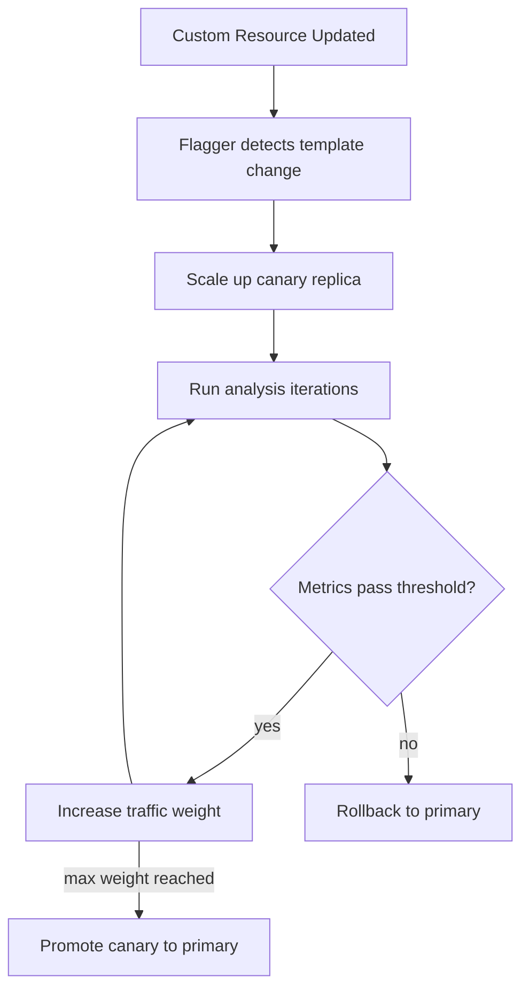

# How to Configure Flagger with Custom Resource Targets

Author: [nawazdhandala](https://github.com/nawazdhandala)

Tags: Flagger, Canary, Kubernetes, Custom Resources, Progressive Delivery

Description: Learn how to configure Flagger to perform canary deployments on custom resources beyond standard Deployments, including DaemonSets and custom controllers.

---

## Introduction

Flagger typically targets Kubernetes Deployments for canary analysis and progressive delivery. However, many teams use custom resource types such as Rollouts, StatefulSets-like CRDs, or operator-managed workloads. Flagger supports targeting custom resources through its `targetRef` field, as long as the custom resource follows certain conventions for scaling and pod template management.

This guide explains how to configure Flagger to work with custom resource targets, covering the requirements, configuration, and common patterns.

## Prerequisites

- A Kubernetes cluster (v1.25 or later)
- Flagger installed (v1.37 or later)
- A service mesh or ingress controller supported by Flagger
- The custom resource controller installed in your cluster
- kubectl configured to access your cluster

## Step 1: Understand Custom Resource Requirements

For Flagger to manage a custom resource, the resource must:

1. Have a `spec.template` field containing a PodTemplateSpec (similar to a Deployment).
2. Support the `/scale` subresource for scaling replicas.
3. Be watchable by Flagger (the API group and version must be accessible).

Flagger creates a copy of the target resource (the primary) and manages the original as the canary. It detects changes to the pod template and triggers analysis.

## Step 2: Configure Flagger with a DaemonSet Target

Flagger supports DaemonSets as targets. Since DaemonSets cannot be scaled, Flagger uses a different strategy. Here is a Canary resource targeting a DaemonSet:

```yaml
apiVersion: flagger.app/v1beta1
kind: Canary
metadata:
  name: logging-agent
  namespace: default
spec:
  targetRef:
    apiVersion: apps/v1
    kind: DaemonSet
    name: logging-agent
  service:
    port: 8080
    targetPort: 8080
  analysis:
    interval: 1m
    threshold: 5
    iterations: 10
    metrics:
      - name: request-success-rate
        thresholdRange:
          min: 99
        interval: 1m
    webhooks:
      - name: load-test
        type: rollout
        url: http://flagger-loadtester.default/
        timeout: 30s
        metadata:
          cmd: "hey -z 1m -q 10 -c 2 http://logging-agent-canary.default:8080/"
```

Note the use of `iterations` instead of `maxWeight`/`stepWeight`. Since DaemonSets run on every node, weight-based traffic shifting does not apply. Instead, Flagger runs the analysis for a fixed number of iterations.

## Step 3: Target a Custom CRD

To target a custom resource managed by an operator, specify its API group, version, and kind in the `targetRef`:

```yaml
apiVersion: flagger.app/v1beta1
kind: Canary
metadata:
  name: my-custom-app
  namespace: default
spec:
  targetRef:
    apiVersion: myoperator.example.com/v1alpha1
    kind: MyApp
    name: my-custom-app
  service:
    port: 8080
    targetPort: http
  analysis:
    interval: 30s
    threshold: 5
    maxWeight: 50
    stepWeight: 10
    metrics:
      - name: request-success-rate
        thresholdRange:
          min: 99
        interval: 1m
```

Your custom resource must have this general structure:

```yaml
apiVersion: myoperator.example.com/v1alpha1
kind: MyApp
metadata:
  name: my-custom-app
  namespace: default
spec:
  replicas: 3
  selector:
    matchLabels:
      app: my-custom-app
  template:
    metadata:
      labels:
        app: my-custom-app
    spec:
      containers:
        - name: app
          image: myregistry/my-custom-app:1.0.0
          ports:
            - name: http
              containerPort: 8080
```

## Step 4: Grant Flagger RBAC for Custom Resources

Flagger needs permissions to read, create, and update your custom resources. Add a ClusterRole:

```yaml
apiVersion: rbac.authorization.k8s.io/v1
kind: ClusterRole
metadata:
  name: flagger-custom-resources
rules:
  - apiGroups: ["myoperator.example.com"]
    resources: ["myapps", "myapps/scale"]
    verbs: ["get", "list", "watch", "create", "update", "patch", "delete"]
---
apiVersion: rbac.authorization.k8s.io/v1
kind: ClusterRoleBinding
metadata:
  name: flagger-custom-resources
roleRef:
  apiGroup: rbac.authorization.k8s.io
  kind: ClusterRole
  name: flagger-custom-resources
subjects:
  - kind: ServiceAccount
    name: flagger
    namespace: flagger-system
```

## Step 5: Handle Scale Subresource

If your custom resource supports the `/scale` subresource, Flagger can scale the primary and canary independently. Verify that the CRD has the scale subresource enabled:

```yaml
apiVersion: apiextensions.k8s.io/v1
kind: CustomResourceDefinition
metadata:
  name: myapps.myoperator.example.com
spec:
  group: myoperator.example.com
  versions:
    - name: v1alpha1
      served: true
      storage: true
      subresources:
        status: {}
        scale:
          specReplicasPath: .spec.replicas
          statusReplicasPath: .status.replicas
          labelSelectorPath: .status.labelSelector
      schema:
        openAPIV3Schema:
          type: object
          properties:
            spec:
              type: object
              properties:
                replicas:
                  type: integer
                template:
                  type: object
                  x-kubernetes-preserve-unknown-fields: true
```

The `specReplicasPath`, `statusReplicasPath`, and `labelSelectorPath` fields tell Kubernetes how to map the scale subresource to fields in your custom resource.

## Step 6: Using AutoscalerRef with Custom Targets

If your custom resource uses an HPA for autoscaling, reference it in the Canary spec:

```yaml
apiVersion: flagger.app/v1beta1
kind: Canary
metadata:
  name: my-custom-app
  namespace: default
spec:
  targetRef:
    apiVersion: myoperator.example.com/v1alpha1
    kind: MyApp
    name: my-custom-app
  autoscalerRef:
    apiVersion: autoscaling/v2
    kind: HorizontalPodAutoscaler
    name: my-custom-app
  service:
    port: 8080
  analysis:
    interval: 30s
    threshold: 5
    maxWeight: 50
    stepWeight: 10
    metrics:
      - name: request-success-rate
        thresholdRange:
          min: 99
        interval: 1m
```

Flagger will create a copy of the HPA for the primary resource and manage scaling for both primary and canary workloads.

## Custom Resource Canary Flow



## Conclusion

Flagger can target any Kubernetes resource that follows the Deployment-like conventions of having a pod template spec and supporting the scale subresource. When using custom CRDs, ensure the resource structure matches what Flagger expects, grant appropriate RBAC permissions, and verify that the scale subresource is configured in the CRD. For workloads that cannot be scaled (like DaemonSets), use iteration-based analysis instead of weight-based traffic shifting.
