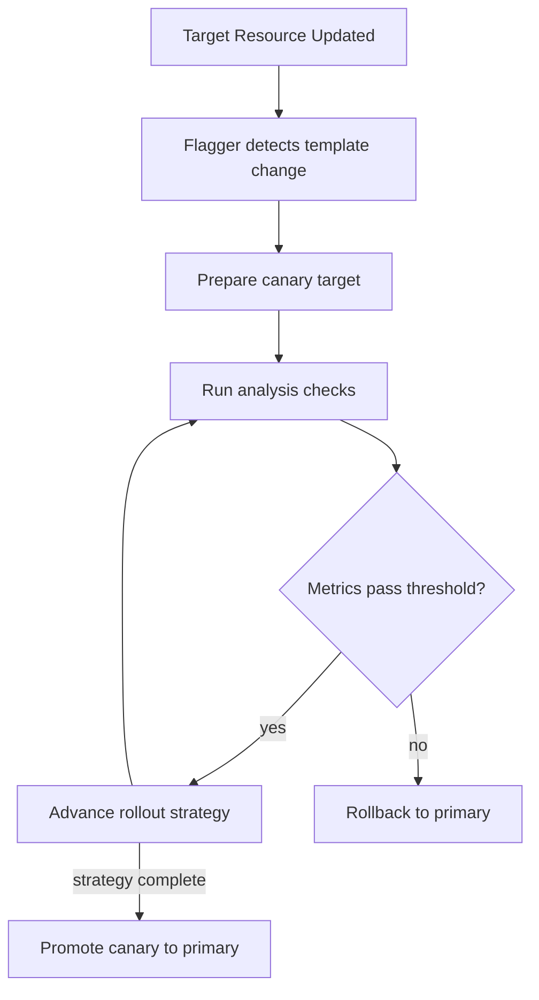

# How to Configure Flagger with Custom Resource Targets

Author: [nawazdhandala](https://github.com/nawazdhandala)

Tags: Flagger, Canary, Kubernetes, Custom Resources, Progressive Delivery

Description: Learn how to configure Flagger to perform canary deployments on custom resources beyond standard Deployments, including DaemonSets and custom controllers.

---

## Introduction

Flagger typically targets Kubernetes Deployments for canary analysis and progressive delivery. It also supports DaemonSets, and it can target Knative Services when the Knative provider is used. Flagger's generic `targetRef` field does not mean that arbitrary operator-managed custom resources can be used as workload targets.

This guide explains how to configure Flagger to work with supported non-Deployment targets, covering the requirements, configuration, and common patterns.

## Prerequisites

- A Kubernetes cluster (v1.25 or later)
- Flagger installed (v1.37 or later)
- A service mesh or ingress controller supported by Flagger
- Knative Serving installed if you want to target Knative Services
- kubectl configured to access your cluster

## Step 1: Understand Supported Target Requirements

For Flagger to manage a target workload, the resource must be one of the target kinds implemented by Flagger:

1. `apps/v1` `Deployment`
2. `apps/v1` `DaemonSet`
3. `serving.knative.dev/v1` `Service` when `spec.provider` is set to `knative`

For Deployments and DaemonSets, Flagger creates a copy of the target resource (the primary) and manages the original as the canary. It detects changes to the pod template and triggers analysis.

## Step 2: Configure Flagger with a DaemonSet Target

Flagger supports DaemonSets as targets. Since DaemonSets do not have a replica count, Flagger scales them down by adding a node selector that prevents pods from being scheduled. Here is a Canary resource targeting a DaemonSet:

```yaml
apiVersion: flagger.app/v1beta1
kind: Canary
metadata:
  name: logging-agent
  namespace: default
spec:
  targetRef:
    apiVersion: apps/v1
    kind: DaemonSet
    name: logging-agent
  service:
    port: 8080
    targetPort: 8080
  analysis:
    interval: 1m
    threshold: 5
    iterations: 10
    metrics:
      - name: request-success-rate
        thresholdRange:
          min: 99
        interval: 1m
    webhooks:
      - name: load-test
        type: rollout
        url: http://flagger-loadtester.default/
        timeout: 30s
        metadata:
          cmd: "hey -z 1m -q 10 -c 2 http://logging-agent-canary.default:8080/"
```

Note the use of `iterations` instead of `maxWeight`/`stepWeight`. In Flagger this selects a blue/green-style analysis that runs for a fixed number of iterations before promotion.

## Step 3: Target a Knative Service

To target a Knative Service, set the Canary provider to `knative` and use the Knative Service API group, version, and kind in the `targetRef`:

```yaml
apiVersion: flagger.app/v1beta1
kind: Canary
metadata:
  name: podinfo
  namespace: default
spec:
  provider: knative
  targetRef:
    apiVersion: serving.knative.dev/v1
    kind: Service
    name: podinfo
  analysis:
    interval: 30s
    threshold: 5
    maxWeight: 50
    stepWeight: 10
    metrics:
      - name: request-success-rate
        thresholdRange:
          min: 99
        interval: 1m
```

The target Knative Service should contain the application pod template:

```yaml
apiVersion: serving.knative.dev/v1
kind: Service
metadata:
  name: podinfo
  namespace: default
spec:
  template:
    metadata:
      labels:
        app: podinfo
    spec:
      containers:
        - name: app
          image: ghcr.io/stefanprodan/podinfo:6.0.0
          ports:
            - containerPort: 9898
              protocol: TCP
          command:
            - ./podinfo
            - --port=9898
```

## Step 4: Grant Flagger RBAC for Supported Resources

Flagger's installation manifests include permissions for its supported Kubernetes resources. If you install Flagger in a restricted namespace or customize its RBAC, make sure it can manage the target resource and the primary copy it creates. For DaemonSets, the relevant permissions include:

```yaml
apiVersion: rbac.authorization.k8s.io/v1
kind: ClusterRole
metadata:
  name: flagger-daemonsets
rules:
  - apiGroups: ["apps"]
    resources: ["daemonsets"]
    verbs: ["get", "list", "watch", "create", "update", "patch", "delete"]
---
apiVersion: rbac.authorization.k8s.io/v1
kind: ClusterRoleBinding
metadata:
  name: flagger-daemonsets
roleRef:
  apiGroup: rbac.authorization.k8s.io
  kind: ClusterRole
  name: flagger-daemonsets
subjects:
  - kind: ServiceAccount
    name: flagger
    namespace: flagger-system
```

## Step 5: Handle Scale Subresource

Flagger does not use an arbitrary custom resource's `/scale` subresource as a generic rollout target. For Deployments, it patches `.spec.replicas`; for DaemonSets, it uses a node selector to temporarily prevent the canary DaemonSet from scheduling pods when it needs to scale it down.

The Kubernetes `/scale` subresource is still useful for custom resources that are managed by other controllers or by HPAs. A CRD scale subresource is configured like this:

```yaml
apiVersion: apiextensions.k8s.io/v1
kind: CustomResourceDefinition
metadata:
  name: myapps.myoperator.example.com
spec:
  group: myoperator.example.com
  versions:
    - name: v1alpha1
      served: true
      storage: true
      schema:
        openAPIV3Schema:
          type: object
          properties:
            spec:
              type: object
              properties:
                replicas:
                  type: integer
                template:
                  type: object
                  x-kubernetes-preserve-unknown-fields: true
            status:
              type: object
              properties:
                replicas:
                  type: integer
                labelSelector:
                  type: string
      subresources:
        status: {}
        scale:
          specReplicasPath: .spec.replicas
          statusReplicasPath: .status.replicas
          labelSelectorPath: .status.labelSelector
  scope: Namespaced
  names:
    plural: myapps
    singular: myapp
    kind: MyApp
```

The `specReplicasPath`, `statusReplicasPath`, and `labelSelectorPath` fields tell Kubernetes how to map the scale subresource to fields in your custom resource.

## Step 6: Using AutoscalerRef with Deployment Targets

If your Deployment uses an HPA for autoscaling, reference it in the Canary spec:

```yaml
apiVersion: flagger.app/v1beta1
kind: Canary
metadata:
  name: podinfo
  namespace: default
spec:
  targetRef:
    apiVersion: apps/v1
    kind: Deployment
    name: podinfo
  autoscalerRef:
    apiVersion: autoscaling/v2
    kind: HorizontalPodAutoscaler
    name: podinfo
  service:
    port: 8080
  analysis:
    interval: 30s
    threshold: 5
    maxWeight: 50
    stepWeight: 10
    metrics:
      - name: request-success-rate
        thresholdRange:
          min: 99
        interval: 1m
```

Flagger will create a copy of the HPA for the primary resource and manage scaling for both primary and canary workloads.

## Supported Target Canary Flow


```mermaid
graph TD
    A[Target Resource Updated] --> B[Flagger detects template change]
    B --> C[Prepare canary target]
    C --> D[Run analysis checks]
    D --> E{Metrics pass threshold?}
    E -->|yes| F[Advance rollout strategy]
    F --> D
    E -->|no| G[Rollback to primary]
    F -->|strategy complete| H[Promote canary to primary]
```

## Conclusion

Flagger can target the workload kinds implemented by its controllers, including Deployments and DaemonSets, and Knative Services when using the Knative provider. When using DaemonSets, make sure the target follows Flagger's selector conventions and that Flagger has RBAC permissions to manage the generated primary DaemonSet. For blue/green-style rollouts, use iteration-based analysis instead of weight-based traffic shifting.
