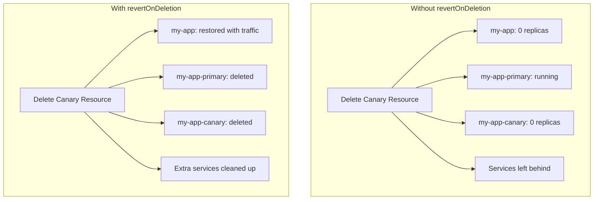

# How to Configure Flagger with Revert on Delete

Author: [nawazdhandala](https://github.com/nawazdhandala)

Tags: flagger, canary, revert-on-delete, kubernetes, cleanup

Description: Learn how to use Flagger's revertOnDeletion flag to automatically restore the original deployment when a Canary resource is deleted.

---

## Introduction

When you delete a Flagger Canary resource, the default behavior is to leave the primary Deployment and related resources (like the primary and canary Services) in place. This can be problematic if you want to remove Flagger from your deployment pipeline or migrate to a different progressive delivery tool. The `revertOnDeletion` flag tells Flagger to restore the original Deployment to its pre-Flagger state when the Canary resource is deleted.

This guide covers how `revertOnDeletion` works, how to configure it, and what happens to your resources during the cleanup process.

## Prerequisites

- A Kubernetes cluster (v1.23 or later)
- Flagger installed (v1.30 or later)
- A service mesh or ingress controller configured with Flagger
- `kubectl` configured to access your cluster

## What Happens Without revertOnDeletion

By default, when you delete a Canary resource, Flagger does not clean up the resources it created. This leaves behind:

- The `my-app-primary` Deployment (with traffic still routed to it)
- The `my-app-canary` Deployment (scaled to zero)
- The primary and canary Services
- The original `my-app` Deployment (scaled to zero by Flagger)

This means your original Deployment remains at zero replicas and all traffic goes to `my-app-primary`, which is fine if Flagger is still managing the workload. But if you remove the Canary resource, you end up with a scaled-to-zero original Deployment and no controller managing the primary.



## Step 1: Enable revertOnDeletion in the Canary Spec

Add `revertOnDeletion: true` to your Canary resource:

```yaml
# canary.yaml
apiVersion: flagger.app/v1beta1
kind: Canary
metadata:
  name: my-app
  namespace: default
spec:
  targetRef:
    apiVersion: apps/v1
    kind: Deployment
    name: my-app
  # Restore original deployment when this Canary is deleted
  revertOnDeletion: true
  service:
    port: 8080
    targetPort: 8080
  analysis:
    interval: 1m
    threshold: 5
    maxWeight: 50
    stepWeight: 10
    metrics:
      - name: request-success-rate
        thresholdRange:
          min: 99
        interval: 1m
```

Apply the configuration:

```bash
kubectl apply -f canary.yaml
```

## Step 2: Verify the Initial State

Before testing deletion, confirm that Flagger has initialized correctly:

```bash
# Check the canary status
kubectl get canary my-app -n default

# List deployments - you should see both original and primary
kubectl get deployments -n default -l app=my-app

# Check that the original deployment is scaled to zero
kubectl get deployment my-app -n default -o jsonpath='{.spec.replicas}'
# Output: 0

# Check that the primary deployment is running
kubectl get deployment my-app-primary -n default -o jsonpath='{.spec.replicas}'
# Output: 2 (or whatever your replica count is)
```

## Step 3: Test the Revert on Delete Behavior

Delete the Canary resource and observe the revert:

```bash
# Delete the canary resource
kubectl delete canary my-app -n default

# Watch the deployments during deletion
kubectl get deployments -n default -w
```

When `revertOnDeletion` is enabled, Flagger performs the following during deletion:

1. Copies the pod spec from `my-app-primary` back to `my-app`
2. Scales `my-app` back to the replica count of `my-app-primary`
3. Deletes the `my-app-primary` Deployment
4. Deletes the `my-app-canary` Deployment
5. Cleans up the generated Services and routing resources

## Step 4: Verify the Reverted State

After deletion, confirm the original Deployment is restored:

```bash
# The original deployment should be running with the correct replicas
kubectl get deployment my-app -n default

# Verify the image is the latest promoted version
kubectl get deployment my-app -n default \
  -o jsonpath='{.spec.template.spec.containers[0].image}'

# Confirm primary and canary deployments are gone
kubectl get deployment my-app-primary -n default 2>&1
# Should return: Error from server (NotFound)

kubectl get deployment my-app-canary -n default 2>&1
# Should return: Error from server (NotFound)
```

## Step 5: Patch an Existing Canary to Enable revertOnDeletion

If you have existing Canary resources that do not have `revertOnDeletion` enabled, you can patch them:

```bash
# Patch an existing canary to enable revert on deletion
kubectl patch canary my-app -n default \
  --type='merge' \
  -p '{"spec":{"revertOnDeletion":true}}'

# Verify the patch was applied
kubectl get canary my-app -n default \
  -o jsonpath='{.spec.revertOnDeletion}'
# Output: true
```

## Using revertOnDeletion with Flux CD

When managing Canary resources with Flux CD, enabling `revertOnDeletion` is especially important. If you remove the Canary manifest from your Git repository, Flux's garbage collection will delete the Canary resource from the cluster. Without `revertOnDeletion`, this leaves your application in a broken state.

```yaml
# flux-system/kustomization.yaml
apiVersion: kustomize.toolkit.fluxcd.io/v1
kind: Kustomization
metadata:
  name: apps
  namespace: flux-system
spec:
  interval: 10m
  sourceRef:
    kind: GitRepository
    name: fleet-infra
  path: ./apps/production
  prune: true  # Flux will delete resources removed from Git
  targetNamespace: default
```

With `prune: true` in your Flux Kustomization, removing a Canary manifest from Git triggers deletion. The `revertOnDeletion: true` flag ensures your application continues running normally after the Canary is garbage collected.

## Handling Edge Cases

### Deletion During an Active Rollout

If you delete the Canary resource while a rollout is in progress, Flagger will still attempt to revert. It will copy the current primary spec (not the canary spec) back to the original Deployment, effectively rolling back any in-progress changes.

### Finalizer Behavior

When `revertOnDeletion` is enabled, Flagger adds a finalizer to the Canary resource. This means the Canary resource will not be fully deleted until Flagger completes the revert process. You can check for finalizers with:

```bash
kubectl get canary my-app -n default -o jsonpath='{.metadata.finalizers}'
```

### Force Deletion

If Flagger is not running and you need to delete a Canary with `revertOnDeletion` enabled, the finalizer will prevent deletion. You can remove the finalizer manually:

```bash
kubectl patch canary my-app -n default \
  --type='json' \
  -p='[{"op": "remove", "path": "/metadata/finalizers"}]'
```

Note that this bypasses the revert process, so you will need to manually restore the original Deployment.

## Conclusion

The `revertOnDeletion` flag is an important safety feature when using Flagger in production. It ensures that deleting a Canary resource does not leave your application in a broken state with a scaled-to-zero original Deployment. This is particularly critical when using GitOps tools like Flux CD where resource deletion can happen automatically through garbage collection. Enable `revertOnDeletion: true` on all your Canary resources to maintain a clean and predictable cleanup path.
