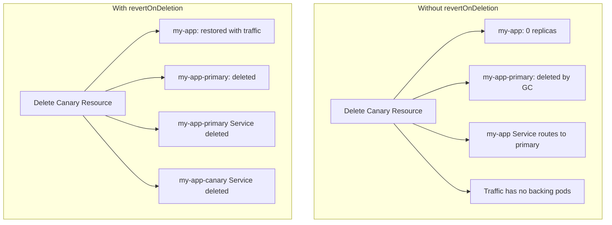

# How to Configure Flagger with Revert on Delete

Author: [nawazdhandala](https://github.com/nawazdhandala)

Tags: Flagger, Canary, Revert-On-Delete, Kubernetes, Cleanup

Description: Learn how to use Flagger's revertOnDeletion flag to automatically restore the original deployment when a Canary resource is deleted.

---

## Introduction

When you delete a Flagger Canary resource, the default behavior is to leave resources that are not owned by the controller in their current state. This can be problematic if you want to remove Flagger from your deployment pipeline or migrate to a different progressive delivery tool. The `revertOnDeletion` flag tells Flagger to scale the original Deployment back up and restore routing to it when the Canary resource is deleted.

This guide covers how `revertOnDeletion` works, how to configure it, and what happens to your resources during the cleanup process.

## Prerequisites

- A Kubernetes cluster (v1.23 or later)
- Flagger installed (v1.30 or later)
- A service mesh or ingress controller configured with Flagger
- `kubectl` configured to access your cluster

## What Happens Without revertOnDeletion

By default, when you delete a Canary resource, Flagger leaves resources that are not owned by the controller in their current state. Generated resources owned by the Canary can be garbage-collected, but the resources Flagger mutated can be left pointing at the primary workload. This leaves behind:

- The original `my-app` Deployment (scaled to zero by Flagger)
- The apex Service selector still pointing to `my-app-primary`
- Mesh or ingress routing that still points to the primary workload
- Generated resources such as `my-app-primary`, `my-app-primary` Service, and `my-app-canary` Service being removed by Kubernetes garbage collection

This means your original Deployment remains at zero replicas while routing can still point to `my-app-primary`. But if you remove the Canary resource, the generated primary resources can be deleted and you end up with a scaled-to-zero original Deployment with traffic pointing at a selector that no longer has backing pods.


```mermaid
graph TD
    subgraph "Without revertOnDeletion"
    A[Delete Canary Resource] --> B[my-app: 0 replicas]
    A --> C[my-app-primary: deleted by GC]
    A --> D[my-app Service routes to primary]
    A --> E[Traffic has no backing pods]
    end

    subgraph "With revertOnDeletion"
    F[Delete Canary Resource] --> G[my-app: restored with traffic]
    F --> H[my-app-primary: deleted]
    F --> I[my-app-primary Service deleted]
    F --> J[my-app-canary Service deleted]
    end
```

## Step 1: Enable revertOnDeletion in the Canary Spec

Add `revertOnDeletion: true` to your Canary resource:

```yaml
# canary.yaml

apiVersion: flagger.app/v1beta1
kind: Canary
metadata:
  name: my-app
  namespace: default
spec:
  targetRef:
    apiVersion: apps/v1
    kind: Deployment
    name: my-app
  # Scale the target deployment back up and restore routing when this Canary is deleted
  revertOnDeletion: true
  service:
    port: 8080
    targetPort: 8080
  analysis:
    interval: 1m
    threshold: 5
    maxWeight: 50
    stepWeight: 10
    metrics:
      - name: request-success-rate
        thresholdRange:
          min: 99
        interval: 1m
```

Apply the configuration:

```bash
kubectl apply -f canary.yaml
```

## Step 2: Verify the Initial State

Before testing deletion, confirm that Flagger has initialized correctly:

```bash
# Check the canary status
kubectl get canary my-app -n default

# List deployments - you should see both original and primary
kubectl get deployments my-app my-app-primary -n default

# Check that the original deployment is scaled to zero
kubectl get deployment my-app -n default -o jsonpath='{.spec.replicas}'
# Output: 0

# Check that the primary deployment is running
kubectl get deployment my-app-primary -n default -o jsonpath='{.spec.replicas}'
# Output: 2 (or whatever your replica count is)
```

## Step 3: Test the Revert on Delete Behavior

Delete the Canary resource and observe the revert:

```bash
# Delete the canary resource
kubectl delete canary my-app -n default

# Watch the deployments during deletion
kubectl get deployments -n default -w
```

When `revertOnDeletion` is enabled, Flagger performs the following during deletion:

1. Scales `my-app` back to the replica count of `my-app-primary`
2. Reverts the `my-app` Service selector so traffic is routed to `my-app`
3. Reverts mesh or ingress traffic to the target workload
4. Removes the finalizer so Kubernetes garbage collection can remove generated resources owned by the Canary, such as `my-app-primary`, `my-app-primary` Service, and `my-app-canary` Service

## Step 4: Verify the Reverted State

After deletion, confirm the original Deployment is restored:

```bash
# The original deployment should be running with the correct replicas
kubectl get deployment my-app -n default

# Confirm the primary deployment is gone
kubectl get deployment my-app-primary -n default 2>&1
# Should return: Error from server (NotFound)

# Confirm generated primary and canary services are gone
kubectl get service my-app-primary -n default 2>&1
# Should return: Error from server (NotFound)

kubectl get service my-app-canary -n default 2>&1
# Should return: Error from server (NotFound)
```

## Step 5: Patch an Existing Canary to Enable revertOnDeletion

If you have existing Canary resources that do not have `revertOnDeletion` enabled, you can patch them:

```bash
# Patch an existing canary to enable revert on deletion
kubectl patch canary my-app -n default \
  --type='merge' \
  -p '{"spec":{"revertOnDeletion":true}}'

# Verify the patch was applied
kubectl get canary my-app -n default \
  -o jsonpath='{.spec.revertOnDeletion}'
# Output: true
```

## Using revertOnDeletion with Flux CD

When managing Canary resources with Flux CD, enabling `revertOnDeletion` is especially important. If you remove the Canary manifest from your Git repository, Flux's garbage collection will delete the Canary resource from the cluster. Without `revertOnDeletion`, this leaves your application in a broken state.

```yaml
# flux-system/kustomization.yaml
apiVersion: kustomize.toolkit.fluxcd.io/v1
kind: Kustomization
metadata:
  name: apps
  namespace: flux-system
spec:
  interval: 10m
  sourceRef:
    kind: GitRepository
    name: fleet-infra
  path: ./apps/production
  prune: true  # Flux will delete resources removed from Git
  targetNamespace: default
```

With `prune: true` in your Flux Kustomization, removing a Canary manifest from Git triggers deletion. The `revertOnDeletion: true` flag ensures your application continues running normally after the Canary is garbage collected.

## Handling Edge Cases

### Deletion During an Active Rollout

If you delete the Canary resource while a rollout is in progress, Flagger will still attempt to revert. It will scale the target Deployment back to the current primary replica count and route traffic back to the target Deployment. It does not copy the primary pod template back to the target Deployment, so make sure the target Deployment spec is the version you want to run after deletion.

### Finalizer Behavior

When `revertOnDeletion` is enabled, Flagger adds a finalizer to the Canary resource. This means the Canary resource will not be fully deleted until Flagger completes the revert process. You can check for finalizers with:

```bash
kubectl get canary my-app -n default -o jsonpath='{.metadata.finalizers}'
```

### Force Deletion

If Flagger is not running and you need to delete a Canary with `revertOnDeletion` enabled, the finalizer will prevent deletion. You can remove the finalizer manually:

```bash
kubectl patch canary my-app -n default \
  --type='json' \
  -p='[{"op": "remove", "path": "/metadata/finalizers"}]'
```

Note that this bypasses the revert process, so you will need to manually restore the original Deployment.

## Conclusion

The `revertOnDeletion` flag is an important safety feature when using Flagger in production. It ensures that deleting a Canary resource does not leave your application in a broken state with a scaled-to-zero original Deployment. This is particularly critical when using GitOps tools like Flux CD where resource deletion can happen automatically through garbage collection. Enable `revertOnDeletion: true` on all your Canary resources to maintain a clean and predictable cleanup path.
