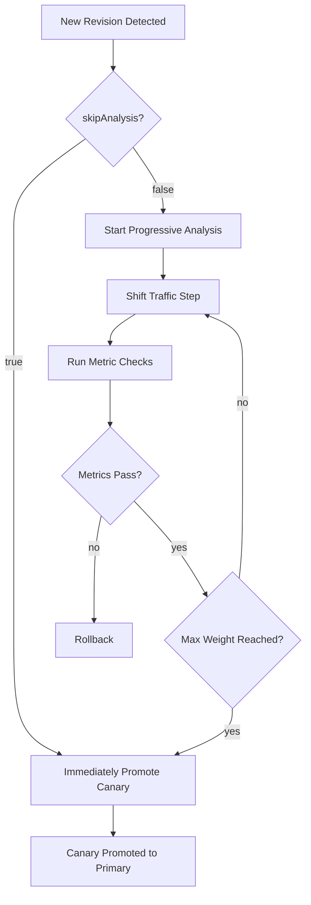

# How to Configure Flagger with Skip Analysis for Quick Promotion

Author: [nawazdhandala](https://github.com/nawazdhandala)

Tags: Flagger, Canary, Skip-Analysis, Promotion, Kubernetes

Description: Learn how to use Flagger's skipAnalysis flag to promote canary deployments immediately without running the full analysis cycle.

---

## Introduction

Flagger's progressive delivery approach is powerful for production rollouts, but there are scenarios where you want to skip the analysis phase entirely and promote a new version immediately. This is common in development and staging environments, during hotfix deployments, or when you have already validated the release through other means. Flagger provides the `skipAnalysis` field for exactly this purpose.

This guide explains how to configure and use `skipAnalysis` in Flagger, including both static configuration and dynamic toggling during a rollout.

## Prerequisites

- A Kubernetes cluster (v1.23 or later)
- Flagger installed (v1.30 or later)
- A service mesh or ingress controller configured with Flagger
- `kubectl` configured to access your cluster

## How skipAnalysis Works

When `skipAnalysis` is set to `true` in the Canary spec, Flagger skips all metric checks and webhook validations. Instead of gradually shifting traffic and evaluating metrics at each step, Flagger immediately promotes the canary to primary. The traffic is shifted from 0% to 100% in a single step.



## Step 1: Configure skipAnalysis in the Canary Spec

Add `skipAnalysis: true` to your Canary resource:

```yaml
# canary-skip.yaml
apiVersion: flagger.app/v1beta1
kind: Canary
metadata:
  name: my-app
  namespace: default
spec:
  targetRef:
    apiVersion: apps/v1
    kind: Deployment
    name: my-app
  # Skip the analysis phase - promote immediately
  skipAnalysis: true
  service:
    port: 8080
    targetPort: 8080
  analysis:
    # These settings are still required but will not be used
    # when skipAnalysis is true
    interval: 1m
    threshold: 5
    maxWeight: 50
    stepWeight: 10
    metrics:
      - name: request-success-rate
        thresholdRange:
          min: 99
        interval: 1m
```

Apply the configuration:

```bash
kubectl apply -f canary-skip.yaml
```

## Step 2: Trigger a Deployment

Update the container image to trigger a new rollout:

```bash
kubectl set image deployment/my-app my-app=my-app:2.0.0 -n default
```

Watch the canary status to see the immediate promotion:

```bash
kubectl get canary my-app -n default -w
```

You should see the canary transition directly from `Progressing` to `Succeeded` without going through the normal step-by-step analysis.

## Step 3: Toggle skipAnalysis Dynamically

One of the most useful patterns is toggling `skipAnalysis` on a per-release basis. You can patch the Canary resource before triggering a deployment:

```bash
# Enable skip analysis for a quick promotion
kubectl patch canary my-app -n default \
  --type='merge' \
  -p '{"spec":{"skipAnalysis":true}}'

# Trigger the deployment
kubectl set image deployment/my-app my-app=my-app:2.0.0 -n default

# After the release, re-enable analysis for future deployments
kubectl patch canary my-app -n default \
  --type='merge' \
  -p '{"spec":{"skipAnalysis":false}}'
```

## Step 4: Use skipAnalysis with Flux CD GitOps

If you manage your Canary resources via GitOps with Flux CD, you can toggle `skipAnalysis` in your Git repository. This is useful for hotfix branches where you want to bypass the normal analysis.

```yaml
# flux-kustomization/canary.yaml
apiVersion: flagger.app/v1beta1
kind: Canary
metadata:
  name: my-app
  namespace: default
spec:
  targetRef:
    apiVersion: apps/v1
    kind: Deployment
    name: my-app
  # Set to true for hotfix releases, false for normal releases
  skipAnalysis: false
  service:
    port: 8080
  analysis:
    interval: 1m
    threshold: 5
    maxWeight: 50
    stepWeight: 10
    metrics:
      - name: request-success-rate
        thresholdRange:
          min: 99
        interval: 1m
```

For hotfix deployments, create a commit that sets `skipAnalysis: true` along with the image update, then revert it after the release is complete.

## Step 5: Environment-Specific Configuration with Kustomize

Use Kustomize overlays to enable `skipAnalysis` in non-production environments while keeping full analysis in production:

```yaml
# base/canary.yaml
apiVersion: flagger.app/v1beta1
kind: Canary
metadata:
  name: my-app
spec:
  targetRef:
    apiVersion: apps/v1
    kind: Deployment
    name: my-app
  skipAnalysis: false
  service:
    port: 8080
  analysis:
    interval: 1m
    threshold: 5
    maxWeight: 50
    stepWeight: 10
    metrics:
      - name: request-success-rate
        thresholdRange:
          min: 99
        interval: 1m
```

```yaml
# overlays/staging/canary-patch.yaml
apiVersion: flagger.app/v1beta1
kind: Canary
metadata:
  name: my-app
spec:
  # Skip analysis in staging for faster deployments
  skipAnalysis: true
```

```yaml
# overlays/staging/kustomization.yaml
apiVersion: kustomize.config.k8s.io/v1beta1
kind: Kustomization
resources:
  - ../../base
patchesStrategicMerge:
  - canary-patch.yaml
```

## Verifying the Promotion

After a skip-analysis promotion, verify the deployment completed correctly:

```bash
# Check canary status
kubectl get canary my-app -n default -o jsonpath='{.status.phase}'
# Should output: Succeeded

# Verify the primary deployment has the new image
kubectl get deployment my-app-primary -n default \
  -o jsonpath='{.spec.template.spec.containers[0].image}'

# Check events for the promotion
kubectl describe canary my-app -n default | grep -A 5 "Events"
```

## When to Use skipAnalysis

**Good use cases:**
- Development and staging environments where speed matters more than safety
- Hotfix deployments that have already been validated
- Infrastructure changes that do not affect application metrics
- Initial deployment of a new service with no baseline metrics

**When to avoid:**
- Production deployments with user-facing traffic
- Changes to critical business logic
- Deployments where rollback would be costly

## Conclusion

The `skipAnalysis` flag gives you fine-grained control over when Flagger performs its full progressive delivery analysis. By toggling it dynamically or using environment-specific overlays, you can maintain the safety of canary deployments in production while keeping development and hotfix workflows fast. Remember that skipping analysis means you lose the automated rollback safety net, so use it judiciously.
