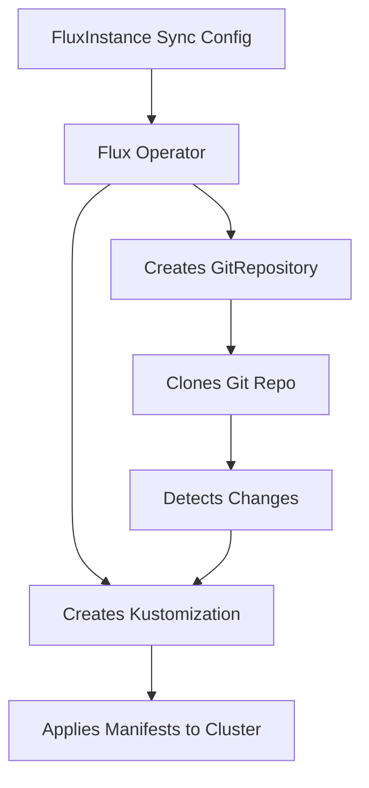

# How to Configure FluxInstance Sync Settings for GitRepository

Author: [nawazdhandala](https://github.com/nawazdhandala)

Tags: Flux, Flux-Operator, FluxInstance, GitRepository, Sync, Kubernetes, GitOps

Description: Learn how to configure FluxInstance sync settings to automatically create a GitRepository source and Kustomization for managing your cluster state from Git.

---

## Introduction

The Flux Operator simplifies Flux management by letting you define not only the Flux installation but also the initial sync configuration within a single FluxInstance resource. The `sync` field in the FluxInstance spec creates a GitRepository source and a root Kustomization that points to your cluster configuration repository. This eliminates the need to manually create these resources after installing Flux.

This guide covers how to configure the FluxInstance sync settings for a GitRepository source, including authentication, branch selection, path configuration, and reconciliation intervals.

## Prerequisites

- A Kubernetes cluster (v1.28 or later)
- kubectl configured to access your cluster
- The Flux Operator installed in your cluster
- A Git repository containing your cluster manifests
- Git credentials (for private repositories)

## Basic GitRepository Sync Configuration

The simplest sync configuration points to a public Git repository:

```yaml
apiVersion: fluxcd.controlplane.io/v1
kind: FluxInstance
metadata:
  name: flux
  namespace: flux-system
spec:
  distribution:
    version: "2.x"
    registry: "ghcr.io/fluxcd"
  components:
    - source-controller
    - kustomize-controller
    - helm-controller
    - notification-controller
  sync:
    kind: GitRepository
    url: https://github.com/org/fleet-repo.git
    ref: refs/heads/main
    path: clusters/production
    interval: 10m
```

This configuration tells the Flux Operator to:

1. Create a GitRepository source pointing to `https://github.com/org/fleet-repo.git`
2. Track the `main` branch
3. Create a root Kustomization that reconciles manifests from the `clusters/production` path
4. Poll for changes every 10 minutes

## Understanding the Sync Flow



## Configuring Authentication for Private Repositories

For private repositories, you need to create a Secret with your Git credentials and reference it in the sync configuration.

First, create the credentials Secret:

```bash
kubectl create secret generic flux-system \
  --namespace=flux-system \
  --from-literal=username=git \
  --from-literal=password=ghp_your_github_token_here
```

Then reference the Secret in your FluxInstance:

```yaml
apiVersion: fluxcd.controlplane.io/v1
kind: FluxInstance
metadata:
  name: flux
  namespace: flux-system
spec:
  distribution:
    version: "2.x"
    registry: "ghcr.io/fluxcd"
  components:
    - source-controller
    - kustomize-controller
    - helm-controller
    - notification-controller
  sync:
    kind: GitRepository
    url: https://github.com/org/private-fleet-repo.git
    ref: refs/heads/main
    path: clusters/production
    interval: 5m
    pullSecret: flux-system
```

The `pullSecret` field references the name of the Secret in the same namespace as the FluxInstance.

## Using SSH Authentication

For SSH-based authentication, create a Secret with your SSH key:

```bash
kubectl create secret generic flux-system \
  --namespace=flux-system \
  --from-file=identity=./id_ed25519 \
  --from-file=identity.pub=./id_ed25519.pub \
  --from-file=known_hosts=./known_hosts
```

Then configure the sync with an SSH URL:

```yaml
apiVersion: fluxcd.controlplane.io/v1
kind: FluxInstance
metadata:
  name: flux
  namespace: flux-system
spec:
  distribution:
    version: "2.x"
    registry: "ghcr.io/fluxcd"
  components:
    - source-controller
    - kustomize-controller
    - helm-controller
    - notification-controller
  sync:
    kind: GitRepository
    url: ssh://git@github.com/org/fleet-repo.git
    ref: refs/heads/main
    path: clusters/production
    interval: 5m
    pullSecret: flux-system
```

## Tracking a Specific Branch or Tag

You can track different Git references using the `ref` field:

Track a specific branch:

```yaml
sync:
  kind: GitRepository
  url: https://github.com/org/fleet-repo.git
  ref: refs/heads/staging
  path: clusters/staging
  interval: 5m
```

Track a specific tag:

```yaml
sync:
  kind: GitRepository
  url: https://github.com/org/fleet-repo.git
  ref: refs/tags/v1.2.0
  path: clusters/production
  interval: 30m
```

Track a specific semver range:

```yaml
sync:
  kind: GitRepository
  url: https://github.com/org/fleet-repo.git
  ref: refs/tags/v1.x
  path: clusters/production
  interval: 30m
```

## Configuring the Reconciliation Interval

The `interval` field controls how often Flux polls the Git repository for changes:

```yaml
sync:
  kind: GitRepository
  url: https://github.com/org/fleet-repo.git
  ref: refs/heads/main
  path: clusters/production
  interval: 1m
```

Choose your interval based on your needs:
- **1m**: For development environments where rapid feedback is needed
- **5m**: A good default for staging environments
- **10m-30m**: Suitable for production environments where stability is prioritized

## Full Production Example

Here is a complete FluxInstance with sync settings optimized for a production cluster:

```yaml
apiVersion: fluxcd.controlplane.io/v1
kind: FluxInstance
metadata:
  name: flux
  namespace: flux-system
spec:
  distribution:
    version: "2.x"
    registry: "ghcr.io/fluxcd"
  components:
    - source-controller
    - kustomize-controller
    - helm-controller
    - notification-controller
  storage:
    class: standard
    size: 10Gi
  sync:
    kind: GitRepository
    url: https://github.com/org/fleet-repo.git
    ref: refs/heads/main
    path: clusters/production
    interval: 10m
    pullSecret: flux-system
```

## Verifying the Sync

After applying the FluxInstance, verify that the GitRepository and Kustomization were created:

```bash
kubectl get gitrepositories -n flux-system
kubectl get kustomizations -n flux-system
```

Check the sync status:

```bash
kubectl get gitrepository flux-system -n flux-system -o yaml | grep -A 5 status
```

You should see the repository being fetched and the Kustomization applying manifests from your specified path.

## Conclusion

Configuring FluxInstance sync settings for a GitRepository gives you a single resource that both installs Flux and connects it to your cluster configuration repository. By setting the URL, branch reference, path, interval, and authentication, you can bootstrap a fully operational GitOps pipeline with one `kubectl apply` command. This approach simplifies cluster provisioning and ensures consistency across environments.
