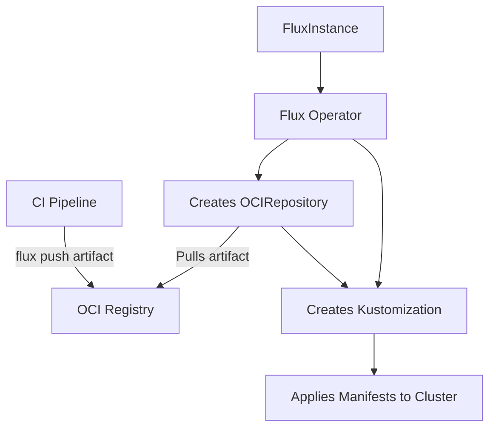

# How to Configure FluxInstance Sync Settings for OCIRepository

Author: [nawazdhandala](https://github.com/nawazdhandala)

Tags: flux, flux-operator, fluxinstance, ocirepository, oci, sync, kubernetes, gitops

Description: Learn how to configure FluxInstance sync settings with an OCIRepository source to pull cluster manifests from OCI-compliant container registries.

---

## Introduction

While Git repositories are the traditional source for GitOps, OCI (Open Container Initiative) registries offer an alternative that brings several advantages: immutable artifact versioning, built-in authentication through container registry credentials, and the ability to leverage existing container registry infrastructure. Flux supports OCI repositories as a first-class source type, and the Flux Operator lets you configure OCI-based sync directly in the FluxInstance spec.

This guide shows you how to configure FluxInstance sync settings to pull cluster configuration from an OCI registry, covering authentication, tag selection, and reconciliation options.

## Prerequisites

- A Kubernetes cluster (v1.28 or later)
- kubectl configured to access your cluster
- The Flux Operator installed in your cluster
- An OCI-compliant container registry (GHCR, Docker Hub, ECR, GCR, ACR, or Harbor)
- The Flux CLI installed (for pushing OCI artifacts)

## Pushing Manifests to an OCI Registry

Before configuring the sync, you need to push your cluster manifests to an OCI registry. Use the Flux CLI to create and push an OCI artifact:

```bash
flux push artifact oci://ghcr.io/org/fleet-manifests:latest \
  --path=./clusters/production \
  --source="$(git config --get remote.origin.url)" \
  --revision="$(git branch --show-current)@sha1:$(git rev-parse HEAD)"
```

This packages the contents of `./clusters/production` into an OCI artifact and pushes it to the registry.

## Basic OCIRepository Sync Configuration

Configure your FluxInstance to sync from an OCI repository:

```yaml
apiVersion: fluxcd.controlplane.io/v1
kind: FluxInstance
metadata:
  name: flux
  namespace: flux-system
spec:
  distribution:
    version: "2.x"
    registry: "ghcr.io/fluxcd"
  components:
    - source-controller
    - kustomize-controller
    - helm-controller
    - notification-controller
  sync:
    kind: OCIRepository
    url: oci://ghcr.io/org/fleet-manifests
    ref: latest
    path: .
    interval: 10m
```

The key differences from a GitRepository sync are:

- `kind` is set to `OCIRepository`
- `url` uses the `oci://` scheme
- `ref` specifies the OCI tag instead of a Git reference

## Understanding the OCI Sync Flow



## Configuring Authentication

For private OCI registries, create a docker-registry Secret:

```bash
kubectl create secret docker-registry flux-system \
  --namespace=flux-system \
  --docker-server=ghcr.io \
  --docker-username=flux \
  --docker-password=ghp_your_token_here
```

Reference it in the FluxInstance:

```yaml
apiVersion: fluxcd.controlplane.io/v1
kind: FluxInstance
metadata:
  name: flux
  namespace: flux-system
spec:
  distribution:
    version: "2.x"
    registry: "ghcr.io/fluxcd"
  components:
    - source-controller
    - kustomize-controller
    - helm-controller
    - notification-controller
  sync:
    kind: OCIRepository
    url: oci://ghcr.io/org/fleet-manifests
    ref: latest
    path: .
    interval: 5m
    pullSecret: flux-system
```

## Using AWS ECR

For Amazon ECR, you can use IAM Roles for Service Accounts (IRSA) or create a Secret with ECR credentials:

```bash
kubectl create secret docker-registry flux-system \
  --namespace=flux-system \
  --docker-server=123456789012.dkr.ecr.us-east-1.amazonaws.com \
  --docker-username=AWS \
  --docker-password=$(aws ecr get-login-password --region us-east-1)
```

```yaml
apiVersion: fluxcd.controlplane.io/v1
kind: FluxInstance
metadata:
  name: flux
  namespace: flux-system
spec:
  distribution:
    version: "2.x"
    registry: "ghcr.io/fluxcd"
  components:
    - source-controller
    - kustomize-controller
    - helm-controller
    - notification-controller
  sync:
    kind: OCIRepository
    url: oci://123456789012.dkr.ecr.us-east-1.amazonaws.com/fleet-manifests
    ref: latest
    path: .
    interval: 5m
    pullSecret: flux-system
```

## Using Semver Tags

Instead of tracking a mutable tag like `latest`, you can use semver-based tags for more controlled updates:

```yaml
sync:
  kind: OCIRepository
  url: oci://ghcr.io/org/fleet-manifests
  ref: ">=1.0.0 <2.0.0"
  path: .
  interval: 10m
```

Push artifacts with semver tags in your CI pipeline:

```bash
VERSION="1.3.0"
flux push artifact oci://ghcr.io/org/fleet-manifests:${VERSION} \
  --path=./clusters/production \
  --source="$(git config --get remote.origin.url)" \
  --revision="v${VERSION}@sha1:$(git rev-parse HEAD)"
```

## Specifying a Subdirectory Path

If your OCI artifact contains manifests in a subdirectory, use the `path` field:

```yaml
sync:
  kind: OCIRepository
  url: oci://ghcr.io/org/fleet-manifests
  ref: latest
  path: ./clusters/production
  interval: 5m
```

## CI/CD Integration

Here is an example GitHub Actions workflow that pushes manifests on every merge to main:

```yaml
name: Push Fleet Manifests
on:
  push:
    branches: [main]

jobs:
  push:
    runs-on: ubuntu-latest
    permissions:
      packages: write
      contents: read
    steps:
      - uses: actions/checkout@v4
      - uses: fluxcd/flux2/action@main
      - name: Login to GHCR
        run: |
          echo ${{ secrets.GITHUB_TOKEN }} | flux oci login ghcr.io --username=flux --password-stdin
      - name: Push artifact
        run: |
          flux push artifact oci://ghcr.io/${{ github.repository }}/fleet-manifests:latest \
            --path=./clusters/production \
            --source="${{ github.server_url }}/${{ github.repository }}" \
            --revision="${{ github.ref_name }}@sha1:${{ github.sha }}"
      - name: Tag with version
        run: |
          flux tag artifact oci://ghcr.io/${{ github.repository }}/fleet-manifests:latest \
            --tag=${{ github.sha }}
```

## Verifying the OCI Sync

After applying the FluxInstance, verify the OCIRepository and Kustomization:

```bash
kubectl get ocirepositories -n flux-system
kubectl get kustomizations -n flux-system
```

Check the artifact details:

```bash
kubectl describe ocirepository flux-system -n flux-system
```

## Conclusion

Configuring FluxInstance sync with an OCIRepository source lets you leverage container registries as the delivery mechanism for your cluster configuration. This approach pairs well with CI/CD pipelines that already push container images, provides immutable artifact versioning, and simplifies authentication through existing registry credentials. Whether you use GHCR, ECR, GCR, or Harbor, the FluxInstance sync configuration remains consistent and straightforward.
