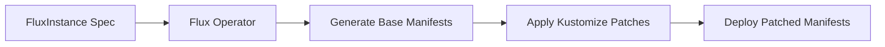

# How to Configure FluxInstance with Kustomize Patches

Author: [nawazdhandala](https://github.com/nawazdhandala)

Tags: Flux, Flux-Operator, FluxInstance, Kustomize, Patches, Kubernetes, GitOps

Description: Learn how to use Kustomize patches in FluxInstance to customize Flux controller deployments, resource limits, tolerations, and more.

---

## Introduction

The Flux Operator deploys Flux controllers with sensible defaults, but production environments often require customization. You may need to adjust resource limits, add tolerations for dedicated nodes, configure environment variables, or modify container arguments. The FluxInstance CRD provides a `kustomize` field that lets you apply strategic merge patches and JSON patches to any Flux component without forking or maintaining custom manifests.

This guide demonstrates how to use Kustomize patches in your FluxInstance to tailor Flux controllers to your cluster requirements.

## Prerequisites

- A Kubernetes cluster (v1.28 or later)
- kubectl configured to access your cluster
- The Flux Operator installed in your cluster
- Basic understanding of Kustomize patch syntax

## Understanding the Kustomize Field

The `kustomize` field in the FluxInstance spec accepts a `patches` array. Each patch entry consists of a `target` selector and either an inline `patch` string or a strategic merge patch. The operator applies these patches to the generated Flux manifests before deploying them.



## Setting Resource Requests and Limits

One of the most common customizations is adjusting resource allocation for controllers:

```yaml
apiVersion: fluxcd.controlplane.io/v1
kind: FluxInstance
metadata:
  name: flux
  namespace: flux-system
spec:
  distribution:
    version: "2.x"
    registry: "ghcr.io/fluxcd"
  components:
    - source-controller
    - kustomize-controller
    - helm-controller
    - notification-controller
  kustomize:
    patches:
      - target:
          kind: Deployment
          name: source-controller
        patch: |
          - op: replace
            path: /spec/template/spec/containers/0/resources
            value:
              requests:
                cpu: 200m
                memory: 256Mi
              limits:
                cpu: "1"
                memory: 1Gi
      - target:
          kind: Deployment
          name: kustomize-controller
        patch: |
          - op: replace
            path: /spec/template/spec/containers/0/resources
            value:
              requests:
                cpu: 200m
                memory: 512Mi
              limits:
                cpu: "2"
                memory: 2Gi
```

## Adding Node Tolerations

To schedule Flux controllers on dedicated infrastructure nodes with taints:

```yaml
apiVersion: fluxcd.controlplane.io/v1
kind: FluxInstance
metadata:
  name: flux
  namespace: flux-system
spec:
  distribution:
    version: "2.x"
    registry: "ghcr.io/fluxcd"
  components:
    - source-controller
    - kustomize-controller
    - helm-controller
    - notification-controller
  kustomize:
    patches:
      - target:
          kind: Deployment
        patch: |
          - op: add
            path: /spec/template/spec/tolerations
            value:
              - key: "dedicated"
                operator: "Equal"
                value: "flux"
                effect: "NoSchedule"
          - op: add
            path: /spec/template/spec/nodeSelector
            value:
              node-role: flux
```

This patch targets all Deployments, so every Flux controller gets the same toleration and node selector.

## Configuring Node Affinity

For more granular scheduling control, use node affinity:

```yaml
apiVersion: fluxcd.controlplane.io/v1
kind: FluxInstance
metadata:
  name: flux
  namespace: flux-system
spec:
  distribution:
    version: "2.x"
    registry: "ghcr.io/fluxcd"
  components:
    - source-controller
    - kustomize-controller
    - helm-controller
    - notification-controller
  kustomize:
    patches:
      - target:
          kind: Deployment
        patch: |
          - op: add
            path: /spec/template/spec/affinity
            value:
              nodeAffinity:
                requiredDuringSchedulingIgnoredDuringExecution:
                  nodeSelectorTerms:
                    - matchExpressions:
                        - key: kubernetes.io/arch
                          operator: In
                          values:
                            - amd64
                            - arm64
```

## Adding Environment Variables

You can inject environment variables into specific controllers. For example, to configure proxy settings for the source-controller:

```yaml
apiVersion: fluxcd.controlplane.io/v1
kind: FluxInstance
metadata:
  name: flux
  namespace: flux-system
spec:
  distribution:
    version: "2.x"
    registry: "ghcr.io/fluxcd"
  components:
    - source-controller
    - kustomize-controller
    - helm-controller
    - notification-controller
  kustomize:
    patches:
      - target:
          kind: Deployment
          name: source-controller
        patch: |
          - op: add
            path: /spec/template/spec/containers/0/env/-
            value:
              name: HTTPS_PROXY
              value: "http://proxy.internal:3128"
          - op: add
            path: /spec/template/spec/containers/0/env/-
            value:
              name: NO_PROXY
              value: ".cluster.local,.svc,10.0.0.0/8"
```

## Modifying Controller Arguments

To change controller startup arguments, such as increasing the concurrent reconciliation count:

```yaml
apiVersion: fluxcd.controlplane.io/v1
kind: FluxInstance
metadata:
  name: flux
  namespace: flux-system
spec:
  distribution:
    version: "2.x"
    registry: "ghcr.io/fluxcd"
  components:
    - source-controller
    - kustomize-controller
    - helm-controller
    - notification-controller
  kustomize:
    patches:
      - target:
          kind: Deployment
          name: kustomize-controller
        patch: |
          - op: add
            path: /spec/template/spec/containers/0/args/-
            value: --concurrent=20
          - op: add
            path: /spec/template/spec/containers/0/args/-
            value: --requeue-dependency=10s
      - target:
          kind: Deployment
          name: helm-controller
        patch: |
          - op: add
            path: /spec/template/spec/containers/0/args/-
            value: --concurrent=10
```

## Adding Extra Volumes and Volume Mounts

To mount additional ConfigMaps or Secrets into controller pods:

```yaml
apiVersion: fluxcd.controlplane.io/v1
kind: FluxInstance
metadata:
  name: flux
  namespace: flux-system
spec:
  distribution:
    version: "2.x"
    registry: "ghcr.io/fluxcd"
  components:
    - source-controller
    - kustomize-controller
    - helm-controller
    - notification-controller
  kustomize:
    patches:
      - target:
          kind: Deployment
          name: source-controller
        patch: |
          - op: add
            path: /spec/template/spec/volumes/-
            value:
              name: custom-ca
              secret:
                secretName: custom-ca-certs
          - op: add
            path: /spec/template/spec/containers/0/volumeMounts/-
            value:
              name: custom-ca
              mountPath: /etc/ssl/custom
              readOnly: true
```

## Combining Multiple Patches

You can combine several patches in a single FluxInstance to build a comprehensive production configuration:

```yaml
apiVersion: fluxcd.controlplane.io/v1
kind: FluxInstance
metadata:
  name: flux
  namespace: flux-system
spec:
  distribution:
    version: "2.x"
    registry: "ghcr.io/fluxcd"
  components:
    - source-controller
    - kustomize-controller
    - helm-controller
    - notification-controller
  kustomize:
    patches:
      # Resource limits for all controllers
      - target:
          kind: Deployment
        patch: |
          - op: replace
            path: /spec/template/spec/containers/0/resources/limits/memory
            value: 1Gi
      # Node scheduling
      - target:
          kind: Deployment
        patch: |
          - op: add
            path: /spec/template/spec/tolerations
            value:
              - key: "dedicated"
                operator: "Equal"
                value: "flux"
                effect: "NoSchedule"
      # Increase concurrency for kustomize-controller
      - target:
          kind: Deployment
          name: kustomize-controller
        patch: |
          - op: add
            path: /spec/template/spec/containers/0/args/-
            value: --concurrent=20
```

## Conclusion

Kustomize patches in the FluxInstance CRD give you fine-grained control over how Flux controllers are deployed without the complexity of maintaining custom manifests. Whether you need to adjust resource limits, schedule controllers on specific nodes, inject environment variables, or modify controller arguments, the `kustomize.patches` field provides a clean declarative approach. Start with the patches you need most and iterate as your requirements evolve.
