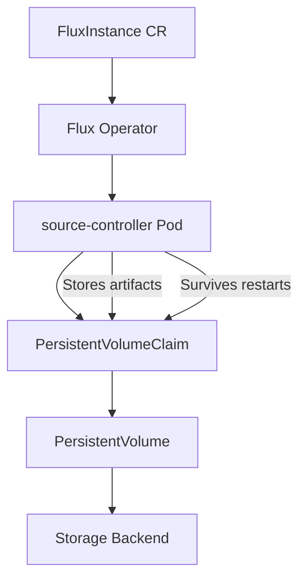

# How to Configure FluxInstance with Persistent Storage

Author: [nawazdhandala](https://github.com/nawazdhandala)

Tags: flux, flux-operator, fluxinstance, persistent-storage, kubernetes, gitops

Description: Learn how to configure a FluxInstance custom resource with persistent storage to preserve Flux source artifacts across pod restarts.

---

## Introduction

When running Flux in production Kubernetes clusters, one challenge you may encounter is the loss of downloaded source artifacts when Flux controller pods restart. By default, Flux stores artifacts in ephemeral storage, which means every restart triggers a full re-download of all sources. This can cause delays in reconciliation, increased network traffic, and temporary disruptions to your GitOps workflow.

The Flux Operator solves this problem by allowing you to configure persistent storage for your FluxInstance. With persistent volumes, source artifacts survive pod restarts, enabling faster recovery and more reliable continuous delivery. In this guide, you will learn how to configure a FluxInstance with persistent storage using PersistentVolumeClaims.

## Prerequisites

- A Kubernetes cluster (v1.28 or later)
- kubectl configured to access your cluster
- Helm v3 installed
- The Flux Operator installed in your cluster
- A StorageClass available in your cluster that supports ReadWriteOnce access

## Installing the Flux Operator

If you have not yet installed the Flux Operator, deploy it using Helm:

```bash
helm install flux-operator oci://ghcr.io/controlplaneio-fluxcd/charts/flux-operator \
  --namespace flux-system \
  --create-namespace
```

## Understanding Persistent Storage in FluxInstance

The FluxInstance CRD supports a `storage` field that allows you to define persistent volume configuration for the source-controller. When configured, the operator creates a PersistentVolumeClaim and mounts it to the source-controller pod at the artifact storage path.

Here is the high-level architecture:



## Configuring FluxInstance with Persistent Storage

Create a FluxInstance resource that includes the `storage` configuration:

```yaml
apiVersion: fluxcd.controlplane.io/v1
kind: FluxInstance
metadata:
  name: flux
  namespace: flux-system
spec:
  distribution:
    version: "2.x"
    registry: "ghcr.io/fluxcd"
  components:
    - source-controller
    - kustomize-controller
    - helm-controller
    - notification-controller
  storage:
    class: standard
    size: 10Gi
```

Save this file as `fluxinstance.yaml` and apply it:

```bash
kubectl apply -f fluxinstance.yaml
```

The `storage` field accepts the following sub-fields:

- `class`: The StorageClass name to use for the PVC. If omitted, the cluster default StorageClass is used.
- `size`: The requested storage capacity. Choose a size based on the total size of your source artifacts.

## Verifying the Persistent Volume

After applying the FluxInstance, verify that the PVC was created:

```bash
kubectl get pvc -n flux-system
```

You should see output similar to:

```
NAME                    STATUS   VOLUME                                     CAPACITY   ACCESS MODES   STORAGECLASS   AGE
flux-source-artifacts   Bound    pvc-a1b2c3d4-e5f6-7890-abcd-ef1234567890   10Gi       RWO            standard       2m
```

Confirm the source-controller pod has the volume mounted:

```bash
kubectl describe pod -n flux-system -l app=source-controller
```

Look for the volume mount in the output:

```
Mounts:
  /data from source-artifacts (rw)
```

## Using a Specific StorageClass

If your cluster has multiple storage classes, you may want to use a specific one optimized for your workload. For example, to use an SSD-backed storage class:

```yaml
apiVersion: fluxcd.controlplane.io/v1
kind: FluxInstance
metadata:
  name: flux
  namespace: flux-system
spec:
  distribution:
    version: "2.x"
    registry: "ghcr.io/fluxcd"
  components:
    - source-controller
    - kustomize-controller
    - helm-controller
    - notification-controller
  storage:
    class: fast-ssd
    size: 20Gi
```

## Sizing Recommendations

The amount of storage you need depends on the number and size of your sources. Here are some guidelines:

- **Small clusters** (fewer than 10 GitRepositories): 5Gi is usually sufficient.
- **Medium clusters** (10 to 50 GitRepositories): 10Gi to 20Gi is recommended.
- **Large clusters** (50+ GitRepositories with Helm charts): 50Gi or more may be required.

You can monitor storage usage with:

```bash
kubectl exec -n flux-system deploy/source-controller -- df -h /data
```

## Testing Persistence Across Restarts

To verify that artifacts persist across restarts, follow these steps:

1. Check the current artifacts:

```bash
kubectl exec -n flux-system deploy/source-controller -- ls /data
```

2. Delete the source-controller pod to simulate a restart:

```bash
kubectl delete pod -n flux-system -l app=source-controller
```

3. After the pod restarts, verify the artifacts are still present:

```bash
kubectl exec -n flux-system deploy/source-controller -- ls /data
```

The artifacts should remain intact, and the source-controller will not need to re-download them.

## Monitoring Storage Health

You can set up alerts for storage capacity using Prometheus. Add a PrometheusRule to detect when storage is running low:

```yaml
apiVersion: monitoring.coreos.com/v1
kind: PrometheusRule
metadata:
  name: flux-storage-alerts
  namespace: flux-system
spec:
  groups:
    - name: flux-storage
      rules:
        - alert: FluxStorageNearlyFull
          expr: |
            kubelet_volume_stats_used_bytes{namespace="flux-system", persistentvolumeclaim="flux-source-artifacts"}
            /
            kubelet_volume_stats_capacity_bytes{namespace="flux-system", persistentvolumeclaim="flux-source-artifacts"}
            > 0.85
          for: 10m
          labels:
            severity: warning
          annotations:
            summary: "Flux source artifact storage is nearly full"
            description: "The PVC flux-source-artifacts is over 85% full."
```

## Conclusion

Configuring persistent storage for your FluxInstance is a straightforward but important step for production deployments. By adding the `storage` field to your FluxInstance spec, you ensure that source artifacts survive pod restarts, reduce reconciliation delays, and improve the overall reliability of your GitOps pipeline. Choose an appropriate storage class and size based on your workload, and monitor usage to avoid running out of space.
