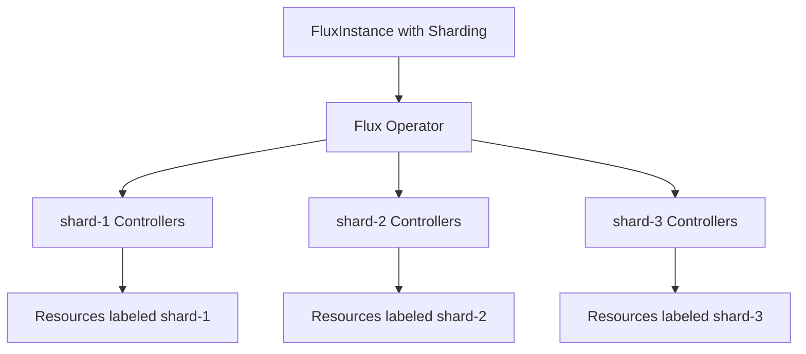

# How to Configure FluxInstance with Sharding

Author: [nawazdhandala](https://github.com/nawazdhandala)

Tags: Flux, Flux-Operator, FluxInstance, Sharding, Kubernetes, GitOps, Scalability

Description: Learn how to configure FluxInstance with sharding to distribute reconciliation workloads across multiple controller instances for large-scale clusters.

---

## Introduction

As your Kubernetes cluster grows and you manage hundreds or thousands of Flux resources, a single set of Flux controllers can become a bottleneck. Reconciliation times increase, memory usage climbs, and the risk of controller overload grows. Sharding addresses this by distributing Flux resources across multiple controller instances, each responsible for a subset of the total workload.

The Flux Operator supports sharding through the FluxInstance CRD, allowing you to configure multiple controller shards with simple declarative configuration. This guide walks you through setting up sharding for your FluxInstance to scale Flux in large environments.

## Prerequisites

- A Kubernetes cluster (v1.28 or later) with sufficient resources for multiple controller replicas
- kubectl configured to access your cluster
- The Flux Operator installed in your cluster
- Familiarity with Flux controllers and resource reconciliation

## How Sharding Works in Flux

Flux sharding works by deploying multiple instances of each controller, where each instance only processes resources that match its assigned shard. Resources are assigned to shards using the `sharding.fluxcd.io/key` label.



Each shard runs its own set of controllers (source-controller, kustomize-controller, helm-controller) and only reconciles resources labeled with its shard key.

## Configuring FluxInstance with Sharding

To enable sharding, add the `sharding` field to your FluxInstance spec:

```yaml
apiVersion: fluxcd.controlplane.io/v1
kind: FluxInstance
metadata:
  name: flux
  namespace: flux-system
spec:
  distribution:
    version: "2.x"
    registry: "ghcr.io/fluxcd"
  components:
    - source-controller
    - kustomize-controller
    - helm-controller
    - notification-controller
  sharding:
    shards:
      - shard-1
      - shard-2
      - shard-3
```

Apply this configuration:

```bash
kubectl apply -f fluxinstance.yaml
```

## Verifying the Shard Deployment

After applying the FluxInstance, verify that the sharded controllers are running:

```bash
kubectl get deployments -n flux-system
```

You should see deployments for each shard:

```bash
NAME                              READY   UP-TO-DATE   AVAILABLE
source-controller                 1/1     1            1
kustomize-controller              1/1     1            1
helm-controller                   1/1     1            1
notification-controller           1/1     1            1
source-controller-shard-1         1/1     1            1
kustomize-controller-shard-1      1/1     1            1
helm-controller-shard-1           1/1     1            1
source-controller-shard-2         1/1     1            1
kustomize-controller-shard-2      1/1     1            1
helm-controller-shard-2           1/1     1            1
source-controller-shard-3         1/1     1            1
kustomize-controller-shard-3      1/1     1            1
helm-controller-shard-3           1/1     1            1
```

The default (unlabeled) controllers handle resources without a shard label, while each shard handles its labeled resources.

## Assigning Resources to Shards

To assign a Flux resource to a specific shard, add the `sharding.fluxcd.io/key` label:

```yaml
apiVersion: source.toolkit.fluxcd.io/v1
kind: GitRepository
metadata:
  name: team-a-apps
  namespace: flux-system
  labels:
    sharding.fluxcd.io/key: shard-1
spec:
  interval: 5m
  url: https://github.com/org/team-a-apps
  ref:
    branch: main
```

And the corresponding Kustomization:

```yaml
apiVersion: kustomize.toolkit.fluxcd.io/v1
kind: Kustomization
metadata:
  name: team-a-apps
  namespace: flux-system
  labels:
    sharding.fluxcd.io/key: shard-1
spec:
  interval: 10m
  sourceRef:
    kind: GitRepository
    name: team-a-apps
  path: ./deploy
  prune: true
```

Both the source and the Kustomization should carry the same shard label so they are processed by the same controller shard.

## Sharding Strategy for Multi-Team Environments

A common pattern is to assign shards by team or business unit:

```yaml
# Team A resources use shard-1
apiVersion: source.toolkit.fluxcd.io/v1
kind: GitRepository
metadata:
  name: team-a-platform
  namespace: flux-system
  labels:
    sharding.fluxcd.io/key: shard-1
spec:
  interval: 5m
  url: https://github.com/org/team-a-platform
  ref:
    branch: main
---
# Team B resources use shard-2
apiVersion: source.toolkit.fluxcd.io/v1
kind: GitRepository
metadata:
  name: team-b-platform
  namespace: flux-system
  labels:
    sharding.fluxcd.io/key: shard-2
spec:
  interval: 5m
  url: https://github.com/org/team-b-platform
  ref:
    branch: main
---
# Team C resources use shard-3
apiVersion: source.toolkit.fluxcd.io/v1
kind: GitRepository
metadata:
  name: team-c-platform
  namespace: flux-system
  labels:
    sharding.fluxcd.io/key: shard-3
spec:
  interval: 5m
  url: https://github.com/org/team-c-platform
  ref:
    branch: main
```

## Resource Allocation Per Shard

For large-scale deployments, you may want to customize resource requests and limits for each shard using Kustomize patches in the FluxInstance. This ensures each shard has adequate resources:

```yaml
apiVersion: fluxcd.controlplane.io/v1
kind: FluxInstance
metadata:
  name: flux
  namespace: flux-system
spec:
  distribution:
    version: "2.x"
    registry: "ghcr.io/fluxcd"
  components:
    - source-controller
    - kustomize-controller
    - helm-controller
    - notification-controller
  sharding:
    shards:
      - shard-1
      - shard-2
  kustomize:
    patches:
      - target:
          kind: Deployment
          name: "(source-controller|kustomize-controller|helm-controller)-(shard-.*)"
        patch: |
          - op: replace
            path: /spec/template/spec/containers/0/resources
            value:
              requests:
                cpu: 200m
                memory: 256Mi
              limits:
                cpu: "1"
                memory: 1Gi
```

## Monitoring Shards

Each shard exposes its own metrics endpoint. You can verify shard health by checking the reconciliation metrics for each:

```bash
# Check the queue length for shard-1 source-controller
kubectl port-forward -n flux-system deploy/source-controller-shard-1 8080:8080 &
curl -s localhost:8080/metrics | grep workqueue_depth
```

## Conclusion

Sharding your FluxInstance is essential for scaling Flux in large Kubernetes environments. By distributing resources across multiple controller shards, you reduce reconciliation latency, isolate team workloads, and prevent single-controller bottlenecks. Use the `sharding.fluxcd.io/key` label consistently across related resources, and monitor each shard independently to maintain healthy operations across your fleet.
