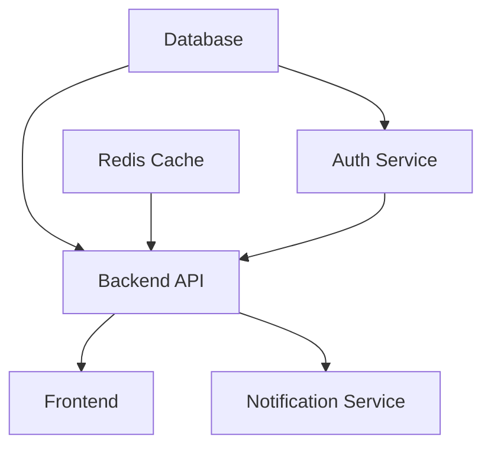

# How to Configure Service Dependencies Between Microservices in Flux

Author: [nawazdhandala](https://github.com/nawazdhandala)

Tags: Flux CD, Kubernetes, GitOps, Kustomization, Microservices, dependsOn, Service Dependencies

Description: Learn how to use the Kustomization dependsOn field in Flux CD to ensure correct deployment order between microservices with inter-service dependencies.

---

## Introduction

Microservices rarely exist in isolation. A backend API depends on a database being ready; an authentication service must be available before any other service can handle requests; a message broker needs to be running before producers or consumers start. Without enforcing deployment order, Flux can attempt to start all services simultaneously, causing cascading failures during initial setup or after a cluster rebuild.

Flux CD's Kustomization resource supports a `dependsOn` field that creates explicit ordering between resources. When Service A depends on Service B, Flux ensures Service B is fully reconciled and healthy before it begins reconciling Service A. This is a declarative, GitOps-native approach to managing startup dependencies without writing init scripts or external orchestration.

In this guide you will learn how to model service dependencies using `dependsOn`, configure health checks that must pass before dependents are unblocked, and structure your Flux repository to represent your service dependency graph clearly.

## Prerequisites

- A Kubernetes cluster with Flux CD installed
- `kubectl` and `flux` CLI tools installed
- Multiple microservices with known inter-service dependencies
- Basic understanding of Flux Kustomization resources

## Step 1: Identify Your Dependency Graph

Map out the dependencies between your services before writing any Flux resources.



This graph tells you:
- Database and Redis must be deployed first (no dependencies)
- Auth Service depends on Database
- Backend API depends on Database, Redis, and Auth Service
- Frontend and Notification Service depend on Backend API

## Step 2: Create GitRepository Source

```yaml
# clusters/production/sources/app-repo.yaml
apiVersion: source.toolkit.fluxcd.io/v1
kind: GitRepository
metadata:
  name: app-repo
  namespace: flux-system
spec:
  interval: 1m
  url: https://github.com/myorg/microservices
  ref:
    branch: main
```

## Step 3: Define Base Infrastructure Kustomizations (No Dependencies)

Services with no dependencies are defined first and have no `dependsOn`.

```yaml
# clusters/production/apps/database-kustomization.yaml
apiVersion: kustomize.toolkit.fluxcd.io/v1
kind: Kustomization
metadata:
  name: database
  namespace: flux-system
spec:
  interval: 10m
  sourceRef:
    kind: GitRepository
    name: app-repo
  path: ./apps/database
  prune: true
  # Wait for health before dependents can start
  wait: true
  timeout: 10m
  healthChecks:
    - apiVersion: apps/v1
      kind: StatefulSet
      name: postgresql
      namespace: database
```

```yaml
# clusters/production/apps/redis-kustomization.yaml
apiVersion: kustomize.toolkit.fluxcd.io/v1
kind: Kustomization
metadata:
  name: redis
  namespace: flux-system
spec:
  interval: 10m
  sourceRef:
    kind: GitRepository
    name: app-repo
  path: ./apps/redis
  prune: true
  wait: true
  timeout: 5m
  healthChecks:
    - apiVersion: apps/v1
      kind: Deployment
      name: redis
      namespace: cache
```

## Step 4: Define Auth Service With Database Dependency

```yaml
# clusters/production/apps/auth-service-kustomization.yaml
apiVersion: kustomize.toolkit.fluxcd.io/v1
kind: Kustomization
metadata:
  name: auth-service
  namespace: flux-system
spec:
  interval: 10m
  sourceRef:
    kind: GitRepository
    name: app-repo
  path: ./apps/auth-service
  prune: true
  wait: true
  timeout: 5m
  # Auth service only starts after database is healthy
  dependsOn:
    - name: database
  healthChecks:
    - apiVersion: apps/v1
      kind: Deployment
      name: auth-service
      namespace: auth
```

## Step 5: Define Backend API With Multiple Dependencies

```yaml
# clusters/production/apps/backend-api-kustomization.yaml
apiVersion: kustomize.toolkit.fluxcd.io/v1
kind: Kustomization
metadata:
  name: backend-api
  namespace: flux-system
spec:
  interval: 10m
  sourceRef:
    kind: GitRepository
    name: app-repo
  path: ./apps/backend-api
  prune: true
  wait: true
  timeout: 5m
  # Backend API waits for all three dependencies
  dependsOn:
    - name: database
    - name: redis
    - name: auth-service
  healthChecks:
    - apiVersion: apps/v1
      kind: Deployment
      name: backend-api
      namespace: backend
```

## Step 6: Define Frontend and Notification Service

```yaml
# clusters/production/apps/frontend-kustomization.yaml
apiVersion: kustomize.toolkit.fluxcd.io/v1
kind: Kustomization
metadata:
  name: frontend
  namespace: flux-system
spec:
  interval: 10m
  sourceRef:
    kind: GitRepository
    name: app-repo
  path: ./apps/frontend
  prune: true
  wait: true
  timeout: 5m
  dependsOn:
    - name: backend-api
---
apiVersion: kustomize.toolkit.fluxcd.io/v1
kind: Kustomization
metadata:
  name: notification-service
  namespace: flux-system
spec:
  interval: 10m
  sourceRef:
    kind: GitRepository
    name: app-repo
  path: ./apps/notification-service
  prune: true
  wait: true
  timeout: 5m
  dependsOn:
    - name: backend-api
```

## Step 7: Verify Dependency Ordering Works

```bash
# Apply all Kustomizations
kubectl apply -f clusters/production/apps/

# Watch the reconciliation order - database and redis first
flux get kustomizations --watch

# Manually verify the order by checking Ready conditions
kubectl get kustomization -n flux-system \
  -o custom-columns='NAME:.metadata.name,READY:.status.conditions[0].status,REASON:.status.conditions[0].reason'

# Simulate a dependency failure by suspending the database
flux suspend kustomization database
# Backend-api will remain stalled until database is resumed
flux resume kustomization database
```

## Best Practices

- Always define `healthChecks` on Kustomizations that are listed as dependencies, otherwise `wait: true` does not validate actual readiness
- Keep dependency chains as shallow as possible to minimize cascading delays
- Avoid circular dependencies - Flux will detect and report them as an error
- Cross-namespace `dependsOn` works by specifying `namespace` alongside the `name` field
- Test your dependency graph by rebuilding in a staging cluster from scratch
- Document your dependency graph in a Mermaid diagram in your repository's README

## Conclusion

Flux CD's `dependsOn` field provides a clean, GitOps-native way to enforce deployment ordering between microservices. By modeling your dependency graph declaratively in Kustomization resources, you ensure services always start in the correct order during initial deployments, cluster rebuilds, or after reconciliation failures. Combined with `healthChecks`, `dependsOn` guarantees that each layer of your microservice stack is truly ready before the next layer begins deploying.
