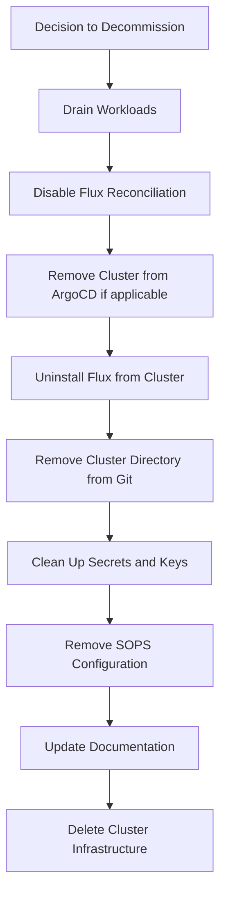

# How to Decommission a Cluster from Flux Multi-Cluster Setup

Author: [nawazdhandala](https://github.com/nawazdhandala)

Tags: Flux, Kubernetes, GitOps, Multi-Cluster, Decommission, Cluster Management, Lifecycle

Description: Learn how to safely decommission a Kubernetes cluster from a Flux multi-cluster GitOps setup with proper cleanup of Git resources and secrets.

---

Decommissioning a cluster is as important as onboarding one. Doing it incorrectly can leave orphaned resources in your Git repository, stale secrets, and broken references. This guide walks you through the complete process of safely removing a Kubernetes cluster from a Flux multi-cluster setup, from draining workloads to cleaning up your GitOps repository.

## The Decommission Workflow



## Pre-Decommission Checklist

Before starting the decommission process, verify the following:

```bash
# Set the cluster context
export CLUSTER_NAME="staging-us-east"
export CLUSTER_CONTEXT="staging-us-east"

# Check what is running on the cluster
kubectl --context ${CLUSTER_CONTEXT} get all -A | grep -v kube-system | grep -v flux-system

# List all Flux-managed resources
flux get all -A --context ${CLUSTER_CONTEXT}

# Check for any PersistentVolumeClaims with data
kubectl --context ${CLUSTER_CONTEXT} get pvc -A

# Verify no other clusters depend on this one
# (e.g., cross-cluster service mesh, shared databases)
```

## Step 1: Drain Workloads

Move or shut down application workloads gracefully before removing infrastructure:

```bash
# Scale down application deployments
kubectl --context ${CLUSTER_CONTEXT} get deployments -A \
  -l app.kubernetes.io/managed-by!=flux \
  -o custom-columns='NAMESPACE:.metadata.namespace,NAME:.metadata.name' \
  --no-headers | while read ns name; do
    echo "Scaling down ${ns}/${name}"
    kubectl --context ${CLUSTER_CONTEXT} scale deployment ${name} -n ${ns} --replicas=0
done

# If using ArgoCD, remove the cluster from ApplicationSets
# This prevents ArgoCD from trying to deploy to a cluster being decommissioned

# Wait for pods to terminate
kubectl --context ${CLUSTER_CONTEXT} get pods -A --field-selector=status.phase=Running \
  | grep -v kube-system | grep -v flux-system
```

## Step 2: Suspend Flux Reconciliation

Prevent Flux from restarting workloads while you are draining them:

```bash
# Suspend all Kustomizations
flux suspend kustomization --all --context ${CLUSTER_CONTEXT}

# Suspend all HelmReleases
flux suspend helmrelease --all -A --context ${CLUSTER_CONTEXT}

# Verify everything is suspended
flux get kustomizations --context ${CLUSTER_CONTEXT}
flux get helmreleases -A --context ${CLUSTER_CONTEXT}
```

## Step 3: Back Up Critical Data

If the cluster has any stateful workloads, back up their data:

```bash
# List all PVCs
kubectl --context ${CLUSTER_CONTEXT} get pvc -A

# Create snapshots of important volumes (AWS example)
kubectl --context ${CLUSTER_CONTEXT} get pv -o json | \
  jq -r '.items[] | select(.spec.csi.driver=="ebs.csi.aws.com") | .spec.csi.volumeHandle' | \
  while read vol_id; do
    echo "Creating snapshot for ${vol_id}"
    aws ec2 create-snapshot --volume-id ${vol_id} --description "Decommission backup ${CLUSTER_NAME}"
  done
```

## Step 4: Uninstall Flux from the Cluster

Remove Flux components from the cluster:

```bash
# Uninstall Flux (this removes all Flux controllers and CRDs)
flux uninstall --context ${CLUSTER_CONTEXT} --silent

# Verify Flux components are removed
kubectl --context ${CLUSTER_CONTEXT} get ns flux-system
# Should return: Error from server (NotFound)

# If flux uninstall fails, force remove
kubectl --context ${CLUSTER_CONTEXT} delete ns flux-system --timeout=60s
```

## Step 5: Remove Cluster Directory from Git

Remove the cluster's configuration from the fleet repository:

```bash
#!/bin/bash
# scripts/decommission-cluster.sh

CLUSTER_NAME="${1:?Usage: $0 <cluster-name>}"
FLEET_REPO_PATH="$(cd "$(dirname "$0")/.." && pwd)"
CLUSTER_DIR="${FLEET_REPO_PATH}/clusters/${CLUSTER_NAME}"

# Verify the cluster directory exists
if [ ! -d "${CLUSTER_DIR}" ]; then
    echo "ERROR: Cluster directory ${CLUSTER_DIR} does not exist."
    exit 1
fi

echo "Removing cluster directory: ${CLUSTER_DIR}"
git rm -r "clusters/${CLUSTER_NAME}/"

# Check for cluster-specific secrets directory
if [ -d "${FLEET_REPO_PATH}/infrastructure/secrets/${CLUSTER_NAME}" ]; then
    echo "Removing cluster-specific secrets directory..."
    git rm -r "infrastructure/secrets/${CLUSTER_NAME}/"
fi

# Commit the removal
git commit -m "decommission: remove cluster ${CLUSTER_NAME}"
git push origin main
```

## Step 6: Clean Up SOPS Configuration

Remove the cluster's encryption key configuration from `.sops.yaml`:

```yaml
# Before: .sops.yaml with the cluster
creation_rules:
  - path_regex: infrastructure/secrets/staging-us-east/.*\.yaml$
    encrypted_regex: ^(data|stringData)$
    age: age1staginguseastpublickey
  - path_regex: infrastructure/secrets/production-us-east/.*\.yaml$
    encrypted_regex: ^(data|stringData)$
    age: age1productionuseastpublickey
```

```yaml
# After: .sops.yaml without the decommissioned cluster
creation_rules:
  - path_regex: infrastructure/secrets/production-us-east/.*\.yaml$
    encrypted_regex: ^(data|stringData)$
    age: age1productionuseastpublickey
```

Securely delete the cluster's age private key:

```bash
# Securely delete the age key file
shred -u keys/${CLUSTER_NAME}.agekey

# If the key is stored in a vault, remove it from there too
# aws secretsmanager delete-secret --secret-id flux-sops-${CLUSTER_NAME} --force-delete-without-recovery
```

## Step 7: Clean Up External References

Check for and remove any references to the decommissioned cluster in other configurations.

### ArgoCD Cluster Registration

```bash
# Remove the cluster from ArgoCD if it was registered
kubectl --context management delete secret -n argocd -l argocd.argoproj.io/secret-type=cluster \
  --field-selector metadata.name=${CLUSTER_NAME}
```

### DNS Records

```bash
# Remove DNS records pointing to the decommissioned cluster
# This depends on your DNS provider
```

### Monitoring and Alerting

```bash
# Check for dashboards or alerts referencing the cluster
# Update Grafana dashboards that filter by cluster name
# Remove the cluster from any external monitoring systems
```

## Step 8: Remove Cloud Infrastructure

After all Kubernetes-level cleanup is done, destroy the underlying infrastructure:

```bash
# If using Terraform
cd terraform/clusters/${CLUSTER_NAME}
terraform destroy

# If using eksctl
eksctl delete cluster --name ${CLUSTER_NAME} --region ${CLUSTER_REGION}

# If using GKE
gcloud container clusters delete ${CLUSTER_NAME} --region ${CLUSTER_REGION}
```

## Complete Decommission Script

Here is a comprehensive script that combines all steps:

```bash
#!/bin/bash
# scripts/decommission-cluster.sh

set -euo pipefail

CLUSTER_NAME="${1:?Usage: $0 <cluster-name>}"
CLUSTER_CONTEXT="${2:-${CLUSTER_NAME}}"
FLEET_REPO_PATH="$(cd "$(dirname "$0")/.." && pwd)"
CLUSTER_DIR="${FLEET_REPO_PATH}/clusters/${CLUSTER_NAME}"

echo "=========================================="
echo "Decommissioning cluster: ${CLUSTER_NAME}"
echo "Context: ${CLUSTER_CONTEXT}"
echo "=========================================="

# Confirm
read -p "Are you sure you want to decommission ${CLUSTER_NAME}? (yes/no): " CONFIRM
if [ "${CONFIRM}" != "yes" ]; then
    echo "Aborted."
    exit 0
fi

# Step 1: Suspend Flux
echo ""
echo "Step 1: Suspending Flux reconciliation..."
if kubectl --context ${CLUSTER_CONTEXT} get ns flux-system > /dev/null 2>&1; then
    flux suspend kustomization --all --context ${CLUSTER_CONTEXT} || true
    flux suspend helmrelease --all -A --context ${CLUSTER_CONTEXT} || true
    echo "Flux reconciliation suspended."
else
    echo "Flux namespace not found, skipping."
fi

# Step 2: Drain workloads
echo ""
echo "Step 2: Scaling down workloads..."
NAMESPACES=$(kubectl --context ${CLUSTER_CONTEXT} get ns -o jsonpath='{.items[*].metadata.name}' \
  | tr ' ' '\n' | grep -v -E '^(kube-|flux-|default$)')
for ns in ${NAMESPACES}; do
    DEPLOYMENTS=$(kubectl --context ${CLUSTER_CONTEXT} get deployments -n ${ns} \
      -o jsonpath='{.items[*].metadata.name}' 2>/dev/null || true)
    for deploy in ${DEPLOYMENTS}; do
        kubectl --context ${CLUSTER_CONTEXT} scale deployment ${deploy} -n ${ns} --replicas=0 || true
    done
done
echo "Workloads scaled down."

# Step 3: Uninstall Flux
echo ""
echo "Step 3: Uninstalling Flux..."
if kubectl --context ${CLUSTER_CONTEXT} get ns flux-system > /dev/null 2>&1; then
    flux uninstall --context ${CLUSTER_CONTEXT} --silent || true
    echo "Flux uninstalled."
else
    echo "Flux already removed."
fi

# Step 4: Remove from Git
echo ""
echo "Step 4: Removing cluster from Git repository..."
cd "${FLEET_REPO_PATH}"

if [ -d "clusters/${CLUSTER_NAME}" ]; then
    git rm -r "clusters/${CLUSTER_NAME}/"
fi

if [ -d "infrastructure/secrets/${CLUSTER_NAME}" ]; then
    git rm -r "infrastructure/secrets/${CLUSTER_NAME}/"
fi

# Step 5: Clean up SOPS config
echo ""
echo "Step 5: Cleaning up SOPS configuration..."
if [ -f ".sops.yaml" ]; then
    # Remove lines referencing the cluster
    sed -i.bak "/${CLUSTER_NAME}/d" .sops.yaml
    rm -f .sops.yaml.bak
    git add .sops.yaml
fi

# Step 6: Commit and push
echo ""
echo "Step 6: Committing changes..."
git commit -m "decommission: remove cluster ${CLUSTER_NAME}

Removed:
- Cluster directory clusters/${CLUSTER_NAME}/
- Cluster-specific secrets
- SOPS configuration for cluster keys"

git push origin main

# Step 7: Clean up local key material
echo ""
echo "Step 7: Cleaning up key material..."
if [ -f "keys/${CLUSTER_NAME}.agekey" ]; then
    shred -u "keys/${CLUSTER_NAME}.agekey" 2>/dev/null || rm -f "keys/${CLUSTER_NAME}.agekey"
    echo "Age key removed."
fi

echo ""
echo "=========================================="
echo "Cluster ${CLUSTER_NAME} decommissioned."
echo ""
echo "Remaining manual steps:"
echo "  1. Delete cloud infrastructure (Terraform/eksctl/gcloud)"
echo "  2. Remove DNS records"
echo "  3. Update monitoring dashboards"
echo "  4. Remove from ArgoCD cluster registration (if applicable)"
echo "  5. Revoke any service account credentials"
echo "=========================================="
```

## Verification After Decommission

```bash
# Verify the cluster directory is gone from Git
ls clusters/ | grep ${CLUSTER_NAME}
# Should return nothing

# Verify no references remain in other cluster configs
grep -r "${CLUSTER_NAME}" clusters/ infrastructure/ apps/ || echo "No references found"

# Verify SOPS config is clean
grep "${CLUSTER_NAME}" .sops.yaml || echo "No SOPS references found"

# Verify the cluster is no longer accessible
kubectl --context ${CLUSTER_CONTEXT} cluster-info
# Should fail if infrastructure is deleted
```

## Handling Partial Decommissions

Sometimes you need to remove a cluster from Flux management without destroying it. For example, migrating to a different GitOps tool:

```bash
# Remove Flux but leave workloads running
flux uninstall --context ${CLUSTER_CONTEXT} --keep-namespace

# Remove only the Flux sync, keeping controllers for manual management
kubectl --context ${CLUSTER_CONTEXT} delete kustomization flux-system -n flux-system

# Remove the cluster from the fleet repo without touching the cluster
cd ${FLEET_REPO_PATH}
git rm -r "clusters/${CLUSTER_NAME}/"
git commit -m "remove: detach cluster ${CLUSTER_NAME} from Flux management"
git push origin main
```

## Conclusion

Decommissioning a cluster from a Flux multi-cluster setup requires careful, methodical cleanup to avoid leaving orphaned configurations, stale secrets, or broken references. By following a structured process -- suspending reconciliation, draining workloads, uninstalling Flux, cleaning up Git, and removing secrets -- you ensure a clean removal that does not affect your remaining clusters. Automating this process with a decommission script makes it repeatable and safe, mirroring the onboarding automation for a complete cluster lifecycle management system.
