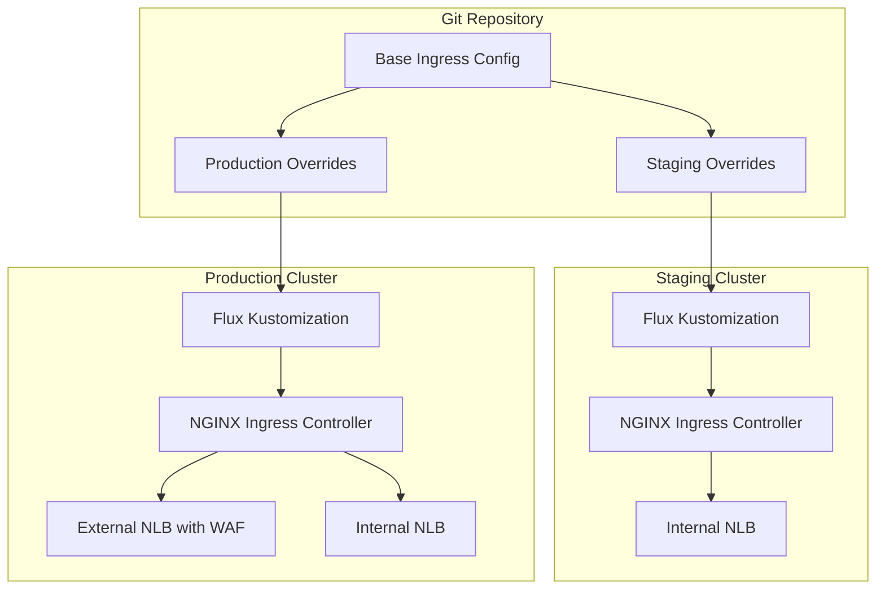

# How to Deploy Ingress Controller to All Clusters with Flux

Author: [nawazdhandala](https://github.com/nawazdhandala)

Tags: Flux, Kubernetes, GitOps, Multi-Cluster, Ingress, NGINX, Load Balancing, Networking

Description: Learn how to deploy and configure ingress controllers consistently across multiple Kubernetes clusters using Flux with per-cluster networking customization.

---

Every Kubernetes cluster that serves external traffic needs an ingress controller. When you manage multiple clusters, deploying and configuring ingress controllers consistently becomes a challenge. This guide demonstrates how to use Flux to deploy NGINX Ingress Controller across all your clusters with cluster-specific configurations for load balancer types, annotations, TLS settings, and resource sizing.

## Architecture Overview



## Repository Structure

```
repo/
├── infrastructure/
│   ├── sources/
│   │   └── ingress-nginx-repo.yaml
│   ├── ingress-nginx/
│   │   ├── namespace.yaml
│   │   ├── release.yaml
│   │   ├── values-base.yaml
│   │   └── kustomization.yaml
│   └── ingress-nginx-internal/
│       ├── release.yaml
│       ├── values-base.yaml
│       └── kustomization.yaml
├── clusters/
│   ├── staging/
│   │   └── infrastructure.yaml
│   └── production/
│       └── infrastructure.yaml
```

## Defining the Helm Source

```yaml
# infrastructure/sources/ingress-nginx-repo.yaml
apiVersion: source.toolkit.fluxcd.io/v1
kind: HelmRepository
metadata:
  name: ingress-nginx
  namespace: flux-system
spec:
  interval: 24h
  url: https://kubernetes.github.io/ingress-nginx
```

## Creating the Ingress Namespace

```yaml
# infrastructure/ingress-nginx/namespace.yaml
apiVersion: v1
kind: Namespace
metadata:
  name: ingress-nginx
  labels:
    app.kubernetes.io/name: ingress-nginx
```

## Base HelmRelease for Ingress Controller

```yaml
# infrastructure/ingress-nginx/release.yaml
apiVersion: helm.toolkit.fluxcd.io/v2
kind: HelmRelease
metadata:
  name: ingress-nginx
  namespace: ingress-nginx
spec:
  interval: 30m
  chart:
    spec:
      chart: ingress-nginx
      version: "4.x"
      sourceRef:
        kind: HelmRepository
        name: ingress-nginx
        namespace: flux-system
  install:
    remediation:
      retries: 3
  upgrade:
    remediation:
      retries: 3
  valuesFrom:
    - kind: ConfigMap
      name: ingress-nginx-values
      valuesKey: values.yaml
```

## Base Values with Variable Substitution

```yaml
# infrastructure/ingress-nginx/values-base.yaml
apiVersion: v1
kind: ConfigMap
metadata:
  name: ingress-nginx-values
  namespace: ingress-nginx
data:
  values.yaml: |
    controller:
      replicaCount: ${ingress_replicas}
      resources:
        requests:
          cpu: ${ingress_cpu_request}
          memory: ${ingress_memory_request}
        limits:
          cpu: ${ingress_cpu_limit}
          memory: ${ingress_memory_limit}
      autoscaling:
        enabled: ${ingress_autoscaling_enabled}
        minReplicas: ${ingress_min_replicas}
        maxReplicas: ${ingress_max_replicas}
        targetCPUUtilizationPercentage: 75
        targetMemoryUtilizationPercentage: 80
      service:
        type: ${ingress_service_type}
        annotations:
          service.beta.kubernetes.io/aws-load-balancer-type: ${lb_type}
          service.beta.kubernetes.io/aws-load-balancer-scheme: ${lb_scheme}
          service.beta.kubernetes.io/aws-load-balancer-cross-zone-load-balancing-enabled: "true"
          service.beta.kubernetes.io/aws-load-balancer-ssl-cert: ${lb_ssl_cert_arn}
          service.beta.kubernetes.io/aws-load-balancer-ssl-ports: "443"
      config:
        use-forwarded-headers: "true"
        compute-full-forwarded-for: "true"
        use-proxy-protocol: "${use_proxy_protocol}"
        log-format-upstream: '$remote_addr - $remote_user [$time_local] "$request" $status $body_bytes_sent "$http_referer" "$http_user_agent" $request_length $request_time [$proxy_upstream_name] [$proxy_alternative_upstream_name] $upstream_addr $upstream_response_length $upstream_response_time $upstream_status $req_id'
      metrics:
        enabled: true
        serviceMonitor:
          enabled: ${servicemonitor_enabled}
          namespace: monitoring
      admissionWebhooks:
        enabled: true
      topologySpreadConstraints:
        - maxSkew: 1
          topologyKey: topology.kubernetes.io/zone
          whenUnsatisfiable: DoNotSchedule
          labelSelector:
            matchLabels:
              app.kubernetes.io/name: ingress-nginx
    defaultBackend:
      enabled: true
      replicaCount: 2
```

## Cluster-Specific Variables

### Staging Cluster

```yaml
# clusters/staging/cluster-vars.yaml (ingress variables)
apiVersion: v1
kind: ConfigMap
metadata:
  name: cluster-vars
  namespace: flux-system
data:
  # Ingress settings
  ingress_replicas: "2"
  ingress_cpu_request: "100m"
  ingress_memory_request: "128Mi"
  ingress_cpu_limit: "500m"
  ingress_memory_limit: "512Mi"
  ingress_autoscaling_enabled: "false"
  ingress_min_replicas: "2"
  ingress_max_replicas: "4"
  ingress_service_type: "LoadBalancer"
  lb_type: "nlb"
  lb_scheme: "internal"
  lb_ssl_cert_arn: "arn:aws:acm:us-east-1:111111111111:certificate/staging-cert-id"
  use_proxy_protocol: "false"
  servicemonitor_enabled: "true"
```

### Production Cluster

```yaml
# clusters/production/cluster-vars.yaml (ingress variables)
apiVersion: v1
kind: ConfigMap
metadata:
  name: cluster-vars
  namespace: flux-system
data:
  # Ingress settings
  ingress_replicas: "3"
  ingress_cpu_request: "500m"
  ingress_memory_request: "512Mi"
  ingress_cpu_limit: "2000m"
  ingress_memory_limit: "2Gi"
  ingress_autoscaling_enabled: "true"
  ingress_min_replicas: "3"
  ingress_max_replicas: "20"
  ingress_service_type: "LoadBalancer"
  lb_type: "nlb"
  lb_scheme: "internet-facing"
  lb_ssl_cert_arn: "arn:aws:acm:us-east-1:222222222222:certificate/production-cert-id"
  use_proxy_protocol: "true"
  servicemonitor_enabled: "true"
```

## Flux Kustomization with Dependency Ordering

The ingress controller should depend on cert-manager if you plan to use TLS certificates:

```yaml
# clusters/production/infrastructure.yaml (ingress section)
apiVersion: kustomize.toolkit.fluxcd.io/v1
kind: Kustomization
metadata:
  name: ingress-nginx
  namespace: flux-system
spec:
  interval: 10m
  path: ./infrastructure/ingress-nginx
  prune: true
  sourceRef:
    kind: GitRepository
    name: flux-system
  dependsOn:
    - name: cert-manager
  wait: true
  timeout: 10m
  postBuild:
    substituteFrom:
      - kind: ConfigMap
        name: cluster-vars
      - kind: Secret
        name: cluster-secrets
        optional: true
  healthChecks:
    - apiVersion: apps/v1
      kind: Deployment
      name: ingress-nginx-controller
      namespace: ingress-nginx
```

## Deploying a Separate Internal Ingress Controller

Production clusters often need both external and internal ingress controllers:

```yaml
# infrastructure/ingress-nginx-internal/release.yaml
apiVersion: helm.toolkit.fluxcd.io/v2
kind: HelmRelease
metadata:
  name: ingress-nginx-internal
  namespace: ingress-nginx
spec:
  interval: 30m
  chart:
    spec:
      chart: ingress-nginx
      version: "4.x"
      sourceRef:
        kind: HelmRepository
        name: ingress-nginx
        namespace: flux-system
  values:
    controller:
      ingressClassResource:
        name: nginx-internal
        controllerValue: k8s.io/ingress-nginx-internal
      replicaCount: 2
      service:
        type: LoadBalancer
        annotations:
          service.beta.kubernetes.io/aws-load-balancer-type: nlb
          service.beta.kubernetes.io/aws-load-balancer-scheme: internal
      electionID: ingress-controller-internal
      metrics:
        enabled: true
        serviceMonitor:
          enabled: true
```

## Adding Rate Limiting and Security Headers

Configure global security settings through the ingress controller ConfigMap:

```yaml
# infrastructure/ingress-nginx/configmap-security.yaml
apiVersion: v1
kind: ConfigMap
metadata:
  name: ingress-nginx-security-config
  namespace: ingress-nginx
data:
  # Security headers
  add-headers: "ingress-nginx/custom-headers"
---
apiVersion: v1
kind: ConfigMap
metadata:
  name: custom-headers
  namespace: ingress-nginx
data:
  X-Frame-Options: "SAMEORIGIN"
  X-Content-Type-Options: "nosniff"
  X-XSS-Protection: "1; mode=block"
  Referrer-Policy: "strict-origin-when-cross-origin"
  Strict-Transport-Security: "max-age=31536000; includeSubDomains"
```

## Verification Commands

```bash
# Check the HelmRelease status
flux get helmreleases -n ingress-nginx

# Verify ingress controller pods
kubectl get pods -n ingress-nginx

# Check the LoadBalancer service
kubectl get svc -n ingress-nginx

# Verify ingress class is registered
kubectl get ingressclass

# Test ingress controller health
kubectl exec -n ingress-nginx deploy/ingress-nginx-controller -- /nginx-ingress-controller --version

# Check metrics endpoint
kubectl port-forward -n ingress-nginx svc/ingress-nginx-controller-metrics 10254:10254

# Verify across all clusters
for ctx in staging production; do
  echo "=== $ctx ==="
  kubectl --context $ctx get svc -n ingress-nginx
  kubectl --context $ctx get pods -n ingress-nginx
done
```

## Handling Ingress Controller Upgrades

When upgrading the ingress controller across clusters, use a staged rollout:

```yaml
# Update the chart version in the HelmRelease
spec:
  chart:
    spec:
      chart: ingress-nginx
      version: "4.9.0"  # Pin to specific version
```

Roll out to staging first by updating the staging cluster configuration, verify it works, then update production. Flux's dependency system ensures the controller is healthy before any dependent Ingress resources are reconciled.

## Conclusion

Deploying ingress controllers across multiple clusters with Flux provides consistency in networking configuration while allowing per-cluster customization for load balancer types, scaling parameters, and security settings. By using variable substitution for cloud-specific annotations and HelmRelease values, you maintain a single source of truth for your ingress configuration. The dependency ordering ensures cert-manager is ready before the ingress controller deploys, and health checks confirm the controller is serving traffic before downstream resources are applied.
