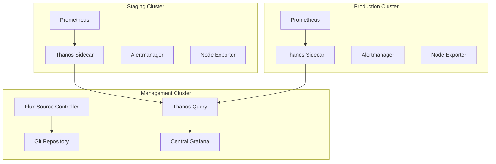

# How to Deploy Monitoring Stack to All Clusters with Flux

Author: [nawazdhandala](https://github.com/nawazdhandala)

Tags: Flux, Kubernetes, GitOps, Multi-Cluster, Monitoring, Prometheus, Grafana, Observability

Description: Learn how to deploy a consistent monitoring stack with Prometheus and Grafana across all your Kubernetes clusters using Flux GitOps.

---

Running multiple Kubernetes clusters without consistent monitoring is a recipe for blind spots and incident response delays. This guide shows you how to deploy a full monitoring stack consisting of Prometheus, Grafana, and Alertmanager to every cluster in your fleet using Flux, with per-cluster customization for retention, storage, and alerting.

## Architecture Overview

The monitoring stack uses a hub-and-spoke model where each cluster runs its own Prometheus instance for local metric collection, and a central cluster aggregates data via remote write or Thanos.



## Repository Structure

```text
repo/
├── infrastructure/
│   ├── sources/
│   │   └── prometheus-community.yaml
│   ├── monitoring/
│   │   ├── namespace.yaml
│   │   ├── kube-prometheus-stack/
│   │   │   ├── release.yaml
│   │   │   ├── values-base.yaml
│   │   │   └── kustomization.yaml
│   │   └── kustomization.yaml
│   └── kustomization.yaml
├── clusters/
│   ├── staging/
│   │   ├── monitoring-patch.yaml
│   │   └── infrastructure.yaml
│   └── production/
│       ├── monitoring-patch.yaml
│       └── infrastructure.yaml
```

## Defining the Helm Source

```yaml
# infrastructure/sources/prometheus-community.yaml
apiVersion: source.toolkit.fluxcd.io/v1
kind: HelmRepository
metadata:
  name: prometheus-community
  namespace: flux-system
spec:
  interval: 24h
  url: https://prometheus-community.github.io/helm-charts
```

## Creating the Base Monitoring HelmRelease

```yaml
# infrastructure/monitoring/kube-prometheus-stack/release.yaml
apiVersion: helm.toolkit.fluxcd.io/v2
kind: HelmRelease
metadata:
  name: kube-prometheus-stack
  namespace: monitoring
spec:
  interval: 30m
  chart:
    spec:
      chart: kube-prometheus-stack
      version: "55.x"
      sourceRef:
        kind: HelmRepository
        name: prometheus-community
        namespace: flux-system
  install:
    crds: CreateReplace
    remediation:
      retries: 3
  upgrade:
    crds: CreateReplace
    remediation:
      retries: 3
  valuesFrom:
    - kind: ConfigMap
      name: monitoring-values
      valuesKey: values.yaml
```

## Base Values ConfigMap

```yaml
# infrastructure/monitoring/kube-prometheus-stack/values-base.yaml
apiVersion: v1
kind: ConfigMap
metadata:
  name: monitoring-values
  namespace: monitoring
data:
  values.yaml: |
    prometheus:
      prometheusSpec:
        retention: ${monitoring_retention}
        retentionSize: ${monitoring_retention_size}
        resources:
          requests:
            cpu: ${prometheus_cpu_request}
            memory: ${prometheus_memory_request}
          limits:
            cpu: ${prometheus_cpu_limit}
            memory: ${prometheus_memory_limit}
        storageSpec:
          volumeClaimTemplate:
            spec:
              storageClassName: ${storage_class}
              accessModes: ["ReadWriteOnce"]
              resources:
                requests:
                  storage: ${prometheus_storage_size}
        externalLabels:
          cluster: ${cluster_name}
          environment: ${cluster_env}
    grafana:
      enabled: ${grafana_enabled}
      adminPassword: ${grafana_admin_password}
      persistence:
        enabled: true
        size: 10Gi
        storageClassName: ${storage_class}
      dashboardProviders:
        dashboardproviders.yaml:
          apiVersion: 1
          providers:
            - name: default
              orgId: 1
              folder: ''
              type: file
              disableDeletion: false
              editable: true
              options:
                path: /var/lib/grafana/dashboards/default
    alertmanager:
      alertmanagerSpec:
        resources:
          requests:
            cpu: 100m
            memory: 128Mi
        storage:
          volumeClaimTemplate:
            spec:
              storageClassName: ${storage_class}
              accessModes: ["ReadWriteOnce"]
              resources:
                requests:
                  storage: 5Gi
    nodeExporter:
      enabled: true
    kubeStateMetrics:
      enabled: true
```

## Monitoring Namespace

```yaml
# infrastructure/monitoring/namespace.yaml
apiVersion: v1
kind: Namespace
metadata:
  name: monitoring
  labels:
    toolkit.fluxcd.io/tenant: infrastructure
```

## Cluster-Specific Variable Configuration

### Staging Cluster

```yaml
# clusters/staging/cluster-vars.yaml (add monitoring variables)
apiVersion: v1
kind: ConfigMap
metadata:
  name: cluster-vars
  namespace: flux-system
data:
  cluster_name: "staging-us-east"
  cluster_env: "staging"
  storage_class: "standard"
  monitoring_retention: "7d"
  monitoring_retention_size: "10GB"
  prometheus_cpu_request: "200m"
  prometheus_memory_request: "512Mi"
  prometheus_cpu_limit: "1000m"
  prometheus_memory_limit: "2Gi"
  prometheus_storage_size: "50Gi"
  grafana_enabled: "true"
  grafana_admin_password: "staging-admin"
```

### Production Cluster

```yaml
# clusters/production/cluster-vars.yaml (add monitoring variables)
apiVersion: v1
kind: ConfigMap
metadata:
  name: cluster-vars
  namespace: flux-system
data:
  cluster_name: "production-us-east"
  cluster_env: "production"
  storage_class: "gp3-encrypted"
  monitoring_retention: "30d"
  monitoring_retention_size: "100GB"
  prometheus_cpu_request: "1000m"
  prometheus_memory_request: "4Gi"
  prometheus_cpu_limit: "4000m"
  prometheus_memory_limit: "8Gi"
  prometheus_storage_size: "500Gi"
  grafana_enabled: "false"
  grafana_admin_password: "unused"
```

## Flux Kustomization for Monitoring

```yaml
# clusters/production/infrastructure.yaml
apiVersion: kustomize.toolkit.fluxcd.io/v1
kind: Kustomization
metadata:
  name: monitoring
  namespace: flux-system
spec:
  interval: 10m
  path: ./infrastructure/monitoring
  prune: true
  sourceRef:
    kind: GitRepository
    name: flux-system
  dependsOn:
    - name: crds
  wait: true
  timeout: 15m
  postBuild:
    substituteFrom:
      - kind: ConfigMap
        name: cluster-vars
      - kind: Secret
        name: cluster-secrets
        optional: true
```

## Adding Custom Alerting Rules

Define common alerting rules that apply across all clusters:

```yaml
# infrastructure/monitoring/alerts/common-alerts.yaml
apiVersion: monitoring.coreos.com/v1
kind: PrometheusRule
metadata:
  name: common-alerts
  namespace: monitoring
spec:
  groups:
    - name: node-alerts
      rules:
        - alert: HighNodeCPU
          expr: 100 - (avg by(instance) (rate(node_cpu_seconds_total{mode="idle"}[5m])) * 100) > 85
          for: 10m
          labels:
            severity: warning
            cluster: "${cluster_name}"
          annotations:
            summary: "High CPU usage detected on {{ $labels.instance }}"
            description: "CPU usage is above 85% for more than 10 minutes."
        - alert: HighMemoryUsage
          expr: (1 - node_memory_MemAvailable_bytes / node_memory_MemTotal_bytes) * 100 > 90
          for: 5m
          labels:
            severity: critical
            cluster: "${cluster_name}"
          annotations:
            summary: "High memory usage on {{ $labels.instance }}"
        - alert: DiskSpaceLow
          expr: (node_filesystem_avail_bytes{mountpoint="/"} / node_filesystem_size_bytes{mountpoint="/"}) * 100 < 10
          for: 5m
          labels:
            severity: critical
            cluster: "${cluster_name}"
          annotations:
            summary: "Disk space below 10% on {{ $labels.instance }}"
```

## Configuring Alertmanager Routing Per Cluster

```yaml
# infrastructure/monitoring/alertmanager-config.yaml
apiVersion: monitoring.coreos.com/v1alpha1
kind: AlertmanagerConfig
metadata:
  name: cluster-alerts
  namespace: monitoring
spec:
  route:
    groupBy: ['alertname', 'cluster']
    groupWait: 30s
    groupInterval: 5m
    repeatInterval: 4h
    receiver: 'default'
    routes:
      - matchers:
          - name: severity
            value: critical
        receiver: 'pagerduty'
      - matchers:
          - name: severity
            value: warning
        receiver: 'slack'
  receivers:
    - name: 'default'
      slackConfigs:
        - channel: '#alerts-${cluster_env}'
          apiURL:
            name: alertmanager-slack
            key: webhook-url
    - name: 'pagerduty'
      pagerdutyConfigs:
        - routingKey:
            name: alertmanager-pagerduty
            key: routing-key
    - name: 'slack'
      slackConfigs:
        - channel: '#alerts-${cluster_env}'
          apiURL:
            name: alertmanager-slack
            key: webhook-url
```

## Verifying the Monitoring Deployment

After Flux deploys the monitoring stack, verify it is working across all clusters:

```bash
# Check the HelmRelease status
flux get helmreleases -n monitoring

# Verify Prometheus pods are running
kubectl get pods -n monitoring -l app.kubernetes.io/name=prometheus

# Check Prometheus targets
kubectl port-forward -n monitoring svc/kube-prometheus-stack-prometheus 9090:9090
# Then visit http://localhost:9090/targets

# Verify Grafana is accessible (if enabled)
kubectl port-forward -n monitoring svc/kube-prometheus-stack-grafana 3000:80

# Check Alertmanager status
kubectl get pods -n monitoring -l app.kubernetes.io/name=alertmanager

# View monitoring Kustomization status across contexts
for ctx in staging production; do
  echo "=== $ctx ==="
  kubectl --context $ctx get kustomization monitoring -n flux-system
done
```

## Deploying Custom Grafana Dashboards

Store dashboards as ConfigMaps so they are deployed consistently via GitOps:

```yaml
# infrastructure/monitoring/dashboards/flux-dashboard.yaml
apiVersion: v1
kind: ConfigMap
metadata:
  name: flux-dashboard
  namespace: monitoring
  labels:
    grafana_dashboard: "1"
data:
  flux-cluster.json: |
    {
      "dashboard": {
        "title": "Flux Cluster Overview",
        "panels": [
          {
            "title": "Kustomization Reconciliation",
            "type": "stat",
            "targets": [
              {
                "expr": "gotk_reconcile_condition{type=\"Ready\",status=\"True\",kind=\"Kustomization\"}"
              }
            ]
          }
        ]
      }
    }
```

## Conclusion

Deploying a monitoring stack across all clusters with Flux ensures every cluster has consistent observability from day one. By using variable substitution for cluster-specific tuning, dependency ordering to ensure CRDs are installed first, and shared alerting rules with per-cluster routing, you get a monitoring setup that scales with your fleet. Each cluster reports its own identity through external labels, making it straightforward to query and alert on any cluster from a central Grafana instance.
