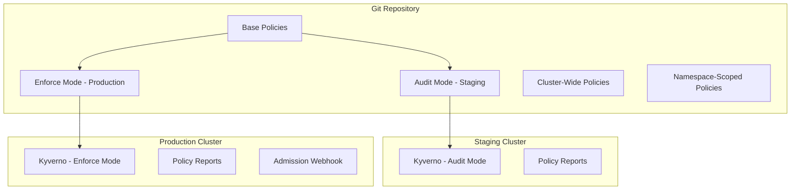

# How to Deploy Policy Engine to All Clusters with Flux

Author: [nawazdhandala](https://github.com/nawazdhandala)

Tags: Flux, Kubernetes, GitOps, Multi-Cluster, Policy, Kyverno, OPA, Gatekeeper, Security

Description: Learn how to deploy and manage Kubernetes policy engines like Kyverno and OPA Gatekeeper across all clusters using Flux with environment-specific policy enforcement.

---

Policy engines enforce security and compliance rules across your Kubernetes clusters. When managing multiple clusters, you need every cluster to have the same baseline policies while allowing environment-specific tuning. This guide shows you how to deploy Kyverno as a policy engine across all your clusters using Flux, with examples for both audit and enforce modes depending on the cluster tier.

## Architecture Overview



## Repository Structure

```
repo/
├── infrastructure/
│   ├── sources/
│   │   └── kyverno-repo.yaml
│   ├── kyverno/
│   │   ├── namespace.yaml
│   │   ├── release.yaml
│   │   ├── values-base.yaml
│   │   └── kustomization.yaml
│   └── policies/
│       ├── baseline/
│       │   ├── disallow-privileged.yaml
│       │   ├── require-labels.yaml
│       │   ├── disallow-latest-tag.yaml
│       │   ├── require-resource-limits.yaml
│       │   └── kustomization.yaml
│       ├── restricted/
│       │   ├── restrict-host-namespaces.yaml
│       │   ├── restrict-volume-types.yaml
│       │   └── kustomization.yaml
│       └── kustomization.yaml
├── clusters/
│   ├── staging/
│   │   └── infrastructure.yaml
│   └── production/
│       └── infrastructure.yaml
```

## Installing Kyverno with Flux

### Helm Repository Source

```yaml
# infrastructure/sources/kyverno-repo.yaml
apiVersion: source.toolkit.fluxcd.io/v1
kind: HelmRepository
metadata:
  name: kyverno
  namespace: flux-system
spec:
  interval: 24h
  url: https://kyverno.github.io/kyverno
```

### Base HelmRelease

```yaml
# infrastructure/kyverno/release.yaml
apiVersion: helm.toolkit.fluxcd.io/v2
kind: HelmRelease
metadata:
  name: kyverno
  namespace: kyverno
spec:
  interval: 30m
  chart:
    spec:
      chart: kyverno
      version: "3.x"
      sourceRef:
        kind: HelmRepository
        name: kyverno
        namespace: flux-system
  install:
    crds: CreateReplace
    remediation:
      retries: 3
  upgrade:
    crds: CreateReplace
    remediation:
      retries: 3
  valuesFrom:
    - kind: ConfigMap
      name: kyverno-values
      valuesKey: values.yaml
```

### Base Values with Variable Substitution

```yaml
# infrastructure/kyverno/values-base.yaml
apiVersion: v1
kind: ConfigMap
metadata:
  name: kyverno-values
  namespace: kyverno
data:
  values.yaml: |
    replicaCount: ${kyverno_replicas}
    resources:
      limits:
        cpu: ${kyverno_cpu_limit}
        memory: ${kyverno_memory_limit}
      requests:
        cpu: ${kyverno_cpu_request}
        memory: ${kyverno_memory_request}
    config:
      webhooks:
        - objectSelector:
            matchExpressions:
              - key: app.kubernetes.io/managed-by
                operator: NotIn
                values:
                  - flux
      resourceFiltersExcludeNamespaces:
        - kube-system
        - flux-system
        - kyverno
    backgroundController:
      enabled: true
      resources:
        limits:
          cpu: 500m
          memory: 512Mi
        requests:
          cpu: 100m
          memory: 128Mi
    cleanupController:
      enabled: true
    reportsController:
      enabled: true
    admissionController:
      replicas: ${kyverno_replicas}
```

## Defining Baseline Policies

### Disallow Privileged Containers

```yaml
# infrastructure/policies/baseline/disallow-privileged.yaml
apiVersion: kyverno.io/v1
kind: ClusterPolicy
metadata:
  name: disallow-privileged-containers
  annotations:
    policies.kyverno.io/title: Disallow Privileged Containers
    policies.kyverno.io/category: Pod Security
    policies.kyverno.io/severity: high
spec:
  validationFailureAction: ${policy_enforcement_mode}
  background: true
  rules:
    - name: disallow-privileged
      match:
        any:
          - resources:
              kinds:
                - Pod
      exclude:
        any:
          - resources:
              namespaces:
                - kube-system
                - kyverno
                - flux-system
      validate:
        message: "Privileged containers are not allowed."
        pattern:
          spec:
            containers:
              - securityContext:
                  privileged: "false"
            initContainers:
              - securityContext:
                  privileged: "false"
```

### Require Resource Limits

```yaml
# infrastructure/policies/baseline/require-resource-limits.yaml
apiVersion: kyverno.io/v1
kind: ClusterPolicy
metadata:
  name: require-resource-limits
  annotations:
    policies.kyverno.io/title: Require Resource Limits
    policies.kyverno.io/category: Best Practices
    policies.kyverno.io/severity: medium
spec:
  validationFailureAction: ${policy_enforcement_mode}
  background: true
  rules:
    - name: require-limits
      match:
        any:
          - resources:
              kinds:
                - Pod
      exclude:
        any:
          - resources:
              namespaces:
                - kube-system
                - kyverno
                - flux-system
      validate:
        message: "CPU and memory limits are required for all containers."
        pattern:
          spec:
            containers:
              - resources:
                  limits:
                    memory: "?*"
                    cpu: "?*"
```

### Disallow Latest Tag

```yaml
# infrastructure/policies/baseline/disallow-latest-tag.yaml
apiVersion: kyverno.io/v1
kind: ClusterPolicy
metadata:
  name: disallow-latest-tag
  annotations:
    policies.kyverno.io/title: Disallow Latest Tag
    policies.kyverno.io/category: Best Practices
    policies.kyverno.io/severity: medium
spec:
  validationFailureAction: ${policy_enforcement_mode}
  background: true
  rules:
    - name: disallow-latest
      match:
        any:
          - resources:
              kinds:
                - Pod
      validate:
        message: "Using 'latest' image tag is not allowed. Please use a specific version tag."
        pattern:
          spec:
            containers:
              - image: "!*:latest"
```

### Require Labels

```yaml
# infrastructure/policies/baseline/require-labels.yaml
apiVersion: kyverno.io/v1
kind: ClusterPolicy
metadata:
  name: require-labels
  annotations:
    policies.kyverno.io/title: Require Labels
    policies.kyverno.io/category: Best Practices
    policies.kyverno.io/severity: medium
spec:
  validationFailureAction: ${policy_enforcement_mode}
  background: true
  rules:
    - name: require-team-label
      match:
        any:
          - resources:
              kinds:
                - Deployment
                - StatefulSet
                - DaemonSet
      exclude:
        any:
          - resources:
              namespaces:
                - kube-system
                - flux-system
                - kyverno
      validate:
        message: "The label 'app.kubernetes.io/team' is required."
        pattern:
          metadata:
            labels:
              app.kubernetes.io/team: "?*"
```

## Cluster-Specific Policy Configuration

### Staging: Audit Mode

```yaml
# clusters/staging/cluster-vars.yaml (policy variables)
apiVersion: v1
kind: ConfigMap
metadata:
  name: cluster-vars
  namespace: flux-system
data:
  kyverno_replicas: "1"
  kyverno_cpu_request: "100m"
  kyverno_memory_request: "256Mi"
  kyverno_cpu_limit: "500m"
  kyverno_memory_limit: "512Mi"
  policy_enforcement_mode: "Audit"
```

### Production: Enforce Mode

```yaml
# clusters/production/cluster-vars.yaml (policy variables)
apiVersion: v1
kind: ConfigMap
metadata:
  name: cluster-vars
  namespace: flux-system
data:
  kyverno_replicas: "3"
  kyverno_cpu_request: "500m"
  kyverno_memory_request: "512Mi"
  kyverno_cpu_limit: "2000m"
  kyverno_memory_limit: "2Gi"
  policy_enforcement_mode: "Enforce"
```

## Flux Kustomizations for Policy Engine

```yaml
# clusters/production/infrastructure.yaml (policy section)
apiVersion: kustomize.toolkit.fluxcd.io/v1
kind: Kustomization
metadata:
  name: kyverno
  namespace: flux-system
spec:
  interval: 10m
  path: ./infrastructure/kyverno
  prune: true
  sourceRef:
    kind: GitRepository
    name: flux-system
  dependsOn:
    - name: crds
  wait: true
  timeout: 10m
  postBuild:
    substituteFrom:
      - kind: ConfigMap
        name: cluster-vars
---
apiVersion: kustomize.toolkit.fluxcd.io/v1
kind: Kustomization
metadata:
  name: policies
  namespace: flux-system
spec:
  interval: 10m
  path: ./infrastructure/policies
  prune: true
  sourceRef:
    kind: GitRepository
    name: flux-system
  dependsOn:
    - name: kyverno
  wait: true
  timeout: 5m
  postBuild:
    substituteFrom:
      - kind: ConfigMap
        name: cluster-vars
```

## Monitoring Policy Violations

Check policy reports to understand what is being flagged across clusters:

```bash
# List all policy reports
kubectl get policyreport -A

# Get cluster-level policy report
kubectl get clusterpolicyreport -o yaml

# Count violations per policy
kubectl get policyreport -A -o json | \
  jq -r '.items[].results[]? | select(.result=="fail") | .policy' | \
  sort | uniq -c | sort -rn

# Check Kyverno admission controller logs
kubectl logs -n kyverno deploy/kyverno-admission-controller --since=1h

# Verify policies are active
kubectl get clusterpolicy

# Force policy reconciliation
flux reconcile kustomization policies -n flux-system
```

## Gradual Policy Rollout Strategy

When introducing new policies across a fleet, follow this workflow:

1. Deploy in Audit mode to all clusters first.
2. Review policy reports for violations.
3. Work with teams to remediate violations.
4. Switch to Enforce mode on staging.
5. After validation, switch to Enforce mode on production.


## Policy Exceptions

For workloads that legitimately need to bypass certain policies, use Kyverno PolicyExceptions:

```yaml
apiVersion: kyverno.io/v2
kind: PolicyException
metadata:
  name: allow-privileged-cni
  namespace: kube-system
spec:
  exceptions:
    - policyName: disallow-privileged-containers
      ruleNames:
        - disallow-privileged
  match:
    any:
      - resources:
          kinds:
            - Pod
          namespaces:
            - kube-system
          names:
            - "calico-node-*"
            - "aws-node-*"
```

## Conclusion

Deploying a policy engine across all clusters with Flux ensures consistent security and compliance baselines while allowing environment-appropriate enforcement levels. By using Audit mode on staging and Enforce mode on production, teams can catch policy violations early without blocking development workflows. The combination of Flux dependency ordering, variable substitution for enforcement modes, and Kyverno policy reports gives you a complete policy management lifecycle across your entire cluster fleet.
