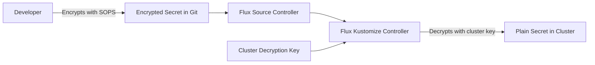

# How to Handle Cluster-Specific Secret Keys with Flux and SOPS

Author: [nawazdhandala](https://github.com/nawazdhandala)

Tags: Flux, Kubernetes, GitOps, Multi-Cluster, SOPS, Secrets, Encryption, Security, Mozilla SOPS

Description: Learn how to manage cluster-specific secrets in a multi-cluster Flux setup using Mozilla SOPS encryption with per-cluster decryption keys.

---

Storing secrets in Git is a fundamental requirement for GitOps, but doing so securely across multiple clusters requires careful key management. Mozilla SOPS integrated with Flux lets you encrypt secrets in your repository and decrypt them at reconciliation time using cluster-specific keys. This guide walks you through setting up SOPS with Flux for a multi-cluster environment where each cluster has its own encryption keys.

## How SOPS Works with Flux

SOPS encrypts the values in your YAML files while leaving the keys and structure readable. Flux's kustomize-controller has built-in SOPS support and can decrypt secrets during reconciliation using age keys, AWS KMS, Azure Key Vault, or GCP KMS.



## Repository Structure

```
repo/
├── infrastructure/
│   └── secrets/
│       ├── .sops.yaml
│       ├── staging/
│       │   ├── database-credentials.yaml
│       │   ├── api-keys.yaml
│       │   └── kustomization.yaml
│       └── production/
│           ├── database-credentials.yaml
│           ├── api-keys.yaml
│           └── kustomization.yaml
├── clusters/
│   ├── staging/
│   │   └── secrets.yaml
│   └── production/
│       └── secrets.yaml
```

## Setting Up Age Keys Per Cluster

Age is the recommended encryption method for SOPS with Flux. Generate a unique key pair for each cluster.

```bash
# Install age
brew install age

# Generate key for staging cluster
age-keygen -o staging.agekey
# Output: public key: age1staging...

# Generate key for production cluster
age-keygen -o production.agekey
# Output: public key: age1production...

# Store the public keys for reference
echo "Staging: $(grep 'public key' staging.agekey | cut -d: -f2 | tr -d ' ')"
echo "Production: $(grep 'public key' production.agekey | cut -d: -f2 | tr -d ' ')"
```

## Configuring SOPS Rules Per Cluster

Create a `.sops.yaml` file in your repository root that maps paths to encryption keys:

```yaml
# .sops.yaml
creation_rules:
  # Staging secrets encrypted with staging age key
  - path_regex: infrastructure/secrets/staging/.*\.yaml$
    encrypted_regex: ^(data|stringData)$
    age: age1stagingpublickeyhere

  # Production secrets encrypted with production age key
  - path_regex: infrastructure/secrets/production/.*\.yaml$
    encrypted_regex: ^(data|stringData)$
    age: age1productionpublickeyhere

  # Shared secrets encrypted with both keys
  - path_regex: infrastructure/secrets/shared/.*\.yaml$
    encrypted_regex: ^(data|stringData)$
    age: age1stagingpublickeyhere,age1productionpublickeyhere
```

## Installing the Decryption Key in Each Cluster

Each cluster needs its private age key installed as a Secret that Flux can use for decryption.

```bash
# Install the staging age key in the staging cluster
kubectl --context staging create secret generic sops-age \
  --namespace=flux-system \
  --from-file=age.agekey=staging.agekey

# Install the production age key in the production cluster
kubectl --context production create secret generic sops-age \
  --namespace=flux-system \
  --from-file=age.agekey=production.agekey
```

Verify the secret exists:

```bash
kubectl --context staging get secret sops-age -n flux-system
kubectl --context production get secret sops-age -n flux-system
```

## Creating and Encrypting Secrets

### Write the Secret in Plain Text

```yaml
# infrastructure/secrets/staging/database-credentials.yaml (before encryption)
apiVersion: v1
kind: Secret
metadata:
  name: database-credentials
  namespace: default
type: Opaque
stringData:
  host: "staging-db.internal.example.com"
  port: "5432"
  username: "app_staging"
  password: "staging-secret-password-123"
  database: "myapp_staging"
```

### Encrypt with SOPS

```bash
# Encrypt the staging database secret
sops --encrypt --in-place infrastructure/secrets/staging/database-credentials.yaml

# Encrypt the production database secret
sops --encrypt --in-place infrastructure/secrets/production/database-credentials.yaml
```

After encryption, the file looks like this:

```yaml
apiVersion: v1
kind: Secret
metadata:
  name: database-credentials
  namespace: default
type: Opaque
stringData:
  host: ENC[AES256_GCM,data:abc123...,iv:...,tag:...,type:str]
  port: ENC[AES256_GCM,data:def456...,iv:...,tag:...,type:str]
  username: ENC[AES256_GCM,data:ghi789...,iv:...,tag:...,type:str]
  password: ENC[AES256_GCM,data:jkl012...,iv:...,tag:...,type:str]
  database: ENC[AES256_GCM,data:mno345...,iv:...,tag:...,type:str]
sops:
  age:
    - recipient: age1stagingpublickeyhere
      enc: |
        -----BEGIN AGE ENCRYPTED FILE-----
        ...
        -----END AGE ENCRYPTED FILE-----
  lastmodified: "2026-03-13T00:00:00Z"
  mac: ENC[AES256_GCM,data:...,iv:...,tag:...,type:str]
  version: 3.8.1
```

## Configuring Flux Kustomization for SOPS Decryption

Tell Flux where to find the decryption key:

```yaml
# clusters/staging/secrets.yaml
apiVersion: kustomize.toolkit.fluxcd.io/v1
kind: Kustomization
metadata:
  name: secrets
  namespace: flux-system
spec:
  interval: 10m
  path: ./infrastructure/secrets/staging
  prune: true
  sourceRef:
    kind: GitRepository
    name: flux-system
  decryption:
    provider: sops
    secretRef:
      name: sops-age
```

```yaml
# clusters/production/secrets.yaml
apiVersion: kustomize.toolkit.fluxcd.io/v1
kind: Kustomization
metadata:
  name: secrets
  namespace: flux-system
spec:
  interval: 10m
  path: ./infrastructure/secrets/production
  prune: true
  sourceRef:
    kind: GitRepository
    name: flux-system
  decryption:
    provider: sops
    secretRef:
      name: sops-age
```

## Using AWS KMS Per Cluster

For AWS-based clusters, you can use KMS keys instead of age. Each cluster gets its own KMS key:

```yaml
# .sops.yaml for AWS KMS
creation_rules:
  - path_regex: infrastructure/secrets/staging/.*\.yaml$
    encrypted_regex: ^(data|stringData)$
    kms: "arn:aws:kms:us-east-1:111111111111:key/staging-key-id"

  - path_regex: infrastructure/secrets/production/.*\.yaml$
    encrypted_regex: ^(data|stringData)$
    kms: "arn:aws:kms:us-east-1:222222222222:key/production-key-id"
```

For KMS-based decryption, the kustomize-controller needs IAM permissions. Configure this via IRSA (IAM Roles for Service Accounts):

```yaml
apiVersion: v1
kind: ServiceAccount
metadata:
  name: kustomize-controller
  namespace: flux-system
  annotations:
    eks.amazonaws.com/role-arn: arn:aws:iam::111111111111:role/flux-sops-role
```

## Managing Secret Rotation

When you need to rotate secrets, edit the encrypted file and re-encrypt:

```bash
# Decrypt in place for editing
sops infrastructure/secrets/production/database-credentials.yaml

# This opens your editor with the decrypted content
# Make changes and save - SOPS re-encrypts automatically

# Or use sops set for individual values
sops set infrastructure/secrets/production/database-credentials.yaml \
  '["stringData"]["password"]' '"new-rotated-password"'
```

## Key Rotation Strategy

When you need to rotate the age key for a cluster:

```bash
# Generate a new age key
age-keygen -o production-new.agekey

# Update .sops.yaml with the new public key
# Then re-encrypt all production secrets with the new key
find infrastructure/secrets/production -name "*.yaml" -exec \
  sops updatekeys {} \;

# Install the new key in the cluster
kubectl --context production delete secret sops-age -n flux-system
kubectl --context production create secret generic sops-age \
  --namespace=flux-system \
  --from-file=age.agekey=production-new.agekey

# Force Flux to reconcile
flux reconcile kustomization secrets -n flux-system --context production
```

## Combining SOPS Secrets with Variable Substitution

You can use SOPS-encrypted Secrets as variable sources in Flux post-build substitution:

```yaml
# Encrypted secret that provides variables
apiVersion: v1
kind: Secret
metadata:
  name: cluster-secrets
  namespace: flux-system
type: Opaque
stringData:
  database_password: "encrypted-value-here"
  api_key: "encrypted-api-key-here"
  redis_password: "encrypted-redis-password"
```

Then reference it in your Kustomization:

```yaml
apiVersion: kustomize.toolkit.fluxcd.io/v1
kind: Kustomization
metadata:
  name: apps
  namespace: flux-system
spec:
  interval: 10m
  path: ./apps
  sourceRef:
    kind: GitRepository
    name: flux-system
  decryption:
    provider: sops
    secretRef:
      name: sops-age
  postBuild:
    substituteFrom:
      - kind: ConfigMap
        name: cluster-vars
      - kind: Secret
        name: cluster-secrets
```

## Verification and Troubleshooting

```bash
# Verify SOPS decryption is working
flux get kustomization secrets -n flux-system

# Check for decryption errors
kubectl logs -n flux-system deploy/kustomize-controller | grep -i "sops\|decrypt"

# Verify the decrypted secret exists in the cluster
kubectl get secret database-credentials -o jsonpath='{.data.password}' | base64 -d

# Test SOPS encryption locally
sops --decrypt infrastructure/secrets/staging/database-credentials.yaml

# Validate .sops.yaml rules
sops --config .sops.yaml --encrypt --in-place test-secret.yaml
```

## Security Best Practices

1. Never commit unencrypted secrets. Add a pre-commit hook to catch this:

```bash
#!/bin/bash
# .git/hooks/pre-commit
for file in $(git diff --cached --name-only | grep -E 'secrets/.*\.yaml$'); do
  if ! grep -q "sops:" "$file"; then
    echo "ERROR: $file appears to be unencrypted. Encrypt with sops before committing."
    exit 1
  fi
done
```

2. Store age private keys securely outside of Git, in a vault or secrets manager.

3. Use separate keys per cluster so that compromising one cluster's key does not expose secrets from other clusters.

4. Audit who has access to the age private keys and rotate them periodically.

## Conclusion

Managing cluster-specific secrets with Flux and SOPS gives you the best of both worlds: secrets stored in Git for full GitOps workflows, with encryption ensuring they are never exposed in plain text. By using per-cluster encryption keys, you maintain strong isolation between environments. Whether you choose age keys for simplicity or cloud KMS for integration with your cloud provider's security model, Flux's built-in SOPS support makes the decryption transparent at reconciliation time.
