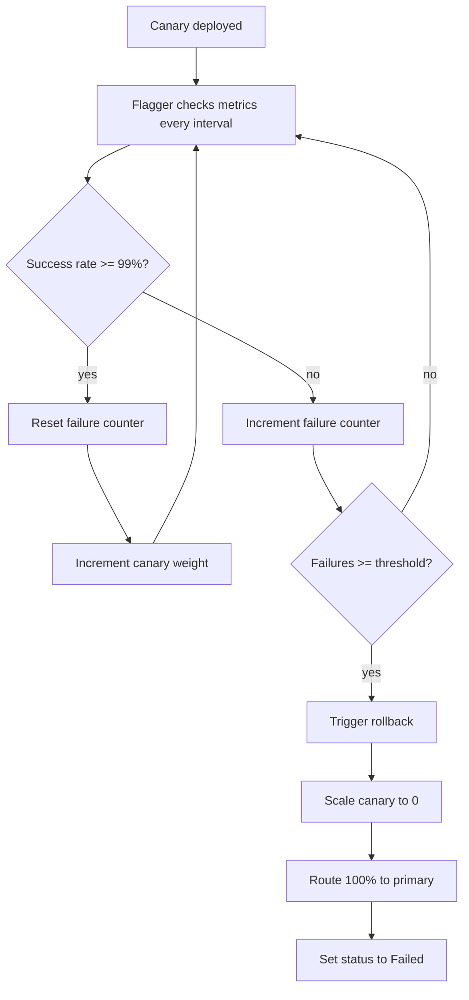

# How to Implement Automated Rollback Based on Error Rate with Flagger

Author: [nawazdhandala](https://github.com/nawazdhandala)

Tags: Flagger, Canary, Kubernetes, Rollback, Error Rate, Progressive Delivery

Description: Learn how to configure Flagger to automatically roll back canary deployments when the error rate exceeds a defined threshold.

---

## Introduction

One of the most valuable features of Flagger is its ability to automatically roll back a canary deployment when metrics indicate a problem. Error rate monitoring is the most common and critical metric for rollback decisions. If a new version starts returning errors at a higher rate than acceptable, Flagger should stop the rollout and revert to the stable version before users are significantly impacted.

This guide shows how to configure Flagger's automated rollback based on HTTP error rates, including threshold tuning, analysis intervals, and custom error rate metrics.

## Prerequisites

- A Kubernetes cluster (v1.25 or later)
- Flagger installed (v1.37 or later)
- Istio or another supported service mesh
- Prometheus installed and collecting metrics
- kubectl configured to access your cluster

## Step 1: Understanding Flagger's Rollback Mechanism

Flagger uses a threshold-based rollback system. During canary analysis, Flagger queries metrics at each `interval`. If a metric check fails, Flagger increments a failure counter. When the failure counter reaches the `threshold` value, Flagger rolls back the canary by scaling it to zero and routing all traffic back to the primary.

The key fields controlling rollback behavior are:

- `analysis.interval`: How often Flagger checks metrics (e.g., `30s`).
- `analysis.threshold`: Number of consecutive failed metric checks before rollback.
- `metrics[].thresholdRange.min`: Minimum acceptable value for the metric.

## Step 2: Configure the Canary with Error Rate Rollback

Here is a Canary resource configured to roll back when the request success rate drops below 99%:

```yaml
apiVersion: flagger.app/v1beta1
kind: Canary
metadata:
  name: my-app
  namespace: default
spec:
  targetRef:
    apiVersion: apps/v1
    kind: Deployment
    name: my-app
  service:
    port: 8080
    targetPort: http
  analysis:
    interval: 30s
    threshold: 3
    maxWeight: 50
    stepWeight: 10
    metrics:
      - name: request-success-rate
        thresholdRange:
          min: 99
        interval: 1m
```

With this configuration:

- Every 30 seconds, Flagger queries the success rate metric.
- The success rate must be at least 99% (meaning error rate must be below 1%).
- If the success rate drops below 99% for 3 consecutive checks (90 seconds), Flagger triggers a rollback.

## Step 3: Use the Built-in Request Success Rate Metric

Flagger includes a built-in `request-success-rate` metric that works with Istio, Linkerd, App Mesh, and other supported providers. For Istio, it queries:

```promql
sum(rate(istio_requests_total{
  reporter="destination",
  destination_workload_namespace="default",
  destination_workload="my-app",
  response_code!~"5.*"
}[1m])) /
sum(rate(istio_requests_total{
  reporter="destination",
  destination_workload_namespace="default",
  destination_workload="my-app"
}[1m])) * 100
```

This calculates the percentage of non-5xx responses over the analysis window.

## Step 4: Create a Custom Error Rate Metric

For finer control, create a custom MetricTemplate that includes specific error codes or excludes certain expected errors:

```yaml
apiVersion: flagger.app/v1beta1
kind: MetricTemplate
metadata:
  name: error-rate-excluding-404
  namespace: default
spec:
  provider:
    type: prometheus
    address: http://prometheus.istio-system:9090
  query: |
    100 - (
      sum(rate(istio_requests_total{
        reporter="destination",
        destination_workload_namespace="{{ namespace }}",
        destination_workload="{{ target }}",
        response_code=~"5.*"
      }[{{ interval }}])) /
      sum(rate(istio_requests_total{
        reporter="destination",
        destination_workload_namespace="{{ namespace }}",
        destination_workload="{{ target }}",
        response_code!="404"
      }[{{ interval }}])) * 100
    )
```

Reference it in your Canary:

```yaml
  analysis:
    metrics:
      - name: error-rate-excluding-404
        templateRef:
          name: error-rate-excluding-404
          namespace: default
        thresholdRange:
          min: 99
        interval: 1m
```

## Step 5: Tune the Rollback Sensitivity

The relationship between `interval`, `threshold`, and `metrics[].interval` determines how quickly Flagger reacts to errors:

| Configuration | Rollback Time | Sensitivity |
|---|---|---|
| interval: 15s, threshold: 2 | 30 seconds | High - fast rollback |
| interval: 30s, threshold: 3 | 90 seconds | Medium - balanced |
| interval: 1m, threshold: 5 | 5 minutes | Low - tolerant of transient errors |

For production services where errors directly impact users:

```yaml
  analysis:
    interval: 15s
    threshold: 2
    metrics:
      - name: request-success-rate
        thresholdRange:
          min: 99.5
        interval: 30s
```

For background services or batch processors where brief error spikes are acceptable:

```yaml
  analysis:
    interval: 1m
    threshold: 5
    metrics:
      - name: request-success-rate
        thresholdRange:
          min: 95
        interval: 2m
```

## Step 6: Add Webhook-Based Error Detection

Supplement metric-based rollback with webhook checks that verify application-specific health:

```yaml
  analysis:
    webhooks:
      - name: error-rate-check
        type: rollout
        url: http://flagger-loadtester.default/
        timeout: 30s
        metadata:
          type: bash
          cmd: |
            error_rate=$(curl -s http://my-app-canary.default:8080/metrics | grep http_errors_total | awk '{print $2}')
            if [ $(echo "$error_rate > 10" | bc) -eq 1 ]; then
              exit 1
            fi
```

## Rollback Flow



## Step 7: Monitor Rollback Events

After a rollback, inspect the Canary events:

```bash
kubectl describe canary my-app
```

Look for events like:

```text
Warning  Synced  2m  flagger  Halt my-app.default advancement success rate 95.24% < 99%
Warning  Synced  1m  flagger  Rolling back my-app.default failed checks threshold reached 3
Warning  Synced  30s flagger  Canary failed! Scaling down my-app.default
```

## Conclusion

Automated rollback based on error rate is Flagger's primary safety mechanism for canary deployments. Configure the `request-success-rate` metric with an appropriate minimum threshold, tune the `interval` and `threshold` values to match your service's tolerance for errors, and consider custom MetricTemplates for application-specific error definitions. The combination of fast analysis intervals, low failure thresholds, and strict success rate minimums provides the strongest protection against deploying faulty releases to production.
