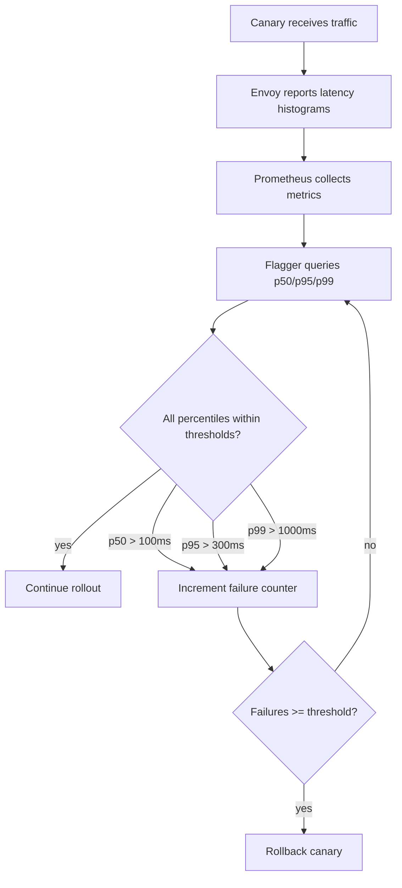

# How to Implement Automated Rollback Based on Latency with Flagger

Author: [nawazdhandala](https://github.com/nawazdhandala)

Tags: Flagger, Canary, Kubernetes, Rollback, Latency, Progressive Delivery

Description: Learn how to configure Flagger to automatically roll back canary deployments when response latency exceeds acceptable thresholds.

---

## Introduction

Latency regressions can be just as harmful as error rate increases. A new version that is functionally correct but responds slowly can degrade user experience, cause timeouts in upstream services, and trigger cascading failures. Flagger can monitor response latency during canary analysis and automatically roll back when latency exceeds defined thresholds.

This guide covers how to configure latency-based rollback using Flagger's built-in metrics, custom percentile-based latency metrics, and strategies for setting appropriate latency thresholds.

## Prerequisites

- A Kubernetes cluster (v1.25 or later)
- Flagger installed (v1.37 or later)
- Istio or another supported service mesh
- Prometheus installed and collecting latency metrics
- kubectl configured to access your cluster

## Step 1: Use the Built-in Request Duration Metric

Flagger provides a built-in `request-duration` metric that measures the 99th percentile response time in milliseconds. Configure it in your Canary resource:

```yaml
apiVersion: flagger.app/v1beta1
kind: Canary
metadata:
  name: my-app
  namespace: default
spec:
  targetRef:
    apiVersion: apps/v1
    kind: Deployment
    name: my-app
  service:
    port: 8080
    targetPort: http
  analysis:
    interval: 30s
    threshold: 3
    maxWeight: 50
    stepWeight: 10
    metrics:
      - name: request-success-rate
        thresholdRange:
          min: 99
        interval: 1m
      - name: request-duration
        thresholdRange:
          max: 500
        interval: 1m
```

The `request-duration` metric has `thresholdRange.max: 500`, meaning the p99 latency must stay below 500 milliseconds. If it exceeds this value for `threshold` consecutive checks, Flagger rolls back.

## Step 2: Create Custom Latency Metrics for Different Percentiles

The built-in metric uses p99 latency. You may want to monitor different percentiles. Create MetricTemplates for p50, p95, and p99:

```yaml
apiVersion: flagger.app/v1beta1
kind: MetricTemplate
metadata:
  name: latency-p50
  namespace: default
spec:
  provider:
    type: prometheus
    address: http://prometheus.istio-system:9090
  query: |
    histogram_quantile(0.50,
      sum(rate(istio_request_duration_milliseconds_bucket{
        reporter="destination",
        destination_workload_namespace="{{ namespace }}",
        destination_workload="{{ target }}"
      }[{{ interval }}])) by (le)
    )
---
apiVersion: flagger.app/v1beta1
kind: MetricTemplate
metadata:
  name: latency-p95
  namespace: default
spec:
  provider:
    type: prometheus
    address: http://prometheus.istio-system:9090
  query: |
    histogram_quantile(0.95,
      sum(rate(istio_request_duration_milliseconds_bucket{
        reporter="destination",
        destination_workload_namespace="{{ namespace }}",
        destination_workload="{{ target }}"
      }[{{ interval }}])) by (le)
    )
---
apiVersion: flagger.app/v1beta1
kind: MetricTemplate
metadata:
  name: latency-p99
  namespace: default
spec:
  provider:
    type: prometheus
    address: http://prometheus.istio-system:9090
  query: |
    histogram_quantile(0.99,
      sum(rate(istio_request_duration_milliseconds_bucket{
        reporter="destination",
        destination_workload_namespace="{{ namespace }}",
        destination_workload="{{ target }}"
      }[{{ interval }}])) by (le)
    )
```

## Step 3: Configure Multi-Percentile Latency Analysis

Use multiple latency metrics in your Canary to catch both median latency regressions and tail latency spikes:

```yaml
apiVersion: flagger.app/v1beta1
kind: Canary
metadata:
  name: my-app
  namespace: default
spec:
  targetRef:
    apiVersion: apps/v1
    kind: Deployment
    name: my-app
  service:
    port: 8080
  analysis:
    interval: 30s
    threshold: 3
    maxWeight: 50
    stepWeight: 10
    metrics:
      - name: request-success-rate
        thresholdRange:
          min: 99
        interval: 1m
      - name: latency-p50
        templateRef:
          name: latency-p50
          namespace: default
        thresholdRange:
          max: 100
        interval: 1m
      - name: latency-p95
        templateRef:
          name: latency-p95
          namespace: default
        thresholdRange:
          max: 300
        interval: 1m
      - name: latency-p99
        templateRef:
          name: latency-p99
          namespace: default
        thresholdRange:
          max: 1000
        interval: 1m
```

This configuration enforces:
- Median (p50) latency under 100ms
- p95 latency under 300ms
- p99 latency under 1000ms (1 second)

If any of these thresholds are breached, the failure counter increments.

## Step 4: Endpoint-Specific Latency Monitoring

Different endpoints may have different acceptable latency ranges. Create endpoint-specific metrics:

```yaml
apiVersion: flagger.app/v1beta1
kind: MetricTemplate
metadata:
  name: api-latency-p99
  namespace: default
spec:
  provider:
    type: prometheus
    address: http://prometheus.istio-system:9090
  query: |
    histogram_quantile(0.99,
      sum(rate(istio_request_duration_milliseconds_bucket{
        reporter="destination",
        destination_workload_namespace="{{ namespace }}",
        destination_workload="{{ target }}",
        request_url_path=~"/api/.*"
      }[{{ interval }}])) by (le)
    )
```

## Step 5: Compare Canary Latency Against Primary

Instead of using absolute thresholds, compare the canary's latency to the primary's latency. This approach is useful when baseline latency varies due to load patterns:

```yaml
apiVersion: flagger.app/v1beta1
kind: MetricTemplate
metadata:
  name: latency-comparison
  namespace: default
spec:
  provider:
    type: prometheus
    address: http://prometheus.istio-system:9090
  query: |
    (
      histogram_quantile(0.99,
        sum(rate(istio_request_duration_milliseconds_bucket{
          reporter="destination",
          destination_workload_namespace="{{ namespace }}",
          destination_workload="{{ target }}-canary"
        }[{{ interval }}])) by (le)
      )
      /
      histogram_quantile(0.99,
        sum(rate(istio_request_duration_milliseconds_bucket{
          reporter="destination",
          destination_workload_namespace="{{ namespace }}",
          destination_workload="{{ target }}-primary"
        }[{{ interval }}])) by (le)
      )
    )
```

Use this in your Canary with a threshold that limits the latency ratio:

```yaml
      - name: latency-comparison
        templateRef:
          name: latency-comparison
          namespace: default
        thresholdRange:
          max: 1.5
        interval: 1m
```

This rolls back if the canary's p99 latency is more than 1.5x the primary's p99 latency.

## Latency-Based Rollback Decision Flow



## Setting Appropriate Latency Thresholds

Guidelines for choosing latency thresholds:

1. **Establish a baseline**: Monitor your current production latency for at least a week to understand normal patterns.
2. **Account for variance**: Set thresholds above typical peak latency to avoid false rollbacks.
3. **Consider SLOs**: Align thresholds with your service level objectives.
4. **Use relative comparisons**: When baseline latency is unpredictable, compare canary to primary rather than using absolute values.

## Conclusion

Latency-based rollback in Flagger protects your services from performance regressions during canary deployments. Use the built-in `request-duration` metric for quick setup, or create custom MetricTemplates for percentile-specific and endpoint-specific latency monitoring. Combining multiple percentile thresholds catches both widespread slowdowns (p50) and tail latency issues (p99). For environments with variable baselines, use comparative metrics that measure the canary's latency relative to the primary instead of absolute thresholds.
