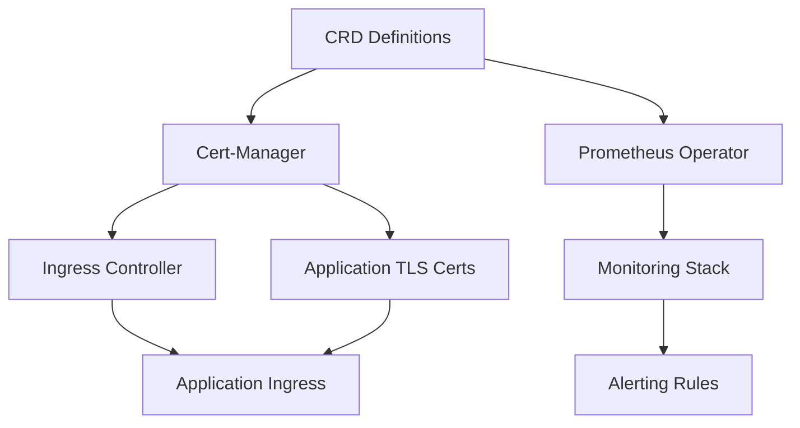
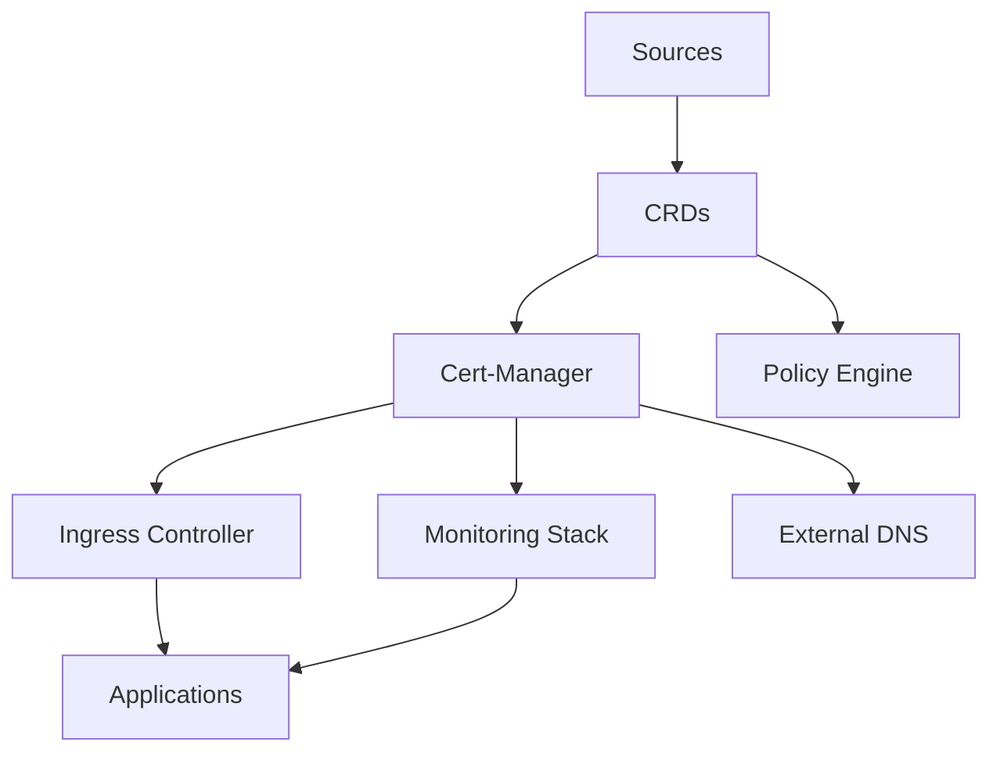

# How to Manage Cluster Addons Lifecycle with Flux Dependency Ordering

Author: [nawazdhandala](https://github.com/nawazdhandala)

Tags: Flux, Kubernetes, GitOps, Multi-Cluster, Dependency Management, Cluster Addons, Kustomize

Description: Learn how to use Flux dependency ordering to manage the lifecycle and installation sequence of cluster addons across multiple Kubernetes clusters.

---

Cluster addons such as CNI plugins, storage drivers, cert-manager, and ingress controllers often have strict installation ordering requirements. Deploying them out of sequence can cause failures, crashloops, or broken dependencies. Flux provides a dependency ordering mechanism through its Kustomization resource that lets you define explicit relationships between components. This guide shows you how to set up and manage cluster addon lifecycles using Flux dependency ordering.

## Why Dependency Ordering Matters

Many cluster addons rely on Custom Resource Definitions (CRDs), certificates, or other infrastructure components to be present before they can function. For example, you cannot deploy a Certificate resource before cert-manager is installed, and you cannot configure an Ingress resource before the ingress controller is running.



## Setting Up the Addon Directory Structure

Organize your addons into separate directories so each can be managed as an independent Flux Kustomization with explicit dependencies.

```
repo/
├── infrastructure/
│   ├── sources/
│   │   ├── helm-repos.yaml
│   │   └── kustomization.yaml
│   ├── crds/
│   │   ├── cert-manager-crds.yaml
│   │   ├── prometheus-crds.yaml
│   │   └── kustomization.yaml
│   ├── cert-manager/
│   │   ├── release.yaml
│   │   ├── namespace.yaml
│   │   └── kustomization.yaml
│   ├── ingress-nginx/
│   │   ├── release.yaml
│   │   ├── namespace.yaml
│   │   └── kustomization.yaml
│   ├── monitoring/
│   │   ├── release.yaml
│   │   ├── namespace.yaml
│   │   └── kustomization.yaml
│   └── policy-engine/
│       ├── release.yaml
│       ├── namespace.yaml
│       └── kustomization.yaml
└── clusters/
    ├── staging/
    │   └── infrastructure.yaml
    └── production/
        └── infrastructure.yaml
```

## Defining Flux Kustomizations with Dependencies

Each addon gets its own Flux Kustomization. The `dependsOn` field establishes the ordering.

### Step 1: Helm Repository Sources

Define the Helm repositories first since all HelmReleases depend on them.

```yaml
# infrastructure/sources/helm-repos.yaml
apiVersion: source.toolkit.fluxcd.io/v1
kind: HelmRepository
metadata:
  name: jetstack
  namespace: flux-system
spec:
  interval: 24h
  url: https://charts.jetstack.io
---
apiVersion: source.toolkit.fluxcd.io/v1
kind: HelmRepository
metadata:
  name: ingress-nginx
  namespace: flux-system
spec:
  interval: 24h
  url: https://kubernetes.github.io/ingress-nginx
---
apiVersion: source.toolkit.fluxcd.io/v1
kind: HelmRepository
metadata:
  name: prometheus-community
  namespace: flux-system
spec:
  interval: 24h
  url: https://prometheus-community.github.io/helm-charts
```

### Step 2: CRDs Kustomization

```yaml
apiVersion: kustomize.toolkit.fluxcd.io/v1
kind: Kustomization
metadata:
  name: crds
  namespace: flux-system
spec:
  interval: 10m
  path: ./infrastructure/crds
  prune: false
  sourceRef:
    kind: GitRepository
    name: flux-system
  wait: true
  timeout: 5m
```

Setting `wait: true` ensures Flux waits until all CRD resources are fully established before marking this Kustomization as ready. The `prune: false` setting prevents accidental CRD deletion.

### Step 3: Cert-Manager Depends on CRDs

```yaml
apiVersion: kustomize.toolkit.fluxcd.io/v1
kind: Kustomization
metadata:
  name: cert-manager
  namespace: flux-system
spec:
  interval: 10m
  path: ./infrastructure/cert-manager
  prune: true
  sourceRef:
    kind: GitRepository
    name: flux-system
  dependsOn:
    - name: crds
  wait: true
  timeout: 5m
  healthChecks:
    - apiVersion: apps/v1
      kind: Deployment
      name: cert-manager
      namespace: cert-manager
    - apiVersion: apps/v1
      kind: Deployment
      name: cert-manager-webhook
      namespace: cert-manager
```

### Step 4: Ingress Controller Depends on Cert-Manager

```yaml
apiVersion: kustomize.toolkit.fluxcd.io/v1
kind: Kustomization
metadata:
  name: ingress-nginx
  namespace: flux-system
spec:
  interval: 10m
  path: ./infrastructure/ingress-nginx
  prune: true
  sourceRef:
    kind: GitRepository
    name: flux-system
  dependsOn:
    - name: cert-manager
  wait: true
  timeout: 5m
```

### Step 5: Monitoring Depends on CRDs

```yaml
apiVersion: kustomize.toolkit.fluxcd.io/v1
kind: Kustomization
metadata:
  name: monitoring
  namespace: flux-system
spec:
  interval: 10m
  path: ./infrastructure/monitoring
  prune: true
  sourceRef:
    kind: GitRepository
    name: flux-system
  dependsOn:
    - name: crds
    - name: cert-manager
  wait: true
  timeout: 10m
```

## Complete Dependency Chain Configuration

Here is a single file that defines the full dependency chain for a cluster:

```yaml
# clusters/production/infrastructure.yaml
apiVersion: kustomize.toolkit.fluxcd.io/v1
kind: Kustomization
metadata:
  name: sources
  namespace: flux-system
spec:
  interval: 10m
  path: ./infrastructure/sources
  prune: true
  sourceRef:
    kind: GitRepository
    name: flux-system
  wait: true
---
apiVersion: kustomize.toolkit.fluxcd.io/v1
kind: Kustomization
metadata:
  name: crds
  namespace: flux-system
spec:
  interval: 10m
  path: ./infrastructure/crds
  prune: false
  sourceRef:
    kind: GitRepository
    name: flux-system
  dependsOn:
    - name: sources
  wait: true
  timeout: 5m
---
apiVersion: kustomize.toolkit.fluxcd.io/v1
kind: Kustomization
metadata:
  name: cert-manager
  namespace: flux-system
spec:
  interval: 10m
  path: ./infrastructure/cert-manager
  prune: true
  sourceRef:
    kind: GitRepository
    name: flux-system
  dependsOn:
    - name: crds
  wait: true
  timeout: 5m
---
apiVersion: kustomize.toolkit.fluxcd.io/v1
kind: Kustomization
metadata:
  name: ingress-nginx
  namespace: flux-system
spec:
  interval: 10m
  path: ./infrastructure/ingress-nginx
  prune: true
  sourceRef:
    kind: GitRepository
    name: flux-system
  dependsOn:
    - name: cert-manager
  wait: true
  timeout: 5m
---
apiVersion: kustomize.toolkit.fluxcd.io/v1
kind: Kustomization
metadata:
  name: monitoring
  namespace: flux-system
spec:
  interval: 10m
  path: ./infrastructure/monitoring
  prune: true
  sourceRef:
    kind: GitRepository
    name: flux-system
  dependsOn:
    - name: crds
    - name: cert-manager
  wait: true
  timeout: 10m
---
apiVersion: kustomize.toolkit.fluxcd.io/v1
kind: Kustomization
metadata:
  name: policy-engine
  namespace: flux-system
spec:
  interval: 10m
  path: ./infrastructure/policy-engine
  prune: true
  sourceRef:
    kind: GitRepository
    name: flux-system
  dependsOn:
    - name: crds
  wait: true
  timeout: 5m
```

## Health Checks and Readiness

The `wait: true` flag tells Flux to check that all resources in a Kustomization are ready before marking it as successful. You can also define custom health checks for more granular control:

```yaml
spec:
  healthChecks:
    - apiVersion: apps/v1
      kind: Deployment
      name: cert-manager
      namespace: cert-manager
    - apiVersion: apps/v1
      kind: Deployment
      name: cert-manager-cainjector
      namespace: cert-manager
    - apiVersion: apps/v1
      kind: Deployment
      name: cert-manager-webhook
      namespace: cert-manager
```

## Handling Timeouts and Failures

When a dependency times out, all downstream Kustomizations are blocked. Configure appropriate timeouts and set up alerts:

```yaml
spec:
  timeout: 10m
  retryInterval: 2m
```

Monitor the dependency chain status:

```bash
# View all Kustomizations and their readiness
flux get kustomizations

# Check for blocked dependencies
kubectl get kustomization -n flux-system -o jsonpath='{range .items[*]}{.metadata.name}{"\t"}{.status.conditions[0].reason}{"\t"}{.status.conditions[0].message}{"\n"}{end}'

# Force reconciliation of a specific addon
flux reconcile kustomization cert-manager -n flux-system --with-source

# View dependency chain events
kubectl events -n flux-system --for kustomization/ingress-nginx
```

## Handling CRD Updates

When updating CRDs, the ordering ensures safety. However, you should be cautious with CRD version upgrades:

```yaml
apiVersion: kustomize.toolkit.fluxcd.io/v1
kind: Kustomization
metadata:
  name: crds
  namespace: flux-system
spec:
  interval: 10m
  path: ./infrastructure/crds
  prune: false          # Never prune CRDs automatically
  wait: true
  force: false          # Do not force-apply CRD changes
  sourceRef:
    kind: GitRepository
    name: flux-system
```

## Parallel vs Sequential Installation

Not all addons need to be sequential. Components without dependencies on each other can be installed in parallel by sharing the same `dependsOn` target:



In this layout, cert-manager and the policy engine install in parallel since they both only depend on CRDs. The ingress controller, monitoring stack, and external DNS then install in parallel once cert-manager is ready.

## Debugging Dependency Issues

When addon deployments get stuck, use these commands to diagnose the problem:

```bash
# Check which Kustomization is blocking
flux get kustomizations --status-selector ready=false

# Get detailed status of a specific Kustomization
flux get kustomization cert-manager -n flux-system -o yaml

# Check events for a stuck Kustomization
kubectl describe kustomization cert-manager -n flux-system

# View the kustomize-controller logs for errors
kubectl logs -n flux-system deploy/kustomize-controller --since=10m | grep -i error
```

## Conclusion

Flux dependency ordering gives you fine-grained control over the installation sequence of cluster addons. By structuring your infrastructure into independent Kustomizations with explicit `dependsOn` relationships, you ensure that components install in the correct order, health checks pass before downstream components are deployed, and failures are contained rather than cascading. This approach scales cleanly across multiple clusters, where each cluster can define its own dependency chain while sharing the same base addon configurations.
