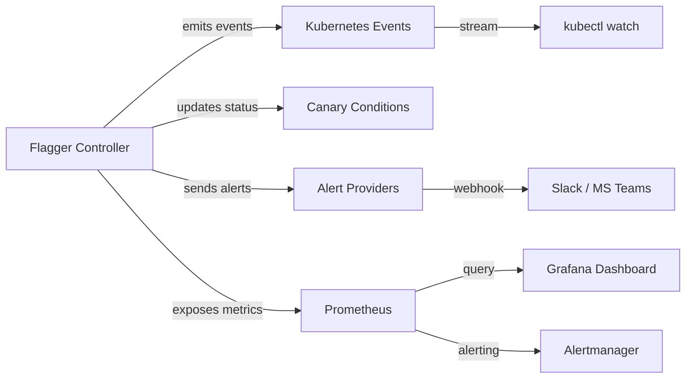

# How to Monitor Flagger Canary Events and Conditions

Author: [nawazdhandala](https://github.com/nawazdhandala)

Tags: Flagger, Canary, Event, Conditions, Monitoring, Kubernetes

Description: Learn how to monitor Flagger canary events and conditions to track rollout progress, detect failures, and integrate with alerting systems.

---

## Introduction

Flagger emits Kubernetes events and updates conditions on the Canary resource throughout the progressive delivery lifecycle. These events provide a detailed audit trail of every action Flagger takes, from initializing the canary to promoting or rolling back. Conditions give you a snapshot of the current state. Together, they form the foundation for monitoring and alerting on canary deployments.

This guide covers how to access, filter, and act on Flagger events and conditions using kubectl, webhooks, and alerting integrations.

## Prerequisites

- A Kubernetes cluster with Flagger installed
- At least one Canary resource deployed
- `kubectl` configured to access your cluster
- (Optional) A Prometheus and Alertmanager setup for alerting

## Understanding Flagger Events

Flagger generates standard Kubernetes events on the Canary resource. Each event includes a reason, a message, and a type (Normal or Warning).

Flagger records these rollout actions as event messages. The Kubernetes event reason is typically `Synced`, while the type and message identify what happened:

| Reason | Type | Example Message |
|--------|------|-----------------|
| `Synced` | Normal | `New revision detected! Scaling up my-app.default` |
| `Synced` | Normal | `Advance my-app.default canary weight 10` |
| `Synced` | Normal | `Copying my-app.default template spec to my-app-primary.default` |
| `Synced` | Normal | `Promotion completed! Scaling down my-app.default` |
| `Synced` | Warning | `Rolling back my-app.default failed checks threshold reached 5` |
| `Synced` | Warning | `Canary failed! Scaling down my-app.default` |

## Viewing Events with kubectl

### List Events for a Specific Canary

```bash
# Get events for a specific canary resource

kubectl describe canary my-app -n default | tail -30

# Use kubectl events (Kubernetes 1.26+) for structured output
kubectl events -n default --for=canary/my-app

# Get events sorted by timestamp
kubectl get events -n default \
  --field-selector involvedObject.name=my-app,involvedObject.kind=Canary \
  --sort-by='.lastTimestamp'
```

### Filter Events by Type

```bash
# Show only warning events (failures and rollbacks)
kubectl get events -n default \
  --field-selector involvedObject.name=my-app,involvedObject.kind=Canary,type=Warning

# Show only normal events (successful operations)
kubectl get events -n default \
  --field-selector involvedObject.name=my-app,involvedObject.kind=Canary,type=Normal
```

### Watch Events in Real Time

```bash
# Stream events as they happen
kubectl get events -n default \
  --field-selector involvedObject.kind=Canary \
  --watch
```

## Understanding Canary Conditions

Flagger maintains conditions on the Canary status that indicate the overall state. The primary condition is `Promoted`, and its reason follows the canary phase (`Initializing`, `Initialized`, `Waiting`, `Progressing`, `WaitingPromotion`, `Promoting`, `Finalising`, `Succeeded`, or `Failed`):

```bash
# View conditions for a canary
kubectl get canary my-app -n default \
  -o jsonpath='{range .status.conditions[*]}Type: {.type}{"\n"}Status: {.status}{"\n"}Reason: {.reason}{"\n"}Message: {.message}{"\n\n"}{end}'
```

Example condition states during different phases:

```yaml
# During initialization
conditions:
  - type: Promoted
    status: "Unknown"
    reason: Initializing
    message: "New Deployment detected, starting initialization."

# During analysis
conditions:
  - type: Promoted
    status: "Unknown"
    reason: Progressing
    message: "New revision detected, progressing canary analysis."

# After successful promotion
conditions:
  - type: Promoted
    status: "True"
    reason: Succeeded
    message: "Canary analysis completed successfully, promotion finished."

# After failed analysis
conditions:
  - type: Promoted
    status: "False"
    reason: Failed
    message: "Canary analysis failed, Deployment scaled to zero."
```

## Setting Up Alert Providers

Flagger can send alerts to external systems through alert providers. Configure the alert provider in the Canary spec:

```yaml
# canary-with-alerts.yaml
apiVersion: flagger.app/v1beta1
kind: Canary
metadata:
  name: my-app
  namespace: default
spec:
  targetRef:
    apiVersion: apps/v1
    kind: Deployment
    name: my-app
  service:
    port: 8080
  analysis:
    interval: 1m
    threshold: 5
    maxWeight: 50
    stepWeight: 10
    # Alert configuration
    alerts:
      - name: "slack-notification"
        severity: info
        providerRef:
          name: slack-alert
          namespace: flagger-system
      - name: "slack-error-notification"
        severity: error
        providerRef:
          name: slack-alert
          namespace: flagger-system
    metrics:
      - name: request-success-rate
        thresholdRange:
          min: 99
        interval: 1m
```

### Create Alert Providers

```yaml
# slack-alert-provider.yaml
apiVersion: flagger.app/v1beta1
kind: AlertProvider
metadata:
  name: slack-alert
  namespace: flagger-system
spec:
  type: slack
  channel: deployments
  # Reference a secret containing the Slack webhook URL
  secretRef:
    name: slack-webhook
---
apiVersion: v1
kind: Secret
metadata:
  name: slack-webhook
  namespace: flagger-system
stringData:
  address: "https://hooks.slack.com/services/YOUR/SLACK/WEBHOOK"
```

```bash
kubectl apply -f slack-alert-provider.yaml
```

## Monitoring Events with Prometheus

Flagger exposes Prometheus metrics for canary status, weights, duration, and analysis results. You can query these to build dashboards and alerts:

```promql
# Last known status for a canary: 0 running, 1 successful, 2 failed
flagger_canary_status{name="my-app", namespace="default"}

# Failed canaries
flagger_canary_status{name="my-app", namespace="default"} == 2

# Current canary weight
flagger_canary_weight{workload="my-app", namespace="default"}

# Canary analysis duration histogram
flagger_canary_duration_seconds_sum{name="my-app", namespace="default"}
flagger_canary_duration_seconds_count{name="my-app", namespace="default"}
```

### Alertmanager Rule for Failed Canaries

```yaml
# prometheus-rules.yaml
apiVersion: monitoring.coreos.com/v1
kind: PrometheusRule
metadata:
  name: flagger-alerts
  namespace: monitoring
spec:
  groups:
    - name: flagger
      rules:
        - alert: CanaryRollbackDetected
          expr: |
            flagger_canary_status == 2
          for: 1m
          labels:
            severity: warning
          annotations:
            summary: "Canary rollback detected for {{ $labels.name }}"
            description: >
              Canary {{ $labels.name }} in namespace {{ $labels.namespace }}
              has been rolled back due to failed analysis.
```

## Building an Event-Driven Monitoring Pipeline


```mermaid
graph LR
    A[Flagger Controller] -->|emits events| B[Kubernetes Events]
    A -->|updates status| C[Canary Conditions]
    A -->|sends alerts| D[Alert Providers]
    A -->|exposes metrics| E[Prometheus]
    B -->|stream| F[kubectl watch]
    D -->|webhook| G[Slack / MS Teams]
    E -->|query| H[Grafana Dashboard]
    E -->|alerting| I[Alertmanager]
```

## Automating Event Collection

Create a simple event collector that logs canary events to a file:

```bash
#!/bin/bash
# collect-canary-events.sh
# Collects Flagger canary events and appends to a log file

NAMESPACE=${1:-default}
LOG_FILE="/var/log/flagger-events.log"

kubectl get events -n "$NAMESPACE" \
  --field-selector involvedObject.kind=Canary \
  --sort-by='.lastTimestamp' \
  -o jsonpath='{range .items[*]}{.lastTimestamp} [{.type}] {.involvedObject.name}: {.reason} - {.message}{"\n"}{end}' \
  >> "$LOG_FILE"
```

## Conclusion

Flagger events and conditions provide comprehensive visibility into the progressive delivery process. By combining kubectl event queries, alert providers, and Prometheus metrics, you can build a robust monitoring pipeline that keeps your team informed about every canary deployment. Use alert providers for real-time notifications and Prometheus rules for automated incident detection to ensure no failed rollout goes unnoticed.
