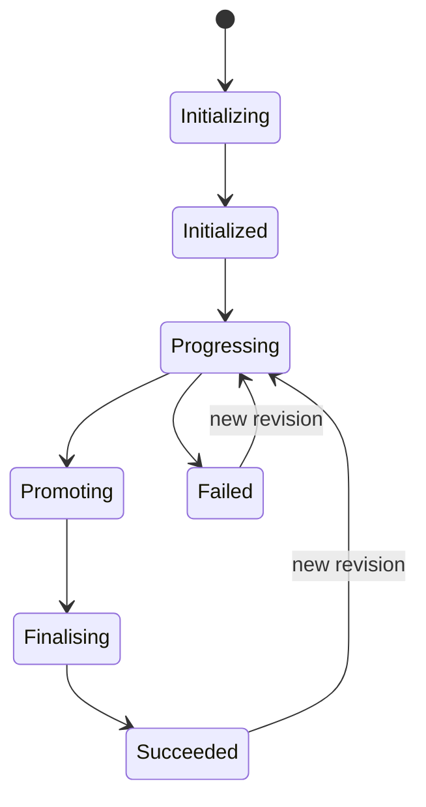

# How to Monitor Flagger Canary Status with kubectl

Author: [nawazdhandala](https://github.com/nawazdhandala)

Tags: flagger, canary, monitoring, kubectl, kubernetes

Description: Learn how to use kubectl commands to monitor Flagger canary deployment status, track rollout progress, and debug failed releases.

---

## Introduction

Flagger exposes detailed status information through the Canary custom resource. Using `kubectl`, you can monitor rollout progress, check traffic weights, view metric analysis results, and diagnose failed deployments. This guide covers the essential `kubectl` commands for monitoring Flagger canary deployments in real time.

## Prerequisites

- A Kubernetes cluster with Flagger installed
- At least one Canary resource deployed
- `kubectl` configured to access your cluster
- (Optional) `jq` installed for JSON parsing

## Understanding Canary Status Phases

Flagger canary resources cycle through several phases during their lifecycle:



- **Initializing**: Flagger is creating the primary and canary Deployments
- **Initialized**: Setup is complete, waiting for a new revision
- **Progressing**: A canary analysis is in progress with traffic shifting
- **Promoting**: Canary passed analysis, being promoted to primary
- **Finalising**: Promotion complete, cleaning up canary resources
- **Succeeded**: Rollout completed successfully
- **Failed**: Canary analysis failed, rolled back to primary

## Basic Status Commands

### List All Canaries

```bash
# List all canary resources across all namespaces
kubectl get canaries --all-namespaces

# List canaries in a specific namespace with additional columns
kubectl get canaries -n default -o wide
```

### Get Canary Status

```bash
# Get the current status of a specific canary
kubectl get canary my-app -n default

# Example output:
# NAME     STATUS      WEIGHT   LASTTRANSITIONTIME
# my-app   Progressing 30       2026-03-13T10:15:00Z
```

### Watch Canary Progress in Real Time

```bash
# Watch for status changes in real time
kubectl get canary my-app -n default -w

# Watch all canaries in a namespace
kubectl get canaries -n default -w
```

## Detailed Status Inspection

### View Full Canary Status

```bash
# Get the complete status section as YAML
kubectl get canary my-app -n default -o yaml | grep -A 50 "^status:"
```

### Extract Specific Status Fields with JSONPath

```bash
# Get the current phase
kubectl get canary my-app -n default \
  -o jsonpath='{.status.phase}'

# Get the current canary weight (traffic percentage)
kubectl get canary my-app -n default \
  -o jsonpath='{.status.canaryWeight}'

# Get the number of failed checks
kubectl get canary my-app -n default \
  -o jsonpath='{.status.failedChecks}'

# Get the number of iterations completed
kubectl get canary my-app -n default \
  -o jsonpath='{.status.iterations}'

# Get the last transition time
kubectl get canary my-app -n default \
  -o jsonpath='{.status.lastTransitionTime}'
```

### Get Conditions

Flagger sets conditions on the Canary resource to indicate the current state:

```bash
# View all conditions
kubectl get canary my-app -n default \
  -o jsonpath='{range .status.conditions[*]}{.type}{"\t"}{.status}{"\t"}{.message}{"\n"}{end}'

# Example output:
# Promoted  True  Canary analysis completed successfully, promotion finished.
```

## Monitoring Deployment Resources

### Check Primary and Canary Deployments

```bash
# View both primary and canary deployments
kubectl get deployments -n default | grep my-app

# Example output:
# my-app           0/0     0            0           1h
# my-app-primary   3/3     3            3           1h
# my-app-canary    1/1     1            1           5m

# Compare images between primary and canary
echo "Primary image:"
kubectl get deployment my-app-primary -n default \
  -o jsonpath='{.spec.template.spec.containers[0].image}'
echo ""
echo "Canary image:"
kubectl get deployment my-app-canary -n default \
  -o jsonpath='{.spec.template.spec.containers[0].image}'
```

### Check Pod Status

```bash
# List pods for primary and canary
kubectl get pods -n default -l app=my-app

# Check pod readiness for canary pods
kubectl get pods -n default -l "app=my-app,app.kubernetes.io/managed-by=flagger" \
  -o jsonpath='{range .items[*]}{.metadata.name}{"\t"}{.status.phase}{"\n"}{end}'
```

## Creating a Monitoring Script

Here is a script that provides a dashboard-like view of your canary status:

```bash
#!/bin/bash
# canary-monitor.sh - Monitor Flagger canary status
# Usage: ./canary-monitor.sh <canary-name> <namespace>

CANARY_NAME=${1:-my-app}
NAMESPACE=${2:-default}

while true; do
  clear
  echo "=== Flagger Canary Monitor: $CANARY_NAME ==="
  echo "Timestamp: $(date)"
  echo ""

  # Get canary status
  PHASE=$(kubectl get canary $CANARY_NAME -n $NAMESPACE \
    -o jsonpath='{.status.phase}' 2>/dev/null)
  WEIGHT=$(kubectl get canary $CANARY_NAME -n $NAMESPACE \
    -o jsonpath='{.status.canaryWeight}' 2>/dev/null)
  FAILED=$(kubectl get canary $CANARY_NAME -n $NAMESPACE \
    -o jsonpath='{.status.failedChecks}' 2>/dev/null)
  ITERATIONS=$(kubectl get canary $CANARY_NAME -n $NAMESPACE \
    -o jsonpath='{.status.iterations}' 2>/dev/null)

  echo "Phase:          $PHASE"
  echo "Canary Weight:  ${WEIGHT:-0}%"
  echo "Failed Checks:  ${FAILED:-0}"
  echo "Iterations:     ${ITERATIONS:-0}"
  echo ""

  # Get conditions
  echo "--- Conditions ---"
  kubectl get canary $CANARY_NAME -n $NAMESPACE \
    -o jsonpath='{range .status.conditions[*]}{.type}: {.message}{"\n"}{end}' 2>/dev/null
  echo ""

  # Get deployment status
  echo "--- Deployments ---"
  kubectl get deployments -n $NAMESPACE \
    -l "app=$CANARY_NAME" \
    --no-headers 2>/dev/null
  echo ""

  # Get recent events
  echo "--- Recent Events ---"
  kubectl events -n $NAMESPACE \
    --for="canary/$CANARY_NAME" \
    --types=Normal,Warning 2>/dev/null | tail -5

  sleep 10
done
```

## Using Custom Columns

Create a custom columns output for a clean overview:

```bash
# Custom columns for canary status
kubectl get canaries -n default \
  -o custom-columns=\
'NAME:.metadata.name,STATUS:.status.phase,WEIGHT:.status.canaryWeight,FAILED:.status.failedChecks,LAST_TRANSITION:.status.lastTransitionTime'
```

## Debugging Failed Canaries

When a canary deployment fails, use these commands to diagnose the issue:

```bash
# Check the canary condition message for failure reason
kubectl get canary my-app -n default \
  -o jsonpath='{.status.conditions[0].message}'

# Describe the canary for detailed events
kubectl describe canary my-app -n default

# Check Flagger controller logs for the specific canary
kubectl logs -n flagger-system deployment/flagger \
  --tail=100 | grep my-app

# Check canary pod logs for application errors
kubectl logs -n default -l app=my-app,deploy=canary --tail=50
```

## Conclusion

Monitoring Flagger canary deployments with `kubectl` gives you full visibility into the progressive delivery process. By combining status queries, event monitoring, and deployment inspection, you can track rollouts in real time and quickly diagnose failures. For production environments, consider integrating these commands into your monitoring pipeline or using the monitoring script as a starting point for a custom dashboard.
