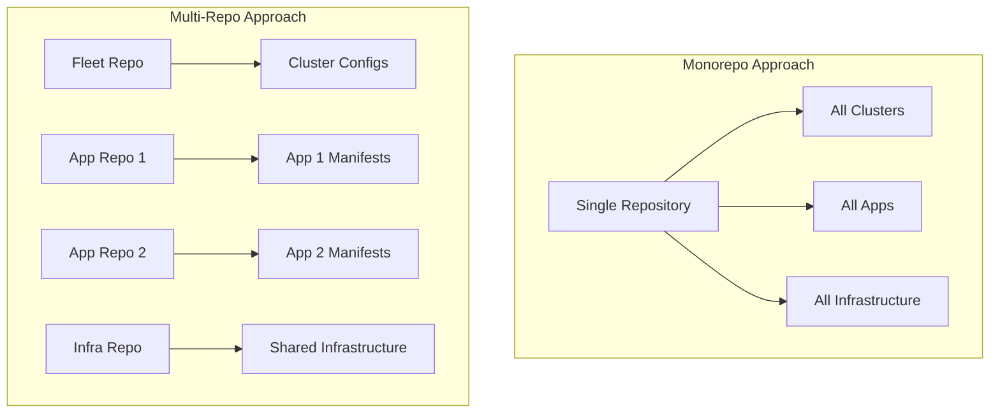
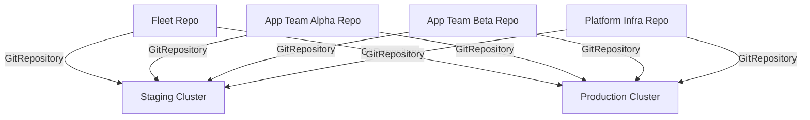

# How to Set Up Cross-Cluster GitOps Repository Structure

Author: [nawazdhandala](https://github.com/nawazdhandala)

Tags: Flux, Kubernetes, GitOps, Multi-Cluster, Repository Structure, Monorepo, Best Practices

Description: Learn how to design and organize a Git repository structure for managing multiple Kubernetes clusters with Flux, covering monorepo and multi-repo patterns.

---

The structure of your GitOps repository determines how maintainable, scalable, and auditable your multi-cluster setup will be. A well-designed repository makes it easy to share configurations across clusters, override settings per environment, and onboard new clusters. This guide covers proven repository structures for Flux multi-cluster setups, from simple monorepos to advanced multi-repo architectures.

## Choosing Between Monorepo and Multi-Repo

The two main approaches each have tradeoffs:



**Monorepo** works well when a single platform team manages everything and you want atomic commits across cluster and application changes. **Multi-repo** works better when different teams own different applications and you need separate access controls.

## The Recommended Monorepo Structure

This is the most common and well-tested structure for Flux multi-cluster setups:

```text
fleet-repo/
├── apps/
│   ├── base/
│   │   ├── frontend/
│   │   │   ├── deployment.yaml
│   │   │   ├── service.yaml
│   │   │   ├── hpa.yaml
│   │   │   └── kustomization.yaml
│   │   ├── backend/
│   │   │   ├── deployment.yaml
│   │   │   ├── service.yaml
│   │   │   └── kustomization.yaml
│   │   └── kustomization.yaml
│   ├── staging/
│   │   ├── kustomization.yaml
│   │   └── patches/
│   │       └── frontend-replicas.yaml
│   └── production/
│       ├── kustomization.yaml
│       └── patches/
│           ├── frontend-replicas.yaml
│           └── backend-resources.yaml
├── infrastructure/
│   ├── sources/
│   │   ├── helm-repos.yaml
│   │   ├── oci-repos.yaml
│   │   └── kustomization.yaml
│   ├── crds/
│   │   ├── cert-manager.yaml
│   │   ├── prometheus.yaml
│   │   └── kustomization.yaml
│   ├── controllers/
│   │   ├── cert-manager/
│   │   ├── ingress-nginx/
│   │   ├── kyverno/
│   │   └── kustomization.yaml
│   ├── configs/
│   │   ├── cluster-issuers/
│   │   ├── network-policies/
│   │   └── kustomization.yaml
│   └── monitoring/
│       ├── kube-prometheus-stack/
│       ├── loki/
│       └── kustomization.yaml
├── clusters/
│   ├── staging/
│   │   ├── flux-system/
│   │   │   ├── gotk-components.yaml
│   │   │   ├── gotk-sync.yaml
│   │   │   └── kustomization.yaml
│   │   ├── infrastructure.yaml
│   │   ├── apps.yaml
│   │   └── cluster-vars.yaml
│   ├── production-us-east/
│   │   ├── flux-system/
│   │   │   ├── gotk-components.yaml
│   │   │   ├── gotk-sync.yaml
│   │   │   └── kustomization.yaml
│   │   ├── infrastructure.yaml
│   │   ├── apps.yaml
│   │   └── cluster-vars.yaml
│   └── production-eu-west/
│       ├── flux-system/
│       ├── infrastructure.yaml
│       ├── apps.yaml
│       └── cluster-vars.yaml
└── tenants/
    ├── team-alpha/
    │   ├── namespace.yaml
    │   ├── rbac.yaml
    │   ├── network-policy.yaml
    │   └── kustomization.yaml
    └── team-beta/
        ├── namespace.yaml
        ├── rbac.yaml
        └── kustomization.yaml
```

## Understanding Each Directory's Purpose

### `clusters/` Directory

This is the entry point for each cluster. Flux bootstraps to the `clusters/<cluster-name>/flux-system/` directory. All other resources in the cluster directory are Flux Kustomizations that point to other parts of the repository.

```yaml
# clusters/staging/infrastructure.yaml
apiVersion: kustomize.toolkit.fluxcd.io/v1
kind: Kustomization
metadata:
  name: infrastructure-sources
  namespace: flux-system
spec:
  interval: 10m
  path: ./infrastructure/sources
  prune: true
  sourceRef:
    kind: GitRepository
    name: flux-system
  wait: true
---
apiVersion: kustomize.toolkit.fluxcd.io/v1
kind: Kustomization
metadata:
  name: infrastructure-controllers
  namespace: flux-system
spec:
  interval: 10m
  path: ./infrastructure/controllers
  prune: true
  sourceRef:
    kind: GitRepository
    name: flux-system
  dependsOn:
    - name: infrastructure-sources
  wait: true
  postBuild:
    substituteFrom:
      - kind: ConfigMap
        name: cluster-vars
```

### `infrastructure/` Directory

Contains everything that the platform team manages: Helm repositories, CRDs, controllers, and shared infrastructure. This is shared across all clusters.

### `apps/` Directory

Contains application manifests organized with Kustomize base and overlay pattern. Each environment has its own overlay directory.

```yaml
# apps/staging/kustomization.yaml
apiVersion: kustomize.config.k8s.io/v1beta1
kind: Kustomization
resources:
  - ../base
patchesStrategicMerge:
  - patches/frontend-replicas.yaml
```

```yaml
# apps/staging/patches/frontend-replicas.yaml
apiVersion: apps/v1
kind: Deployment
metadata:
  name: frontend
spec:
  replicas: 2
```

### `tenants/` Directory

Contains per-team or per-tenant configurations including namespaces, RBAC, resource quotas, and network policies.

## Setting Up the Flux Bootstrap

Bootstrap each cluster pointing to its directory:

```bash
# Bootstrap staging cluster
flux bootstrap github \
  --owner=my-org \
  --repository=fleet-repo \
  --branch=main \
  --path=clusters/staging \
  --context=staging

# Bootstrap production US East cluster
flux bootstrap github \
  --owner=my-org \
  --repository=fleet-repo \
  --branch=main \
  --path=clusters/production-us-east \
  --context=production-us-east

# Bootstrap production EU West cluster
flux bootstrap github \
  --owner=my-org \
  --repository=fleet-repo \
  --branch=main \
  --path=clusters/production-eu-west \
  --context=production-eu-west
```

## Multi-Repo Architecture

For organizations with multiple teams, a multi-repo approach provides better access control:



### Fleet Repository

The fleet repo contains only cluster configurations and GitRepository references:

```yaml
# fleet-repo/clusters/staging/sources.yaml
apiVersion: source.toolkit.fluxcd.io/v1
kind: GitRepository
metadata:
  name: team-alpha-apps
  namespace: flux-system
spec:
  interval: 5m
  url: https://github.com/my-org/team-alpha-apps
  ref:
    branch: main
---
apiVersion: source.toolkit.fluxcd.io/v1
kind: GitRepository
metadata:
  name: platform-infrastructure
  namespace: flux-system
spec:
  interval: 5m
  url: https://github.com/my-org/platform-infrastructure
  ref:
    branch: main
```

### Team Application Repository

Each team's repo contains their application manifests:

```yaml
# fleet-repo/clusters/staging/team-alpha.yaml
apiVersion: kustomize.toolkit.fluxcd.io/v1
kind: Kustomization
metadata:
  name: team-alpha-apps
  namespace: flux-system
spec:
  interval: 10m
  path: ./staging
  prune: true
  sourceRef:
    kind: GitRepository
    name: team-alpha-apps
  targetNamespace: team-alpha
  serviceAccountName: team-alpha-reconciler
  postBuild:
    substituteFrom:
      - kind: ConfigMap
        name: cluster-vars
```

## Branch Strategy

There are two common branch strategies for multi-cluster setups:

### Single Branch (Recommended)

Use a single `main` branch with path-based separation. Each cluster points to a different path in the same branch.

```text
main branch:
  clusters/staging/     -> staging cluster
  clusters/production/  -> production cluster
```

### Branch Per Environment

Use separate branches for each environment. Changes promote through branch merges.

```text
staging branch    -> staging cluster
production branch -> production cluster
```

The single-branch approach is recommended because it avoids merge conflicts and makes it easier to see the full state of all clusters at once.

## Adding a New Cluster to the Repository

When onboarding a new cluster, create its directory structure:

```bash
# Create the cluster directory
mkdir -p clusters/production-ap-southeast/flux-system

# Copy the infrastructure and apps Kustomizations from an existing cluster
cp clusters/production-us-east/infrastructure.yaml clusters/production-ap-southeast/
cp clusters/production-us-east/apps.yaml clusters/production-ap-southeast/

# Create cluster-specific variables
cat > clusters/production-ap-southeast/cluster-vars.yaml << 'EOF'
apiVersion: v1
kind: ConfigMap
metadata:
  name: cluster-vars
  namespace: flux-system
data:
  cluster_name: "production-ap-southeast"
  cluster_env: "production"
  cluster_region: "ap-southeast-1"
  storage_class: "gp3"
EOF

# Bootstrap Flux
flux bootstrap github \
  --owner=my-org \
  --repository=fleet-repo \
  --branch=main \
  --path=clusters/production-ap-southeast \
  --context=production-ap-southeast
```

## Repository Conventions

Follow these conventions to keep your repository manageable:

1. **Use Kustomize bases and overlays** for anything that varies between clusters.
2. **Keep cluster directories thin** -- they should contain only Flux Kustomizations pointing to shared paths, plus cluster-specific variable ConfigMaps.
3. **Version-pin Helm charts** in HelmRelease specs to prevent unexpected upgrades.
4. **Use namespaces for isolation** between teams and components.
5. **Document your structure** in a top-level README so new team members understand the layout.

## Validating the Repository Structure

```bash
# Validate all Kustomize overlays build successfully
for dir in apps/staging apps/production; do
  echo "Validating $dir..."
  kustomize build $dir > /dev/null && echo "OK" || echo "FAILED"
done

# Check Flux resources are valid
flux check --pre

# Dry-run a specific cluster's configuration
flux diff kustomization infrastructure --path ./clusters/staging
```

## Conclusion

A well-structured GitOps repository is the foundation of a successful multi-cluster Flux deployment. The monorepo approach with path-based cluster separation is the simplest starting point, providing atomic commits and a single view of your entire fleet. As your organization scales and team boundaries become more defined, you can evolve to a multi-repo architecture where each team manages their own application repository while the platform team controls the fleet repo and infrastructure. Whichever approach you choose, keep cluster directories thin, share as much configuration as possible through bases, and use variable substitution for cluster-specific values.
