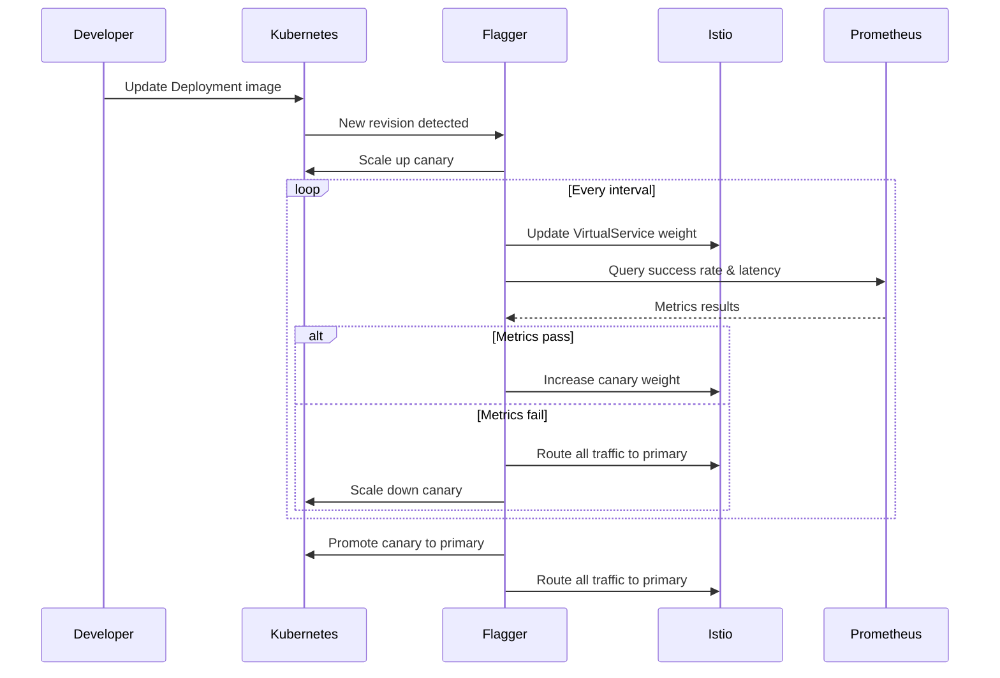

# How to Set Up Flagger with Istio on EKS Step by Step

Author: [nawazdhandala](https://github.com/nawazdhandala)

Tags: Flagger, Istio, EKS, AWS, Canary, Kubernetes, Service-Mesh

Description: A step-by-step guide to setting up Flagger with Istio on Amazon EKS for automated canary deployments.

---

## Introduction

Amazon EKS provides a managed Kubernetes control plane that pairs well with Istio for service mesh capabilities and Flagger for progressive delivery. This guide walks you through setting up a complete canary deployment pipeline on EKS, from cluster creation to your first automated rollout.

## Prerequisites

- AWS CLI configured with appropriate permissions
- `eksctl` CLI installed
- `kubectl` installed
- `helm` v3 installed
- `istioctl` installed

## Step 1: Create an EKS Cluster

Create a new EKS cluster with `eksctl`:

```bash
# Create an EKS cluster with two managed node groups
eksctl create cluster \
  --name flagger-demo \
  --region us-west-2 \
  --version 1.29 \
  --nodegroup-name workers \
  --node-type m5.large \
  --nodes 3 \
  --nodes-min 2 \
  --nodes-max 5 \
  --managed

# Verify cluster access
kubectl get nodes
```

## Step 2: Install Istio

Install Istio using `istioctl` with the default profile:

```bash
# Install Istio with the default profile
istioctl install --set profile=default -y

# Verify Istio installation
kubectl get pods -n istio-system

# Enable automatic sidecar injection for the default namespace
kubectl label namespace default istio-injection=enabled
```

Verify all Istio components are running:

```bash
istioctl verify-install
```

## Step 3: Install Flagger

Install Flagger for Istio using Helm:

```bash
# Add the Flagger Helm repository
helm repo add flagger https://flagger.app
helm repo update

# Install Flagger in the istio-system namespace
helm upgrade -i flagger flagger/flagger \
  --namespace istio-system \
  --set meshProvider=istio \
  --set metricsServer=http://prometheus:9090

# Install Flagger's Grafana dashboard (optional)
helm upgrade -i flagger-grafana flagger/grafana \
  --namespace istio-system \
  --set url=http://prometheus.istio-system:9090
```

Verify Flagger is running:

```bash
kubectl get pods -n istio-system -l app.kubernetes.io/name=flagger
```

## Step 4: Install Prometheus for Istio Metrics

Flagger needs Prometheus to query Istio telemetry metrics:

```bash
# Install Prometheus using Istio's addon
kubectl apply -f https://raw.githubusercontent.com/istio/istio/release-1.22/samples/addons/prometheus.yaml

# Verify Prometheus is running
kubectl get pods -n istio-system -l app=prometheus
```

## Step 5: Deploy a Sample Application

Create the application Deployment and Service:

```yaml
# app.yaml
apiVersion: apps/v1
kind: Deployment
metadata:
  name: podinfo
  namespace: default
  labels:
    app: podinfo
spec:
  replicas: 2
  selector:
    matchLabels:
      app: podinfo
  template:
    metadata:
      labels:
        app: podinfo
      annotations:
        # Istio sidecar injection is enabled via namespace label
        prometheus.io/scrape: "true"
        prometheus.io/port: "9797"
    spec:
      containers:
        - name: podinfo
          image: ghcr.io/stefanprodan/podinfo:6.5.0
          ports:
            - name: http
              containerPort: 9898
            - name: grpc
              containerPort: 9999
          command:
            - ./podinfo
            - --port=9898
            - --grpc-port=9999
            - --level=info
          resources:
            requests:
              cpu: 100m
              memory: 64Mi
            limits:
              cpu: 200m
              memory: 128Mi
```

Apply the Deployment:

```bash
kubectl apply -f app.yaml
```

## Step 6: Create the Canary Resource

Define the Canary resource that configures Flagger for Istio:

```yaml
# canary.yaml
apiVersion: flagger.app/v1beta1
kind: Canary
metadata:
  name: podinfo
  namespace: default
spec:
  targetRef:
    apiVersion: apps/v1
    kind: Deployment
    name: podinfo
  # Istio virtual service configuration
  service:
    port: 9898
    targetPort: 9898
    # Istio gateway references (optional, for external traffic)
    gateways:
      - public-gateway.istio-system.svc.cluster.local
    hosts:
      - podinfo.example.com
    # Istio traffic policy
    trafficPolicy:
      tls:
        mode: ISTIO_MUTUAL
    # Istio retry policy
    retries:
      attempts: 3
      perTryTimeout: 1s
      retryOn: "gateway-error,connect-failure,refused-stream"
  analysis:
    # Schedule of the canary analysis
    interval: 1m
    # Max number of failed metric checks before rollback
    threshold: 5
    # Max traffic percentage routed to canary
    maxWeight: 50
    # Canary increment step
    stepWeight: 10
    # Istio Prometheus metrics
    metrics:
      - name: request-success-rate
        # Minimum request success rate (non-5xx responses)
        thresholdRange:
          min: 99
        interval: 1m
      - name: request-duration
        # Maximum request duration P99
        thresholdRange:
          max: 500
        interval: 1m
```

Apply the Canary:

```bash
kubectl apply -f canary.yaml

# Wait for initialization
kubectl get canary podinfo -n default -w
```

## Step 7: Trigger a Canary Release

Update the container image to trigger the canary analysis:

```bash
kubectl set image deployment/podinfo podinfo=ghcr.io/stefanprodan/podinfo:6.5.1 -n default
```

Monitor the rollout:

```bash
# Watch canary progress
kubectl get canary podinfo -n default -w

# Check Flagger logs
kubectl logs -n istio-system deployment/flagger -f | grep podinfo

# Verify Istio VirtualService traffic weights
kubectl get virtualservice podinfo -n default -o yaml
```



## Step 8: Verify the Promotion

After the canary analysis completes successfully:

```bash
# Check the canary status
kubectl get canary podinfo -n default

# Verify the primary deployment has the new image
kubectl get deployment podinfo-primary -n default \
  -o jsonpath='{.spec.template.spec.containers[0].image}'
```

## Cleanup

To remove the resources:

```bash
kubectl delete canary podinfo -n default
kubectl delete deployment podinfo -n default
helm uninstall flagger -n istio-system
istioctl uninstall --purge -y
eksctl delete cluster --name flagger-demo --region us-west-2
```

## Conclusion

You now have a complete Flagger and Istio setup on Amazon EKS for automated canary deployments. Flagger leverages Istio's VirtualService for traffic splitting and Prometheus for metric analysis, giving you safe, automated progressive delivery. From here, you can add custom metrics, webhooks, and alert providers to build a production-grade deployment pipeline.
