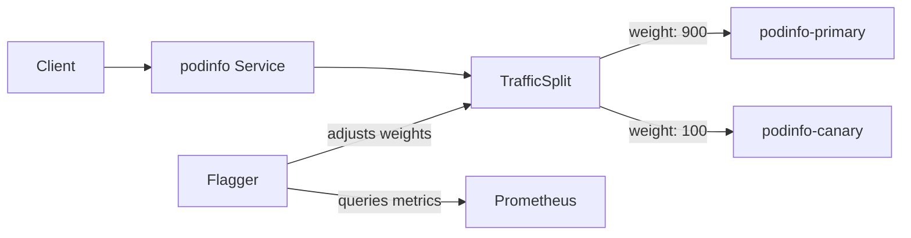

# How to Set Up Flagger with Linkerd on EKS Step by Step

Author: [nawazdhandala](https://github.com/nawazdhandala)

Tags: Flagger, Linkerd, EKS, AWS, Canary, Kubernetes, Service-Mesh

Description: A step-by-step guide to setting up Flagger with Linkerd on Amazon EKS for lightweight canary deployments.

---

## Introduction

Linkerd is a lightweight, security-focused service mesh that pairs well with Flagger for progressive delivery. Unlike Istio, Linkerd has a smaller resource footprint and simpler operational model, making it a popular choice for teams that want service mesh capabilities without the complexity. This guide walks through setting up Flagger with Linkerd on Amazon EKS.

## Prerequisites

- AWS CLI configured with appropriate permissions
- `eksctl` CLI installed
- `kubectl` installed
- `helm` v3 installed
- `linkerd` CLI installed

## Step 1: Create an EKS Cluster

```bash
# Create an EKS cluster
eksctl create cluster \
  --name flagger-linkerd \
  --region us-west-2 \
  --version 1.29 \
  --nodegroup-name workers \
  --node-type m5.large \
  --nodes 3 \
  --managed

# Verify cluster access
kubectl get nodes
```

## Step 2: Install Linkerd

```bash
# Validate prerequisites
linkerd check --pre

# Install Linkerd CRDs
linkerd install --crds | kubectl apply -f -

# Install Linkerd control plane
linkerd install | kubectl apply -f -

# Verify installation
linkerd check

# Install the Linkerd Viz extension (includes Prometheus)
linkerd viz install | kubectl apply -f -

# Verify Viz extension
linkerd viz check
```

## Step 3: Install Flagger

```bash
# Add Flagger Helm repository
helm repo add flagger https://flagger.app
helm repo update

# Install Flagger for Linkerd
helm upgrade -i flagger flagger/flagger \
  --namespace linkerd-viz \
  --set meshProvider=linkerd \
  --set metricsServer=http://prometheus.linkerd-viz:9090
```

Verify Flagger is running:

```bash
kubectl get pods -n linkerd-viz -l app.kubernetes.io/name=flagger
```

## Step 4: Inject Linkerd Proxy into the Application Namespace

```bash
# Annotate the namespace for automatic proxy injection
kubectl annotate namespace default linkerd.io/inject=enabled
```

## Step 5: Deploy the Application

```yaml
# app.yaml
apiVersion: apps/v1
kind: Deployment
metadata:
  name: podinfo
  namespace: default
  labels:
    app: podinfo
spec:
  replicas: 2
  selector:
    matchLabels:
      app: podinfo
  template:
    metadata:
      labels:
        app: podinfo
    spec:
      containers:
        - name: podinfo
          image: ghcr.io/stefanprodan/podinfo:6.5.0
          ports:
            - name: http
              containerPort: 9898
          resources:
            requests:
              cpu: 100m
              memory: 64Mi
            limits:
              cpu: 200m
              memory: 128Mi
```

```bash
kubectl apply -f app.yaml

# Verify the Linkerd proxy is injected
kubectl get pods -n default -l app=podinfo -o jsonpath='{.items[0].spec.containers[*].name}'
# Should show: podinfo linkerd-proxy
```

## Step 6: Create the Canary Resource

Flagger with Linkerd uses TrafficSplit resources for traffic management:

```yaml
# canary.yaml
apiVersion: flagger.app/v1beta1
kind: Canary
metadata:
  name: podinfo
  namespace: default
spec:
  targetRef:
    apiVersion: apps/v1
    kind: Deployment
    name: podinfo
  service:
    port: 9898
    targetPort: 9898
  analysis:
    interval: 1m
    threshold: 5
    maxWeight: 50
    stepWeight: 10
    # Linkerd Prometheus metrics
    metrics:
      - name: request-success-rate
        thresholdRange:
          min: 99
        interval: 1m
      - name: request-duration
        thresholdRange:
          max: 500
        interval: 1m
```

```bash
kubectl apply -f canary.yaml
kubectl get canary podinfo -n default -w
```

## Step 7: Trigger a Canary Release

```bash
# Update the image
kubectl set image deployment/podinfo podinfo=ghcr.io/stefanprodan/podinfo:6.5.1 -n default

# Monitor the rollout
kubectl get canary podinfo -n default -w

# Check TrafficSplit resource
kubectl get trafficsplit podinfo -n default -o yaml
```

The TrafficSplit resource shows how Linkerd distributes traffic between primary and canary:

```bash
kubectl get trafficsplit podinfo -n default \
  -o jsonpath='{range .spec.backends[*]}{.service}: {.weight}{"\n"}{end}'
```



## Step 8: Verify the Deployment

```bash
# Check final status
kubectl get canary podinfo -n default

# Verify primary image
kubectl get deployment podinfo-primary -n default \
  -o jsonpath='{.spec.template.spec.containers[0].image}'

# Use Linkerd dashboard to visualize traffic
linkerd viz dashboard &
```

## Cleanup

```bash
kubectl delete canary podinfo -n default
kubectl delete deployment podinfo -n default
helm uninstall flagger -n linkerd-viz
linkerd viz uninstall | kubectl delete -f -
linkerd uninstall | kubectl delete -f -
eksctl delete cluster --name flagger-linkerd --region us-west-2
```

## Conclusion

Flagger with Linkerd on EKS provides a lightweight progressive delivery solution. Linkerd's automatic mTLS, minimal resource requirements, and TrafficSplit-based traffic management make it an excellent choice for canary deployments. The setup is simpler than Istio while still providing the core features needed for safe, automated rollouts.
