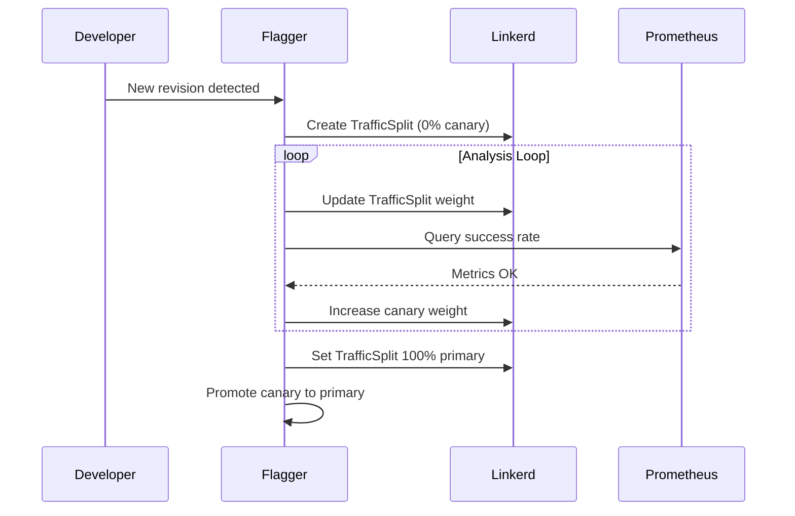

# How to Set Up Flagger with Linkerd on GKE Step by Step

Author: [nawazdhandala](https://github.com/nawazdhandala)

Tags: flagger, linkerd, gke, gcp, canary, kubernetes, service-mesh

Description: A step-by-step guide to setting up Flagger with Linkerd on Google Kubernetes Engine for automated canary deployments.

---

## Introduction

Linkerd's lightweight service mesh combined with Flagger's progressive delivery capabilities provides a streamlined canary deployment workflow on Google Kubernetes Engine. This guide covers the complete setup from cluster creation to executing and monitoring canary releases with Linkerd's TrafficSplit-based traffic management.

## Prerequisites

- Google Cloud SDK (`gcloud`) installed and configured
- A GCP project with billing enabled
- `kubectl` installed
- `helm` v3 installed
- `linkerd` CLI installed

## Step 1: Create a GKE Cluster

```bash
# Set project and zone
export PROJECT_ID=your-gcp-project-id
export ZONE=us-central1-a
gcloud config set project $PROJECT_ID

# Create GKE cluster
gcloud container clusters create flagger-linkerd \
  --zone $ZONE \
  --num-nodes 3 \
  --machine-type e2-standard-4 \
  --release-channel regular

# Get kubectl credentials
gcloud container clusters get-credentials flagger-linkerd --zone $ZONE

kubectl get nodes
```

## Step 2: Install Linkerd

```bash
# Pre-check
linkerd check --pre

# Install CRDs
linkerd install --crds | kubectl apply -f -

# Install control plane
linkerd install | kubectl apply -f -

# Verify
linkerd check

# Install Viz extension with Prometheus
linkerd viz install | kubectl apply -f -
linkerd viz check
```

## Step 3: Install Flagger

```bash
helm repo add flagger https://flagger.app
helm repo update

# Install Flagger for Linkerd
helm upgrade -i flagger flagger/flagger \
  --namespace linkerd-viz \
  --set meshProvider=linkerd \
  --set metricsServer=http://prometheus.linkerd-viz:9090

kubectl get pods -n linkerd-viz -l app.kubernetes.io/name=flagger
```

## Step 4: Prepare the Application Namespace

```bash
# Enable Linkerd proxy injection
kubectl annotate namespace default linkerd.io/inject=enabled
```

## Step 5: Deploy the Application

```yaml
# app.yaml
apiVersion: apps/v1
kind: Deployment
metadata:
  name: podinfo
  namespace: default
  labels:
    app: podinfo
spec:
  replicas: 2
  selector:
    matchLabels:
      app: podinfo
  template:
    metadata:
      labels:
        app: podinfo
    spec:
      containers:
        - name: podinfo
          image: ghcr.io/stefanprodan/podinfo:6.5.0
          ports:
            - name: http
              containerPort: 9898
          resources:
            requests:
              cpu: 100m
              memory: 64Mi
            limits:
              cpu: 200m
              memory: 128Mi
```

```bash
kubectl apply -f app.yaml
```

## Step 6: Create the Canary Resource

```yaml
# canary.yaml
apiVersion: flagger.app/v1beta1
kind: Canary
metadata:
  name: podinfo
  namespace: default
spec:
  targetRef:
    apiVersion: apps/v1
    kind: Deployment
    name: podinfo
  service:
    port: 9898
    targetPort: 9898
  analysis:
    interval: 1m
    threshold: 5
    maxWeight: 50
    stepWeight: 10
    metrics:
      - name: request-success-rate
        thresholdRange:
          min: 99
        interval: 1m
      - name: request-duration
        thresholdRange:
          max: 500
        interval: 1m
```

```bash
kubectl apply -f canary.yaml
kubectl get canary podinfo -n default -w
```

## Step 7: Generate Traffic and Trigger a Release

To ensure metrics are available, generate traffic to the application:

```bash
# Deploy a load testing pod
kubectl run load-generator --image=buoyantio/slow_cooker:1.3.0 \
  --command -- /slow_cooker/slow_cooker \
  -qps 10 -concurrency 2 http://podinfo:9898

# Trigger canary by updating the image
kubectl set image deployment/podinfo podinfo=ghcr.io/stefanprodan/podinfo:6.5.1 -n default
```

## Step 8: Monitor the Rollout

```bash
# Watch canary status
kubectl get canary podinfo -n default -w

# Check TrafficSplit weights
kubectl get trafficsplit podinfo -n default -o yaml

# View Flagger logs
kubectl logs -n linkerd-viz deployment/flagger -f | grep podinfo

# Use Linkerd Viz to see traffic
linkerd viz stat deploy -n default
```



## GKE-Specific Tips

### Using GKE Ingress with Linkerd

To expose your Linkerd-meshed services externally on GKE:

```yaml
# ingress.yaml
apiVersion: networking.k8s.io/v1
kind: Ingress
metadata:
  name: podinfo
  namespace: default
  annotations:
    kubernetes.io/ingress.class: "gce"
spec:
  rules:
    - http:
        paths:
          - path: /*
            pathType: ImplementationSpecific
            backend:
              service:
                name: podinfo
                port:
                  number: 9898
```

### GKE Autopilot Considerations

If using GKE Autopilot, ensure your resource requests are sufficient for Linkerd's proxy sidecar. Autopilot enforces minimum resource requests, so you may need to adjust your pod resource specifications.

## Cleanup

```bash
kubectl delete canary podinfo -n default
kubectl delete deployment podinfo -n default
kubectl delete pod load-generator
helm uninstall flagger -n linkerd-viz
linkerd viz uninstall | kubectl delete -f -
linkerd uninstall | kubectl delete -f -
gcloud container clusters delete flagger-linkerd --zone $ZONE --quiet
```

## Conclusion

Flagger with Linkerd on GKE delivers a lightweight, automated canary deployment pipeline. Linkerd's minimal resource overhead and automatic mTLS complement GKE's managed infrastructure, while Flagger handles the progressive traffic shifting and metric-based promotion decisions. This combination is ideal for teams that want progressive delivery without the operational complexity of a full-featured service mesh.
