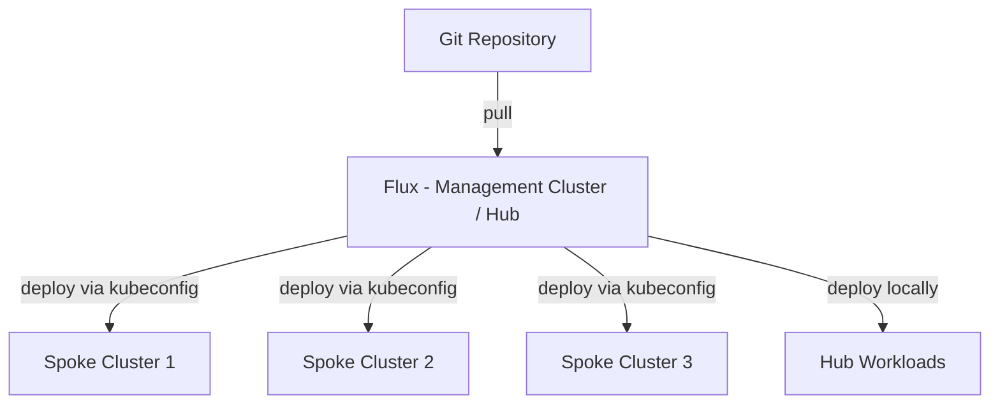

# How to Set Up Hub-and-Spoke Mode Multi-Cluster with Flux CD

Author: [nawazdhandala](https://github.com/nawazdhandala)

Tags: Flux, Kubernetes, GitOps, Multi-Cluster, Hub-and-Spoke, Cluster Management, Kustomization

Description: Learn how to configure a hub-and-spoke multi-cluster architecture with Flux CD where a central management cluster orchestrates deployments across remote leaf clusters.

---

The hub-and-spoke model is a centralized approach to managing multiple Kubernetes clusters with Flux CD. A single management cluster (the hub) runs Flux and pushes configurations to multiple workload clusters (the spokes). This pattern gives you centralized visibility and control over your entire fleet.

## Understanding Hub-and-Spoke Architecture

In this model, the management cluster is the only cluster running Flux controllers. It holds Kustomization and HelmRelease resources that target remote clusters using kubeconfig secrets.



The management cluster connects to each spoke cluster using stored kubeconfig credentials and applies resources remotely.

## Prerequisites

- A dedicated management cluster (the hub)
- Two or more workload clusters (the spokes)
- `kubectl` configured with contexts for all clusters
- `flux` CLI installed (v2.0 or later)
- Admin-level kubeconfig files for each spoke cluster
- A Git repository with a personal access token

## Step 1: Bootstrap Flux on the Management Cluster

Bootstrap Flux only on the management cluster:

```bash
kubectl config use-context management-cluster

flux bootstrap github \
  --owner=your-org \
  --repository=fleet-repo \
  --branch=main \
  --path=clusters/management \
  --personal
```

The spoke clusters do not run Flux. All reconciliation happens from the hub.

## Step 2: Register Spoke Clusters

For each spoke cluster, you need to create a kubeconfig secret in the management cluster. First, extract the kubeconfig for a spoke cluster:

```bash
kubectl config use-context spoke-cluster-1
SPOKE1_SERVER=$(kubectl config view --minify -o jsonpath='{.clusters[0].cluster.server}')
```

Create a service account on the spoke cluster for Flux to use:

```yaml
apiVersion: v1
kind: ServiceAccount
metadata:
  name: flux-reconciler
  namespace: kube-system
---
apiVersion: rbac.authorization.k8s.io/v1
kind: ClusterRoleBinding
metadata:
  name: flux-reconciler
roleRef:
  apiGroup: rbac.authorization.k8s.io
  kind: ClusterRole
  name: cluster-admin
subjects:
  - kind: ServiceAccount
    name: flux-reconciler
    namespace: kube-system
```

Apply this on the spoke cluster:

```bash
kubectl config use-context spoke-cluster-1
kubectl apply -f flux-reconciler-sa.yaml
```

Generate a long-lived token for the service account:

```yaml
apiVersion: v1
kind: Secret
metadata:
  name: flux-reconciler-token
  namespace: kube-system
  annotations:
    kubernetes.io/service-account.name: flux-reconciler
type: kubernetes.io/service-account-token
```

Now create the kubeconfig secret on the management cluster:

```bash
kubectl config use-context management-cluster

SPOKE1_TOKEN=$(kubectl --context=spoke-cluster-1 get secret flux-reconciler-token -n kube-system -o jsonpath='{.data.token}' | base64 -d)
SPOKE1_CA=$(kubectl --context=spoke-cluster-1 get secret flux-reconciler-token -n kube-system -o jsonpath='{.data.ca\.crt}')

cat <<EOF | kubectl apply -f -
apiVersion: v1
kind: Secret
metadata:
  name: spoke-cluster-1-kubeconfig
  namespace: flux-system
type: Opaque
stringData:
  value: |
    apiVersion: v1
    kind: Config
    clusters:
      - cluster:
          server: ${SPOKE1_SERVER}
          certificate-authority-data: ${SPOKE1_CA}
        name: spoke-cluster-1
    contexts:
      - context:
          cluster: spoke-cluster-1
          user: flux-reconciler
        name: spoke-cluster-1
    current-context: spoke-cluster-1
    users:
      - name: flux-reconciler
        user:
          token: ${SPOKE1_TOKEN}
EOF
```

Repeat this process for each spoke cluster.

## Step 3: Organize the Repository

Structure the repository to separate management and spoke configurations:

```
fleet-repo/
├── clusters/
│   └── management/
│       ├── flux-system/
│       ├── spoke-cluster-1.yaml
│       ├── spoke-cluster-2.yaml
│       └── spoke-cluster-3.yaml
├── infrastructure/
│   ├── base/
│   │   ├── cert-manager/
│   │   ├── ingress-nginx/
│   │   └── monitoring/
│   └── overlays/
│       ├── spoke-cluster-1/
│       ├── spoke-cluster-2/
│       └── spoke-cluster-3/
└── apps/
    ├── base/
    └── overlays/
        ├── spoke-cluster-1/
        ├── spoke-cluster-2/
        └── spoke-cluster-3/
```

## Step 4: Create Kustomizations Targeting Spoke Clusters

The critical difference from standalone mode is the `kubeConfig` field. This tells Flux to apply resources on a remote cluster instead of locally.

For `clusters/management/spoke-cluster-1.yaml`:

```yaml
apiVersion: kustomize.toolkit.fluxcd.io/v1
kind: Kustomization
metadata:
  name: spoke-cluster-1-infrastructure
  namespace: flux-system
spec:
  interval: 10m
  sourceRef:
    kind: GitRepository
    name: flux-system
  path: ./infrastructure/overlays/spoke-cluster-1
  prune: true
  wait: true
  timeout: 5m
  kubeConfig:
    secretRef:
      name: spoke-cluster-1-kubeconfig
---
apiVersion: kustomize.toolkit.fluxcd.io/v1
kind: Kustomization
metadata:
  name: spoke-cluster-1-apps
  namespace: flux-system
spec:
  interval: 10m
  dependsOn:
    - name: spoke-cluster-1-infrastructure
  sourceRef:
    kind: GitRepository
    name: flux-system
  path: ./apps/overlays/spoke-cluster-1
  prune: true
  wait: true
  timeout: 5m
  kubeConfig:
    secretRef:
      name: spoke-cluster-1-kubeconfig
```

## Step 5: Deploy HelmReleases to Spoke Clusters

HelmReleases can also target remote clusters using the `kubeConfig` field:

```yaml
apiVersion: helm.toolkit.fluxcd.io/v2
kind: HelmRelease
metadata:
  name: ingress-nginx
  namespace: flux-system
spec:
  interval: 30m
  targetNamespace: ingress-nginx
  kubeConfig:
    secretRef:
      name: spoke-cluster-1-kubeconfig
  chart:
    spec:
      chart: ingress-nginx
      version: "4.x"
      sourceRef:
        kind: HelmRepository
        name: ingress-nginx
        namespace: flux-system
      interval: 12h
  install:
    createNamespace: true
  values:
    controller:
      replicaCount: 2
```

## Step 6: Health Checks Across Clusters

Flux can perform health checks on remote cluster resources. Add health checks to your Kustomizations:

```yaml
apiVersion: kustomize.toolkit.fluxcd.io/v1
kind: Kustomization
metadata:
  name: spoke-cluster-1-apps
  namespace: flux-system
spec:
  interval: 10m
  sourceRef:
    kind: GitRepository
    name: flux-system
  path: ./apps/overlays/spoke-cluster-1
  prune: true
  kubeConfig:
    secretRef:
      name: spoke-cluster-1-kubeconfig
  healthChecks:
    - apiVersion: apps/v1
      kind: Deployment
      name: frontend
      namespace: production
    - apiVersion: apps/v1
      kind: Deployment
      name: backend
      namespace: production
```

## Step 7: Monitor from the Management Cluster

Since all Flux resources live on the management cluster, monitoring is centralized:

```bash
kubectl config use-context management-cluster

# View all Kustomizations across all spokes
flux get kustomizations

# Check a specific spoke cluster
flux get kustomizations | grep spoke-cluster-1

# View events for reconciliation issues
flux events --for Kustomization/spoke-cluster-1-apps
```

You can also set up Flux notifications to alert on failures:

```yaml
apiVersion: notification.toolkit.fluxcd.io/v1beta3
kind: Alert
metadata:
  name: spoke-failures
  namespace: flux-system
spec:
  providerRef:
    name: slack
  eventSeverity: error
  eventSources:
    - kind: Kustomization
      name: '*'
    - kind: HelmRelease
      name: '*'
```

## Security Considerations

The hub-and-spoke model requires careful security planning:

- Store spoke kubeconfigs as Kubernetes secrets and encrypt them with SOPS in Git.
- Use dedicated service accounts with minimal RBAC permissions on spoke clusters.
- Rotate credentials regularly.
- Consider using short-lived tokens or certificate-based authentication.

```yaml
apiVersion: kustomize.toolkit.fluxcd.io/v1
kind: Kustomization
metadata:
  name: spoke-secrets
  namespace: flux-system
spec:
  interval: 10m
  sourceRef:
    kind: GitRepository
    name: flux-system
  path: ./secrets/spoke-cluster-1
  prune: true
  decryption:
    provider: sops
    secretRef:
      name: sops-age
```

## Advantages and Trade-offs

**Advantages:**

- Centralized management and visibility across all clusters
- Spoke clusters do not need Git access or Flux installation
- Simplified auditing from a single control plane
- Easy to add or remove spoke clusters

**Trade-offs:**

- Single point of failure at the management cluster
- Requires network connectivity from hub to all spokes
- Kubeconfig credential management overhead
- Increased load on the management cluster as the fleet grows

## Summary

You have configured a hub-and-spoke multi-cluster deployment with Flux CD. The management cluster runs all Flux controllers and reconciles resources to remote spoke clusters using kubeconfig secrets. This model is ideal when you want centralized control and visibility across your fleet, and when spoke clusters are managed by a single platform team.
