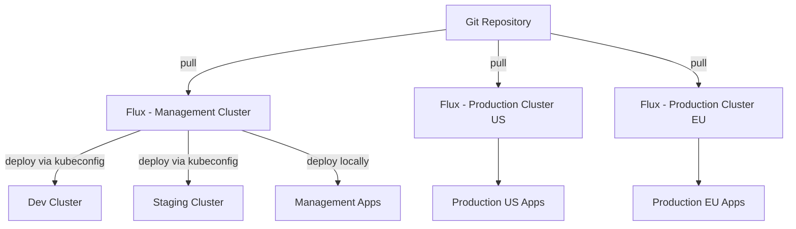

# How to Set Up Hybrid Mode Multi-Cluster with Flux CD

Author: [nawazdhandala](https://github.com/nawazdhandala)

Tags: Flux, Kubernetes, GitOps, Multi-Cluster, Hybrid Mode, Hub-and-Spoke, Standalone Mode, Cluster Management

Description: A guide to implementing hybrid mode multi-cluster with Flux CD, combining hub-and-spoke for non-production and standalone mode for production clusters.

---

Not every cluster in your fleet has the same operational requirements. Development and staging clusters benefit from centralized management, while production clusters often need full independence and fault isolation. Hybrid mode in Flux CD combines the hub-and-spoke and standalone patterns to give you the best of both worlds.

## What Is Hybrid Mode?

Hybrid mode uses a management cluster (hub) to control non-production environments while production clusters run their own standalone Flux instances. This approach balances centralized convenience with production-grade resilience.



The management cluster handles dev and staging through remote kubeconfigs. Production clusters are self-managing.

## Prerequisites

- A management cluster for non-production workloads
- One or more non-production clusters (dev, staging)
- One or more production clusters
- `kubectl` and `flux` CLI installed
- A Git repository with appropriate access tokens
- Kubeconfig access to all clusters

## Repository Structure for Hybrid Mode

The repository must accommodate both patterns. Each production cluster gets its own top-level directory alongside the management cluster:

```text
fleet-repo/
├── clusters/
│   ├── management/
│   │   ├── flux-system/
│   │   ├── dev-cluster.yaml
│   │   └── staging-cluster.yaml
│   ├── production-us/
│   │   ├── flux-system/
│   │   ├── infrastructure.yaml
│   │   └── apps.yaml
│   └── production-eu/
│       ├── flux-system/
│       ├── infrastructure.yaml
│       └── apps.yaml
├── infrastructure/
│   ├── base/
│   └── overlays/
│       ├── dev/
│       ├── staging/
│       ├── production-us/
│       └── production-eu/
└── apps/
    ├── base/
    └── overlays/
        ├── dev/
        ├── staging/
        ├── production-us/
        └── production-eu/
```

## Step 1: Bootstrap the Management Cluster

The management cluster handles non-production environments:

```bash
kubectl config use-context management-cluster

flux bootstrap github \
  --owner=your-org \
  --repository=fleet-repo \
  --branch=main \
  --path=clusters/management \
  --personal
```

## Step 2: Register Non-Production Clusters with the Hub

Create kubeconfig secrets on the management cluster for each non-production cluster. First, set up a service account on the dev cluster:

```bash
kubectl config use-context dev-cluster

kubectl apply -f - <<EOF
apiVersion: v1
kind: ServiceAccount
metadata:
  name: flux-reconciler
  namespace: kube-system
---
apiVersion: v1
kind: Secret
metadata:
  name: flux-reconciler-token
  namespace: kube-system
  annotations:
    kubernetes.io/service-account.name: flux-reconciler
type: kubernetes.io/service-account-token
---
apiVersion: rbac.authorization.k8s.io/v1
kind: ClusterRoleBinding
metadata:
  name: flux-reconciler
roleRef:
  apiGroup: rbac.authorization.k8s.io
  kind: ClusterRole
  name: cluster-admin
subjects:
  - kind: ServiceAccount
    name: flux-reconciler
    namespace: kube-system
EOF
```

Then create the kubeconfig secret on the management cluster:

```bash
kubectl config use-context management-cluster

kubectl create secret generic dev-cluster-kubeconfig \
  --namespace=flux-system \
  --from-literal=value="$(cat dev-cluster-kubeconfig.yaml)"
```

Create Kustomizations targeting the dev cluster in `clusters/management/dev-cluster.yaml`:

```yaml
apiVersion: kustomize.toolkit.fluxcd.io/v1
kind: Kustomization
metadata:
  name: dev-infrastructure
  namespace: flux-system
spec:
  interval: 5m
  sourceRef:
    kind: GitRepository
    name: flux-system
  path: ./infrastructure/overlays/dev
  prune: true
  wait: true
  kubeConfig:
    secretRef:
      name: dev-cluster-kubeconfig
---
apiVersion: kustomize.toolkit.fluxcd.io/v1
kind: Kustomization
metadata:
  name: dev-apps
  namespace: flux-system
spec:
  interval: 5m
  dependsOn:
    - name: dev-infrastructure
  sourceRef:
    kind: GitRepository
    name: flux-system
  path: ./apps/overlays/dev
  prune: true
  kubeConfig:
    secretRef:
      name: dev-cluster-kubeconfig
```

Repeat the same process for the staging cluster.

## Step 3: Bootstrap Production Clusters in Standalone Mode

Each production cluster gets its own independent Flux installation:

```bash
kubectl config use-context production-us

flux bootstrap github \
  --owner=your-org \
  --repository=fleet-repo \
  --branch=main \
  --path=clusters/production-us \
  --personal
```

```bash
kubectl config use-context production-eu

flux bootstrap github \
  --owner=your-org \
  --repository=fleet-repo \
  --branch=main \
  --path=clusters/production-eu \
  --personal
```

## Step 4: Configure Production Cluster Kustomizations

Each production cluster has its own Kustomizations in its directory. For `clusters/production-us/infrastructure.yaml`:

```yaml
apiVersion: kustomize.toolkit.fluxcd.io/v1
kind: Kustomization
metadata:
  name: infrastructure
  namespace: flux-system
spec:
  interval: 10m
  sourceRef:
    kind: GitRepository
    name: flux-system
  path: ./infrastructure/overlays/production-us
  prune: true
  wait: true
  timeout: 5m
```

For `clusters/production-us/apps.yaml`:

```yaml
apiVersion: kustomize.toolkit.fluxcd.io/v1
kind: Kustomization
metadata:
  name: apps
  namespace: flux-system
spec:
  interval: 10m
  dependsOn:
    - name: infrastructure
  sourceRef:
    kind: GitRepository
    name: flux-system
  path: ./apps/overlays/production-us
  prune: true
  wait: true
  timeout: 5m
```

## Step 5: Differentiate Environment Configurations

Use Kustomize overlays to adjust resource limits, replica counts, and feature flags per environment.

For `apps/overlays/dev/kustomization.yaml`:

```yaml
apiVersion: kustomize.config.k8s.io/v1beta1
kind: Kustomization
resources:
  - ../../base
patches:
  - target:
      kind: Deployment
    patch: |
      - op: replace
        path: /spec/replicas
        value: 1
  - target:
      kind: HorizontalPodAutoscaler
    patch: |
      - op: replace
        path: /spec/minReplicas
        value: 1
      - op: replace
        path: /spec/maxReplicas
        value: 2
```

For `apps/overlays/production-us/kustomization.yaml`:

```yaml
apiVersion: kustomize.config.k8s.io/v1beta1
kind: Kustomization
resources:
  - ../../base
patches:
  - target:
      kind: Deployment
    patch: |
      - op: replace
        path: /spec/replicas
        value: 3
  - target:
      kind: HorizontalPodAutoscaler
    patch: |
      - op: replace
        path: /spec/minReplicas
        value: 3
      - op: replace
        path: /spec/maxReplicas
        value: 10
```

## Step 6: Implement Promotion Across Environments

A natural workflow with hybrid mode is to promote changes through environments. Use Git branches or image automation:

```yaml
apiVersion: image.toolkit.fluxcd.io/v1
kind: ImagePolicy
metadata:
  name: app-policy
  namespace: flux-system
spec:
  imageRepositoryRef:
    name: app
  filterTags:
    pattern: '^main-[a-f0-9]+-(?P<ts>[0-9]+)'
    extract: '$ts'
  policy:
    numerical:
      order: asc
```

For production, pin to specific tags using a semver policy:

```yaml
apiVersion: image.toolkit.fluxcd.io/v1
kind: ImagePolicy
metadata:
  name: app-policy
  namespace: flux-system
spec:
  imageRepositoryRef:
    name: app
  policy:
    semver:
      range: '>=1.0.0'
```

## Step 7: Monitoring the Hybrid Setup

Monitor both patterns from their respective control planes:

```bash
# Check non-production from the management cluster
kubectl config use-context management-cluster
flux get kustomizations

# Check production clusters individually
kubectl config use-context production-us
flux get kustomizations

kubectl config use-context production-eu
flux get kustomizations
```

For a unified view, set up Prometheus federation or a tool like Grafana with multiple data sources to aggregate Flux metrics across all clusters.

## When to Use Hybrid Mode

Hybrid mode is ideal when:

- Your production and non-production environments have different reliability requirements
- A platform team manages non-production centrally, but production clusters are owned by dedicated SRE teams
- You want centralized control for rapid iteration in dev and staging, but full independence for production
- Regulatory requirements mandate that production clusters operate autonomously

## Summary

Hybrid mode gives you the flexibility to match your Flux multi-cluster architecture to your operational reality. Non-production clusters benefit from centralized management through the hub, while production clusters maintain full independence in standalone mode. This approach scales well as your fleet grows and your team structures evolve.
