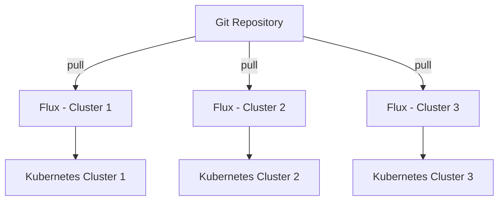

# How to Set Up Standalone Mode Multi-Cluster with Flux CD

Author: [nawazdhandala](https://github.com/nawazdhandala)

Tags: Flux, Kubernetes, GitOps, Multi-Cluster, Standalone Mode, Cluster Management

Description: A complete guide to setting up standalone mode multi-cluster deployments with Flux CD where each cluster independently manages its own GitOps reconciliation.

---

Managing multiple Kubernetes clusters is a common challenge in modern infrastructure. Flux CD provides several multi-cluster patterns, and standalone mode is the simplest and most resilient approach. In this guide, you will learn how to set up standalone mode multi-cluster deployments where each cluster runs its own Flux instance and reconciles directly from a shared Git repository.

## What Is Standalone Mode?

In standalone mode, every cluster has its own independent Flux installation. Each Flux instance connects directly to the Git repository and reconciles the resources assigned to that specific cluster. There is no central management cluster controlling others.



Each cluster operates independently. If one cluster goes down, the others continue reconciling without disruption.

## Prerequisites

Before you begin, make sure you have the following:

- Three or more Kubernetes clusters (can be any distribution)
- `kubectl` configured with contexts for each cluster
- `flux` CLI installed (v2.0 or later)
- A Git repository (GitHub, GitLab, or Bitbucket)
- A personal access token for your Git provider

Verify your Flux CLI installation:

```bash
flux --version
flux check --pre
```

## Repository Structure

The key to standalone mode is organizing your Git repository so each cluster has its own directory with dedicated configuration. A recommended structure looks like this:

```text
fleet-repo/
├── clusters/
│   ├── cluster-1/
│   │   ├── flux-system/
│   │   ├── infrastructure.yaml
│   │   └── apps.yaml
│   ├── cluster-2/
│   │   ├── flux-system/
│   │   ├── infrastructure.yaml
│   │   └── apps.yaml
│   └── cluster-3/
│       ├── flux-system/
│       ├── infrastructure.yaml
│       └── apps.yaml
├── infrastructure/
│   ├── base/
│   │   ├── cert-manager/
│   │   ├── ingress-nginx/
│   │   └── monitoring/
│   └── overlays/
│       ├── cluster-1/
│       ├── cluster-2/
│       └── cluster-3/
└── apps/
    ├── base/
    └── overlays/
        ├── cluster-1/
        ├── cluster-2/
        └── cluster-3/
```

## Step 1: Bootstrap Flux on Each Cluster

Switch to the first cluster context and bootstrap Flux. The `--path` flag tells Flux which directory in the repository to watch.

```bash
kubectl config use-context cluster-1

flux bootstrap github \
  --owner=your-org \
  --repository=fleet-repo \
  --branch=main \
  --path=clusters/cluster-1 \
  --personal
```

Repeat for each additional cluster, changing the context and path:

```bash
kubectl config use-context cluster-2

flux bootstrap github \
  --owner=your-org \
  --repository=fleet-repo \
  --branch=main \
  --path=clusters/cluster-2 \
  --personal
```

```bash
kubectl config use-context cluster-3

flux bootstrap github \
  --owner=your-org \
  --repository=fleet-repo \
  --branch=main \
  --path=clusters/cluster-3 \
  --personal
```

Each bootstrap command installs Flux components in the cluster and commits the Flux manifests to the corresponding path in the repository.

## Step 2: Define Infrastructure Sources

Create a Kustomization that points to shared infrastructure components. Place this in each cluster's directory.

For `clusters/cluster-1/infrastructure.yaml`:

```yaml
apiVersion: kustomize.toolkit.fluxcd.io/v1
kind: Kustomization
metadata:
  name: infrastructure
  namespace: flux-system
spec:
  interval: 10m
  sourceRef:
    kind: GitRepository
    name: flux-system
  path: ./infrastructure/overlays/cluster-1
  prune: true
  wait: true
  timeout: 5m
```

## Step 3: Define Application Sources

Similarly, create a Kustomization for applications in each cluster directory.

For `clusters/cluster-1/apps.yaml`:

```yaml
apiVersion: kustomize.toolkit.fluxcd.io/v1
kind: Kustomization
metadata:
  name: apps
  namespace: flux-system
spec:
  interval: 10m
  dependsOn:
    - name: infrastructure
  sourceRef:
    kind: GitRepository
    name: flux-system
  path: ./apps/overlays/cluster-1
  prune: true
  wait: true
  timeout: 5m
```

The `dependsOn` field ensures infrastructure components are deployed before applications.

## Step 4: Create Shared Base Components

Define shared infrastructure in the base directory. For example, to deploy ingress-nginx across all clusters, create `infrastructure/base/ingress-nginx/kustomization.yaml`:

```yaml
apiVersion: kustomize.config.k8s.io/v1beta1
kind: Kustomization
namespace: ingress-nginx
resources:
  - namespace.yaml
  - helmrepository.yaml
  - helmrelease.yaml
```

The HelmRelease for ingress-nginx at `infrastructure/base/ingress-nginx/helmrelease.yaml`:

```yaml
apiVersion: helm.toolkit.fluxcd.io/v2
kind: HelmRelease
metadata:
  name: ingress-nginx
  namespace: ingress-nginx
spec:
  interval: 30m
  chart:
    spec:
      chart: ingress-nginx
      version: "4.x"
      sourceRef:
        kind: HelmRepository
        name: ingress-nginx
        namespace: ingress-nginx
      interval: 12h
  values:
    controller:
      replicaCount: 2
```

## Step 5: Create Cluster-Specific Overlays

Each cluster can customize shared components through Kustomize overlays. For example, `infrastructure/overlays/cluster-1/kustomization.yaml`:

```yaml
apiVersion: kustomize.config.k8s.io/v1beta1
kind: Kustomization
resources:
  - ../../base/ingress-nginx
  - ../../base/cert-manager
patches:
  - target:
      kind: HelmRelease
      name: ingress-nginx
    patch: |
      - op: replace
        path: /spec/values/controller/replicaCount
        value: 3
```

## Step 6: Verify the Deployment

Check the status of Flux on each cluster:

```bash
kubectl config use-context cluster-1
flux get all

kubectl config use-context cluster-2
flux get all

kubectl config use-context cluster-3
flux get all
```

To check a specific Kustomization:

```bash
flux get kustomizations --watch
```

To inspect reconciliation events:

```bash
flux events
```

## Handling Secrets Across Clusters

Each standalone cluster needs its own secrets. Use Mozilla SOPS or Sealed Secrets with per-cluster keys:

```bash
flux create secret oci registry-credentials \
  --url=ghcr.io \
  --username=flux \
  --password=${GITHUB_TOKEN}
```

For SOPS, each cluster gets its own age key:

```bash
age-keygen -o age.agekey

cat age.agekey | kubectl create secret generic sops-age \
  --namespace=flux-system \
  --from-file=age.agekey=/dev/stdin
```

Configure the Kustomization to decrypt secrets:

```yaml
apiVersion: kustomize.toolkit.fluxcd.io/v1
kind: Kustomization
metadata:
  name: apps
  namespace: flux-system
spec:
  interval: 10m
  sourceRef:
    kind: GitRepository
    name: flux-system
  path: ./apps/overlays/cluster-1
  prune: true
  decryption:
    provider: sops
    secretRef:
      name: sops-age
```

## Advantages of Standalone Mode

Standalone mode offers several benefits for multi-cluster operations:

- **High resilience**: Each cluster is fully independent. A failure in one cluster has zero impact on the others.
- **Simple mental model**: Every cluster manages itself. There is no central point of failure.
- **Security isolation**: Clusters do not need cross-cluster network access or shared credentials.
- **Scalability**: Adding a new cluster means bootstrapping Flux with a new path. No changes to existing clusters are required.

## When to Use Standalone Mode

Standalone mode works best when your clusters are in different trust boundaries, managed by different teams, or when you need maximum fault isolation. It is the recommended starting point for most multi-cluster Flux deployments.

## Summary

You have now set up a standalone mode multi-cluster deployment with Flux CD. Each cluster independently reconciles from a shared Git repository using its own dedicated path. This approach gives you strong isolation between clusters while sharing configuration through Kustomize bases and overlays. As your fleet grows, you can simply bootstrap additional clusters pointing to new paths in the same repository.
