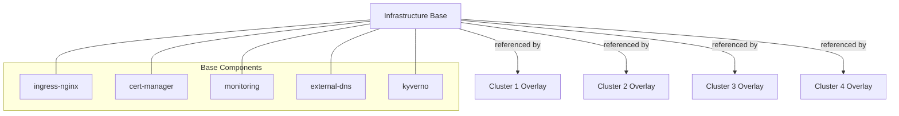

# How to Sync Common Platform Components Across All Clusters with Flux

Author: [nawazdhandala](https://github.com/nawazdhandala)

Tags: Flux, Kubernetes, GitOps, Multi-Cluster, Platform Components, Kustomize, Helm, Infrastructure

Description: Learn how to define and synchronize shared platform components like ingress controllers, cert-manager, and monitoring stacks across all clusters using Flux CD.

---

Most Kubernetes clusters in a fleet share a common set of platform components: ingress controllers, certificate managers, monitoring stacks, policy engines, and more. Maintaining these components consistently across clusters is a challenge that Flux CD solves elegantly through Kustomize bases, HelmReleases, and a well-structured Git repository.

## The Problem

Without a structured approach, platform components drift across clusters. One cluster might run cert-manager v1.12, another v1.14. Ingress controller configurations diverge. Monitoring dashboards become inconsistent. This drift leads to operational surprises and makes troubleshooting harder.

## Architecture

The key principle is "define once, deploy everywhere." Shared components live in a base directory. Each cluster references these bases and optionally applies overlays for cluster-specific customization.



## Repository Structure

```
fleet-repo/
├── infrastructure/
│   ├── base/
│   │   ├── sources/
│   │   │   ├── kustomization.yaml
│   │   │   ├── helm-ingress-nginx.yaml
│   │   │   ├── helm-cert-manager.yaml
│   │   │   ├── helm-prometheus.yaml
│   │   │   ├── helm-external-dns.yaml
│   │   │   └── helm-kyverno.yaml
│   │   ├── cert-manager/
│   │   │   ├── kustomization.yaml
│   │   │   ├── namespace.yaml
│   │   │   └── helmrelease.yaml
│   │   ├── ingress-nginx/
│   │   │   ├── kustomization.yaml
│   │   │   ├── namespace.yaml
│   │   │   └── helmrelease.yaml
│   │   ├── monitoring/
│   │   │   ├── kustomization.yaml
│   │   │   ├── namespace.yaml
│   │   │   └── helmrelease.yaml
│   │   ├── external-dns/
│   │   │   ├── kustomization.yaml
│   │   │   ├── namespace.yaml
│   │   │   └── helmrelease.yaml
│   │   └── kyverno/
│   │       ├── kustomization.yaml
│   │       ├── namespace.yaml
│   │       └── helmrelease.yaml
│   └── overlays/
│       ├── cluster-1/
│       │   └── kustomization.yaml
│       ├── cluster-2/
│       │   └── kustomization.yaml
│       └── cluster-3/
│           └── kustomization.yaml
└── clusters/
    ├── cluster-1/
    │   ├── flux-system/
    │   └── infrastructure.yaml
    ├── cluster-2/
    │   ├── flux-system/
    │   └── infrastructure.yaml
    └── cluster-3/
        ├── flux-system/
        └── infrastructure.yaml
```

## Step 1: Define Helm Repository Sources

Create shared HelmRepository sources that all clusters will use. In `infrastructure/base/sources/kustomization.yaml`:

```yaml
apiVersion: kustomize.config.k8s.io/v1beta1
kind: Kustomization
resources:
  - helm-ingress-nginx.yaml
  - helm-cert-manager.yaml
  - helm-prometheus.yaml
  - helm-external-dns.yaml
  - helm-kyverno.yaml
```

For `infrastructure/base/sources/helm-ingress-nginx.yaml`:

```yaml
apiVersion: source.toolkit.fluxcd.io/v1
kind: HelmRepository
metadata:
  name: ingress-nginx
  namespace: flux-system
spec:
  interval: 24h
  url: https://kubernetes.github.io/ingress-nginx
```

For `infrastructure/base/sources/helm-cert-manager.yaml`:

```yaml
apiVersion: source.toolkit.fluxcd.io/v1
kind: HelmRepository
metadata:
  name: cert-manager
  namespace: flux-system
spec:
  interval: 24h
  url: https://charts.jetstack.io
```

For `infrastructure/base/sources/helm-prometheus.yaml`:

```yaml
apiVersion: source.toolkit.fluxcd.io/v1
kind: HelmRepository
metadata:
  name: prometheus-community
  namespace: flux-system
spec:
  interval: 24h
  url: https://prometheus-community.github.io/helm-charts
```

## Step 2: Define Base Component HelmReleases

Each component gets a base definition. For `infrastructure/base/cert-manager/helmrelease.yaml`:

```yaml
apiVersion: helm.toolkit.fluxcd.io/v2
kind: HelmRelease
metadata:
  name: cert-manager
  namespace: cert-manager
spec:
  interval: 30m
  chart:
    spec:
      chart: cert-manager
      version: "1.14.x"
      sourceRef:
        kind: HelmRepository
        name: cert-manager
        namespace: flux-system
      interval: 12h
  install:
    crds: CreateReplace
    remediation:
      retries: 3
  upgrade:
    crds: CreateReplace
    remediation:
      retries: 3
  values:
    installCRDs: true
    replicaCount: 2
    podDisruptionBudget:
      enabled: true
      minAvailable: 1
```

For `infrastructure/base/ingress-nginx/helmrelease.yaml`:

```yaml
apiVersion: helm.toolkit.fluxcd.io/v2
kind: HelmRelease
metadata:
  name: ingress-nginx
  namespace: ingress-nginx
spec:
  interval: 30m
  chart:
    spec:
      chart: ingress-nginx
      version: "4.9.x"
      sourceRef:
        kind: HelmRepository
        name: ingress-nginx
        namespace: flux-system
      interval: 12h
  install:
    remediation:
      retries: 3
  upgrade:
    remediation:
      retries: 3
  values:
    controller:
      replicaCount: 2
      metrics:
        enabled: true
        serviceMonitor:
          enabled: true
      podDisruptionBudget:
        enabled: true
        minAvailable: 1
```

For `infrastructure/base/monitoring/helmrelease.yaml`:

```yaml
apiVersion: helm.toolkit.fluxcd.io/v2
kind: HelmRelease
metadata:
  name: kube-prometheus-stack
  namespace: monitoring
spec:
  interval: 30m
  chart:
    spec:
      chart: kube-prometheus-stack
      version: "55.x"
      sourceRef:
        kind: HelmRepository
        name: prometheus-community
        namespace: flux-system
      interval: 12h
  install:
    crds: CreateReplace
    remediation:
      retries: 3
  upgrade:
    crds: CreateReplace
    remediation:
      retries: 3
  values:
    grafana:
      enabled: true
      persistence:
        enabled: true
        size: 10Gi
    prometheus:
      prometheusSpec:
        retention: 30d
        storageSpec:
          volumeClaimTemplate:
            spec:
              accessModes: ["ReadWriteOnce"]
              resources:
                requests:
                  storage: 50Gi
    alertmanager:
      enabled: true
```

## Step 3: Create the Base Kustomization

Tie all base components together with dependency ordering. In `infrastructure/base/kustomization.yaml` is not needed because each overlay references individual components.

For each component, create its own `kustomization.yaml`. For example, `infrastructure/base/cert-manager/kustomization.yaml`:

```yaml
apiVersion: kustomize.config.k8s.io/v1beta1
kind: Kustomization
namespace: cert-manager
resources:
  - namespace.yaml
  - helmrelease.yaml
```

The namespace file `infrastructure/base/cert-manager/namespace.yaml`:

```yaml
apiVersion: v1
kind: Namespace
metadata:
  name: cert-manager
```

## Step 4: Create Cluster Overlays

Each cluster overlay selects which base components to include and can customize them. For `infrastructure/overlays/cluster-1/kustomization.yaml`:

```yaml
apiVersion: kustomize.config.k8s.io/v1beta1
kind: Kustomization
resources:
  - ../../base/sources
  - ../../base/cert-manager
  - ../../base/ingress-nginx
  - ../../base/monitoring
  - ../../base/external-dns
  - ../../base/kyverno
```

If a cluster does not need a particular component, simply omit it from the resources list.

## Step 5: Use Dependency Ordering in Flux

The Flux Kustomization in each cluster directory should define proper dependencies. Sources must be deployed before HelmReleases. Create a layered approach in `clusters/cluster-1/`:

```yaml
# clusters/cluster-1/sources.yaml
apiVersion: kustomize.toolkit.fluxcd.io/v1
kind: Kustomization
metadata:
  name: sources
  namespace: flux-system
spec:
  interval: 15m
  sourceRef:
    kind: GitRepository
    name: flux-system
  path: ./infrastructure/base/sources
  prune: true
  wait: true
---
# clusters/cluster-1/infrastructure.yaml
apiVersion: kustomize.toolkit.fluxcd.io/v1
kind: Kustomization
metadata:
  name: infrastructure
  namespace: flux-system
spec:
  interval: 15m
  dependsOn:
    - name: sources
  sourceRef:
    kind: GitRepository
    name: flux-system
  path: ./infrastructure/overlays/cluster-1
  prune: true
  wait: true
  timeout: 10m
```

## Step 6: Version Pinning Strategy

Pin component versions in the base to ensure consistency. Use Helm chart version ranges to allow patch updates while preventing breaking changes:

```yaml
spec:
  chart:
    spec:
      # Pin to minor version, allow patch updates
      version: "1.14.x"
```

For tighter control, pin exact versions:

```yaml
spec:
  chart:
    spec:
      version: "1.14.5"
```

To update a component across all clusters, change the version in the base. Every cluster picks up the change on its next reconciliation cycle.

## Step 7: Customize Per Cluster When Needed

Some clusters may need different settings for shared components. Use JSON patches in overlays. For `infrastructure/overlays/cluster-3/kustomization.yaml`:

```yaml
apiVersion: kustomize.config.k8s.io/v1beta1
kind: Kustomization
resources:
  - ../../base/sources
  - ../../base/cert-manager
  - ../../base/ingress-nginx
  - ../../base/monitoring
patches:
  - target:
      kind: HelmRelease
      name: ingress-nginx
    patch: |
      - op: replace
        path: /spec/values/controller/replicaCount
        value: 5
  - target:
      kind: HelmRelease
      name: kube-prometheus-stack
    patch: |
      - op: replace
        path: /spec/values/prometheus/prometheusSpec/retention
        value: 90d
```

## Step 8: Verify Component Sync

Check that components are consistent across clusters:

```bash
for CTX in cluster-1 cluster-2 cluster-3; do
  echo "=== $CTX ==="
  kubectl --context=$CTX get helmreleases -A
  echo ""
done
```

Check specific component versions:

```bash
for CTX in cluster-1 cluster-2 cluster-3; do
  echo "=== $CTX ==="
  kubectl --context=$CTX get helmrelease cert-manager -n cert-manager -o jsonpath='{.spec.chart.spec.version}'
  echo ""
done
```

## Upgrading Components Fleet-Wide

To upgrade a component across all clusters:

1. Update the version in the base HelmRelease
2. Commit and push to Git
3. Each cluster picks up the change on its next reconciliation interval

```bash
# Example: Update cert-manager from 1.14.x to 1.15.x
# Edit infrastructure/base/cert-manager/helmrelease.yaml
# Change version: "1.14.x" to version: "1.15.x"
git add infrastructure/base/cert-manager/helmrelease.yaml
git commit -m "chore: upgrade cert-manager to 1.15.x"
git push
```

Monitor the rollout:

```bash
flux get helmreleases -A --watch
```

## Summary

Syncing common platform components across clusters with Flux CD is a matter of repository structure and discipline. Define components once in a base directory, reference them from cluster overlays, and let each Flux instance reconcile them. Version pinning in the base ensures consistency, while overlays provide the escape hatch for cluster-specific adjustments. This approach scales from a handful of clusters to hundreds, keeping your platform layer consistent and manageable.
