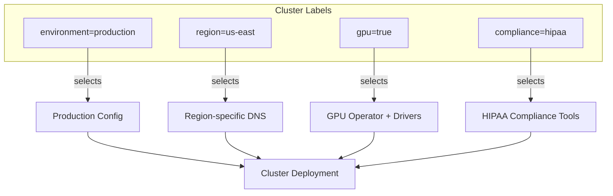

# How to Use Cluster Labels for Conditional Resource Deployment in Flux

Author: [nawazdhandala](https://github.com/nawazdhandala)

Tags: Flux, Kubernetes, GitOps, Multi-Cluster, Cluster Labels, Conditional Deployment, Kustomize, Configuration Management

Description: Learn how to use Kubernetes cluster labels and Flux post-build variable substitution to conditionally deploy resources based on cluster characteristics.

---

Not every resource belongs on every cluster. GPU-specific workloads should only deploy to clusters with GPU nodes. Compliance tools may only be needed in regulated regions. Debug tooling belongs in dev but not production. Flux CD lets you use cluster labels and variable substitution to conditionally control what gets deployed where.

## The Approach

Flux does not have a built-in label selector for clusters. Instead, you achieve conditional deployment through a combination of techniques:

1. Define cluster metadata as ConfigMaps or variables
2. Use Flux post-build variable substitution to inject cluster labels
3. Structure your repository so that different label combinations map to different Kustomize paths
4. Use Kustomize components to compose feature sets based on labels



## Step 1: Define Cluster Labels as ConfigMaps

On each cluster, create a ConfigMap that stores the cluster's labels. This ConfigMap will be used by Flux for variable substitution.

```yaml
apiVersion: v1
kind: ConfigMap
metadata:
  name: cluster-labels
  namespace: flux-system
data:
  CLUSTER_NAME: "production-us-east"
  CLUSTER_ENVIRONMENT: "production"
  CLUSTER_REGION: "us-east"
  CLUSTER_CLOUD: "aws"
  CLUSTER_GPU_ENABLED: "true"
  CLUSTER_COMPLIANCE: "hipaa"
  CLUSTER_TIER: "tier-1"
```

Apply this ConfigMap to each cluster with appropriate values:

```bash
kubectl config use-context production-us-east
kubectl apply -f cluster-labels-us-east.yaml

kubectl config use-context production-eu-west
kubectl apply -f cluster-labels-eu-west.yaml
```

## Step 2: Configure Flux Variable Substitution

Reference the cluster labels ConfigMap in your Flux Kustomizations using `postBuild.substituteFrom`:

```yaml
apiVersion: kustomize.toolkit.fluxcd.io/v1
kind: Kustomization
metadata:
  name: infrastructure
  namespace: flux-system
spec:
  interval: 10m
  sourceRef:
    kind: GitRepository
    name: flux-system
  path: ./infrastructure/clusters/${CLUSTER_NAME}
  prune: true
  wait: true
  postBuild:
    substituteFrom:
      - kind: ConfigMap
        name: cluster-labels
```

## Step 3: Structure Repository by Cluster Characteristics

Organize resources by feature or capability rather than by cluster name. This makes it easy to compose different sets of resources based on labels:

```text
fleet-repo/
├── infrastructure/
│   ├── base/
│   │   ├── core/
│   │   │   ├── cert-manager/
│   │   │   ├── ingress-nginx/
│   │   │   └── monitoring/
│   │   ├── gpu/
│   │   │   ├── nvidia-operator/
│   │   │   └── gpu-feature-discovery/
│   │   ├── compliance/
│   │   │   ├── hipaa/
│   │   │   ├── pci-dss/
│   │   │   └── soc2/
│   │   └── optional/
│   │       ├── debug-tools/
│   │       └── cost-management/
│   └── profiles/
│       ├── production-gpu-hipaa/
│       ├── production-standard/
│       ├── staging/
│       └── dev/
└── clusters/
    ├── production-us-east/
    ├── production-eu-west/
    ├── staging/
    └── dev/
```

## Step 4: Create Cluster Profiles

Profiles are Kustomization overlays that compose a set of features. A production cluster with GPU and HIPAA compliance would use `infrastructure/profiles/production-gpu-hipaa/kustomization.yaml`:

```yaml
apiVersion: kustomize.config.k8s.io/v1beta1
kind: Kustomization
resources:
  # Core platform components for all clusters
  - ../../base/core/cert-manager
  - ../../base/core/ingress-nginx
  - ../../base/core/monitoring
  # GPU-specific components
  - ../../base/gpu/nvidia-operator
  - ../../base/gpu/gpu-feature-discovery
  # HIPAA compliance components
  - ../../base/compliance/hipaa
```

A standard production cluster without GPU or HIPAA uses `infrastructure/profiles/production-standard/kustomization.yaml`:

```yaml
apiVersion: kustomize.config.k8s.io/v1beta1
kind: Kustomization
resources:
  - ../../base/core/cert-manager
  - ../../base/core/ingress-nginx
  - ../../base/core/monitoring
```

A dev cluster includes debug tools in `infrastructure/profiles/dev/kustomization.yaml`:

```yaml
apiVersion: kustomize.config.k8s.io/v1beta1
kind: Kustomization
resources:
  - ../../base/core/cert-manager
  - ../../base/core/ingress-nginx
  - ../../base/core/monitoring
  - ../../base/optional/debug-tools
```

## Step 5: Map Clusters to Profiles

In each cluster's directory, create a Flux Kustomization that points to the appropriate profile:

For `clusters/production-us-east/infrastructure.yaml`:

```yaml
apiVersion: kustomize.toolkit.fluxcd.io/v1
kind: Kustomization
metadata:
  name: infrastructure
  namespace: flux-system
spec:
  interval: 15m
  sourceRef:
    kind: GitRepository
    name: flux-system
  path: ./infrastructure/profiles/production-gpu-hipaa
  prune: true
  wait: true
  postBuild:
    substituteFrom:
      - kind: ConfigMap
        name: cluster-labels
```

For `clusters/production-eu-west/infrastructure.yaml`:

```yaml
apiVersion: kustomize.toolkit.fluxcd.io/v1
kind: Kustomization
metadata:
  name: infrastructure
  namespace: flux-system
spec:
  interval: 15m
  sourceRef:
    kind: GitRepository
    name: flux-system
  path: ./infrastructure/profiles/production-standard
  prune: true
  wait: true
  postBuild:
    substituteFrom:
      - kind: ConfigMap
        name: cluster-labels
```

## Step 6: Use Kustomize Components for Composable Features

Kustomize components provide a more flexible alternative to profiles. Define each feature as a component:

For `infrastructure/base/gpu/nvidia-operator/kustomization.yaml`:

```yaml
apiVersion: kustomize.config.k8s.io/v1alpha1
kind: Component
resources:
  - namespace.yaml
  - helmrelease.yaml
```

Then compose components in the cluster overlay:

```yaml
apiVersion: kustomize.config.k8s.io/v1beta1
kind: Kustomization
resources:
  - ../../base/core/cert-manager
  - ../../base/core/ingress-nginx
  - ../../base/core/monitoring
components:
  - ../../base/gpu/nvidia-operator
  - ../../base/compliance/hipaa
```

## Step 7: Conditional Patches Based on Labels

Use variable substitution within patches to conditionally adjust resources based on cluster labels. For example, set monitoring retention based on the cluster tier:

```yaml
apiVersion: kustomize.config.k8s.io/v1beta1
kind: Kustomization
resources:
  - ../../base/core/monitoring
patches:
  - target:
      kind: HelmRelease
      name: kube-prometheus-stack
    patch: |
      - op: replace
        path: /spec/values/prometheus/prometheusSpec/retention
        value: "${MONITORING_RETENTION}"
      - op: add
        path: /spec/values/prometheus/prometheusSpec/externalLabels
        value:
          cluster: "${CLUSTER_NAME}"
          region: "${CLUSTER_REGION}"
          environment: "${CLUSTER_ENVIRONMENT}"
```

The ConfigMap for a tier-1 production cluster would include:

```yaml
apiVersion: v1
kind: ConfigMap
metadata:
  name: cluster-labels
  namespace: flux-system
data:
  CLUSTER_NAME: "production-us-east"
  CLUSTER_ENVIRONMENT: "production"
  CLUSTER_REGION: "us-east"
  MONITORING_RETENTION: "90d"
```

While a dev cluster would have:

```yaml
data:
  CLUSTER_NAME: "dev"
  CLUSTER_ENVIRONMENT: "dev"
  CLUSTER_REGION: "us-east"
  MONITORING_RETENTION: "7d"
```

## Step 8: Dynamic Feature Flags

You can use cluster labels as feature flags to enable or disable specific behaviors. Create conditional resources using variable substitution in annotations or labels:

```yaml
apiVersion: kustomize.toolkit.fluxcd.io/v1
kind: Kustomization
metadata:
  name: gpu-workloads
  namespace: flux-system
spec:
  interval: 10m
  sourceRef:
    kind: GitRepository
    name: flux-system
  path: ./workloads/gpu
  prune: true
  postBuild:
    substituteFrom:
      - kind: ConfigMap
        name: cluster-labels
```

Only create this Kustomization in the cluster directories of GPU-enabled clusters. Non-GPU clusters simply do not include this file.

## Step 9: Verify Label-Based Deployments

Check what is deployed on each cluster:

```bash
for CTX in production-us-east production-eu-west dev; do
  echo "=== $CTX ==="
  kubectl --context=$CTX get configmap cluster-labels -n flux-system -o yaml
  echo "---"
  kubectl --context=$CTX get kustomizations -n flux-system
  echo ""
done
```

Compare deployed components:

```bash
echo "=== GPU Clusters ==="
kubectl --context=production-us-east get pods -n gpu-operator

echo "=== Non-GPU Clusters ==="
kubectl --context=production-eu-west get pods -n gpu-operator 2>&1
```

## Best Practices

- Keep cluster labels in version control alongside your cluster configuration
- Use a consistent naming convention for label keys (e.g., all uppercase with underscores for ConfigMap data)
- Document which labels enable which features
- Test label combinations in non-production environments first
- Use Flux alerts to catch misconfigurations when a cluster is missing expected labels

```yaml
apiVersion: notification.toolkit.fluxcd.io/v1
kind: Alert
metadata:
  name: substitution-errors
  namespace: flux-system
spec:
  providerRef:
    name: slack
  eventSeverity: error
  eventSources:
    - kind: Kustomization
      name: '*'
```

## Summary

Cluster labels combined with Flux variable substitution and structured repository layouts give you fine-grained control over what gets deployed where. By organizing resources into composable profiles or Kustomize components, you can map cluster characteristics to deployment sets without duplicating configuration. This pattern scales well from a handful of clusters to large fleets with diverse hardware and compliance requirements.
