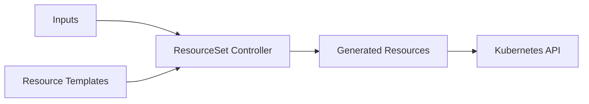

# How to Use Flux Operator ResourceSet API

Author: [nawazdhandala](https://github.com/nawazdhandala)

Tags: Flux, Flux-Operator, ResourceSets, Kubernetes, GitOps, Templating

Description: Learn how to use the Flux Operator ResourceSet API to dynamically generate Kubernetes resources from templates and input data.

---

## Introduction

The Flux Operator ResourceSet API provides a powerful templating mechanism for generating Kubernetes resources dynamically. Unlike static manifests that require duplication for each environment or tenant, ResourceSets let you define resource templates once and instantiate them with different input data. This is particularly useful for multi-tenant setups, ephemeral environments, and any scenario where you need to create similar resources with varying configurations.

This guide covers the ResourceSet CRD, its input sources, templating syntax, and practical examples for common use cases.

## Prerequisites

- A Kubernetes cluster (v1.28 or later)
- kubectl configured to access your cluster
- The Flux Operator installed in your cluster
- Flux controllers running (via FluxInstance)

## Understanding the ResourceSet CRD

A ResourceSet consists of two main parts:

1. **Inputs**: Data sources that provide values for template rendering. These can be inline values or values exported by ResourceSetInputProvider resources.
2. **Resources**: Kubernetes resource templates that use `<< inputs.fieldname >>` syntax to reference input values.


```mermaid
graph LR
    A[Inputs] --> B[ResourceSet Controller]
    C[Resource Templates] --> B
    B --> D[Generated Resources]
    D --> E[Kubernetes API]
```

## Basic ResourceSet Example

Here is a simple ResourceSet that creates a namespace and a GitRepository for each team:

```yaml
apiVersion: fluxcd.controlplane.io/v1
kind: ResourceSet
metadata:
  name: team-resources
  namespace: flux-system
spec:
  inputs:
    - team: "frontend"
      repo: "https://github.com/org/frontend-apps.git"
      branch: "main"
    - team: "backend"
      repo: "https://github.com/org/backend-apps.git"
      branch: "main"
    - team: "data"
      repo: "https://github.com/org/data-pipelines.git"
      branch: "main"
  resources:
    - apiVersion: v1
      kind: Namespace
      metadata:
        name: "team-<< inputs.team >>"
    - apiVersion: source.toolkit.fluxcd.io/v1
      kind: GitRepository
      metadata:
        name: "<< inputs.team >>-repo"
        namespace: "team-<< inputs.team >>"
      spec:
        interval: 5m
        url: "<< inputs.repo >>"
        ref:
          branch: "<< inputs.branch >>"
    - apiVersion: kustomize.toolkit.fluxcd.io/v1
      kind: Kustomization
      metadata:
        name: "<< inputs.team >>-apps"
        namespace: "team-<< inputs.team >>"
      spec:
        interval: 10m
        sourceRef:
          kind: GitRepository
          name: "<< inputs.team >>-repo"
        path: ./deploy
        prune: true
```

Apply this ResourceSet:

```bash
kubectl apply -f team-resources.yaml
```

## Inputs from ResourceSetInputProviders

Instead of defining all input data inline, you can reference ResourceSetInputProvider objects with `spec.inputsFrom`. For static values that you want to keep in a separate object, use a ResourceSetInputProvider with `spec.type: Static`:

```yaml
apiVersion: fluxcd.controlplane.io/v1
kind: ResourceSetInputProvider
metadata:
  name: tenant-config
  namespace: flux-system
spec:
  type: Static
  defaultValues:
    name: "acme"
    environment: "production"
    replicas: "3"
---
apiVersion: fluxcd.controlplane.io/v1
kind: ResourceSet
metadata:
  name: tenant-resources
  namespace: flux-system
spec:
  inputsFrom:
    - kind: ResourceSetInputProvider
      name: tenant-config
  resources:
    - apiVersion: v1
      kind: Namespace
      metadata:
        name: "tenant-<< inputs.name >>"
        labels:
          environment: "<< inputs.environment >>"
    - apiVersion: kustomize.toolkit.fluxcd.io/v1
      kind: Kustomization
      metadata:
        name: "<< inputs.name >>-apps"
        namespace: "tenant-<< inputs.name >>"
      spec:
        interval: 10m
        sourceRef:
          kind: GitRepository
          name: fleet-repo
          namespace: flux-system
        path: "./tenants/<< inputs.name >>"
        prune: true
```

## Copying Data from Secrets

For sensitive configuration data, generate Secrets by copying data from an existing Secret with the `fluxcd.controlplane.io/copyFrom` annotation:

```yaml
apiVersion: v1
kind: Secret
metadata:
  name: db-credentials
  namespace: flux-system
type: Opaque
stringData:
  DB_HOST: "db.internal"
  DB_PASSWORD: "s3cret"
---
apiVersion: fluxcd.controlplane.io/v1
kind: ResourceSet
metadata:
  name: db-secrets
  namespace: flux-system
spec:
  inputs:
    - name: "app-db"
    - name: "analytics-db"
  resources:
    - apiVersion: v1
      kind: Secret
      metadata:
        name: "<< inputs.name >>-credentials"
        namespace: app
        annotations:
          fluxcd.controlplane.io/copyFrom: "flux-system/db-credentials"
      type: Opaque
```

## Template Functions

ResourceSet templates support Go template functions for string manipulation:

```yaml
resources:
  - apiVersion: v1
    kind: ConfigMap
    metadata:
      name: "<< inputs.name | lower >>-config"
      namespace: "<< inputs.namespace >>"
    data:
      app-name: "<< inputs.name | upper >>"
      environment: "<< inputs.env >>"
```

## Lifecycle Management

The ResourceSet controller manages the lifecycle of generated resources:

- **Creation**: Resources are created when the ResourceSet is applied.
- **Updates**: When inputs change, resources are updated accordingly.
- **Deletion**: When an input entry is removed, the corresponding generated resources are deleted.
- **Inventory and garbage collection**: Generated resources are tracked in the ResourceSet inventory. Deleting the ResourceSet deletes the generated resources unless garbage collection is disabled with the supported prune annotation.

## Verifying ResourceSet Status

Check the status of your ResourceSet:

```bash
kubectl get resourcesets -n flux-system
kubectl describe resourceset team-resources -n flux-system
```

The status shows the number of resources generated and any errors:

```bash
kubectl get resourceset team-resources -n flux-system -o jsonpath='{.status.conditions[*].message}'
```

## Conclusion

The Flux Operator ResourceSet API brings dynamic resource generation to your GitOps workflow. By separating data from templates, you can manage multiple teams, tenants, or environments without duplicating manifests. Use inline data for simple cases, ResourceSetInputProviders for decoupled or externally generated inputs, and Secret copy annotations for sensitive data that must be propagated into generated resources. The ResourceSet controller handles the full lifecycle of generated resources, ensuring they stay in sync with your input data.
