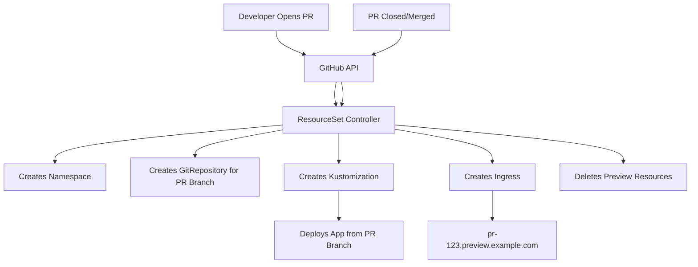

# How to Use Flux Operator ResourceSet for PR Preview Environments

Author: [nawazdhandala](https://github.com/nawazdhandala)

Tags: flux, flux-operator, resourceset, preview-environments, pull-requests, github, kubernetes, gitops

Description: Learn how to use Flux Operator ResourceSet to automatically create and destroy preview environments for GitHub pull requests.

---

## Introduction

Preview environments let developers see their changes running in a real Kubernetes cluster before merging to the main branch. Each pull request gets its own isolated environment with its own namespace, services, and ingress. When the PR is closed or merged, the environment is automatically cleaned up.

The Flux Operator ResourceSet API, combined with its GitHub input source, makes this pattern straightforward to implement. The ResourceSet controller watches for open pull requests and generates the necessary Kubernetes resources for each one. This guide walks you through setting up automated PR preview environments using ResourceSet.

## Prerequisites

- A Kubernetes cluster (v1.28 or later)
- kubectl configured to access your cluster
- The Flux Operator installed with a FluxInstance
- A GitHub repository with your application code
- A GitHub personal access token with `repo` scope
- An ingress controller installed (e.g., NGINX Ingress)

## Architecture Overview



## Creating the GitHub Token Secret

First, create a Secret with your GitHub token so the ResourceSet controller can query the GitHub API:

```bash
kubectl create secret generic github-token \
  --namespace=flux-system \
  --from-literal=token=ghp_your_github_token_here
```

## Configuring the ResourceSet for PR Previews

Create a ResourceSet that watches for open pull requests and generates preview environments:

```yaml
apiVersion: fluxcd.controlplane.io/v1
kind: ResourceSet
metadata:
  name: pr-previews
  namespace: flux-system
spec:
  inputs:
    - github:
        owner: my-org
        repo: my-app
        token:
          secretRef:
            name: github-token
            key: token
        pullRequests:
          labels:
            - preview
          interval: 1m
  resources:
    - apiVersion: v1
      kind: Namespace
      metadata:
        name: "pr-{{ .number }}"
        labels:
          preview: "true"
          pr-number: "{{ .number }}"
    - apiVersion: source.toolkit.fluxcd.io/v1
      kind: GitRepository
      metadata:
        name: "pr-{{ .number }}"
        namespace: "pr-{{ .number }}"
      spec:
        interval: 1m
        url: "https://github.com/my-org/my-app.git"
        ref:
          branch: "{{ .head_branch }}"
    - apiVersion: kustomize.toolkit.fluxcd.io/v1
      kind: Kustomization
      metadata:
        name: "pr-{{ .number }}"
        namespace: "pr-{{ .number }}"
      spec:
        interval: 5m
        sourceRef:
          kind: GitRepository
          name: "pr-{{ .number }}"
        path: ./deploy/preview
        prune: true
        postBuild:
          substitute:
            PR_NUMBER: "{{ .number }}"
            PR_BRANCH: "{{ .head_branch }}"
            PREVIEW_HOST: "pr-{{ .number }}.preview.example.com"
    - apiVersion: networking.k8s.io/v1
      kind: Ingress
      metadata:
        name: "pr-{{ .number }}"
        namespace: "pr-{{ .number }}"
        annotations:
          nginx.ingress.kubernetes.io/rewrite-target: /
      spec:
        ingressClassName: nginx
        rules:
          - host: "pr-{{ .number }}.preview.example.com"
            http:
              paths:
                - path: /
                  pathType: Prefix
                  backend:
                    service:
                      name: app
                      port:
                        number: 80
```

Apply this ResourceSet:

```bash
kubectl apply -f pr-previews.yaml
```

## How It Works

The ResourceSet controller performs the following actions:

1. **Polls GitHub**: Every minute (as specified by `interval`), the controller queries the GitHub API for open pull requests with the `preview` label.
2. **Generates Resources**: For each matching PR, it renders the resource templates using the PR metadata (number, branch name, author, etc.).
3. **Creates Environments**: The generated resources are applied to the cluster, creating a namespace, GitRepository, Kustomization, and Ingress for each PR.
4. **Cleans Up**: When a PR is closed or merged (or the `preview` label is removed), the controller deletes the corresponding resources.

## Available Template Variables

The GitHub pull request input provides these variables for templates:

- `{{ .number }}`: The PR number
- `{{ .head_branch }}`: The source branch name
- `{{ .head_sha }}`: The latest commit SHA on the PR branch
- `{{ .title }}`: The PR title
- `{{ .author }}`: The PR author's username

## Configuring the Preview Application

In your application repository, create a `deploy/preview` directory with a Kustomization that uses variable substitution:

```yaml
# deploy/preview/kustomization.yaml
apiVersion: kustomize.config.k8s.io/v1beta1
kind: Kustomization
resources:
  - ../base
patches:
  - target:
      kind: Deployment
      name: app
    patch: |
      - op: replace
        path: /spec/replicas
        value: 1
      - op: add
        path: /spec/template/spec/containers/0/env/-
        value:
          name: PREVIEW_HOST
          value: "${PREVIEW_HOST}"
```

## Adding Resource Limits for Preview Environments

To prevent preview environments from consuming too many cluster resources, add ResourceQuotas:

```yaml
# Add to the resources array in the ResourceSet
- apiVersion: v1
  kind: ResourceQuota
  metadata:
    name: preview-quota
    namespace: "pr-{{ .number }}"
  spec:
    hard:
      requests.cpu: "500m"
      requests.memory: "512Mi"
      limits.cpu: "1"
      limits.memory: "1Gi"
      pods: "10"
```

## Setting Up Wildcard DNS

For the preview URLs to work, configure a wildcard DNS record:

```
*.preview.example.com -> <ingress-controller-ip>
```

Or use a wildcard TLS certificate with cert-manager:

```yaml
apiVersion: cert-manager.io/v1
kind: Certificate
metadata:
  name: preview-wildcard
  namespace: flux-system
spec:
  secretName: preview-wildcard-tls
  dnsNames:
    - "*.preview.example.com"
  issuerRef:
    name: letsencrypt-prod
    kind: ClusterIssuer
```

## Verifying Preview Environments

Check which preview environments are running:

```bash
kubectl get namespaces -l preview=true
kubectl get resourceset pr-previews -n flux-system
```

View the status of a specific preview:

```bash
kubectl get all -n pr-42
```

## Conclusion

Using the Flux Operator ResourceSet for PR preview environments gives your team instant feedback on changes in a real Kubernetes environment. The GitHub input source automates the lifecycle: environments are created when PRs are labeled and destroyed when PRs are closed. Combined with Flux's GitOps reconciliation, each preview environment stays in sync with the latest commits on the PR branch. This approach requires minimal CI/CD configuration and leverages the Kubernetes-native capabilities of the Flux Operator.
