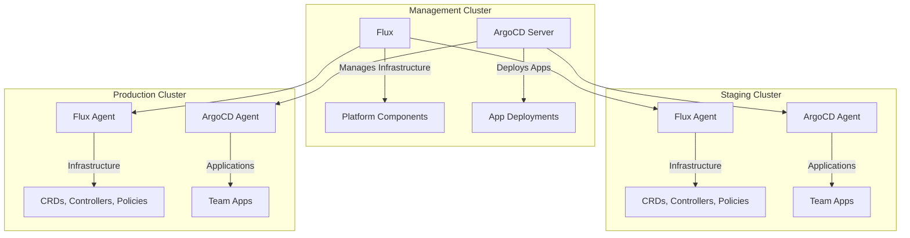
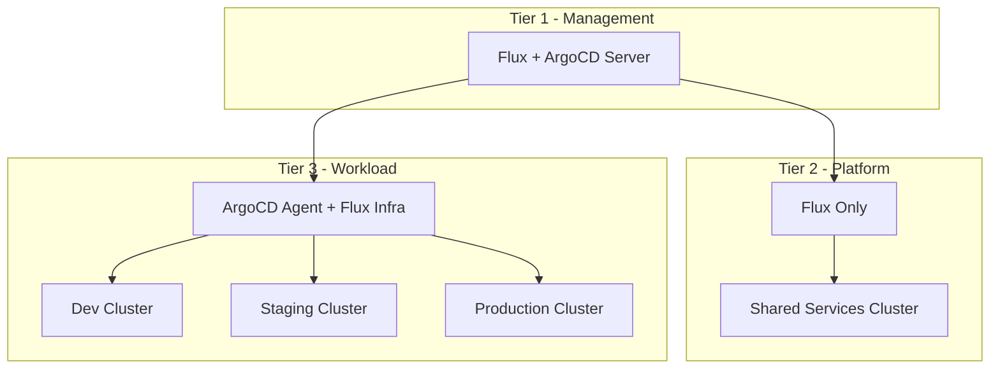

# How to Use Flux with ArgoCD for Different Cluster Tiers

Author: [nawazdhandala](https://github.com/nawazdhandala)

Tags: Flux, Kubernetes, GitOps, Multi-Cluster, ArgoCD, Hybrid GitOps, Cluster Tiers

Description: Learn how to combine Flux and ArgoCD in a multi-cluster setup where each tool handles different cluster tiers or responsibilities.

---

Flux and ArgoCD are both mature GitOps tools, and there are valid reasons to use both in a single organization. Some teams prefer ArgoCD's UI for application deployment visibility while relying on Flux for infrastructure and platform management. This guide shows you how to run Flux and ArgoCD together across different cluster tiers, with clear boundaries between what each tool manages.

## Why Combine Flux and ArgoCD

Each tool has strengths that complement the other:

- **Flux** excels at infrastructure management, Helm controller operations, dependency ordering, and multi-tenancy through Kustomization resources.
- **ArgoCD** excels at application deployment visualization, progressive delivery UIs, RBAC for developer self-service, and application-level sync status dashboards.

A common pattern is to use Flux for platform and infrastructure management on all clusters, and ArgoCD for application deployments that development teams interact with.



## Defining the Boundary

The key to running both tools successfully is a clear boundary. Here is a recommended split:

| Component | Managed By | Reason |
|-----------|-----------|--------|
| CRDs | Flux | Dependency ordering with `wait: true` |
| Cert-Manager | Flux | Infrastructure dependency |
| Ingress Controller | Flux | Platform component |
| Monitoring Stack | Flux | Infrastructure concern |
| Policy Engine | Flux | Must be in place before apps deploy |
| Namespaces and RBAC | Flux | Platform team responsibility |
| ArgoCD itself | Flux | Bootstrapping ArgoCD is an infra task |
| Application workloads | ArgoCD | Developer self-service with UI |
| Application configs | ArgoCD | Teams manage their own deployments |

## Repository Structure

```text
fleet-repo/
├── infrastructure/
│   ├── flux-managed/
│   │   ├── cert-manager/
│   │   ├── ingress-nginx/
│   │   ├── monitoring/
│   │   ├── kyverno/
│   │   └── kustomization.yaml
│   └── argocd/
│       ├── namespace.yaml
│       ├── release.yaml
│       ├── values.yaml
│       ├── projects/
│       │   ├── team-alpha.yaml
│       │   └── team-beta.yaml
│       ├── applicationsets/
│       │   ├── team-alpha-apps.yaml
│       │   └── team-beta-apps.yaml
│       └── kustomization.yaml
├── clusters/
│   ├── staging/
│   │   ├── flux-system/
│   │   ├── infrastructure.yaml
│   │   └── argocd.yaml
│   └── production/
│       ├── flux-system/
│       ├── infrastructure.yaml
│       └── argocd.yaml
```

## Deploying ArgoCD with Flux

Flux manages the installation and configuration of ArgoCD itself:

```yaml
# infrastructure/argocd/namespace.yaml
apiVersion: v1
kind: Namespace
metadata:
  name: argocd
```

```yaml
# infrastructure/argocd/release.yaml
apiVersion: helm.toolkit.fluxcd.io/v2
kind: HelmRelease
metadata:
  name: argocd
  namespace: argocd
spec:
  interval: 30m
  chart:
    spec:
      chart: argo-cd
      version: "6.x"
      sourceRef:
        kind: HelmRepository
        name: argocd
        namespace: flux-system
  install:
    crds: CreateReplace
    remediation:
      retries: 3
  upgrade:
    crds: CreateReplace
    remediation:
      retries: 3
  values:
    server:
      replicas: 2
      ingress:
        enabled: true
        ingressClassName: nginx
        hosts:
          - argocd.${cluster_domain}
        tls:
          - secretName: argocd-tls
            hosts:
              - argocd.${cluster_domain}
    controller:
      replicas: 1
      resources:
        requests:
          cpu: 500m
          memory: 512Mi
    repoServer:
      replicas: 2
    applicationSet:
      replicas: 2
    configs:
      params:
        server.insecure: false
      cm:
        admin.enabled: "false"
        dex.config: |
          connectors:
            - type: github
              id: github
              name: GitHub
              config:
                clientID: ${argocd_github_client_id}
                clientSecret: ${argocd_github_client_secret}
                orgs:
                  - name: my-org
```

## Flux Kustomization for ArgoCD

```yaml
# clusters/staging/argocd.yaml
apiVersion: kustomize.toolkit.fluxcd.io/v1
kind: Kustomization
metadata:
  name: argocd
  namespace: flux-system
spec:
  interval: 10m
  path: ./infrastructure/argocd
  prune: true
  sourceRef:
    kind: GitRepository
    name: flux-system
  dependsOn:
    - name: infrastructure-controllers
  wait: true
  timeout: 10m
  postBuild:
    substituteFrom:
      - kind: ConfigMap
        name: cluster-vars
      - kind: Secret
        name: cluster-secrets
        optional: true
```

## Configuring ArgoCD Projects

Define ArgoCD projects to scope what each team can deploy:

```yaml
# infrastructure/argocd/projects/team-alpha.yaml
apiVersion: argoproj.io/v1alpha1
kind: AppProject
metadata:
  name: team-alpha
  namespace: argocd
spec:
  description: Team Alpha Applications
  sourceRepos:
    - "https://github.com/my-org/team-alpha-*"
  destinations:
    - namespace: "team-alpha-*"
      server: "https://kubernetes.default.svc"
    - namespace: "team-alpha-*"
      server: "${staging_cluster_url}"
    - namespace: "team-alpha-*"
      server: "${production_cluster_url}"
  clusterResourceWhitelist: []
  namespaceResourceWhitelist:
    - group: ""
      kind: "*"
    - group: "apps"
      kind: "*"
    - group: "networking.k8s.io"
      kind: "Ingress"
  roles:
    - name: admin
      description: Team Alpha admins
      policies:
        - p, proj:team-alpha:admin, applications, *, team-alpha/*, allow
      groups:
        - my-org:team-alpha
```

## Using ArgoCD ApplicationSets for Multi-Cluster Apps

ApplicationSets let ArgoCD deploy applications across multiple clusters:

```yaml
# infrastructure/argocd/applicationsets/team-alpha-apps.yaml
apiVersion: argoproj.io/v1alpha1
kind: ApplicationSet
metadata:
  name: team-alpha-apps
  namespace: argocd
spec:
  generators:
    - matrix:
        generators:
          - git:
              repoURL: https://github.com/my-org/team-alpha-apps
              revision: HEAD
              directories:
                - path: "apps/*"
          - list:
              elements:
                - cluster: staging
                  url: https://staging.k8s.internal
                  overlay: staging
                - cluster: production
                  url: https://production.k8s.internal
                  overlay: production
  template:
    metadata:
      name: "team-alpha-{{path.basename}}-{{cluster}}"
    spec:
      project: team-alpha
      source:
        repoURL: https://github.com/my-org/team-alpha-apps
        targetRevision: HEAD
        path: "apps/{{path.basename}}/overlays/{{overlay}}"
      destination:
        server: "{{url}}"
        namespace: "team-alpha-{{path.basename}}"
      syncPolicy:
        automated:
          prune: true
          selfHeal: true
        syncOptions:
          - CreateNamespace=false
```

## Preventing Conflicts Between Flux and ArgoCD

The most important rule is that Flux and ArgoCD must never manage the same resources. Enforce this through:

### Label-Based Separation

```yaml
# Flux-managed resources get this label
metadata:
  labels:
    app.kubernetes.io/managed-by: flux

# ArgoCD-managed resources get this label
metadata:
  labels:
    app.kubernetes.io/managed-by: argocd
```

### Namespace-Based Separation

Flux manages infrastructure namespaces, ArgoCD manages application namespaces:

```yaml
# Flux creates the namespace with resource quotas
apiVersion: v1
kind: Namespace
metadata:
  name: team-alpha-frontend
  labels:
    app.kubernetes.io/managed-by: flux
    argocd.argoproj.io/managed-by: argocd  # Allow ArgoCD to deploy into it
---
apiVersion: v1
kind: ResourceQuota
metadata:
  name: team-alpha-quota
  namespace: team-alpha-frontend
spec:
  hard:
    requests.cpu: "4"
    requests.memory: 8Gi
    limits.cpu: "8"
    limits.memory: 16Gi
    pods: "50"
```

### ArgoCD Resource Tracking Exclusion

Configure ArgoCD to ignore Flux-managed resources:

```yaml
# ArgoCD ConfigMap
configs:
  cm:
    resource.exclusions: |
      - apiGroups:
          - "kustomize.toolkit.fluxcd.io"
          - "helm.toolkit.fluxcd.io"
          - "source.toolkit.fluxcd.io"
          - "notification.toolkit.fluxcd.io"
          - "image.toolkit.fluxcd.io"
        kinds:
          - "*"
        clusters:
          - "*"
```

## Tiered Cluster Architecture



- **Tier 1 (Management)**: Runs both Flux and the ArgoCD control plane. Flux manages all infrastructure, ArgoCD manages application deployments to downstream clusters.
- **Tier 2 (Platform)**: Flux-only clusters for shared services (databases, message queues, observability). No application team access.
- **Tier 3 (Workload)**: Clusters where applications run. Flux manages infrastructure, ArgoCD deploys applications. Teams interact with ArgoCD UI.

## Monitoring the Hybrid Setup

```bash
# Check Flux-managed components
flux get kustomizations -A
flux get helmreleases -A

# Check ArgoCD applications
kubectl get applications -n argocd
kubectl get applicationsets -n argocd

# Verify no resource conflicts
kubectl get all -A -l app.kubernetes.io/managed-by=flux --show-labels
kubectl get all -A -l app.kubernetes.io/managed-by=argocd --show-labels

# Check ArgoCD health (managed by Flux)
flux get helmrelease argocd -n argocd
```

## Conclusion

Running Flux and ArgoCD together in a multi-cluster environment gives you the infrastructure management strengths of Flux combined with the developer-friendly application deployment experience of ArgoCD. The key is maintaining a clear boundary: Flux manages infrastructure, platform components, and even ArgoCD itself, while ArgoCD handles application deployments with its visual interface and team-scoped projects. By using namespace-based separation and resource exclusion rules, you prevent conflicts and give each tool clear ownership of its domain.
