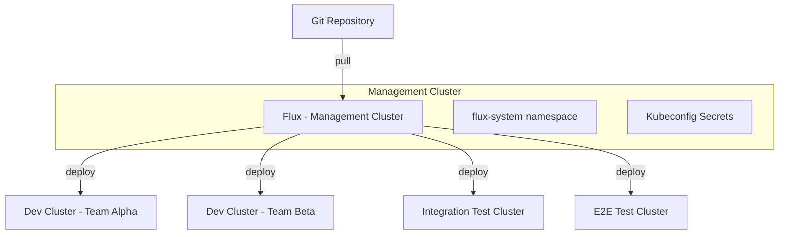

# How to Use Management Cluster for Dev and Test Environments with Flux

Author: [nawazdhandala](https://github.com/nawazdhandala)

Tags: Flux, Kubernetes, GitOps, Multi-Cluster, Management Cluster, Dev Environment, Test Environment, Hub-and-Spoke

Description: Learn how to use a centralized Flux management cluster to orchestrate deployments across development and test Kubernetes environments.

---

Development and test environments share common characteristics: they change frequently, they tolerate more risk, and they benefit from centralized oversight. Using a Flux management cluster to control these environments simplifies operations and gives your platform team a single pane of glass for all non-production workloads.

## Architecture Overview

A single management cluster runs Flux and deploys resources to multiple dev and test clusters using remote kubeconfigs. This removes the need to install and maintain Flux on each non-production cluster.



## Prerequisites

- A management cluster with Flux installed
- Two or more non-production clusters (dev, test, QA)
- `kubectl` and `flux` CLI
- Git repository access
- Network connectivity from the management cluster to all target clusters

## Step 1: Bootstrap the Management Cluster

```bash
kubectl config use-context management

flux bootstrap github \
  --owner=your-org \
  --repository=fleet-repo \
  --branch=main \
  --path=clusters/management \
  --personal
```

## Step 2: Prepare Target Clusters

On each dev and test cluster, create a service account that the management cluster will use:

```bash
for CLUSTER in dev-alpha dev-beta test-integration test-e2e; do
  kubectl config use-context $CLUSTER
  kubectl apply -f - <<EOF
apiVersion: v1
kind: Namespace
metadata:
  name: flux-system
---
apiVersion: v1
kind: ServiceAccount
metadata:
  name: flux-reconciler
  namespace: flux-system
---
apiVersion: v1
kind: Secret
metadata:
  name: flux-reconciler-token
  namespace: flux-system
  annotations:
    kubernetes.io/service-account.name: flux-reconciler
type: kubernetes.io/service-account-token
---
apiVersion: rbac.authorization.k8s.io/v1
kind: ClusterRoleBinding
metadata:
  name: flux-reconciler
roleRef:
  apiGroup: rbac.authorization.k8s.io
  kind: ClusterRole
  name: cluster-admin
subjects:
  - kind: ServiceAccount
    name: flux-reconciler
    namespace: flux-system
EOF
done
```

## Step 3: Create Kubeconfig Secrets

Generate a kubeconfig for each target cluster and store it as a secret on the management cluster:

```bash
kubectl config use-context management

for CLUSTER in dev-alpha dev-beta test-integration test-e2e; do
  SERVER=$(kubectl --context=$CLUSTER config view --minify -o jsonpath='{.clusters[0].cluster.server}')
  TOKEN=$(kubectl --context=$CLUSTER -n flux-system get secret flux-reconciler-token -o jsonpath='{.data.token}' | base64 -d)
  CA=$(kubectl --context=$CLUSTER -n flux-system get secret flux-reconciler-token -o jsonpath='{.data.ca\.crt}')

  kubectl create secret generic ${CLUSTER}-kubeconfig \
    --namespace=flux-system \
    --from-literal=value="
apiVersion: v1
kind: Config
clusters:
  - cluster:
      server: ${SERVER}
      certificate-authority-data: ${CA}
    name: ${CLUSTER}
contexts:
  - context:
      cluster: ${CLUSTER}
      user: flux-reconciler
    name: ${CLUSTER}
current-context: ${CLUSTER}
users:
  - name: flux-reconciler
    user:
      token: ${TOKEN}
"
done
```

## Step 4: Structure the Repository

Organize your repository to clearly separate environments:

```
fleet-repo/
├── clusters/
│   └── management/
│       ├── flux-system/
│       ├── dev-alpha.yaml
│       ├── dev-beta.yaml
│       ├── test-integration.yaml
│       └── test-e2e.yaml
├── infrastructure/
│   ├── base/
│   │   ├── namespaces/
│   │   ├── cert-manager/
│   │   └── ingress-nginx/
│   └── overlays/
│       ├── dev/
│       └── test/
├── apps/
│   ├── base/
│   │   ├── frontend/
│   │   ├── backend/
│   │   └── database/
│   └── overlays/
│       ├── dev-alpha/
│       ├── dev-beta/
│       ├── test-integration/
│       └── test-e2e/
└── test-fixtures/
    ├── integration/
    └── e2e/
```

## Step 5: Define Kustomizations for Dev Clusters

Dev clusters typically need fast reconciliation intervals and relaxed resource limits. Create `clusters/management/dev-alpha.yaml`:

```yaml
apiVersion: kustomize.toolkit.fluxcd.io/v1
kind: Kustomization
metadata:
  name: dev-alpha-infrastructure
  namespace: flux-system
spec:
  interval: 2m
  retryInterval: 1m
  sourceRef:
    kind: GitRepository
    name: flux-system
  path: ./infrastructure/overlays/dev
  prune: true
  wait: true
  kubeConfig:
    secretRef:
      name: dev-alpha-kubeconfig
---
apiVersion: kustomize.toolkit.fluxcd.io/v1
kind: Kustomization
metadata:
  name: dev-alpha-apps
  namespace: flux-system
spec:
  interval: 2m
  retryInterval: 1m
  dependsOn:
    - name: dev-alpha-infrastructure
  sourceRef:
    kind: GitRepository
    name: flux-system
  path: ./apps/overlays/dev-alpha
  prune: true
  kubeConfig:
    secretRef:
      name: dev-alpha-kubeconfig
```

## Step 6: Define Kustomizations for Test Clusters

Test clusters may include additional test fixture data. Create `clusters/management/test-integration.yaml`:

```yaml
apiVersion: kustomize.toolkit.fluxcd.io/v1
kind: Kustomization
metadata:
  name: test-integration-infrastructure
  namespace: flux-system
spec:
  interval: 5m
  sourceRef:
    kind: GitRepository
    name: flux-system
  path: ./infrastructure/overlays/test
  prune: true
  wait: true
  kubeConfig:
    secretRef:
      name: test-integration-kubeconfig
---
apiVersion: kustomize.toolkit.fluxcd.io/v1
kind: Kustomization
metadata:
  name: test-integration-apps
  namespace: flux-system
spec:
  interval: 5m
  dependsOn:
    - name: test-integration-infrastructure
  sourceRef:
    kind: GitRepository
    name: flux-system
  path: ./apps/overlays/test-integration
  prune: true
  kubeConfig:
    secretRef:
      name: test-integration-kubeconfig
---
apiVersion: kustomize.toolkit.fluxcd.io/v1
kind: Kustomization
metadata:
  name: test-integration-fixtures
  namespace: flux-system
spec:
  interval: 5m
  dependsOn:
    - name: test-integration-apps
  sourceRef:
    kind: GitRepository
    name: flux-system
  path: ./test-fixtures/integration
  prune: true
  kubeConfig:
    secretRef:
      name: test-integration-kubeconfig
```

## Step 7: Configure Dev-Specific Overlays

Dev environments typically run with minimal resources. Create `apps/overlays/dev-alpha/kustomization.yaml`:

```yaml
apiVersion: kustomize.config.k8s.io/v1beta1
kind: Kustomization
resources:
  - ../../base/frontend
  - ../../base/backend
  - ../../base/database
patches:
  - target:
      kind: Deployment
    patch: |
      - op: replace
        path: /spec/replicas
        value: 1
      - op: add
        path: /spec/template/spec/containers/0/resources
        value:
          requests:
            cpu: 50m
            memory: 64Mi
          limits:
            cpu: 200m
            memory: 256Mi
```

## Step 8: Enable Image Automation for Dev

Let Flux automatically update dev environments when new images are pushed:

```yaml
apiVersion: image.toolkit.fluxcd.io/v1beta2
kind: ImageRepository
metadata:
  name: frontend
  namespace: flux-system
spec:
  image: ghcr.io/your-org/frontend
  interval: 1m
---
apiVersion: image.toolkit.fluxcd.io/v1beta2
kind: ImagePolicy
metadata:
  name: frontend-dev
  namespace: flux-system
spec:
  imageRepositoryRef:
    name: frontend
  filterTags:
    pattern: '^dev-[a-f0-9]+-(?P<ts>[0-9]+)'
    extract: '$ts'
  policy:
    numerical:
      order: asc
---
apiVersion: image.toolkit.fluxcd.io/v1beta2
kind: ImageUpdateAutomation
metadata:
  name: dev-auto-update
  namespace: flux-system
spec:
  interval: 1m
  sourceRef:
    kind: GitRepository
    name: flux-system
  git:
    checkout:
      ref:
        branch: main
    commit:
      author:
        email: flux@your-org.com
        name: Flux
      messageTemplate: 'chore(dev): update images'
    push:
      branch: main
  update:
    path: ./apps/overlays/dev-alpha
    strategy: Setters
```

## Step 9: Monitor All Environments

From the management cluster, get a complete view of all environments:

```bash
kubectl config use-context management

# See all Kustomizations and their status
flux get kustomizations

# Filter by environment
flux get kustomizations | grep dev
flux get kustomizations | grep test

# Watch for reconciliation issues
flux events --watch
```

Set up notifications for failed reconciliations:

```yaml
apiVersion: notification.toolkit.fluxcd.io/v1beta3
kind: Provider
metadata:
  name: slack-dev
  namespace: flux-system
spec:
  type: slack
  channel: dev-deployments
  secretRef:
    name: slack-webhook
---
apiVersion: notification.toolkit.fluxcd.io/v1beta3
kind: Alert
metadata:
  name: dev-test-alerts
  namespace: flux-system
spec:
  providerRef:
    name: slack-dev
  eventSeverity: error
  eventSources:
    - kind: Kustomization
      name: 'dev-*'
    - kind: Kustomization
      name: 'test-*'
```

## Ephemeral Test Clusters

For CI pipelines, you can dynamically create test clusters and register them with the management cluster:

```bash
# In your CI pipeline
kind create cluster --name test-pr-$PR_NUMBER

# Register with management cluster
kubectl --context=management create secret generic test-pr-${PR_NUMBER}-kubeconfig \
  --namespace=flux-system \
  --from-file=value=test-kubeconfig.yaml

# Create Kustomization targeting the ephemeral cluster
kubectl --context=management apply -f - <<EOF
apiVersion: kustomize.toolkit.fluxcd.io/v1
kind: Kustomization
metadata:
  name: test-pr-${PR_NUMBER}
  namespace: flux-system
spec:
  interval: 2m
  sourceRef:
    kind: GitRepository
    name: flux-system
  path: ./apps/overlays/test-integration
  prune: true
  kubeConfig:
    secretRef:
      name: test-pr-${PR_NUMBER}-kubeconfig
EOF
```

After tests complete, clean up:

```bash
kubectl --context=management delete kustomization test-pr-${PR_NUMBER} -n flux-system
kubectl --context=management delete secret test-pr-${PR_NUMBER}-kubeconfig -n flux-system
kind delete cluster --name test-pr-$PR_NUMBER
```

## Summary

Using a management cluster for dev and test environments centralizes operational overhead where it matters least and provides a single point of visibility for all non-production deployments. Dev clusters can use aggressive reconciliation intervals and automatic image updates, while test clusters can include fixtures and test data. This pattern keeps your non-production fleet manageable as your team and application portfolio grows.
