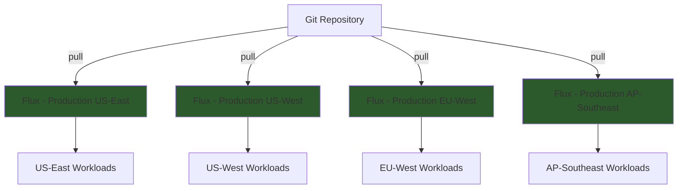

# How to Use Standalone Clusters for Production with Flux

Author: [nawazdhandala](https://github.com/nawazdhandala)

Tags: Flux, Kubernetes, GitOps, Multi-Cluster, Standalone Mode, Production, High Availability, Disaster Recovery

Description: A guide to running production Kubernetes clusters in standalone mode with Flux CD for maximum resilience, fault isolation, and operational independence.

---

Production clusters demand the highest levels of reliability and fault isolation. Running Flux in standalone mode on each production cluster ensures that no single point of failure can take down your production deployments. Each cluster is fully self-sufficient, reconciling directly from Git without depending on any external management plane.

## Why Standalone Mode for Production?

When a management cluster controls production deployments via hub-and-spoke, any issue with that management cluster (network partition, resource exhaustion, accidental deletion) can block deployments to all production clusters simultaneously. Standalone mode eliminates this risk entirely.



Each production cluster operates independently. A failure in one region has zero impact on the others.

## Prerequisites

- Two or more production Kubernetes clusters
- `kubectl` and `flux` CLI installed
- A Git repository for your fleet configuration
- SOPS or Sealed Secrets for secret management
- Monitoring infrastructure (Prometheus, Grafana)

## Step 1: Plan the Repository Layout

Each production cluster gets a dedicated path in the repository:

```text
fleet-repo/
├── clusters/
│   ├── production-us-east/
│   │   ├── flux-system/
│   │   ├── infrastructure.yaml
│   │   └── apps.yaml
│   ├── production-us-west/
│   │   ├── flux-system/
│   │   ├── infrastructure.yaml
│   │   └── apps.yaml
│   ├── production-eu-west/
│   │   ├── flux-system/
│   │   ├── infrastructure.yaml
│   │   └── apps.yaml
│   └── production-ap-southeast/
│       ├── flux-system/
│       ├── infrastructure.yaml
│       └── apps.yaml
├── infrastructure/
│   ├── base/
│   │   ├── cert-manager/
│   │   ├── ingress-nginx/
│   │   ├── monitoring/
│   │   └── external-dns/
│   └── production/
│       ├── base/
│       ├── us-east/
│       ├── us-west/
│       ├── eu-west/
│       └── ap-southeast/
└── apps/
    ├── base/
    └── production/
        ├── base/
        ├── us-east/
        ├── us-west/
        ├── eu-west/
        └── ap-southeast/
```

## Step 2: Bootstrap Each Production Cluster

Bootstrap Flux on each production cluster independently:

```bash
kubectl config use-context production-us-east

flux bootstrap github \
  --owner=your-org \
  --repository=fleet-repo \
  --branch=main \
  --path=clusters/production-us-east \
  --personal
```

```bash
kubectl config use-context production-us-west

flux bootstrap github \
  --owner=your-org \
  --repository=fleet-repo \
  --branch=main \
  --path=clusters/production-us-west \
  --personal
```

Repeat for all production regions.

## Step 3: Configure Production-Grade Reconciliation

Production Kustomizations should use longer intervals, strict timeouts, and health checks. For `clusters/production-us-east/infrastructure.yaml`:

```yaml
apiVersion: kustomize.toolkit.fluxcd.io/v1
kind: Kustomization
metadata:
  name: infrastructure
  namespace: flux-system
spec:
  interval: 15m
  retryInterval: 5m
  timeout: 10m
  sourceRef:
    kind: GitRepository
    name: flux-system
  path: ./infrastructure/production/us-east
  prune: true
  wait: true
  force: false
  healthChecks:
    - apiVersion: apps/v1
      kind: Deployment
      name: ingress-nginx-controller
      namespace: ingress-nginx
    - apiVersion: apps/v1
      kind: Deployment
      name: cert-manager
      namespace: cert-manager
```

For `clusters/production-us-east/apps.yaml`:

```yaml
apiVersion: kustomize.toolkit.fluxcd.io/v1
kind: Kustomization
metadata:
  name: apps
  namespace: flux-system
spec:
  interval: 15m
  retryInterval: 5m
  timeout: 10m
  dependsOn:
    - name: infrastructure
  sourceRef:
    kind: GitRepository
    name: flux-system
  path: ./apps/production/us-east
  prune: true
  wait: true
  force: false
  healthChecks:
    - apiVersion: apps/v1
      kind: Deployment
      name: frontend
      namespace: production
    - apiVersion: apps/v1
      kind: Deployment
      name: backend
      namespace: production
```

## Step 4: Production Secret Management

Each production cluster must manage its own encryption keys. Use SOPS with age for per-cluster encryption:

```bash
# Generate a unique key per cluster
age-keygen -o production-us-east.agekey

# Store the key as a Kubernetes secret
kubectl config use-context production-us-east
cat production-us-east.agekey | kubectl create secret generic sops-age \
  --namespace=flux-system \
  --from-file=age.agekey=/dev/stdin
```

Create a `.sops.yaml` configuration that uses different keys per cluster path:

```yaml
creation_rules:
  - path_regex: apps/production/us-east/.*\.yaml
    encrypted_regex: ^(data|stringData)$
    age: age1us-east-public-key-here
  - path_regex: apps/production/us-west/.*\.yaml
    encrypted_regex: ^(data|stringData)$
    age: age1us-west-public-key-here
  - path_regex: apps/production/eu-west/.*\.yaml
    encrypted_regex: ^(data|stringData)$
    age: age1eu-west-public-key-here
```

Enable decryption in the Kustomization:

```yaml
apiVersion: kustomize.toolkit.fluxcd.io/v1
kind: Kustomization
metadata:
  name: apps
  namespace: flux-system
spec:
  interval: 15m
  sourceRef:
    kind: GitRepository
    name: flux-system
  path: ./apps/production/us-east
  prune: true
  decryption:
    provider: sops
    secretRef:
      name: sops-age
```

## Step 5: Production Overlays

Production overlays enforce higher resource allocations, stricter security, and multi-replica deployments. For `apps/production/us-east/kustomization.yaml`:

```yaml
apiVersion: kustomize.config.k8s.io/v1beta1
kind: Kustomization
resources:
  - ../base
patches:
  - target:
      kind: Deployment
      name: frontend
    patch: |
      - op: replace
        path: /spec/replicas
        value: 5
      - op: add
        path: /spec/template/spec/containers/0/resources
        value:
          requests:
            cpu: 500m
            memory: 512Mi
          limits:
            cpu: "2"
            memory: 2Gi
      - op: add
        path: /spec/template/spec/topologySpreadConstraints
        value:
          - maxSkew: 1
            topologyKey: topology.kubernetes.io/zone
            whenUnsatisfiable: DoNotSchedule
            labelSelector:
              matchLabels:
                app: frontend
  - target:
      kind: Deployment
      name: backend
    patch: |
      - op: replace
        path: /spec/replicas
        value: 5
```

## Step 6: Set Up Notifications per Cluster

Each standalone cluster should have its own notification pipeline:

```yaml
apiVersion: notification.toolkit.fluxcd.io/v1
kind: Provider
metadata:
  name: slack
  namespace: flux-system
spec:
  type: slack
  channel: production-us-east-deploys
  secretRef:
    name: slack-webhook
---
apiVersion: notification.toolkit.fluxcd.io/v1
kind: Alert
metadata:
  name: production-alerts
  namespace: flux-system
spec:
  providerRef:
    name: slack
  eventSeverity: info
  eventSources:
    - kind: Kustomization
      name: '*'
    - kind: HelmRelease
      name: '*'
  exclusionList:
    - ".*no new revision.*"
```

## Step 7: Implement Rollback Safety

Use Flux's built-in rollback capabilities for production safety. Configure the GitRepository source with a specific commit or tag:

```yaml
apiVersion: source.toolkit.fluxcd.io/v1
kind: GitRepository
metadata:
  name: flux-system
  namespace: flux-system
spec:
  interval: 5m
  url: ssh://git@github.com/your-org/fleet-repo
  ref:
    branch: main
  secretRef:
    name: flux-system
```

For emergency rollbacks, suspend reconciliation and revert:

```bash
# Suspend reconciliation on a specific cluster
flux suspend kustomization apps

# Revert the Git commit
git revert HEAD
git push

# Resume reconciliation
flux resume kustomization apps
```

## Step 8: Monitor Across Standalone Clusters

While each cluster is independent, you still need fleet-wide visibility. Deploy a Prometheus instance on each cluster and use Thanos or Grafana Mimir for aggregated metrics:

```yaml
apiVersion: helm.toolkit.fluxcd.io/v2
kind: HelmRelease
metadata:
  name: kube-prometheus-stack
  namespace: monitoring
spec:
  interval: 30m
  chart:
    spec:
      chart: kube-prometheus-stack
      version: "55.x"
      sourceRef:
        kind: HelmRepository
        name: prometheus-community
        namespace: monitoring
  values:
    prometheus:
      prometheusSpec:
        externalLabels:
          cluster: production-us-east
          region: us-east-1
        thanos:
          objectStorageConfig:
            existingSecret:
              name: thanos-objstore
              key: config
```

## Disaster Recovery

With standalone mode, each cluster can be rebuilt independently:

```bash
# If a cluster needs to be rebuilt from scratch
flux bootstrap github \
  --owner=your-org \
  --repository=fleet-repo \
  --branch=main \
  --path=clusters/production-us-east \
  --personal

# Flux will reconcile all resources from Git automatically
```

Since the entire desired state is in Git, disaster recovery is simply re-bootstrapping Flux on a new cluster pointing to the same path.

## Summary

Running production clusters in standalone mode with Flux provides the highest level of fault isolation and operational independence. Each cluster reconciles directly from Git, manages its own secrets, and operates without any dependency on external control planes. This approach is particularly well-suited for multi-region deployments where network partitions between regions must not affect production availability.
