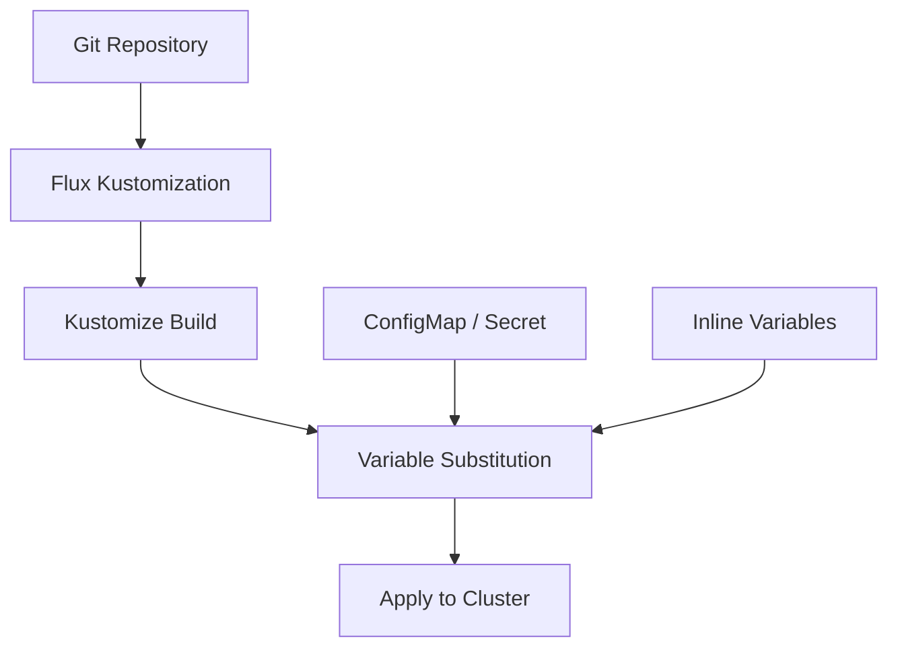

# How to Use Variable Substitution for Cluster Environment in Flux

Author: [nawazdhandala](https://github.com/nawazdhandala)

Tags: Flux, Kubernetes, GitOps, Multi-Cluster, Variable Substitution, Kustomize

Description: Learn how to use Flux variable substitution to customize deployments per cluster environment without duplicating manifests.

---

Managing multiple Kubernetes clusters with Flux becomes significantly easier when you use variable substitution. Instead of maintaining separate manifest files for each cluster, you can write a single set of templates and inject cluster-specific values at reconciliation time. This guide walks you through setting up and using Flux post-build variable substitution for multi-cluster environments.

## Understanding Flux Variable Substitution

Flux supports post-build variable substitution through its Kustomization resource. Variables are defined either inline or via ConfigMaps and Secrets, then substituted into your manifests before they are applied to the cluster. This mechanism uses the `${var}` syntax and runs after Kustomize builds the final manifests.



## Setting Up the Repository Structure

Start by organizing your repository so that base manifests live in a shared directory and cluster-specific variable definitions live alongside each cluster's configuration.

```
repo/
├── base/
│   └── app/
│       ├── deployment.yaml
│       ├── service.yaml
│       └── kustomization.yaml
├── clusters/
│   ├── staging/
│   │   ├── kustomization.yaml
│   │   └── cluster-vars.yaml
│   └── production/
│       ├── kustomization.yaml
│       └── cluster-vars.yaml
```

## Creating Base Manifests with Variables

Define your base deployment using `${variable}` placeholders. These will be replaced at reconciliation time with the values specific to each cluster.

```yaml
# base/app/deployment.yaml
apiVersion: apps/v1
kind: Deployment
metadata:
  name: my-app
  namespace: ${cluster_namespace}
spec:
  replicas: ${cluster_replicas}
  selector:
    matchLabels:
      app: my-app
  template:
    metadata:
      labels:
        app: my-app
        environment: ${cluster_env}
    spec:
      containers:
        - name: my-app
          image: my-registry/my-app:${app_version}
          resources:
            requests:
              cpu: ${cpu_request}
              memory: ${memory_request}
            limits:
              cpu: ${cpu_limit}
              memory: ${memory_limit}
          env:
            - name: LOG_LEVEL
              value: ${log_level}
            - name: DATABASE_HOST
              value: ${database_host}
```

Create the base Kustomization file:

```yaml
# base/app/kustomization.yaml
apiVersion: kustomize.config.k8s.io/v1beta1
kind: Kustomization
resources:
  - deployment.yaml
  - service.yaml
```

## Defining Cluster-Specific Variables

For each cluster, create a ConfigMap that holds the variable values.

```yaml
# clusters/staging/cluster-vars.yaml
apiVersion: v1
kind: ConfigMap
metadata:
  name: cluster-vars
  namespace: flux-system
data:
  cluster_env: "staging"
  cluster_namespace: "staging-apps"
  cluster_replicas: "2"
  app_version: "1.2.0-rc1"
  cpu_request: "100m"
  memory_request: "128Mi"
  cpu_limit: "500m"
  memory_limit: "512Mi"
  log_level: "debug"
  database_host: "db.staging.internal"
```

```yaml
# clusters/production/cluster-vars.yaml
apiVersion: v1
kind: ConfigMap
metadata:
  name: cluster-vars
  namespace: flux-system
data:
  cluster_env: "production"
  cluster_namespace: "production-apps"
  cluster_replicas: "5"
  app_version: "1.1.0"
  cpu_request: "500m"
  memory_request: "512Mi"
  cpu_limit: "2000m"
  memory_limit: "2Gi"
  log_level: "warn"
  database_host: "db.production.internal"
```

## Configuring Flux Kustomization with Substitution

Create the Flux Kustomization resource for each cluster that references the variable source.

```yaml
# clusters/staging/kustomization.yaml
apiVersion: kustomize.toolkit.fluxcd.io/v1
kind: Kustomization
metadata:
  name: my-app
  namespace: flux-system
spec:
  interval: 10m
  path: ./base/app
  prune: true
  sourceRef:
    kind: GitRepository
    name: flux-system
  postBuild:
    substituteFrom:
      - kind: ConfigMap
        name: cluster-vars
```

For production, you might also add inline variables that override or supplement ConfigMap values:

```yaml
# clusters/production/kustomization.yaml
apiVersion: kustomize.toolkit.fluxcd.io/v1
kind: Kustomization
metadata:
  name: my-app
  namespace: flux-system
spec:
  interval: 10m
  path: ./base/app
  prune: true
  sourceRef:
    kind: GitRepository
    name: flux-system
  postBuild:
    substitute:
      cluster_region: "us-east-1"
    substituteFrom:
      - kind: ConfigMap
        name: cluster-vars
      - kind: Secret
        name: cluster-secrets
        optional: true
```

## Using Secrets for Sensitive Variables

For values that should not be stored in plain text, use a Secret as a variable source.

```yaml
apiVersion: v1
kind: Secret
metadata:
  name: cluster-secrets
  namespace: flux-system
type: Opaque
stringData:
  database_password: "s3cur3-p@ssw0rd"
  api_key: "abc123def456"
```

Reference the secret in your Kustomization alongside the ConfigMap:

```yaml
postBuild:
  substituteFrom:
    - kind: ConfigMap
      name: cluster-vars
    - kind: Secret
      name: cluster-secrets
```

## Variable Precedence Rules

Flux processes variables in a specific order. Understanding this is critical when dealing with multiple sources:

1. Inline `substitute` values have the highest priority.
2. `substituteFrom` entries are processed in order, with later entries overriding earlier ones.
3. If a variable is not found in any source, the literal `${var}` string remains in the manifest, which will likely cause an apply error.

## Setting Default Values

You can provide default values using the `${var:=default}` syntax to prevent errors when a variable is not defined:

```yaml
spec:
  replicas: ${cluster_replicas:=1}
  template:
    spec:
      containers:
        - name: my-app
          resources:
            requests:
              cpu: ${cpu_request:=100m}
              memory: ${memory_request:=128Mi}
```

## Validating Variable Substitution

Before deploying, verify that your variable substitution works correctly:

```bash
# Check the Flux Kustomization status
kubectl get kustomization my-app -n flux-system

# View the last applied configuration with variables resolved
flux get kustomization my-app -n flux-system

# Force a reconciliation to test changes
flux reconcile kustomization my-app -n flux-system

# Check for substitution errors in Flux logs
kubectl logs -n flux-system deploy/kustomize-controller | grep "substitution"
```

## Restricting Variable Substitution

For security, you can use a strict substitution mode that fails if any variable is missing rather than leaving placeholders:

```yaml
postBuild:
  substitute:
    cluster_env: "staging"
  substituteFrom:
    - kind: ConfigMap
      name: cluster-vars
```

To prevent accidental substitution in manifests that contain literal `${}` patterns (such as shell scripts in ConfigMaps), escape them by using `$${var}` which Flux will convert to the literal `${var}`.

## Multi-Layer Variable Substitution

For complex setups with shared variables across environments and cluster-specific overrides, layer your ConfigMaps:

```yaml
postBuild:
  substituteFrom:
    - kind: ConfigMap
      name: global-vars        # shared across all clusters
    - kind: ConfigMap
      name: env-vars           # per environment (staging/production)
    - kind: ConfigMap
      name: cluster-vars       # per cluster overrides
    - kind: Secret
      name: cluster-secrets    # sensitive per-cluster values
```

This layered approach keeps your configuration DRY while allowing precise control at every level of your infrastructure.

## Conclusion

Variable substitution in Flux is a powerful mechanism for managing multi-cluster deployments without manifest duplication. By combining ConfigMaps, Secrets, inline values, and default values, you can maintain a single set of base manifests that adapt to each cluster's requirements. Start with simple inline variables for small setups and graduate to layered ConfigMap-based substitution as your cluster fleet grows.
