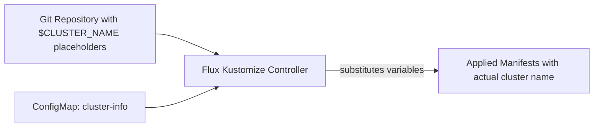

# How to Use Variable Substitution for Cluster Name in Flux

Author: [nawazdhandala](https://github.com/nawazdhandala)

Tags: Flux, Kubernetes, GitOps, Multi-Cluster, Variable Substitution, Kustomize, Post-Build

Description: A practical guide to using Flux post-build variable substitution to inject cluster names into manifests for dynamic multi-cluster configuration.

---

When managing multiple clusters from a shared Git repository, many resources need to include the cluster name: ingress hostnames, monitoring labels, log prefixes, ConfigMap values, and more. Hardcoding cluster names in overlays creates maintenance overhead. Flux post-build variable substitution lets you define the cluster name once and inject it everywhere it is needed.

## How Variable Substitution Works in Flux

Flux's Kustomize controller supports post-build variable substitution. After building the Kustomize output, Flux replaces `${VARIABLE_NAME}` placeholders with values from ConfigMaps or Secrets. This happens server-side, so your manifests in Git contain the placeholders, and Flux resolves them at apply time.



## Prerequisites

- Flux v2 installed on your clusters
- `kubectl` and `flux` CLI
- A multi-cluster Git repository

## Step 1: Create the Cluster Identity ConfigMap

On each cluster, create a ConfigMap that defines the cluster name:

For the production-us-east cluster:

```bash
kubectl config use-context production-us-east

kubectl apply -f - <<EOF
apiVersion: v1
kind: ConfigMap
metadata:
  name: cluster-info
  namespace: flux-system
data:
  CLUSTER_NAME: "production-us-east"
  CLUSTER_DISPLAY_NAME: "Production US East"
EOF
```

For the staging cluster:

```bash
kubectl config use-context staging

kubectl apply -f - <<EOF
apiVersion: v1
kind: ConfigMap
metadata:
  name: cluster-info
  namespace: flux-system
data:
  CLUSTER_NAME: "staging"
  CLUSTER_DISPLAY_NAME: "Staging"
EOF
```

Repeat for every cluster in your fleet, changing the values accordingly.

## Step 2: Configure Flux Kustomization with substituteFrom

Update your Flux Kustomizations to reference the ConfigMap. For `clusters/production-us-east/apps.yaml`:

```yaml
apiVersion: kustomize.toolkit.fluxcd.io/v1
kind: Kustomization
metadata:
  name: apps
  namespace: flux-system
spec:
  interval: 10m
  sourceRef:
    kind: GitRepository
    name: flux-system
  path: ./apps/base
  prune: true
  postBuild:
    substituteFrom:
      - kind: ConfigMap
        name: cluster-info
```

The same Kustomization file can be used across all clusters (each pointing to the same path), because the variable values differ per cluster.

## Step 3: Use Variables in Ingress Hostnames

One of the most common uses is dynamically setting ingress hostnames. In `apps/base/ingress.yaml`:

```yaml
apiVersion: networking.k8s.io/v1
kind: Ingress
metadata:
  name: webapp
  namespace: app
  annotations:
    cert-manager.io/cluster-issuer: letsencrypt
    external-dns.alpha.kubernetes.io/hostname: webapp-${CLUSTER_NAME}.example.com
spec:
  ingressClassName: nginx
  tls:
    - hosts:
        - webapp-${CLUSTER_NAME}.example.com
      secretName: webapp-${CLUSTER_NAME}-tls
  rules:
    - host: webapp-${CLUSTER_NAME}.example.com
      http:
        paths:
          - path: /
            pathType: Prefix
            backend:
              service:
                name: webapp
                port:
                  number: 80
```

On `production-us-east`, this resolves to `webapp-production-us-east.example.com`. On `staging`, it resolves to `webapp-staging.example.com`.

## Step 4: Use Variables in Monitoring Labels

Add the cluster name to Prometheus labels so metrics can be filtered by cluster. In `apps/base/deployment.yaml`:

```yaml
apiVersion: apps/v1
kind: Deployment
metadata:
  name: webapp
  namespace: app
  labels:
    app: webapp
    cluster: ${CLUSTER_NAME}
spec:
  replicas: 2
  selector:
    matchLabels:
      app: webapp
  template:
    metadata:
      labels:
        app: webapp
        cluster: ${CLUSTER_NAME}
      annotations:
        prometheus.io/scrape: "true"
        prometheus.io/port: "8080"
    spec:
      containers:
        - name: webapp
          image: ghcr.io/your-org/webapp:latest
          ports:
            - containerPort: 8080
          env:
            - name: CLUSTER_NAME
              value: ${CLUSTER_NAME}
            - name: OTEL_RESOURCE_ATTRIBUTES
              value: "cluster=${CLUSTER_NAME}"
```

## Step 5: Use Variables in ConfigMaps

Inject the cluster name into application configuration. In `apps/base/configmap.yaml`:

```yaml
apiVersion: v1
kind: ConfigMap
metadata:
  name: webapp-config
  namespace: app
data:
  cluster.name: ${CLUSTER_NAME}
  log.prefix: "[${CLUSTER_NAME}]"
  metrics.cluster.label: ${CLUSTER_NAME}
  config.yaml: |
    server:
      name: webapp-${CLUSTER_NAME}
    telemetry:
      cluster: ${CLUSTER_NAME}
      service: webapp
    cache:
      prefix: "${CLUSTER_NAME}:"
```

## Step 6: Use Variables in Namespace Names

You can even use the cluster name in namespace definitions when different clusters need isolated namespaces:

```yaml
apiVersion: v1
kind: Namespace
metadata:
  name: app-${CLUSTER_NAME}
  labels:
    cluster: ${CLUSTER_NAME}
    managed-by: flux
```

## Step 7: Use Variables in HelmRelease Values

Variable substitution works inside HelmRelease value overrides. In `apps/base/helmrelease.yaml`:

```yaml
apiVersion: helm.toolkit.fluxcd.io/v2
kind: HelmRelease
metadata:
  name: webapp
  namespace: app
spec:
  interval: 30m
  chart:
    spec:
      chart: webapp
      version: "1.x"
      sourceRef:
        kind: HelmRepository
        name: internal
        namespace: flux-system
  values:
    global:
      clusterName: ${CLUSTER_NAME}
    ingress:
      enabled: true
      hosts:
        - host: webapp-${CLUSTER_NAME}.example.com
          paths:
            - path: /
              pathType: Prefix
      tls:
        - secretName: webapp-${CLUSTER_NAME}-tls
          hosts:
            - webapp-${CLUSTER_NAME}.example.com
    monitoring:
      labels:
        cluster: ${CLUSTER_NAME}
    config:
      logPrefix: "[${CLUSTER_NAME}]"
```

## Step 8: Combine with Inline Variables

You can mix ConfigMap-sourced variables with inline variables defined directly in the Kustomization:

```yaml
apiVersion: kustomize.toolkit.fluxcd.io/v1
kind: Kustomization
metadata:
  name: apps
  namespace: flux-system
spec:
  interval: 10m
  sourceRef:
    kind: GitRepository
    name: flux-system
  path: ./apps/base
  prune: true
  postBuild:
    substitute:
      APP_VERSION: "v2.1.0"
      DOMAIN: "example.com"
    substituteFrom:
      - kind: ConfigMap
        name: cluster-info
```

Now you can use `${CLUSTER_NAME}` from the ConfigMap alongside `${DOMAIN}` from inline variables:

```yaml
spec:
  rules:
    - host: webapp-${CLUSTER_NAME}.${DOMAIN}
```

## Step 9: Handle Default Values

To prevent errors when a variable is missing, use Flux's default value syntax:

```yaml
metadata:
  labels:
    cluster: ${CLUSTER_NAME:=unknown}
    environment: ${CLUSTER_ENVIRONMENT:=dev}
```

If `CLUSTER_NAME` is not defined, it defaults to `unknown`. This is useful as a safety net during initial setup.

## Step 10: Verify Variable Substitution

Check that variables are being resolved correctly:

```bash
# Check the ConfigMap is in place
kubectl get configmap cluster-info -n flux-system -o yaml

# Check the Kustomization status
flux get kustomization apps

# Inspect the applied resources to see resolved values
kubectl get ingress webapp -n app -o yaml | grep host

# Check deployment labels
kubectl get deployment webapp -n app -o jsonpath='{.metadata.labels.cluster}'
```

If variables are not being substituted, check the Kustomization events:

```bash
flux events --for Kustomization/apps
```

Common issues include:

- ConfigMap not found in the `flux-system` namespace
- Variable name mismatch (case-sensitive)
- Missing `postBuild` section in the Kustomization

## Step 11: Store Cluster Identity in Git

For reproducibility, keep the cluster identity ConfigMap in your repository alongside the Flux bootstrap configuration:

```text
clusters/
├── production-us-east/
│   ├── flux-system/
│   ├── cluster-info.yaml    # ConfigMap with CLUSTER_NAME
│   ├── infrastructure.yaml
│   └── apps.yaml
```

The `cluster-info.yaml`:

```yaml
apiVersion: v1
kind: ConfigMap
metadata:
  name: cluster-info
  namespace: flux-system
data:
  CLUSTER_NAME: "production-us-east"
  CLUSTER_DISPLAY_NAME: "Production US East"
```

Reference it from the Flux system Kustomization so it is applied before other resources depend on it.

## Summary

Variable substitution for cluster name is one of the most practical Flux features for multi-cluster deployments. By defining the cluster name once in a ConfigMap and referencing it throughout your manifests with `${CLUSTER_NAME}`, you eliminate hardcoded values, reduce overlay duplication, and make it straightforward to add new clusters to your fleet. The same base manifests work across every cluster, with Flux resolving the cluster-specific values at reconciliation time.
