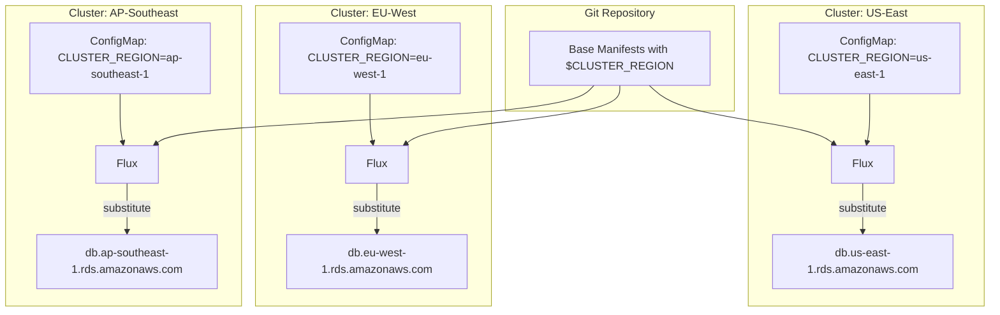

# How to Use Variable Substitution for Cluster Region in Flux

Author: [nawazdhandala](https://github.com/nawazdhandala)

Tags: Flux, Kubernetes, GitOps, Multi-Cluster, Variable Substitution, Region, Kustomize, Post-Build

Description: A hands-on guide to using Flux post-build variable substitution to dynamically configure region-specific settings like endpoints, storage classes, and DNS across multi-region clusters.

---

Multi-region Kubernetes deployments require region-aware configuration. Database endpoints, storage classes, container registry mirrors, DNS zones, and compliance settings all vary by region. Flux post-build variable substitution lets you inject the cluster region into manifests at reconciliation time, enabling a single set of base manifests to work across all regions.

## Why Region-Based Variable Substitution?

Hardcoding region-specific values in overlays creates a maintenance burden that grows with each new region. With variable substitution, you define region metadata once per cluster and reference it anywhere in your manifests using `${CLUSTER_REGION}` placeholders.



## Step 1: Define Region Metadata

Create a ConfigMap on each cluster that includes region-related variables:

For the US-East cluster:

```yaml
apiVersion: v1
kind: ConfigMap
metadata:
  name: cluster-info
  namespace: flux-system
data:
  CLUSTER_NAME: "production-us-east"
  CLUSTER_REGION: "us-east-1"
  CLUSTER_REGION_SHORT: "use1"
  CLUSTER_CLOUD_PROVIDER: "aws"
  CLUSTER_AVAILABILITY_ZONES: "us-east-1a,us-east-1b,us-east-1c"
  CLUSTER_DNS_ZONE: "us-east.example.com"
  CLUSTER_REGISTRY_MIRROR: "123456789.dkr.ecr.us-east-1.amazonaws.com"
  CLUSTER_STORAGE_CLASS: "gp3"
  CLUSTER_BACKUP_REGION: "us-west-2"
```

For the EU-West cluster:

```yaml
apiVersion: v1
kind: ConfigMap
metadata:
  name: cluster-info
  namespace: flux-system
data:
  CLUSTER_NAME: "production-eu-west"
  CLUSTER_REGION: "eu-west-1"
  CLUSTER_REGION_SHORT: "euw1"
  CLUSTER_CLOUD_PROVIDER: "aws"
  CLUSTER_AVAILABILITY_ZONES: "eu-west-1a,eu-west-1b,eu-west-1c"
  CLUSTER_DNS_ZONE: "eu-west.example.com"
  CLUSTER_REGISTRY_MIRROR: "123456789.dkr.ecr.eu-west-1.amazonaws.com"
  CLUSTER_STORAGE_CLASS: "gp3"
  CLUSTER_BACKUP_REGION: "eu-central-1"
```

Apply to each cluster:

```bash
for CTX in production-us-east production-eu-west production-ap-southeast; do
  kubectl config use-context $CTX
  kubectl apply -f cluster-info-${CTX}.yaml
done
```

## Step 2: Configure Flux Kustomization

Enable variable substitution in the Flux Kustomization:

```yaml
apiVersion: kustomize.toolkit.fluxcd.io/v1
kind: Kustomization
metadata:
  name: apps
  namespace: flux-system
spec:
  interval: 10m
  sourceRef:
    kind: GitRepository
    name: flux-system
  path: ./apps/base
  prune: true
  postBuild:
    substituteFrom:
      - kind: ConfigMap
        name: cluster-info
```

## Step 3: Region-Specific Database Endpoints

Use the region variable to point applications at the correct regional database. In `apps/base/configmap.yaml`:

```yaml
apiVersion: v1
kind: ConfigMap
metadata:
  name: database-config
  namespace: app
data:
  DB_HOST: "postgres.${CLUSTER_REGION}.rds.amazonaws.com"
  DB_PORT: "5432"
  DB_NAME: "webapp"
  DB_REPLICA_HOST: "postgres-ro.${CLUSTER_REGION}.rds.amazonaws.com"
  REDIS_HOST: "redis.${CLUSTER_REGION}.cache.amazonaws.com"
  REDIS_PORT: "6379"
```

On the US-East cluster, `DB_HOST` resolves to `postgres.us-east-1.rds.amazonaws.com`. On EU-West, it resolves to `postgres.eu-west-1.rds.amazonaws.com`.

## Step 4: Region-Specific Storage Configuration

Different regions may use different storage classes or have different default volume sizes. In `apps/base/statefulset.yaml`:

```yaml
apiVersion: apps/v1
kind: StatefulSet
metadata:
  name: cache
  namespace: app
spec:
  replicas: 3
  selector:
    matchLabels:
      app: cache
  template:
    metadata:
      labels:
        app: cache
        region: ${CLUSTER_REGION}
    spec:
      containers:
        - name: redis
          image: redis:7
          ports:
            - containerPort: 6379
          volumeMounts:
            - name: data
              mountPath: /data
  volumeClaimTemplates:
    - metadata:
        name: data
      spec:
        accessModes: ["ReadWriteOnce"]
        storageClassName: ${CLUSTER_STORAGE_CLASS}
        resources:
          requests:
            storage: 20Gi
```

## Step 5: Region-Specific DNS and Ingress

Configure ingress with region-specific hostnames and DNS zones. In `apps/base/ingress.yaml`:

```yaml
apiVersion: networking.k8s.io/v1
kind: Ingress
metadata:
  name: webapp
  namespace: app
  annotations:
    cert-manager.io/cluster-issuer: letsencrypt
    external-dns.alpha.kubernetes.io/hostname: webapp.${CLUSTER_DNS_ZONE}
    external-dns.alpha.kubernetes.io/ttl: "300"
spec:
  ingressClassName: nginx
  tls:
    - hosts:
        - webapp.${CLUSTER_DNS_ZONE}
      secretName: webapp-tls-${CLUSTER_REGION_SHORT}
  rules:
    - host: webapp.${CLUSTER_DNS_ZONE}
      http:
        paths:
          - path: /
            pathType: Prefix
            backend:
              service:
                name: webapp
                port:
                  number: 80
```

This creates:
- US-East: `webapp.us-east.example.com`
- EU-West: `webapp.eu-west.example.com`

## Step 6: Region-Specific Container Registry Mirrors

Pull images from the closest registry mirror to reduce latency and cross-region data transfer costs. In `apps/base/deployment.yaml`:

```yaml
apiVersion: apps/v1
kind: Deployment
metadata:
  name: webapp
  namespace: app
spec:
  replicas: 3
  selector:
    matchLabels:
      app: webapp
  template:
    metadata:
      labels:
        app: webapp
        region: ${CLUSTER_REGION}
    spec:
      containers:
        - name: webapp
          image: ${CLUSTER_REGISTRY_MIRROR}/webapp:v2.1.0
          ports:
            - containerPort: 8080
          env:
            - name: AWS_REGION
              value: ${CLUSTER_REGION}
            - name: AWS_DEFAULT_REGION
              value: ${CLUSTER_REGION}
```

## Step 7: Region-Specific Monitoring Labels

Add region information to all metrics for multi-region dashboards. In `infrastructure/base/monitoring/helmrelease.yaml`:

```yaml
apiVersion: helm.toolkit.fluxcd.io/v2
kind: HelmRelease
metadata:
  name: kube-prometheus-stack
  namespace: monitoring
spec:
  interval: 30m
  chart:
    spec:
      chart: kube-prometheus-stack
      version: "55.x"
      sourceRef:
        kind: HelmRepository
        name: prometheus-community
        namespace: flux-system
  values:
    prometheus:
      prometheusSpec:
        externalLabels:
          cluster: ${CLUSTER_NAME}
          region: ${CLUSTER_REGION}
          cloud: ${CLUSTER_CLOUD_PROVIDER}
        remoteWrite:
          - url: https://metrics.${CLUSTER_REGION}.internal.example.com/api/v1/write
    grafana:
      env:
        REGION: ${CLUSTER_REGION}
      dashboardProviders:
        dashboardproviders.yaml:
          apiVersion: 1
          providers:
            - name: default
              folder: ${CLUSTER_REGION}
              type: file
              options:
                path: /var/lib/grafana/dashboards
```

## Step 8: Region-Specific Backup Configuration

Configure backup destinations to use region-appropriate storage. In `apps/base/backup-cronjob.yaml`:

```yaml
apiVersion: batch/v1
kind: CronJob
metadata:
  name: database-backup
  namespace: app
spec:
  schedule: "0 2 * * *"
  jobTemplate:
    spec:
      template:
        spec:
          containers:
            - name: backup
              image: ${CLUSTER_REGISTRY_MIRROR}/db-backup:latest
              env:
                - name: SOURCE_DB_HOST
                  value: "postgres.${CLUSTER_REGION}.rds.amazonaws.com"
                - name: BACKUP_BUCKET
                  value: "backups-${CLUSTER_REGION_SHORT}"
                - name: BACKUP_REGION
                  value: ${CLUSTER_BACKUP_REGION}
                - name: AWS_REGION
                  value: ${CLUSTER_REGION}
          restartPolicy: OnFailure
```

## Step 9: Region-Based Network Policies

Apply region-aware network policies. For example, allow traffic only to regional service endpoints. In `apps/base/networkpolicy.yaml`:

```yaml
apiVersion: networking.k8s.io/v1
kind: NetworkPolicy
metadata:
  name: webapp-egress
  namespace: app
  annotations:
    description: "Allow egress to regional endpoints for ${CLUSTER_REGION}"
spec:
  podSelector:
    matchLabels:
      app: webapp
  policyTypes:
    - Egress
  egress:
    - to:
        - ipBlock:
            cidr: 10.0.0.0/8
      ports:
        - protocol: TCP
          port: 5432
        - protocol: TCP
          port: 6379
    - to: []
      ports:
        - protocol: TCP
          port: 443
        - protocol: UDP
          port: 53
```

## Step 10: Multi-Region HelmRelease with Region Variables

For Helm charts that need region-specific values. In `apps/base/helmrelease.yaml`:

```yaml
apiVersion: helm.toolkit.fluxcd.io/v2
kind: HelmRelease
metadata:
  name: webapp
  namespace: app
spec:
  interval: 30m
  chart:
    spec:
      chart: webapp
      version: "2.x"
      sourceRef:
        kind: HelmRepository
        name: internal
        namespace: flux-system
  values:
    replicaCount: 3
    region: ${CLUSTER_REGION}
    image:
      repository: ${CLUSTER_REGISTRY_MIRROR}/webapp
      tag: v2.1.0
    ingress:
      enabled: true
      hosts:
        - host: webapp.${CLUSTER_DNS_ZONE}
          paths:
            - path: /
      tls:
        - secretName: webapp-tls
          hosts:
            - webapp.${CLUSTER_DNS_ZONE}
    database:
      host: postgres.${CLUSTER_REGION}.rds.amazonaws.com
      port: 5432
    cache:
      host: redis.${CLUSTER_REGION}.cache.amazonaws.com
    objectStorage:
      bucket: webapp-assets-${CLUSTER_REGION_SHORT}
      region: ${CLUSTER_REGION}
    monitoring:
      labels:
        region: ${CLUSTER_REGION}
        cluster: ${CLUSTER_NAME}
```

## Step 11: Verify Region Substitution

Confirm that region variables are resolved correctly on each cluster:

```bash
for CTX in production-us-east production-eu-west production-ap-southeast; do
  echo "=== $CTX ==="
  kubectl --context=$CTX get configmap cluster-info -n flux-system -o jsonpath='{.data.CLUSTER_REGION}'
  echo ""
  kubectl --context=$CTX get ingress webapp -n app -o jsonpath='{.spec.rules[0].host}'
  echo ""
  kubectl --context=$CTX get configmap database-config -n app -o jsonpath='{.data.DB_HOST}'
  echo ""
  echo "---"
done
```

Check for substitution errors:

```bash
flux get kustomization apps
flux events --for Kustomization/apps
```

## Adding a New Region

When you add a new region to your fleet, the process is straightforward:

1. Create a new cluster in the target region
2. Create the `cluster-info` ConfigMap with the region-specific values
3. Bootstrap Flux pointing to the shared base path
4. All manifests automatically get the correct regional values

```bash
kubectl config use-context production-ap-northeast

kubectl apply -f - <<EOF
apiVersion: v1
kind: ConfigMap
metadata:
  name: cluster-info
  namespace: flux-system
data:
  CLUSTER_NAME: "production-ap-northeast"
  CLUSTER_REGION: "ap-northeast-1"
  CLUSTER_REGION_SHORT: "apne1"
  CLUSTER_CLOUD_PROVIDER: "aws"
  CLUSTER_DNS_ZONE: "ap-northeast.example.com"
  CLUSTER_REGISTRY_MIRROR: "123456789.dkr.ecr.ap-northeast-1.amazonaws.com"
  CLUSTER_STORAGE_CLASS: "gp3"
  CLUSTER_BACKUP_REGION: "ap-southeast-1"
EOF

flux bootstrap github \
  --owner=your-org \
  --repository=fleet-repo \
  --branch=main \
  --path=clusters/production-ap-northeast \
  --personal
```

No changes to the base manifests are needed. The new cluster picks up all resources with its region-specific values automatically.

## Summary

Variable substitution for cluster region is essential for multi-region Flux deployments. By storing region metadata in a ConfigMap and using `${CLUSTER_REGION}` placeholders throughout your manifests, you create a single set of base templates that work across all regions. Database endpoints, registry mirrors, DNS zones, storage classes, and monitoring labels all adapt automatically to each cluster's region. Adding a new region to your fleet becomes a matter of creating a ConfigMap and bootstrapping Flux, with zero changes to application manifests.
